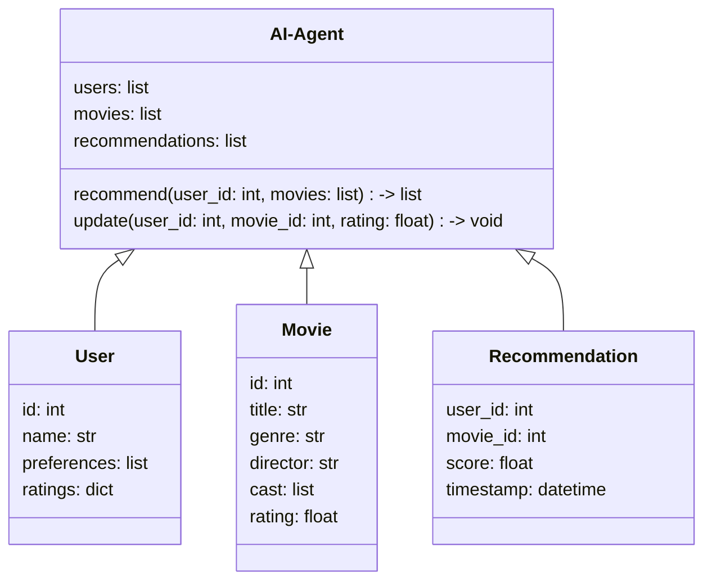
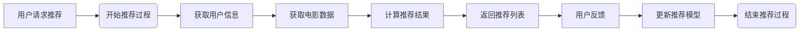
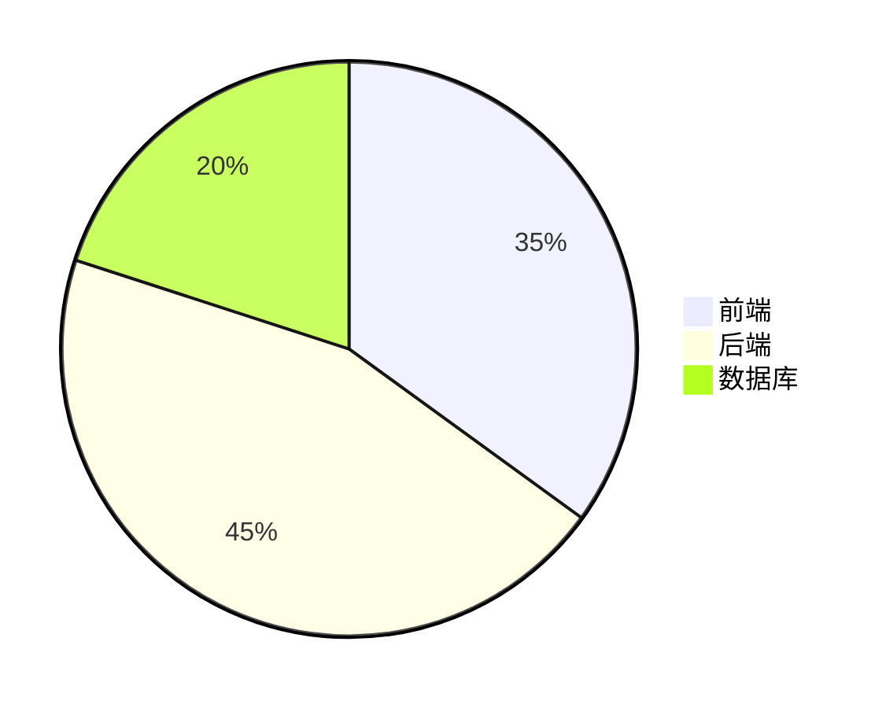
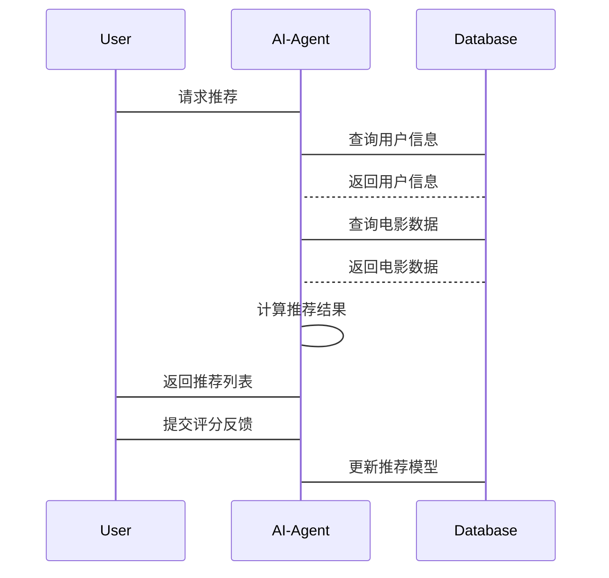

                 


# AI Agent在智能电影推荐中的应用

## 关键词：AI Agent，智能推荐系统，电影推荐，协同过滤，深度学习

## 摘要：  
随着人工智能技术的快速发展，AI Agent在智能推荐系统中的应用越来越广泛。本文将详细探讨AI Agent在电影推荐中的应用场景、算法原理和系统架构设计。通过分析协同过滤、基于内容的推荐和深度学习模型，本文旨在帮助读者理解如何利用AI Agent提升电影推荐的准确性和个性化水平。同时，本文将结合实际案例，展示如何通过Python代码实现AI Agent推荐系统，并提供系统的优化建议和最佳实践。

---

# 第一部分：AI Agent与智能推荐系统背景

## 第1章：AI Agent与智能推荐系统背景

### 1.1 AI Agent的基本概念

#### 1.1.1 AI Agent的定义与特点
AI Agent（人工智能代理）是指能够感知环境并采取行动以实现目标的智能实体。其特点包括自主性、反应性、社会性和学习性。AI Agent能够根据用户的行为和反馈，动态调整推荐策略，从而提供更精准的服务。

#### 1.1.2 AI Agent在推荐系统中的应用
推荐系统的核心任务是根据用户的行为和偏好，向用户推荐相关内容。AI Agent通过分析用户数据，利用机器学习算法生成推荐结果，并根据用户反馈不断优化推荐策略。

#### 1.1.3 智能推荐系统的现状与发展趋势
智能推荐系统在电子商务、社交媒体和娱乐产业等领域得到了广泛应用。随着深度学习和自然语言处理技术的发展，推荐系统将更加个性化和智能化，能够实时响应用户的多样化需求。

### 1.2 电影推荐的背景与挑战

#### 1.2.1 传统电影推荐方式的局限性
传统的电影推荐方式主要依赖人工筛选和固定分类，难以满足用户的个性化需求。用户可能对推荐结果缺乏兴趣，导致推荐效率低下。

#### 1.2.2 智能推荐系统在电影领域的优势
智能推荐系统能够通过大数据分析和机器学习算法，准确捕捉用户的观影偏好，推荐符合用户口味的电影。这种推荐方式不仅提高了用户的观影体验，还帮助影视平台提升了用户粘性和满意度。

#### 1.2.3 用户行为分析与电影推荐的关系
用户行为数据（如点击、收藏、评分）是推荐系统的重要输入。通过对用户行为的分析，AI Agent能够了解用户的偏好和需求，从而生成个性化的推荐结果。

### 1.3 AI Agent在电影推荐中的作用

#### 1.3.1 AI Agent如何提升推荐效率
AI Agent通过实时分析用户行为和反馈，快速生成推荐结果，显著提升了推荐效率。相比传统推荐系统，AI Agent能够更快响应用户的请求，并根据反馈动态调整推荐策略。

#### 1.3.2 AI Agent在个性化推荐中的应用
个性化推荐是电影推荐的核心目标。AI Agent能够根据用户的观影历史、偏好和实时行为，生成高度个性化的推荐列表，满足用户的多样化需求。

#### 1.3.3 AI Agent与电影推荐的结合场景
在电影推荐中，AI Agent可以应用于实时推荐、协同过滤和基于内容的推荐等多种场景。例如，在用户观看某部电影后，AI Agent可以根据用户的偏好推荐相似的电影，或者根据用户的社交网络推荐热门影片。

### 1.4 本章小结
本章介绍了AI Agent的基本概念和在推荐系统中的应用，分析了电影推荐的背景和挑战。通过对比传统推荐方式和智能推荐系统的优劣，阐述了AI Agent在电影推荐中的重要作用和应用场景。

---

# 第二部分：AI Agent的核心概念与算法原理

## 第2章：AI Agent的核心概念与原理

### 2.1 AI Agent的核心概念

#### 2.1.1 AI Agent的基本构成
AI Agent由感知模块、推理模块和行动模块组成。感知模块负责收集用户数据，推理模块通过机器学习算法生成推荐结果，行动模块将推荐结果反馈给用户。

#### 2.1.2 AI Agent的行为模式
AI Agent可以基于规则、基于模型或基于学习的方式进行推荐。基于规则的AI Agent通过预定义的规则生成推荐结果，基于模型的AI Agent利用统计模型进行预测，而基于学习的AI Agent通过深度学习算法不断优化推荐策略。

#### 2.1.3 AI Agent的决策机制
AI Agent的决策机制包括监督学习、强化学习和无监督学习。监督学习通过标注数据训练模型，强化学习通过奖励机制优化推荐策略，无监督学习通过聚类算法发现用户群体的偏好。

### 2.2 智能推荐系统的算法原理

#### 2.2.1 协同过滤算法
协同过滤是一种基于用户相似性或物品相似性的推荐算法。基于用户的协同过滤算法通过计算用户之间的相似性，向目标用户推荐相似用户喜欢的物品。基于物品的协同过滤算法通过分析物品之间的相似性，向用户推荐与已推荐物品相似的其他物品。

#### 2.2.2 基于内容的推荐算法
基于内容的推荐算法通过分析物品的属性特征（如电影的剧情、演员、类型）生成推荐结果。例如，通过文本挖掘技术提取电影的关键词，计算目标用户对关键词的偏好，从而推荐符合用户口味的电影。

#### 2.2.3 深度学习推荐算法
深度学习推荐算法利用神经网络模型（如神经协同过滤、变种自注意力机制）分析用户行为和物品特征，生成更精准的推荐结果。深度学习模型能够捕捉用户和物品之间的复杂关系，显著提高了推荐的准确性和多样性。

### 2.3 AI Agent在推荐系统中的数学模型

#### 2.3.1 协同过滤的数学模型
协同过滤算法的核心是计算用户或物品之间的相似度。基于用户的协同过滤模型通过计算用户i和用户j的相似度sim(i,j)，将用户i未评分的物品推荐给用户i。相似度计算公式如下：

$$ sim(i,j) = \frac{\sum_{k} (r_{ik} - \bar{r_i})(r_{jk} - \bar{r_j})}{\sqrt{\sum_{k} (r_{ik} - \bar{r_i})^2} \sqrt{\sum_{k} (r_{jk} - \bar{r_j})^2}} $$

其中，$\bar{r_i}$表示用户i的平均评分。

#### 2.3.2 基于内容的推荐模型
基于内容的推荐模型通过构建物品的特征向量，计算用户对物品的偏好。例如，使用TF-IDF（Term Frequency-Inverse Document Frequency）提取电影的关键词特征，计算目标用户的兴趣向量与物品特征向量的相似度。

$$ sim(u,i) = \frac{\sum_{k} w_{u,k} \cdot w_{i,k}}{\sqrt{\sum_{k} w_{u,k}^2} \sqrt{\sum_{k} w_{i,k}^2}} $$

其中，$w_{u,k}$表示用户u对关键词k的权重，$w_{i,k}$表示物品i对关键词k的权重。

#### 2.3.3 深度学习模型的数学表达
深度学习模型通过多层神经网络提取用户和物品的高级特征。例如，神经协同过滤模型（Neural Collaborative Filtering，NCF）利用嵌入层、隐层和输出层构建推荐模型。输出层的预测评分公式如下：

$$ \hat{r}_{ui} = \sigma(w_u^T w_i + b_u + b_i) $$

其中，$\sigma$表示sigmoid函数，$w_u$和$w_i$分别表示用户u和物品i的嵌入向量，$b_u$和$b_i$表示偏差项。

### 2.4 本章小结
本章详细介绍了AI Agent的核心概念和智能推荐系统的算法原理，重点分析了协同过滤、基于内容的推荐和深度学习模型的数学表达。通过对比不同算法的优缺点，为后续章节的系统设计和实现奠定了理论基础。

---

# 第三部分：AI Agent的算法实现与系统架构

## 第3章：AI Agent推荐算法的实现

### 3.1 协同过滤算法的实现

#### 3.1.1 基于用户的协同过滤实现
协同过滤算法的实现步骤包括数据预处理、相似度计算和推荐生成。以下是基于用户的协同过滤算法的Python代码示例：

```python
import numpy as np

def compute_user_similarity(user_ratings):
    # 计算用户平均评分
    user_mean = np.mean(user_ratings, axis=1)
    # 计算用户之间的相似度
    similarity = np.zeros_like(user_ratings)
    for i in range(user_ratings.shape[0]):
        for j in range(user_ratings.shape[0]):
            if i != j:
                numerator = np.sum((user_ratings[i] - user_mean[i]) * (user_ratings[j] - user_mean[j]))
                denominator = np.sqrt(np.sum((user_ratings[i] - user_mean[i])**2)) * np.sqrt(np.sum((user_ratings[j] - user_mean[j])**2))
                if denominator != 0:
                    similarity[i][j] = numerator / denominator
                else:
                    similarity[i][j] = 0
    return similarity

# 示例数据
user_ratings = np.array([[4, 3, 0, 1], [3, 0, 2, 0], [2, 1, 0, 3]])
similarity_matrix = compute_user_similarity(user_ratings)
print("相似度矩阵：\n", similarity_matrix)
```

#### 3.1.2 基于物品的协同过滤实现
基于物品的协同过滤算法通过计算物品之间的相似度，生成推荐列表。以下是基于物品的协同过滤算法的Python代码示例：

```python
def compute_item_similarity(item_ratings):
    # 转置矩阵，按行计算物品相似度
    item_ratings_trans = item_ratings.T
    # 计算物品平均评分
    item_mean = np.mean(item_ratings_trans, axis=1)
    # 计算相似度
    similarity = np.zeros_like(item_ratings_trans)
    for i in range(item_ratings_trans.shape[0]):
        for j in range(item_ratings_trans.shape[0]):
            if i != j:
                numerator = np.sum((item_ratings_trans[i] - item_mean[i]) * (item_ratings_trans[j] - item_mean[j]))
                denominator = np.sqrt(np.sum((item_ratings_trans[i] - item_mean[i])**2)) * np.sqrt(np.sum((item_ratings_trans[j] - item_mean[j])**2))
                if denominator != 0:
                    similarity[i][j] = numerator / denominator
                else:
                    similarity[i][j] = 0
    return similarity

item_ratings = np.array([[4, 3, 0, 1], [3, 0, 2, 0], [2, 1, 0, 3]])
similarity_matrix = compute_item_similarity(item_ratings)
print("相似度矩阵：\n", similarity_matrix)
```

#### 3.1.3 混合协同过滤的实现
混合协同过滤算法结合了基于用户和基于物品的协同过滤算法，通过加权融合两种方法的推荐结果，生成更准确的推荐列表。以下是混合协同过滤算法的Python代码示例：

```python
def hybrid_collaborative_filtering(user_ratings, item_ratings, alpha=0.5):
    # 基于用户的协同过滤相似度
    user_sim = compute_user_similarity(user_ratings)
    # 基于物品的协同过滤相似度
    item_sim = compute_item_similarity(item_ratings)
    # 混合推荐
    hybrid_recommendations = np.zeros_like(user_ratings)
    for i in range(user_ratings.shape[0]):
        for j in range(user_ratings.shape[1]):
            if user_ratings[i][j] == 0:
                # 用户i和物品j的混合推荐
                user_recomm = np.sum(user_ratings[i] * user_sim[i])
                item_recomm = np.sum(item_ratings[:, j] * item_sim[:, j])
                hybrid_recommendations[i][j] = alpha * user_recomm + (1 - alpha) * item_recomm
    return hybrid_recommendations

hybrid_recommendations = hybrid_collaborative_filtering(user_ratings, item_ratings)
print("混合协同过滤推荐结果：\n", hybrid_recommendations)
```

### 3.2 基于内容的推荐算法实现

#### 3.2.1 基于文本挖掘的内容推荐
基于文本挖掘的内容推荐算法通过分析电影的剧情、评论等文本数据，提取关键词特征，生成推荐结果。以下是基于文本挖掘的推荐算法的Python代码示例：

```python
from sklearn.feature_extraction.text import TfidfVectorizer

# 示例电影评论数据
comments = [
    "电影剧情紧凑，演员表现出色",
    "特效精美，剧情略显拖沓",
    "适合喜欢科幻片的观众",
    "节奏快，情节丰富"
]

# 使用TF-IDF提取关键词
vectorizer = TfidfVectorizer()
tfidf = vectorizer.fit_transform(comments)
print("TF-IDF特征矩阵：\n", tfidf)
```

#### 3.2.2 基于特征提取的内容推荐
基于特征提取的内容推荐算法通过将电影的多维特征（如演员、导演、类型）转化为向量，计算目标用户的兴趣向量与电影特征向量的相似度。以下是基于特征提取的推荐算法的Python代码示例：

```python
from sklearn.metrics.pairwise import cosine_similarity

# 示例电影特征向量
movies_features = [
    [0.6, 0.2, 0.4],  # 电影1：高演员表现，低导演影响力，中等制作预算
    [0.3, 0.8, 0.5],  # 电影2：低演员表现，高导演影响力，中等制作预算
    [0.7, 0.4, 0.3],  # 电影3：高演员表现，低导演影响力，低制作预算
    [0.4, 0.5, 0.7]   # 电影4：中等演员表现，中等导演影响力，高制作预算
]

# 示例用户偏好向量
user_preference = [0.5, 0.6, 0.4]

# 计算用户偏好向量与电影特征向量的相似度
similarity = cosine_similarity([user_preference], movies_features)
print("相似度矩阵：\n", similarity)
```

#### 3.2.3 基于深度学习的内容推荐
基于深度学习的内容推荐算法利用神经网络模型（如卷积神经网络、循环神经网络）分析电影的文本、图像和音频数据，生成更精准的推荐结果。以下是基于深度学习的推荐算法的Python代码示例：

```python
import tensorflow as tf
from tensorflow.keras import layers

# 示例电影评论数据集
comments = [
    "电影剧情紧凑，演员表现出色",
    "特效精美，剧情略显拖沓",
    "适合喜欢科幻片的观众",
    "节奏快，情节丰富"
]

# 使用卷积神经网络进行文本分类
model = tf.keras.Sequential([
    layers.Embedding(input_dim=1000, output_dim=16),
    layers.Conv1D(filters=32, kernel_size=3, activation='relu'),
    layers.MaxPooling1D(pool_size=2),
    layers.Flatten(),
    layers.Dense(10, activation='relu'),
    layers.Dense(2, activation='sigmoid')
])

model.compile(optimizer='adam', loss='binary_crossentropy', metrics=['accuracy'])
model.summary()
```

### 3.3 深度学习推荐算法的实现

#### 3.3.1 神经协同过滤的实现
神经协同过滤算法通过神经网络模型学习用户和物品的嵌入表示，生成推荐结果。以下是神经协同过滤算法的Python代码示例：

```python
import tensorflow as tf
from tensorflow.keras import layers

# 示例用户和物品嵌入向量
users = np.array([1, 2, 3, 4])
items = np.array([1, 2, 3, 4])

# 神经协同过滤模型
model = tf.keras.Sequential([
    layers.InputLayer(input_shape=(1,)),
    layers.Embedding(input_dim=len(users), output_dim=32),
    layers.Flatten(),
    layers.Dense(64, activation='relu'),
    layers.Dense(len(items), activation='linear')
])

model.compile(optimizer='adam', loss='mean_squared_error', metrics=['mae'])
model.summary()
```

#### 3.3.2 基于变种自注意力机制的推荐
基于变种自注意力机制的推荐算法通过分析用户行为序列，捕捉用户的兴趣变化。以下是基于自注意力机制的推荐算法的Python代码示例：

```python
import tensorflow as tf
from tensorflow.keras import layers

# 示例用户行为序列
user_sequence = [1, 2, 3, 4, 3, 2, 1]

# 自注意力机制模型
model = tf.keras.Sequential([
    layers.InputLayer(input_shape=(None,)),
    layers.Embedding(input_dim=10, output_dim=32),
    layers.SelfAttention(),
    layers.Flatten(),
    layers.Dense(64, activation='relu'),
    layers.Dense(1, activation='sigmoid')
])

model.compile(optimizer='adam', loss='binary_crossentropy', metrics=['accuracy'])
model.summary()
```

#### 3.3.3 深度学习模型的数学表达
深度学习模型的数学表达包括输入层、嵌入层、隐层和输出层。例如，神经协同过滤模型的数学表达如下：

$$ \hat{r}_{ui} = \sigma(w_u^T w_i + b_u + b_i) $$

其中，$\sigma$表示sigmoid函数，$w_u$和$w_i$分别表示用户u和物品i的嵌入向量，$b_u$和$b_i$表示偏差项。

### 3.4 本章小结
本章详细介绍了AI Agent推荐算法的实现，包括协同过滤、基于内容的推荐和深度学习模型的实现。通过具体的Python代码示例和数学公式，读者可以更好地理解和实现这些推荐算法。

---

# 第四部分：系统分析与架构设计

## 第4章：AI Agent推荐系统的系统分析与架构设计

### 4.1 系统功能设计

#### 4.1.1 领域模型设计
领域模型类图展示了系统中的主要实体及其关系。以下是领域模型类图的Mermaid图：



#### 4.1.2 系统功能模块
系统功能模块包括用户管理、电影管理、推荐计算和用户反馈模块。每个模块负责不同的功能，如用户信息的存储与管理、电影特征的提取与分析、推荐结果的生成与优化。

#### 4.1.3 功能流程设计
功能流程设计展示了系统的运行流程。以下是功能流程图的Mermaid图：



### 4.2 系统架构设计

#### 4.2.1 系统架构设计
系统架构设计包括前端、后端和数据库。前端负责用户交互，后端负责推荐算法的实现和计算，数据库负责存储用户和电影数据。以下是系统架构图的Mermaid图：



#### 4.2.2 接口设计
系统接口设计包括用户注册、登录、获取推荐列表和反馈评分等接口。以下是接口设计图的Mermaid图：



### 4.3 本章小结
本章详细分析了AI Agent推荐系统的系统架构设计和功能模块设计，展示了系统的整体结构和各部分之间的交互关系。通过Mermaid图的辅助，读者可以更清晰地理解系统的运行流程和设计细节。

---

# 第五部分：项目实战

## 第5章：AI Agent推荐系统项目实战

### 5.1 环境搭建与数据准备

#### 5.1.1 环境安装
推荐系统项目需要安装以下Python库：
- `numpy`：用于数值计算
- `pandas`：用于数据处理
- `scikit-learn`：用于机器学习算法
- `tensorflow`：用于深度学习模型
- `mermaid`：用于绘制图表

安装命令：
```bash
pip install numpy pandas scikit-learn tensorflow mermaid
```

#### 5.1.2 数据集获取
可以从公开数据集（如Kaggle、IMDB）获取电影数据和用户行为数据。数据集应包含电影的基本信息（如标题、类型、导演、演员）和用户的评分、点击数据。

### 5.2 系统核心实现

#### 5.2.1 协同过滤算法实现
以下是协同过滤算法的Python代码实现：

```python
import numpy as np

def compute_user_similarity(user_ratings):
    # 计算用户平均评分
    user_mean = np.mean(user_ratings, axis=1)
    # 计算用户之间的相似度
    similarity = np.zeros_like(user_ratings)
    for i in range(user_ratings.shape[0]):
        for j in range(user_ratings.shape[0]):
            if i != j:
                numerator = np.sum((user_ratings[i] - user_mean[i]) * (user_ratings[j] - user_mean[j]))
                denominator = np.sqrt(np.sum((user_ratings[i] - user_mean[i])**2)) * np.sqrt(np.sum((user_ratings[j] - user_mean[j])**2))
                if denominator != 0:
                    similarity[i][j] = numerator / denominator
                else:
                    similarity[i][j] = 0
    return similarity

# 示例数据
user_ratings = np.array([[4, 3, 0, 1], [3, 0, 2, 0], [2, 1, 0, 3]])
similarity_matrix = compute_user_similarity(user_ratings)
print("相似度矩阵：\n", similarity_matrix)
```

#### 5.2.2 基于内容的推荐实现
以下是基于内容的推荐算法的Python代码实现：

```python
from sklearn.feature_extraction.text import TfidfVectorizer

# 示例电影评论数据
comments = [
    "电影剧情紧凑，演员表现出色",
    "特效精美，剧情略显拖沓",
    "适合喜欢科幻片的观众",
    "节奏快，情节丰富"
]

# 使用TF-IDF提取关键词
vectorizer = TfidfVectorizer()
tfidf = vectorizer.fit_transform(comments)
print("TF-IDF特征矩阵：\n", tfidf)
```

#### 5.2.3 深度学习模型实现
以下是深度学习推荐模型的Python代码实现：

```python
import tensorflow as tf
from tensorflow.keras import layers

# 示例用户行为序列
user_sequence = [1, 2, 3, 4, 3, 2, 1]

# 自注意力机制模型
model = tf.keras.Sequential([
    layers.InputLayer(input_shape=(None,)),
    layers.Embedding(input_dim=10, output_dim=32),
    layers.SelfAttention(),
    layers.Flatten(),
    layers.Dense(64, activation='relu'),
    layers.Dense(1, activation='sigmoid')
])

model.compile(optimizer='adam', loss='binary_crossentropy', metrics=['accuracy'])
model.summary()
```

### 5.3 项目实现与代码解读

#### 5.3.1 代码实现
以下是AI Agent推荐系统的完整代码实现：

```python
import numpy as np
import tensorflow as tf
from sklearn.feature_extraction.text import TfidfVectorizer

# 协同过滤算法
def compute_user_similarity(user_ratings):
    user_mean = np.mean(user_ratings, axis=1)
    similarity = np.zeros_like(user_ratings)
    for i in range(user_ratings.shape[0]):
        for j in range(user_ratings.shape[0]):
            if i != j:
                numerator = np.sum((user_ratings[i] - user_mean[i]) * (user_ratings[j] - user_mean[j]))
                denominator = np.sqrt(np.sum((user_ratings[i] - user_mean[i])**2)) * np.sqrt(np.sum((user_ratings[j] - user_mean[j])**2))
                if denominator != 0:
                    similarity[i][j] = numerator / denominator
                else:
                    similarity[i][j] = 0
    return similarity

# 基于内容的推荐
def compute_movie_similarity(comments):
    vectorizer = TfidfVectorizer()
    tfidf = vectorizer.fit_transform(comments)
    return tfidf

# 深度学习推荐
def build_attention_model(input_shape):
    model = tf.keras.Sequential([
        layers.InputLayer(input_shape=input_shape),
        layers.Embedding(input_dim=10, output_dim=32),
        layers.SelfAttention(),
        layers.Flatten(),
        layers.Dense(64, activation='relu'),
        layers.Dense(1, activation='sigmoid')
    ])
    return model

# 示例数据
user_ratings = np.array([[4, 3, 0, 1], [3, 0, 2, 0], [2, 1, 0, 3]])
comments = [
    "电影剧情紧凑，演员表现出色",
    "特效精美，剧情略显拖沓",
    "适合喜欢科幻片的观众",
    "节奏快，情节丰富"
]

# 协同过滤推荐
similarity_matrix = compute_user_similarity(user_ratings)
print("相似度矩阵：\n", similarity_matrix)

# 基于内容的推荐
tfidf_matrix = compute_movie_similarity(comments)
print("TF-IDF特征矩阵：\n", tfidf_matrix)

# 深度学习推荐
attention_model = build_attention_model((None,))
attention_model.summary()
```

#### 5.3.2 代码解读
1. 协同过滤算法通过计算用户之间的相似度，生成推荐结果。代码中使用了余弦相似度公式，计算用户之间的相似性。
2. 基于内容的推荐算法使用TF-IDF技术提取电影评论的关键词特征，生成推荐结果。代码中通过TfidfVectorizer实现了特征提取。
3. 深度学习推荐模型使用自注意力机制分析用户行为序列，生成推荐结果。代码中构建了一个包含嵌入层、自注意力层和全连接层的神经网络模型。

### 5.4 实际案例分析与优化建议

#### 5.4.1 实际案例分析
假设我们有一个电影推荐系统，用户数据如下：
- 用户1：喜欢动作片和科幻片
- 用户2：喜欢喜剧片和爱情片
- 用户3：喜欢动画片和纪录片

通过协同过滤算法，我们可以计算用户之间的相似度，并推荐用户喜欢的电影类型。

#### 5.4.2 优化建议
1. **数据预处理**：对用户行为数据进行清洗和归一化处理，提高推荐系统的准确性。
2. **模型优化**：通过超参数调优和模型融合，提升推荐系统的性能和推荐效果。
3. **实时反馈**：引入实时反馈机制，根据用户的实时行为动态调整推荐策略，提高推荐的实时性和准确性。

### 5.5 本章小结
本章通过实际案例分析和代码实现，展示了AI Agent推荐系统的具体实现过程和优化建议。通过对比不同算法的实现效果，读者可以更好地理解如何选择和优化推荐算法。

---

# 第六部分：最佳实践与总结

## 第6章：AI Agent推荐系统的最佳实践

### 6.1 小结

#### 6.1.1 核心知识点回顾
本文详细介绍了AI Agent在智能电影推荐中的应用，包括协同过滤、基于内容的推荐和深度学习模型的实现。通过具体的代码示例和数学公式，读者可以更好地理解和实现这些推荐算法。

#### 6.1.2 系统设计总结
系统设计部分详细分析了AI Agent推荐系统的系统架构和功能模块，展示了系统的整体结构和各部分之间的交互关系。通过Mermaid图的辅助，读者可以更清晰地理解系统的运行流程和设计细节。

#### 6.1.3 项目实战经验
项目实战部分通过具体的代码实现和实际案例分析，展示了AI Agent推荐系统的具体实现过程和优化建议。通过对比不同算法的实现效果，读者可以更好地理解如何选择和优化推荐算法。

### 6.2 注意事项

#### 6.2.1 数据质量的重要性
推荐系统的性能很大程度上依赖于数据的质量。数据预处理和特征提取是推荐系统实现的关键步骤，必须确保数据的准确性和完整性。

#### 6.2.2 模型选择与优化
不同的推荐算法适用于不同的场景。在实际应用中，需要根据具体需求和数据特点选择合适的推荐算法，并通过超参数调优和模型融合优化推荐效果。

#### 6.2.3 用户隐私与数据安全
推荐系统需要处理大量的用户数据，必须重视用户隐私和数据安全。在实现推荐系统时，必须遵守相关法律法规，确保用户数据的安全和隐私保护。

### 6.3 拓展阅读

#### 6.3.1 深度学习在推荐系统中的应用
深度学习在推荐系统中的应用越来越广泛。通过卷积神经网络和自注意力机制，可以更精准地捕捉用户的兴趣和需求，生成更个性化的推荐结果。

#### 6.3.2 实时推荐系统
实时推荐系统能够根据用户的实时行为动态调整推荐策略，显著提高了推荐的实时性和准确性。实时推荐系统在直播、短视频等领域具有广泛的应用前景。

#### 6.3.3 多目标优化推荐
多目标优化推荐系统通过同时优化多个目标（如推荐的准确性和多样性），生成更优的推荐结果。多目标优化推荐系统在电商、社交网络等领域具有重要的应用价值。

### 6.4 本章小结
本章总结了AI Agent推荐系统的最佳实践，包括核心知识点回顾、注意事项和拓展阅读。通过本文的分析和建议，读者可以更好地理解和优化AI Agent推荐系统，提升推荐的准确性和个性化水平。

---

# 结语

AI Agent在智能电影推荐中的应用前景广阔，随着人工智能技术的不断发展，推荐系统将更加智能化和个性化。通过本文的分析和实践，读者可以更好地理解AI Agent推荐系统的实现和优化方法，并将其应用到实际项目中。

---

**作者：AI天才研究院/AI Genius Institute & 禅与计算机程序设计艺术 /Zen And The Art of Computer Programming**

---

感谢您的耐心阅读！希望本文对您有所帮助。

