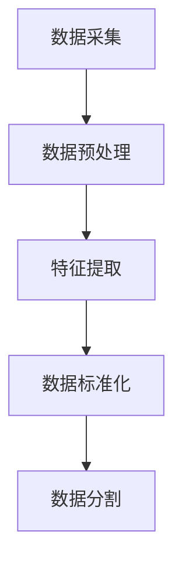
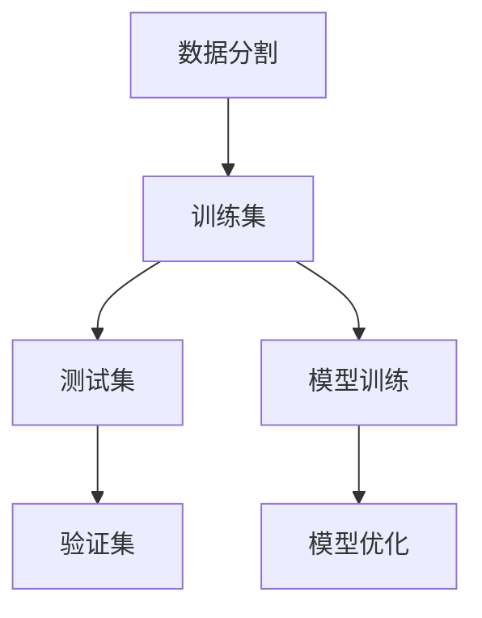
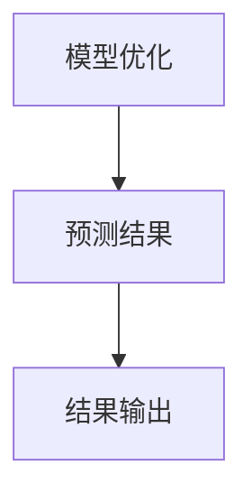
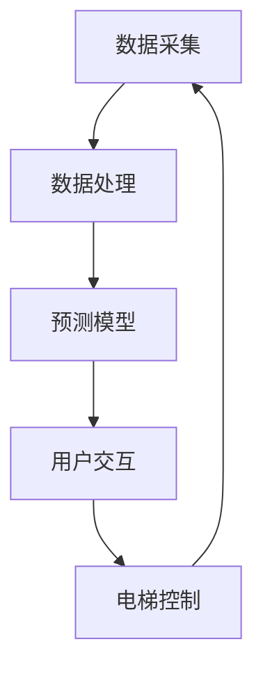

                 


# AI Agent在智能电梯中的人流预测

> 关键词：AI Agent，智能电梯，人流预测，算法原理，系统架构

> 摘要：本文探讨了AI Agent在智能电梯中的人流预测应用，从背景、概念、算法原理到系统架构设计和项目实战，详细分析了如何利用AI技术优化电梯管理。文章通过丰富的图表和代码示例，深入浅出地展示了AI Agent在智能电梯中的实际应用价值和未来发展方向。

---

## 第一部分：背景介绍

### 第1章：AI Agent与智能电梯概述

#### 1.1 AI Agent的核心概念

##### 1.1.1 AI Agent的定义与特点
AI Agent（人工智能代理）是一种智能实体，能够感知环境、自主决策并执行任务。其特点包括：
- **自主性**：无需外部干预，自主完成任务。
- **反应性**：能够实时感知环境并做出反应。
- **主动性**：主动采取行动以达到目标。
- **社会性**：能够与其他系统或用户进行交互。

##### 1.1.2 智能电梯的基本概念
智能电梯是一种集成自动化技术的电梯系统，能够通过传感器和控制器实现智能化管理。其主要功能包括：
- 实时监控电梯运行状态。
- 自动调度电梯以满足用户需求。
- 提供智能化的用户交互界面。

##### 1.1.3 人流预测的背景与意义
随着高楼大厦的普及，电梯的使用频率和复杂性不断增加。传统电梯管理方式存在效率低、能耗高等问题。通过AI Agent进行人流预测，可以优化电梯调度，减少等待时间，降低能耗，提升用户体验。

#### 1.2 问题背景与目标

##### 1.2.1 传统电梯管理的局限性
传统电梯管理主要依赖人工调度，存在以下问题：
- 电梯等待时间长，用户体验差。
- 能耗较高，运营成本大。
- 需要大量人工监控，管理效率低。

##### 1.2.2 人流预测的需求与挑战
随着高楼大厦的人员流动复杂化，电梯调度需要更加智能化。人流预测的需求包括：
- 实时预测电梯使用需求。
- 动态调整电梯运行策略。
- 提供高效的电梯调度算法。

##### 1.2.3 AI Agent在电梯管理中的作用
AI Agent可以通过以下方式优化电梯管理：
- 实时收集和分析电梯使用数据。
- 预测未来的人流需求。
- 自动调整电梯运行策略，提高效率。

#### 1.3 问题解决与边界

##### 1.3.1 问题解决的思路与方法
通过AI Agent进行电梯人流预测的主要思路包括：
- 数据采集：通过传感器和用户行为数据收集电梯使用情况。
- 数据分析：利用机器学习算法对数据进行建模和预测。
- 系统优化：根据预测结果优化电梯调度策略。

##### 1.3.2 系统边界与外延
电梯系统的人流预测仅关注电梯相关数据，不涉及其他系统（如 HVAC 或照明系统）。预测范围限于电梯使用情况，不考虑外部天气等因素。

##### 1.3.3 核心要素与组成结构
智能电梯系统的核心要素包括：
- 数据采集模块：收集电梯运行状态和用户行为数据。
- 数据分析模块：对数据进行处理和建模。
- 预测模块：基于模型进行人流预测。
- 调度模块：根据预测结果调整电梯运行策略。

---

## 第二部分：核心概念与联系

### 第2章：AI Agent与电梯系统的关系

#### 2.1 核心概念原理

##### 2.1.1 AI Agent的基本原理
AI Agent通过感知环境、分析数据并采取行动来实现目标。其基本原理包括：
- **感知**：通过传感器或其他数据源获取环境信息。
- **决策**：基于感知信息进行分析和推理，制定行动方案。
- **行动**：根据决策结果执行相应的操作。

##### 2.1.2 电梯系统的工作原理
电梯系统通过传感器、控制器和执行机构实现运行控制。其工作原理包括：
- **数据采集**：传感器实时采集电梯运行状态和用户请求。
- **数据处理**：控制器根据数据处理用户请求并制定运行计划。
- **执行**：执行机构根据控制器指令驱动电梯运行。

##### 2.1.3 人流预测的基本原理
人流预测通过分析历史数据和当前状态，预测未来的人流情况。其基本原理包括：
- **数据建模**：建立数学模型描述电梯使用情况。
- **模型训练**：利用历史数据训练模型。
- **预测**：基于训练好的模型预测未来的人流需求。

#### 2.2 概念属性特征对比

##### 2.2.1 AI Agent与传统电梯控制的对比
| 特性 | AI Agent | 传统电梯控制 |
|------|-----------|---------------|
| 数据依赖 | 高 | 低 |
| 自适应能力 | 强 | 弱 |
| 复杂性 | 高 | 低 |

##### 2.2.2 人流预测与传统预测方法的对比
| 特性 | 传统预测方法 | 基于AI Agent的预测方法 |
|------|---------------|--------------------------|
| 数据需求 | 低 | 高 |
| 实时性 | 低 | 高 |
| 精度 | 中 | 高 |

##### 2.2.3 系统性能与用户需求的对比
| 特性 | 用户需求 | 系统性能 |
|------|-----------|-----------|
| 响应时间 | 快 | 快 |
| 能耗 | 低 | 较低 |
| 维护成本 | 低 | 较低 |

#### 2.3 ER实体关系图

##### 2.3.1 实体关系图的构建
```mermaid
er
    rectangle "电梯系统" {
        "电梯ID" [key]
        "当前楼层"
        "运行状态"
    }
    rectangle "用户请求" {
        "请求ID" [key]
        "来源楼层"
        "目标楼层"
    }
    rectangle "预测结果" {
        "预测时间"
        "预测电梯需求"
    }
    "电梯系统" --| "预测结果": 提供实时数据
    "用户请求" --| "预测结果": 提供历史数据
```

---

## 第三部分：算法原理讲解

### 第3章：AI Agent的人流预测算法

#### 3.1 算法原理

##### 3.1.1 时间序列分析
时间序列分析是一种常用的预测方法，通过分析历史数据的时序特征来预测未来值。其核心思想是利用历史数据的自相关性进行预测。

##### 3.1.2 机器学习模型
机器学习模型（如随机森林、支持向量机）可以用于电梯使用情况的分类或回归预测。

##### 3.1.3 深度学习模型
深度学习模型（如LSTM、GRU）能够捕捉时间序列数据中的复杂模式，适合处理电梯使用中的非线性关系。

#### 3.2 算法流程图

##### 3.2.1 数据采集与预处理


##### 3.2.2 模型训练与优化


##### 3.2.3 预测结果输出


#### 3.3 Python实现代码

##### 3.3.1 数据加载与预处理
```python
import pandas as pd
import numpy as np

# 加载数据
data = pd.read_csv('elevator_data.csv')

# 数据预处理
data['时间'] = pd.to_datetime(data['时间'])
data.set_index('时间', inplace=True)
data = data.resample('5T').mean()
```

##### 3.3.2 模型训练
```python
from sklearn.model_selection import train_test_split
from sklearn.linear_model import LinearRegression

# 数据分割
X = data[['当前楼层', '运行状态']]
y = data['预测电梯需求']

X_train, X_test, y_train, y_test = train_test_split(X, y, test_size=0.2)

# 模型训练
model = LinearRegression()
model.fit(X_train, y_train)
```

##### 3.3.3 模型预测
```python
# 预测结果
y_pred = model.predict(X_test)

# 结果分析
print('预测结果:', y_pred)
print('真实结果:', y_test)
print('预测精度:', model.score(X_test, y_test))
```

---

## 第四部分：系统分析与架构设计

### 第4章：智能电梯系统架构

#### 4.1 系统架构设计

##### 4.1.1 系统模块划分
智能电梯系统主要由以下模块组成：
- 数据采集模块：负责采集电梯运行状态和用户请求数据。
- 数据处理模块：对数据进行清洗、转换和特征提取。
- 预测模型模块：基于数据建立预测模型并进行预测。
- 用户交互模块：提供用户请求界面和预测结果展示。
- 电梯控制模块：根据预测结果调整电梯运行策略。

##### 4.1.2 模块之间的关系


#### 4.2 系统功能设计

##### 4.2.1 数据采集模块
- 采集电梯运行状态（如当前楼层、运行状态）。
- 采集用户请求（如来源楼层、目标楼层）。

##### 4.2.2 数据处理模块
- 数据清洗：处理缺失值和异常值。
- 数据转换：将数据转换为适合模型输入的格式。
- 特征提取：提取有用的特征（如时间、楼层变化）。

##### 4.2.3 预测模型模块
- 建立预测模型：使用时间序列分析、机器学习或深度学习模型。
- 模型训练：利用历史数据训练模型。
- 模型预测：根据当前数据预测未来电梯需求。

##### 4.2.4 用户交互模块
- 提供用户请求界面：用户输入请求信息。
- 展示预测结果：将预测结果以可视化形式展示给用户。

##### 4.2.5 电梯控制模块
- 根据预测结果调整电梯运行策略。
- 自动调度电梯以满足用户需求。

#### 4.3 系统接口设计

##### 4.3.1 数据接口
- 数据采集模块与数据处理模块之间的接口。
- 数据处理模块与预测模型模块之间的接口。

##### 4.3.2 用户接口
- 用户交互模块与电梯控制模块之间的接口。
- 用户与用户交互模块之间的接口。

##### 4.3.3 电梯控制接口
- 电梯控制模块与电梯系统之间的接口。
- 电梯控制模块与数据采集模块之间的接口。

---

## 第五部分：项目实战

### 第5章：电梯系统实战分析

#### 5.1 项目背景与目标

##### 5.1.1 项目背景
某高档写字楼的电梯系统存在用户等待时间长、电梯使用效率低的问题。为了优化电梯管理，引入AI Agent进行电梯需求预测。

##### 5.1.2 项目目标
- 实现实时电梯需求预测。
- 优化电梯调度策略，减少用户等待时间。
- 提高电梯使用效率，降低能耗。

#### 5.2 项目环境搭建

##### 5.2.1 环境要求
- 操作系统：Linux或Windows。
- 开发工具：Python、Jupyter Notebook。
- 数据库：MySQL或MongoDB。
- 依赖库：Pandas、NumPy、Scikit-learn、TensorFlow。

##### 5.2.2 数据准备
- 数据来源：电梯运行日志和用户请求记录。
- 数据格式：CSV格式，包含时间戳、当前楼层、运行状态、用户请求信息。

#### 5.3 核心代码实现

##### 5.3.1 数据加载与预处理
```python
import pandas as pd
import numpy as np

# 加载数据
data = pd.read_csv('elevator_data.csv')

# 数据预处理
data['时间'] = pd.to_datetime(data['时间'])
data.set_index('时间', inplace=True)
data = data.resample('5T').mean()
```

##### 5.3.2 模型训练
```python
from sklearn.model_selection import train_test_split
from sklearn.linear_model import LinearRegression

# 数据分割
X = data[['当前楼层', '运行状态']]
y = data['预测电梯需求']

X_train, X_test, y_train, y_test = train_test_split(X, y, test_size=0.2)

# 模型训练
model = LinearRegression()
model.fit(X_train, y_train)
```

##### 5.3.3 模型预测
```python
# 预测结果
y_pred = model.predict(X_test)

# 结果分析
print('预测结果:', y_pred)
print('真实结果:', y_test)
print('预测精度:', model.score(X_test, y_test))
```

#### 5.4 系统优化与测试

##### 5.4.1 系统优化
- 优化模型参数，提高预测精度。
- 实现实时数据更新，保持预测准确性。
- 提供用户友好的交互界面，方便用户操作。

##### 5.4.2 测试与验证
- 测试系统功能，确保各模块正常运行。
- 验证预测结果，评估系统性能。
- 根据反馈调整系统参数，优化用户体验。

#### 5.5 项目总结与反思

##### 5.5.1 项目小结
通过AI Agent进行电梯需求预测，能够显著提高电梯使用效率，减少用户等待时间。系统实现了实时数据采集、预测模型建立和电梯调度优化。

##### 5.5.2 注意事项
- 数据质量对预测结果影响较大，需确保数据准确性和完整性。
- 模型选择需根据实际需求进行调整，避免过度复杂化。
- 系统运行需考虑实时性要求，确保预测结果能够及时反馈。

##### 5.5.3 拓展阅读
- 深度学习在时间序列预测中的应用。
- 强化学习在电梯调度中的应用。
- 大规模数据处理与实时分析技术。

---

## 第六部分：总结与展望

### 第6章：总结与未来展望

#### 6.1 小结
本文详细探讨了AI Agent在智能电梯中的人流预测应用，从背景、概念、算法原理到系统架构设计和项目实战，全面分析了AI技术在电梯管理中的潜力和价值。

#### 6.2 展望
随着AI技术的不断发展，电梯管理将更加智能化和个性化。未来的研究方向包括：
- 更精确的人流预测算法。
- 更高效的电梯调度策略。
- 更智能的用户交互界面。
- 更广泛的应用场景探索。

---

## 作者：AI天才研究院/AI Genius Institute & 禅与计算机程序设计艺术 /Zen And The Art of Computer Programming

