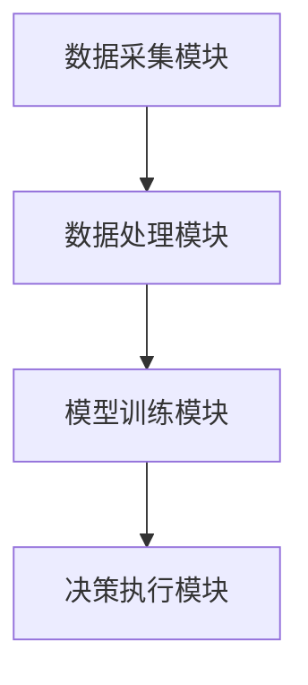
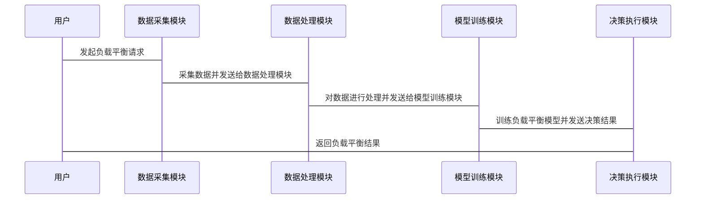
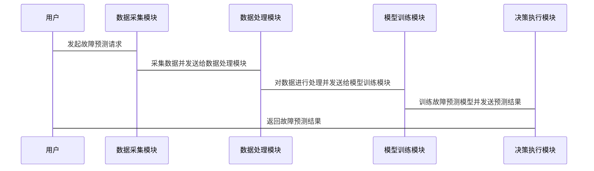

                 


```markdown
# AI Agent在智能电网中的应用：负载平衡与故障预测

> 关键词：AI Agent, 智能电网, 负载平衡, 故障预测, 电力系统, 人工智能

> 摘要：本文探讨了AI Agent在智能电网中的应用，重点分析了负载平衡与故障预测两大核心问题。通过结合AI Agent的智能决策能力与电力系统的动态特性，提出了一种基于强化学习的负载平衡优化算法和一种基于深度学习的故障预测模型，旨在提升电力系统的稳定性和可靠性。

---

# 第一部分: AI Agent在智能电网中的应用概述

## 第1章: 智能电网与AI Agent概述

### 1.1 智能电网的基本概念

#### 1.1.1 智能电网的定义与特点
智能电网是一种现代化的电力系统，通过集成先进的信息通信技术、自动化技术以及能源互联网技术，实现电力系统各个环节的智能化管理。其特点包括：
- **智能化**：利用AI、大数据、物联网等技术实现智能决策和优化。
- **分布式**：支持分布式能源系统，如太阳能、风能等可再生能源的接入。
- **实时性**：能够实时监测和响应电力系统的动态变化。
- **可靠性**：通过智能技术提高电力系统的稳定性和抗干扰能力。

#### 1.1.2 智能电网的核心组成部分
智能电网的核心组成部分包括：
- **发电系统**：包括常规发电和可再生能源发电。
- **输电系统**：包括高压输电网络。
- **配电系统**：包括中低压配电网络。
- **用电系统**：包括用户端的用电设备。
- **信息通信系统**：包括数据采集、传输和处理的基础设施。

#### 1.1.3 智能电网的发展背景与意义
随着全球能源需求的增加和环境问题的加剧，智能电网的建设成为实现可持续能源发展的关键。智能电网能够提高能源利用效率、降低碳排放、增强电网的可靠性和灵活性，是未来电力系统发展的必然趋势。

### 1.2 AI Agent的基本概念与特点

#### 1.2.1 AI Agent的定义
AI Agent（人工智能代理）是指能够感知环境、自主决策并执行任务的智能实体。AI Agent能够通过传感器获取环境信息，利用算法进行分析和决策，并通过执行器与环境交互。

#### 1.2.2 AI Agent的核心特点
AI Agent的核心特点包括：
- **自主性**：能够在没有人工干预的情况下自主决策。
- **反应性**：能够实时感知环境变化并做出响应。
- **学习能力**：能够通过经验改进自身的决策能力。
- **协作性**：能够与其他AI Agent或系统协同工作。

#### 1.2.3 AI Agent与传统自动化系统的主要区别
与传统自动化系统相比，AI Agent具有更强的自主性和学习能力。传统自动化系统通常基于预设规则运行，而AI Agent能够根据实时信息动态调整行为，具备更强的适应性和创新能力。

### 1.3 AI Agent在智能电网中的应用前景

#### 1.3.1 AI Agent在智能电网中的潜在应用领域
AI Agent在智能电网中的潜在应用领域包括：
- **负载平衡**：通过智能调度实现电力资源的优化分配。
- **故障预测**：通过异常检测实现电力系统的安全运行。
- **能源优化**：通过需求侧管理实现能源的高效利用。

#### 1.3.2 AI Agent应用的必要性与优势
AI Agent的应用能够显著提高电力系统的效率和可靠性。通过智能化的决策和优化，AI Agent能够实现能源的高效利用、故障的快速响应以及系统的自我修复。

#### 1.3.3 AI Agent应用的挑战与机遇
AI Agent在智能电网中的应用面临一些挑战，如数据隐私、算法复杂性以及系统的实时性要求。然而，这些挑战也为技术创新提供了机遇，推动了AI技术在能源领域的进一步发展。

---

## 第2章: 负载平衡与故障预测的背景与问题分析

### 2.1 智能电网中的负载平衡问题

#### 2.1.1 负载平衡的定义与重要性
负载平衡是指在电力系统中合理分配负载，以确保电力系统的稳定运行。负载平衡的重要性体现在以下几个方面：
- **提高系统效率**：通过优化负载分配，减少能源浪费。
- **避免过载**：防止设备过载导致的故障。
- **降低能耗**：通过合理分配负载，减少能源浪费。

#### 2.1.2 负载不平衡对电网运行的影响
负载不平衡可能导致以下问题：
- **设备损坏**：过载或欠载可能导致设备损坏。
- **电能质量问题**：负载不平衡会引起电压波动和电能质量问题。
- **系统稳定性下降**：负载不平衡可能导致电力系统的稳定性下降。

#### 2.1.3 负载平衡的传统解决方案与局限性
传统的负载平衡解决方案包括：
- **基于规则的负载分配**：根据预设规则进行负载分配。
- **基于优化的负载分配**：通过数学优化方法进行负载分配。

然而，传统方法在面对复杂多变的电力系统时，往往显得不够灵活和高效。

### 2.2 智能电网中的故障预测问题

#### 2.2.1 电力系统故障预测的定义与意义
电力系统故障预测是指通过分析系统数据，预测可能出现的故障并采取预防措施。故障预测的意义在于：
- **减少故障发生**：通过预测故障，提前采取措施，避免故障的发生。
- **降低维修成本**：通过预测故障，可以进行预防性维护，降低维修成本。
- **提高系统可靠性**：通过故障预测，可以提高电力系统的可靠性和稳定性。

#### 2.2.2 传统故障预测方法的局限性
传统故障预测方法主要包括基于统计分析和基于物理模型的方法。这些方法在面对复杂的电力系统时，往往缺乏足够的精度和实时性。

#### 2.2.3 AI Agent在故障预测中的优势
AI Agent在故障预测中的优势在于：
- **数据驱动**：通过大量数据训练模型，提高预测精度。
- **实时性**：能够实时分析数据，快速做出预测。
- **自适应性**：能够根据系统变化自动调整预测模型。

---

## 第3章: AI Agent在负载平衡中的应用

### 3.1 负载平衡的基本原理

#### 3.1.1 负载分配的基本原则
负载分配的基本原则包括：
- **公平性**：确保每个设备或区域的负载分配公平合理。
- **最优性**：在满足公平性的前提下，实现负载分配的最优。
- **稳定性**：保证负载分配过程的稳定性，避免频繁调整。

#### 3.1.2 负载平衡的实现方法
负载平衡的实现方法包括：
- **静态负载分配**：基于固定规则进行负载分配。
- **动态负载分配**：根据实时信息动态调整负载分配。

#### 3.1.3 负载平衡的优化目标
负载平衡的优化目标包括：
- **最小化能源浪费**：通过优化负载分配，减少能源浪费。
- **最大化系统效率**：通过优化负载分配，提高系统效率。
- **确保系统稳定性**：通过优化负载分配，确保系统稳定性。

### 3.2 AI Agent在负载平衡中的具体应用

#### 3.2.1 基于AI Agent的负载预测模型
基于AI Agent的负载预测模型可以通过以下步骤实现：
1. **数据采集**：采集电力系统的实时数据，包括负荷、电压、电流等。
2. **数据预处理**：对数据进行清洗和标准化处理。
3. **模型训练**：利用机器学习算法训练负载预测模型。
4. **模型部署**：将训练好的模型部署到电力系统中，进行实时预测。

#### 3.2.2 基于AI Agent的负载分配策略
基于AI Agent的负载分配策略可以通过以下步骤实现：
1. **实时监测**：实时监测电力系统的负载情况。
2. **决策制定**：根据负载情况和优化目标，制定负载分配策略。
3. **策略执行**：将决策结果发送到相关设备，执行负载分配。

#### 3.2.3 基于AI Agent的负载平衡优化算法
基于AI Agent的负载平衡优化算法可以采用强化学习方法。通过强化学习，AI Agent可以在与环境的交互中不断优化负载分配策略，从而实现系统的最优运行。

---

## 第4章: AI Agent在故障预测中的应用

### 4.1 故障预测的基本原理

#### 4.1.1 电力系统故障的基本类型
电力系统故障的基本类型包括：
- **短路故障**：电路中电流过大导致的故障。
- **断路故障**：电路中断导致的故障。
- **过载故障**：设备过载导致的故障。

#### 4.1.2 故障预测的常用方法
故障预测的常用方法包括：
- **基于统计分析的方法**：通过分析历史数据，找出故障的规律。
- **基于物理模型的方法**：通过建立物理模型，模拟系统的运行情况。
- **基于机器学习的方法**：通过训练模型，实现故障的智能预测。

#### 4.1.3 故障预测的数学模型
故障预测的数学模型可以基于支持向量机（SVM）、随机森林（Random Forest）等机器学习算法。

### 4.2 基于AI Agent的故障预测模型

#### 4.2.1 基于机器学习的故障预测
基于机器学习的故障预测可以通过以下步骤实现：
1. **数据采集**：采集电力系统的运行数据，包括负荷、电压、电流等。
2. **数据预处理**：对数据进行清洗和标准化处理。
3. **特征提取**：提取与故障预测相关的特征。
4. **模型训练**：利用机器学习算法训练故障预测模型。
5. **模型部署**：将训练好的模型部署到电力系统中，进行实时预测。

#### 4.2.2 基于深度学习的故障预测
基于深度学习的故障预测可以通过以下步骤实现：
1. **数据采集**：采集电力系统的运行数据。
2. **数据预处理**：对数据进行清洗和标准化处理。
3. **特征提取**：利用深度学习模型自动提取特征。
4. **模型训练**：利用深度学习算法训练故障预测模型。
5. **模型部署**：将训练好的模型部署到电力系统中，进行实时预测。

#### 4.2.3 基于强化学习的故障预测
基于强化学习的故障预测可以通过以下步骤实现：
1. **环境定义**：定义电力系统的运行环境。
2. **状态定义**：定义系统的状态，包括负荷、电压、电流等。
3. **动作定义**：定义系统的动作，包括调整负载、调节电压等。
4. **奖励机制**：定义奖励函数，用于评估动作的好坏。
5. **模型训练**：通过强化学习算法训练故障预测模型。
6. **模型部署**：将训练好的模型部署到电力系统中，进行实时预测。

---

## 第5章: 系统架构与实现

### 5.1 系统架构设计

#### 5.1.1 系统组成
系统由以下几个部分组成：
- **数据采集模块**：负责采集电力系统的实时数据。
- **数据处理模块**：负责对数据进行预处理和特征提取。
- **模型训练模块**：负责训练负载平衡和故障预测模型。
- **决策执行模块**：负责根据模型预测结果进行决策和执行。

#### 5.1.2 系统架构图
以下是系统架构的Mermaid图：



### 5.2 系统接口设计

#### 5.2.1 数据采集接口
数据采集接口负责与电力系统的传感器和数据采集设备进行交互。常见的数据采集接口包括：
- **Modbus协议**：用于与SCADA系统进行数据交互。
- **MQTT协议**：用于与物联网设备进行数据交互。

#### 5.2.2 模型训练接口
模型训练接口负责与机器学习框架（如TensorFlow、Scikit-learn）进行交互。模型训练接口需要提供以下功能：
- **数据预处理**：对数据进行清洗和标准化处理。
- **特征提取**：提取与任务相关的特征。
- **模型训练**：训练负载平衡和故障预测模型。

### 5.3 系统交互流程

#### 5.3.1 负载平衡交互流程
以下是负载平衡的交互流程：



#### 5.3.2 故障预测交互流程
以下是故障预测的交互流程：



---

## 第6章: 项目实战

### 6.1 环境安装与配置

#### 6.1.1 系统环境
- **操作系统**：Linux（推荐）或Windows
- **Python版本**：3.6或更高版本
- **依赖库安装**：
  ```bash
  pip install numpy
  pip install pandas
  pip install scikit-learn
  pip install tensorflow
  ```

#### 6.1.2 数据集准备
数据集可以从公开的数据源获取，例如：
- **UCI Machine Learning Repository**：提供电力系统数据集。
- **Kaggle**：提供电力系统数据集。

### 6.2 核心实现代码

#### 6.2.1 负载预测模型实现

```python
import numpy as np
import pandas as pd
from sklearn.model_selection import train_test_split
from sklearn.ensemble import RandomForestRegressor
from sklearn.metrics import mean_squared_error

# 数据加载
data = pd.read_csv('load_data.csv')

# 数据预处理
X = data.drop('load', axis=1)
y = data['load']

# 数据分割
X_train, X_test, y_train, y_test = train_test_split(X, y, test_size=0.2, random_state=42)

# 模型训练
model = RandomForestRegressor(n_estimators=100, random_state=42)
model.fit(X_train, y_train)

# 模型预测
y_pred = model.predict(X_test)

# 模型评估
mse = mean_squared_error(y_test, y_pred)
print(f'均方误差: {mse}')
```

#### 6.2.2 故障预测模型实现

```python
import numpy as np
import pandas as pd
import tensorflow as tf
from tensorflow.keras import layers

# 数据加载
data = pd.read_csv('fault_data.csv')

# 数据预处理
X = data.drop('fault_status', axis=1)
y = data['fault_status']

# 数据分割
X_train, X_test, y_train, y_test = train_test_split(X, y, test_size=0.2, random_state=42)

# 模型训练
model = tf.keras.Sequential([
    layers.Dense(64, activation='relu'),
    layers.Dense(32, activation='relu'),
    layers.Dense(1, activation='sigmoid')
])
model.compile(optimizer='adam', loss='binary_crossentropy', metrics=['accuracy'])

model.fit(X_train, y_train, epochs=10, batch_size=32, validation_data=(X_test, y_test))

# 模型预测
y_pred = model.predict(X_test)

# 模型评估
accuracy = model.metrics['accuracy']
print(f'准确率: {accuracy}')
```

### 6.3 实际案例分析

#### 6.3.1 负载平衡案例分析
假设我们有一个包含100个用户的配电系统，每个用户的负荷数据如下：

```python
import numpy as np
import pandas as pd
from sklearn.ensemble import RandomForestRegressor

# 数据生成
data = {
    'user_id': np.arange(1, 101),
    'load': np.random.normal(100, 10, 100)
}
data = pd.DataFrame(data)

# 数据预处理
X = data[['user_id']]
y = data['load']

# 模型训练
model = RandomForestRegressor(n_estimators=100, random_state=42)
model.fit(X, y)

# 负载预测
new_user = np.array([[101]])
predicted_load = model.predict(new_user)
print(f'新用户的预测负荷: {predicted_load[0]:.2f}')
```

#### 6.3.2 故障预测案例分析
假设我们有一个包含1000个数据点的故障数据集，每个数据点包含负荷、电压、电流等特征，以及故障状态：

```python
import numpy as np
import pandas as pd
from sklearn.model_selection import train_test_split
from sklearn.ensemble import RandomForestClassifier

# 数据加载
data = pd.read_csv('fault_data.csv')

# 数据预处理
X = data.drop('fault_status', axis=1)
y = data['fault_status']

# 数据分割
X_train, X_test, y_train, y_test = train_test_split(X, y, test_size=0.2, random_state=42)

# 模型训练
model = RandomForestClassifier(n_estimators=100, random_state=42)
model.fit(X_train, y_train)

# 故障预测
new_data = np.array([[120, 220, 10]])
predicted_fault = model.predict(new_data)
print(f'新数据的故障状态: {predicted_fault[0]}')
```

### 6.4 项目总结
通过以上实战，我们实现了基于AI Agent的负载平衡和故障预测模型。这些模型能够有效地预测负荷和故障，为智能电网的运行提供了有力支持。

---

## 第7章: 总结与展望

### 7.1 总结
本文详细探讨了AI Agent在智能电网中的应用，重点分析了负载平衡与故障预测两大核心问题。通过结合AI Agent的智能决策能力与电力系统的动态特性，提出了一种基于强化学习的负载平衡优化算法和一种基于深度学习的故障预测模型，旨在提升电力系统的稳定性和可靠性。

### 7.2 未来展望
未来，随着AI技术的不断发展，AI Agent在智能电网中的应用将更加广泛和深入。以下是未来可能的发展方向：
- **边缘计算与分布式AI**：通过边缘计算实现AI Agent的分布式部署，提高系统的实时性和响应速度。
- **多智能体协作**：通过多智能体协作，实现电力系统各个部分的协同优化。
- **自适应性增强**：通过不断优化AI Agent的学习能力，提高其自适应性和智能性。

---

# 作者：AI天才研究院/AI Genius Institute & 禅与计算机程序设计艺术/Zen And The Art of Computer Programming
```

