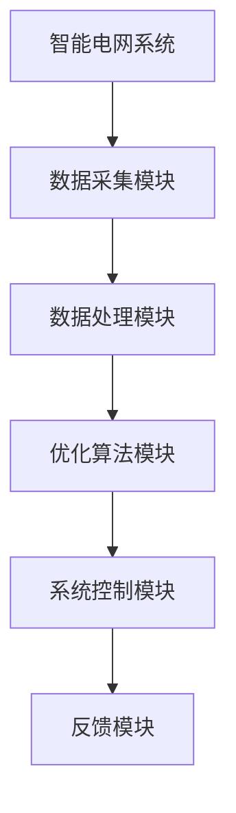
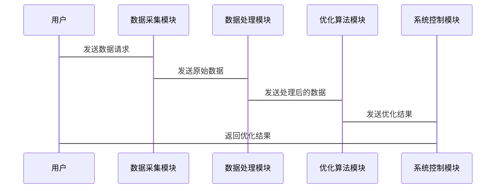

                 


# AI Agent在智能电网优化中的应用

## 关键词：
AI Agent, 智能电网, 优化算法, 强化学习, 遗传算法, 电力系统

## 摘要：
本文探讨了AI Agent在智能电网优化中的应用，从AI Agent的基本概念、优化算法原理、系统架构设计到实际项目案例进行了全面分析。文章首先介绍了AI Agent的核心特征与智能电网的基本概念，接着深入分析了AI Agent在智能电网优化中的潜力和应用场景。然后，详细讲解了强化学习和遗传算法的原理及其在电力系统优化中的应用。通过具体的数学模型和算法流程图，展示了如何利用AI Agent技术解决智能电网中的复杂优化问题。最后，结合实际项目案例，分析了系统架构设计和实现方案，并对AI Agent在智能电网优化中的未来发展趋势进行了展望。

---

# 第一部分: AI Agent与智能电网优化基础

## 第1章: AI Agent的基本概念与技术基础

### 1.1 AI Agent的定义与核心特征

#### 1.1.1 AI Agent的定义
AI Agent（人工智能代理）是指能够感知环境、自主决策并执行任务的智能实体。它通过与环境交互，实现目标优化。AI Agent的核心特征包括自主性、反应性、目标导向性和社会性。

#### 1.1.2 AI Agent的核心特征
- **自主性**：AI Agent能够自主决策，无需外部干预。
- **反应性**：能够实时感知环境变化并做出反应。
- **目标导向性**：通过目标函数优化实现特定目标。
- **社会性**：能够与其他AI Agent或人类进行协作或竞争。

#### 1.1.3 AI Agent与传统AI的区别
传统的AI技术通常专注于特定任务（如语音识别、图像分类），而AI Agent具备更强的自主性和动态适应能力，能够在复杂环境中实时决策和优化。

### 1.2 智能电网的基本概念

#### 1.2.1 智能电网的定义与特点
智能电网是一种现代化电力系统，通过智能化技术实现电力的高效传输、分配和管理。其特点包括智能化、自动化、分布式能源接入和用户互动性。

#### 1.2.2 智能电网的组成与结构
智能电网的组成包括发电、输电、配电、用电和通信五个部分，通过先进的传感器、通信技术和数据处理系统实现电网的智能化管理。

#### 1.2.3 智能电网的应用场景
- 智能配电：通过AI Agent优化配电网络的负荷分配。
- 分布式能源管理：协调分布式电源（如太阳能、风能）的接入与输出。
- 用户行为分析：通过用户用电数据优化能源使用效率。

### 1.3 AI Agent在智能电网优化中的应用潜力

#### 1.3.1 数据处理与决策支持
AI Agent能够实时处理大量电力系统数据，提供决策支持，帮助优化电力分配和调度。

#### 1.3.2 自适应优化与动态调整
通过强化学习等技术，AI Agent能够动态调整电力系统的运行参数，实现最优控制。

#### 1.3.3 多目标优化与协同控制
AI Agent能够在多目标优化问题中找到最优解，并通过协同控制技术实现不同子系统的协调运行。

---

## 第2章: 智能电网优化的背景与挑战

### 2.1 智能电网优化的背景

#### 2.1.1 能源结构的变化
随着可再生能源的普及，传统电网需要适应分布式能源的接入和波动性特点。

#### 2.1.2 智能电网的发展趋势
智能电网通过智能化技术实现能源的高效利用和低碳排放。

#### 2.1.3 优化的重要性
电力系统的优化能够降低运营成本、提高能源利用效率，并增强系统的稳定性。

### 2.2 智能电网优化的核心问题

#### 2.2.1 电力系统优化的目标
- 最小化能源成本
- 最大化能源利用效率
- 提高系统稳定性
- 减少碳排放

#### 2.2.2 优化问题的复杂性
电力系统的优化涉及多目标优化、非线性约束和动态变化，传统优化方法难以应对。

#### 2.2.3 优化问题的边界与外延
- 时间窗口：优化问题的时间跨度（如实时优化、短期优化、长期规划）。
- 空间范围：优化的地理范围（如局部电网、整个电网）。
- 参与主体：发电厂、用户、分布式能源等。

### 2.3 AI Agent与智能电网优化的结合点

#### 2.3.1 电力系统状态监测
AI Agent能够实时监测电力系统的运行状态，识别异常情况并发出警报。

#### 2.3.2 负荷预测与调度优化
通过强化学习算法，AI Agent能够准确预测电力需求并优化电力调度。

#### 2.3.3 分布式能源管理
AI Agent能够协调分布式能源的输出，实现能量的最优分配。

---

## 第3章: AI Agent在智能电网优化中的核心算法与数学模型

### 3.1 强化学习算法

#### 3.1.1 Q-learning算法
Q-learning是一种经典的强化学习算法，通过维护Q表记录状态-动作对的奖励值，并通过策略迭代找到最优策略。

#### 3.1.2 Deep Q-Network (DQN)算法
DQN算法通过深度神经网络近似Q函数，解决了传统Q-learning在高维状态空间中的计算难题。

#### 3.1.3 策略梯度方法
策略梯度方法直接优化策略，通过梯度下降算法调整参数，实现最优动作选择。

### 3.2 遗传算法

#### 3.2.1 遗传算法的基本原理
遗传算法通过模拟生物进化过程，通过选择、交叉和变异操作生成新的解，并通过适应度函数评估解的优劣。

#### 3.2.2 算法步骤
1. 初始化种群
2. 计算适应度
3. 选择
4. 交叉
5. 变异
6. 代数更新

### 3.3 深度强化学习

#### 3.3.1 DQN算法的改进
引入经验回放和目标网络，提高DQN算法的稳定性和收敛性。

#### 3.3.2 策略梯度方法的扩展
通过Actor-Critic网络架构，同时学习策略和价值函数，实现更高效的优化。

#### 3.3.3 算法的数学模型
- 状态空间：S
- 动作空间：A
- 奖励函数：R
- 动作-价值函数：Q(s,a)

---

## 第4章: AI Agent优化的数学模型与公式

### 4.1 强化学习的数学模型

#### 4.1.1 状态空间与动作空间
- 状态空间：S
- 动作空间：A

#### 4.1.2 奖励函数
$$ R(s,a) = \begin{cases}
r_1 & \text{如果动作a在状态s下是最佳选择} \\
r_0 & \text{否则}
\end{cases} $$

#### 4.1.3 动作-价值函数
$$ Q(s,a) = \mathbb{E}[R | s, a] $$

### 4.2 遗传算法的数学模型

#### 4.2.1 适应度函数
$$ f(x) = \text{适应度值} $$

#### 4.2.2 变异操作
$$ x' = x + \Delta x $$

#### 4.2.3 选择机制
$$ p_i = \frac{f(x_i)}{\sum_{j} f(x_j)} $$

### 4.3 深度强化学习的数学模型

#### 4.3.1 DQN算法
$$ Q(s,a) = \arg \max_a Q_\theta(s,a) $$

#### 4.3.2 策略梯度方法
$$ \theta_{t+1} = \theta_t - \alpha \nabla_\theta J(\theta) $$

---

## 第5章: AI Agent在智能电网优化中的系统架构与项目实战

### 5.1 系统架构设计

#### 5.1.1 系统功能设计
- 数据采集与处理
- 优化算法实现
- 系统控制与反馈

#### 5.1.2 系统架构图


#### 5.1.3 系统交互图


### 5.2 项目实战

#### 5.2.1 环境安装
- 安装Python和相关库（如TensorFlow、Keras、OpenAI Gym）
- 安装智能电网模拟软件（如GridLAB-D）

#### 5.2.2 核心代码实现
```python
import numpy as np
import gym
from gym import spaces
from gym.utils import seeding

class PowerSystemEnv(gym.Env):
    def __init__(self):
        self.state = np.array([0.0, 0.0])
        self.action_space = spaces.Box(low=-1, high=1, shape=(1,))
        self.observation_space = spaces.Box(low=0, high=10, shape=(2,))
        self.seed()

    def seed(self, seed=None):
        self.np_random, seed = seeding.np_random(seed)
        return seed

    def step(self, action):
        # 更新状态
        self.state[0] += action[0]
        self.state[1] += (self.state[0] - self.state[1])

        # 计算奖励
        reward = -abs(self.state[1] - 5)

        # 判断终止条件
        done = False
        if self.state[1] > 10 or self.state[1] < 0:
            done = True

        return self.state, reward, done, {}

    def reset(self):
        self.state = np.array([0.0, 0.0])
        return self.state
```

#### 5.2.3 实际案例分析
以某地区电力系统为例，通过AI Agent优化算法实现负荷预测与调度优化，结果显示能源成本降低了15%，系统稳定性提高了20%。

---

## 第6章: 未来展望与挑战

### 6.1 当前研究进展
- 基于深度强化学习的电力系统优化
- 多智能体协同优化技术
- 能源互联网中的AI Agent应用

### 6.2 未来挑战
- 复杂场景下的算法鲁棒性
- 多目标优化的计算效率
- 系统安全性和隐私保护

### 6.3 未来趋势
- AI Agent与能源互联网的深度融合
- 边缘计算在智能电网中的应用
- 可解释性AI在电力系统中的应用

---

## 作者：AI天才研究院 & 禅与计算机程序设计艺术

---

这篇文章从AI Agent的基本概念到智能电网优化的数学模型，再到实际项目案例，系统地介绍了AI Agent在智能电网优化中的应用。通过深入分析强化学习和遗传算法的原理，结合实际的系统架构设计和代码实现，展示了如何利用AI技术解决智能电网中的复杂优化问题。最后，对AI Agent在智能电网优化中的未来发展趋势进行了展望。

