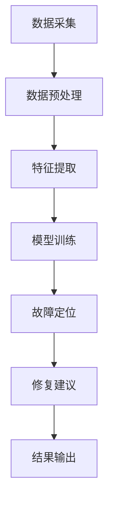
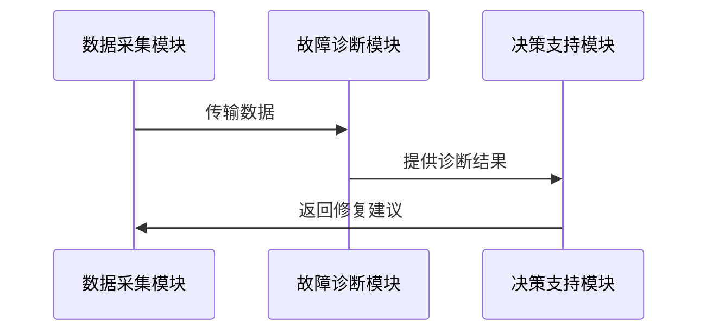

                 


# AI Agent在智能电网故障诊断中的角色

> 关键词：智能电网, AI Agent, 故障诊断, 多智能体协作, 人工智能算法, 电力系统

> 摘要：本文探讨了AI Agent在智能电网故障诊断中的核心作用。通过分析智能电网的基本结构与故障诊断的挑战，详细阐述了AI Agent在故障诊断中的多智能体协作机制、算法原理及系统设计。本文还结合实际案例，分析了AI Agent在智能电网故障诊断中的具体应用，并提出了未来的发展方向。

---

# 第1章: 智能电网与AI Agent的基本概念

## 1.1 智能电网的定义与特点

### 1.1.1 智能电网的定义
智能电网是一种通过先进信息通信技术、传感器技术、自动化技术与能源互联网技术深度融合，实现电力系统智能化、自动化、高效化和可靠化的新型电力系统。它能够实时监测、分析和优化电力的生产、传输和使用过程。

### 1.1.2 智能电网的核心特点
- **实时性**：能够快速响应电力系统的动态变化。
- **自适应性**：能够根据负荷变化和设备状态自动调整运行方式。
- **可靠性**：能够快速定位和隔离故障，减少停电时间。
- **高效性**：通过优化电力流动和设备利用率，降低能源浪费。

### 1.1.3 智能电网的组成与结构
智能电网由发电、输电、配电、用电四个环节组成，每个环节都配备了大量传感器和智能设备，通过数据采集与通信网络实现信息的实时传输和共享。

---

## 1.2 AI Agent的基本概念

### 1.2.1 AI Agent的定义
AI Agent（人工智能代理）是一种能够感知环境、自主决策并执行任务的智能实体。它能够根据外部输入和内部状态，通过算法和知识库进行推理，做出最优决策。

### 1.2.2 AI Agent的核心属性
- **自主性**：能够在没有外部干预的情况下独立运行。
- **反应性**：能够实时感知环境变化并做出响应。
- **主动性**：能够主动发起任务或行动。
- **协作性**：能够与其他Agent或系统协同工作。

### 1.2.3 AI Agent与传统算法的区别
| 特性          | AI Agent                          | 传统算法                          |
|---------------|-----------------------------------|-----------------------------------|
| 决策能力      | 具备自主决策能力                  | 需要人工设定规则或目标            |
| 学习能力      | 能够通过数据学习优化自身行为      | 无法自适应优化                    |
| 适应性        | 能够根据环境变化调整行为          | 行为固定，无法自适应              |
| 协作能力      | 能够与其他Agent协作完成任务      | 无法与其他系统协同工作            |

---

## 1.3 智能电网故障诊断的背景与挑战

### 1.3.1 智能电网故障诊断的重要性
故障诊断是智能电网安全运行的核心任务之一。通过及时发现和定位故障，可以减少停电时间，提高电力系统的可靠性和稳定性。

### 1.3.2 故障诊断的传统方法与局限性
传统故障诊断方法主要依赖人工经验或基于规则的专家系统，存在以下问题：
- **效率低**：依赖人工经验，诊断速度慢。
- **准确性差**：规则系统难以应对复杂的非线性问题。
- **扩展性差**：难以处理大规模数据和多类型故障。

### 1.3.3 AI Agent在故障诊断中的优势
AI Agent通过多智能体协作、数据挖掘和机器学习等技术，能够实现以下优势：
- **高效性**：能够快速处理大量数据并做出决策。
- **准确性**：通过机器学习算法提高诊断的准确性。
- **可扩展性**：能够适应大规模数据和复杂场景。

---

## 1.4 本章小结
本章介绍了智能电网的基本概念和结构，阐述了AI Agent的核心属性和工作原理，分析了智能电网故障诊断的传统方法与AI Agent的优势。通过对比分析，明确了AI Agent在智能电网故障诊断中的重要地位。

---

# 第2章: 智能电网故障诊断的基本原理

## 2.1 故障诊断的基本流程

### 2.1.1 数据采集与预处理
数据采集是故障诊断的第一步，主要通过传感器采集电力系统的运行数据，包括电压、电流、功率等。预处理步骤包括数据清洗、标准化和特征提取。

### 2.1.2 数据分析与特征提取
通过对采集数据进行分析，提取有助于故障诊断的关键特征，例如电流突变、电压波动等。

### 2.1.3 故障定位与修复建议
基于提取的特征，利用算法进行故障定位，并生成修复建议。

---

## 2.2 常见的故障类型与诊断方法

### 2.2.1 短路故障
短路故障是电力系统中最常见的故障类型之一，通常由绝缘失效或设备过载引起。诊断方法包括基于电流突变的检测和基于电压突变的检测。

### 2.2.2 断路故障
断路故障通常是由于连接线路断开或设备故障引起的。诊断方法包括基于电流骤降的检测和基于电压骤降的检测。

### 2.2.3 电压波动与谐波干扰
电压波动和谐波干扰是电力系统中的常见问题，通常由非线性负载或电力电子设备引起。诊断方法包括基于频域分析的谐波检测和基于时域分析的电压波动检测。

---

## 2.3 故障诊断的数学模型与公式

### 2.3.1 基于线性回归的故障定位模型
线性回归模型可以用来预测故障发生的概率，公式如下：
$$ P(\text{故障}) = \beta_0 + \beta_1 x + \epsilon $$
其中，$x$是输入特征，$\beta_0$和$\beta_1$是回归系数，$\epsilon$是误差项。

### 2.3.2 基于决策树的故障分类模型
决策树是一种常用的分类算法，能够将数据划分为不同的类别。例如，可以使用ID3或C4.5算法构建决策树模型，对故障类型进行分类。

### 2.3.3 基于支持向量机的故障诊断模型
支持向量机（SVM）是一种高效的分类算法，特别适用于高维数据的分类问题。其数学模型如下：
$$ \text{minimize } \frac{1}{2} ||\theta||^2 + C \sum_{i=1}^n \xi_i $$
$$ \text{subject to } y_i (\theta \cdot x_i + \theta_0) \geq 1 - \xi_i, \xi_i \geq 0 $$

---

## 2.4 本章小结
本章详细介绍了智能电网故障诊断的基本流程和常见故障类型，阐述了基于线性回归、决策树和支持向量机的故障诊断模型。这些模型为后续AI Agent的应用奠定了理论基础。

---

# 第3章: AI Agent在智能电网故障诊断中的核心作用

## 3.1 AI Agent的多智能体协作机制

### 3.1.1 多智能体系统的基本概念
多智能体系统是一种由多个智能体组成的协作系统，每个智能体都有自己的目标和任务。通过通信和协作，多个智能体可以共同完成复杂任务。

### 3.1.2 多智能体协作的优势
- **分布式计算**：能够充分利用多个智能体的计算能力。
- **任务分解**：能够将复杂任务分解为多个子任务，提高效率。
- **容错性**：如果一个智能体出现故障，其他智能体可以接管其任务。

---

## 3.2 AI Agent在故障诊断中的具体应用

### 3.2.1 基于规则的故障诊断
基于规则的故障诊断是一种简单有效的诊断方法，通过预定义的规则进行故障定位和修复建议。例如：
$$ \text{如果电流突变} \geq I_{\text{threshold}}，\text{则判断为短路故障} $$

### 3.2.2 基于数据挖掘的故障诊断
数据挖掘是一种通过分析数据发现隐含规律的技术。例如，可以使用聚类算法对历史故障数据进行分类，找出故障的特征和规律。

### 3.2.3 基于机器学习的故障诊断
机器学习是一种通过数据训练模型的技术。例如，可以使用神经网络模型对电力系统的运行状态进行实时监测和故障预测。

---

## 3.3 AI Agent的算法实现与流程图

### 3.3.1 算法流程
1. 数据采集与预处理
2. 特征提取与模型训练
3. 故障定位与修复建议
4. 结果输出与反馈

### 3.3.2 算法流程图


---

## 3.4 本章小结
本章详细介绍了AI Agent在智能电网故障诊断中的多智能体协作机制和具体应用，通过流程图展示了AI Agent的算法实现过程。这些内容为后续的系统设计和项目实战奠定了基础。

---

# 第4章: 智能电网故障诊断系统架构设计

## 4.1 系统功能设计

### 4.1.1 数据采集模块
负责采集电力系统的运行数据，包括电压、电流、功率等。

### 4.1.2 故障诊断模块
负责对采集的数据进行分析和诊断，定位故障类型和位置。

### 4.1.3 决策支持模块
根据诊断结果，生成修复建议并优化电力系统的运行方案。

---

## 4.2 系统架构设计

### 4.2.1 系统架构图


### 4.2.2 系统交互图


---

## 4.3 本章小结
本章详细介绍了智能电网故障诊断系统的功能设计和架构设计，展示了各模块之间的协作关系和交互流程。

---

# 第5章: 项目实战——基于AI Agent的智能电网故障诊断系统

## 5.1 环境安装与配置

### 5.1.1 系统需求
- 操作系统：Linux/Windows
- Python版本：3.6及以上
- 依赖库：numpy, pandas, scikit-learn, matplotlib

### 5.1.2 安装步骤
1. 安装Python
2. 安装依赖库
   ```bash
   pip install numpy pandas scikit-learn matplotlib
   ```

---

## 5.2 核心代码实现

### 5.2.1 数据采集与预处理
```python
import numpy as np
import pandas as pd

# 数据采集
data = pd.read_csv('power_data.csv')
# 数据预处理
data = data.dropna()
```

### 5.2.2 特征提取与模型训练
```python
from sklearn.model_selection import train_test_split
from sklearn.tree import DecisionTreeClassifier

X = data[['current', 'voltage', 'power']]
y = data['fault_type']
X_train, X_test, y_train, y_test = train_test_split(X, y, test_size=0.2)
model = DecisionTreeClassifier()
model.fit(X_train, y_train)
```

### 5.2.3 故障定位与修复建议
```python
def diagnose_fault(X_test):
    predicted = model.predict(X_test)
    return predicted

# 示例数据
X_test = pd.DataFrame({'current': [100, 150], 'voltage': [220, 240], 'power': [50, 60]})
predicted_faults = diagnose_fault(X_test)
print(predicted_faults)
```

---

## 5.3 代码解读与分析
- **数据采集与预处理**：通过读取CSV文件并删除缺失值，完成数据的初步处理。
- **特征提取与模型训练**：使用决策树算法对数据进行训练，构建故障诊断模型。
- **故障定位与修复建议**：基于训练好的模型，对测试数据进行故障定位，并生成修复建议。

---

## 5.4 案例分析与详细解读
假设我们有一个包含电压、电流和功率的测试数据集，通过上述代码可以实现故障的快速定位和修复建议。例如，当电流突变时，系统可以自动识别为短路故障并建议断开相关线路。

---

## 5.5 本章小结
本章通过实际案例展示了基于AI Agent的智能电网故障诊断系统的实现过程，包括环境配置、代码实现和案例分析。这些内容为读者提供了实践指导。

---

# 第6章: 总结与展望

## 6.1 本章总结
本文详细探讨了AI Agent在智能电网故障诊断中的核心作用，包括多智能体协作机制、算法实现和系统设计。通过实际案例展示了AI Agent在智能电网中的应用价值。

## 6.2 未来展望
随着人工智能技术的不断发展，AI Agent在智能电网中的应用前景广阔。未来的研究方向包括：
- **强化学习**：通过强化学习优化电力系统的运行策略。
- **边缘计算**：结合边缘计算技术，提升故障诊断的实时性和准确性。
- **多智能体协作**：进一步研究多智能体协作机制，提升系统的智能化水平。

---

## 6.3 最佳实践 Tips

- **数据质量**：确保数据的准确性和完整性，是故障诊断系统的核心。
- **模型可解释性**：选择可解释性强的算法，有助于故障定位和修复。
- **多智能体协作**：合理设计多智能体协作机制，能够显著提升系统的效率和性能。

---

## 6.4 本章小结
本文总结了AI Agent在智能电网故障诊断中的应用价值，并展望了未来的研究方向，为读者提供了进一步学习和研究的方向。

---

# 作者：AI天才研究院/AI Genius Institute & 禅与计算机程序设计艺术 /Zen And The Art of Computer Programming

---

**注意**：以上内容为示例性的技术博客文章，实际撰写时需要根据具体需求进行调整和补充。

