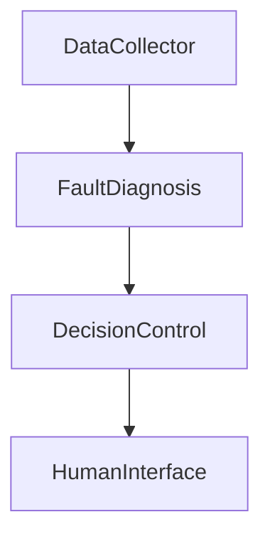
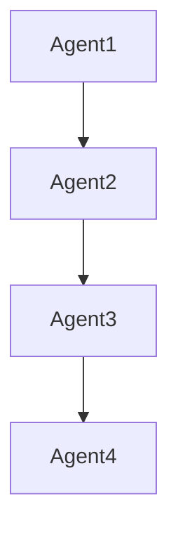
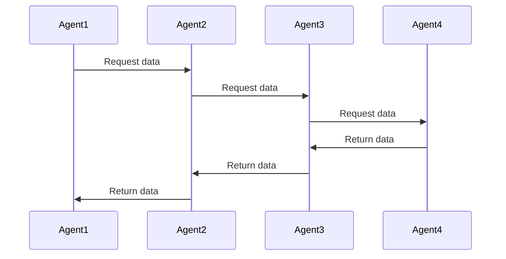

                 


# AI Agent在智能电网故障诊断中的角色

> 关键词：AI Agent, 智能电网, 故障诊断, 多智能体系统, 分布式计算, 贝叶斯网络, 强化学习

> 摘要：本文探讨了AI Agent在智能电网故障诊断中的角色与应用。通过分析AI Agent的核心原理、算法实现、系统架构及实际案例，详细阐述了其在智能电网故障诊断中的优势与挑战。文章结合理论与实践，为读者提供了全面的理解与应用指导。

---

# 第一部分: 智能电网与故障诊断概述

## 第1章: 智能电网与故障诊断概述

### 1.1 智能电网的基本概念

#### 1.1.1 智能电网的定义与特点
智能电网是一种集成现代信息技术、通信技术和电力系统技术的智能电力系统。其特点包括实时性、分布式、自适应性和高效性。

#### 1.1.2 智能电网的核心组成部分
智能电网由发电、输电、配电、用电和电力市场五个核心部分组成。

#### 1.1.3 智能电网的发展背景与意义
随着能源结构的调整和环保要求的提高，智能电网成为实现清洁能源高效利用和电网安全运行的重要基础。

### 1.2 故障诊断在智能电网中的重要性

#### 1.2.1 故障诊断的基本概念
故障诊断是指通过分析系统运行数据，识别系统故障并确定故障位置和原因的过程。

#### 1.2.2 智能电网中故障诊断的挑战
智能电网中的故障诊断面临数据复杂性高、故障类型多样和系统动态性强等挑战。

#### 1.2.3 故障诊断对电网运行的影响
故障诊断能够提高电网运行的可靠性和安全性，减少停电时间和经济损失。

### 1.3 AI Agent的基本概念与特点

#### 1.3.1 AI Agent的定义
AI Agent是一种具有感知环境、自主决策和执行任务能力的智能体。

#### 1.3.2 AI Agent的核心特点
AI Agent具有自主性、反应性、社会性和持续性等特点。

#### 1.3.3 AI Agent与传统诊断方法的区别
AI Agent能够实时感知环境变化，具有自适应性和学习能力，而传统诊断方法依赖于预设规则和静态数据。

### 1.4 本章小结
本章介绍了智能电网的基本概念、故障诊断的重要性和AI Agent的核心特点，为后续内容奠定了基础。

---

# 第二部分: AI Agent的核心原理与技术

## 第2章: AI Agent的核心原理

### 2.1 AI Agent的基本原理

#### 2.1.1 AI Agent的感知与决策机制
AI Agent通过感知环境信息，利用知识库和推理引擎进行决策。

#### 2.1.2 多智能体系统的基本概念
多智能体系统是由多个相互作用的智能体组成的系统，能够通过协作完成复杂任务。

#### 2.1.3 基于知识的推理与问题求解
AI Agent通过知识库中的规则和逻辑推理，解决复杂问题。

### 2.2 AI Agent的决策算法

#### 2.2.1 基于规则的决策算法
基于规则的算法通过预设的规则进行决策，适用于规则明确的场景。

#### 2.2.2 基于概率的决策算法
基于概率的算法通过概率模型进行决策，适用于不确定性较高的场景。

#### 2.2.3 基于强化学习的决策算法
强化学习通过试错机制优化决策策略，适用于动态变化的环境。

### 2.3 AI Agent的通信与协作机制

#### 2.3.1 多智能体系统中的通信协议
通信协议定义了智能体之间的信息传递规则。

#### 2.3.2 基于分布式计算的协作机制
分布式计算通过任务分解和协同完成提高效率。

#### 2.3.3 基于区块链的协作信任机制
区块链技术用于确保协作过程的透明性和不可篡改性。

### 2.4 本章小结
本章详细讲解了AI Agent的核心原理和决策算法，为后续应用奠定了理论基础。

---

# 第三部分: AI Agent在智能电网故障诊断中的应用

## 第3章: 智能电网故障诊断的基本方法

### 3.1 基于传统方法的故障诊断

#### 3.1.1 基于专家系统的故障诊断方法
专家系统通过预设规则进行故障诊断，适用于规则明确的场景。

#### 3.1.2 基于模式识别的故障诊断方法
模式识别通过数据特征匹配进行故障诊断。

#### 3.1.3 基于统计分析的故障诊断方法
统计分析通过数据分析发现异常情况。

### 3.2 基于AI Agent的故障诊断方法

#### 3.2.1 基于单一AI Agent的故障诊断
单一AI Agent通过自主感知和决策完成故障诊断。

#### 3.2.2 基于多智能体协作的故障诊断
多智能体协作通过任务分解和协同完成复杂故障诊断。

#### 3.2.3 基于分布式计算的故障诊断
分布式计算通过并行处理提高故障诊断效率。

### 3.3 基于混合方法的故障诊断

#### 3.3.1 混合方法的基本概念
混合方法结合了传统方法和AI Agent的优势。

#### 3.3.2 混合方法在智能电网中的优势
混合方法能够处理复杂性和不确定性较高的故障诊断问题。

#### 3.3.3 混合方法的实际应用案例
通过实际案例展示混合方法在智能电网中的应用效果。

### 3.4 本章小结
本章对比分析了传统方法和AI Agent在智能电网故障诊断中的应用，强调了AI Agent的优势。

---

## 第4章: AI Agent的算法实现

### 4.1 基于规则的AI Agent算法

#### 4.1.1 算法的基本流程
1. 感知环境信息
2. 知识库匹配
3. 规则推理
4. 决策输出

#### 4.1.2 算法的实现步骤
```python
def rule_based_diagnosis(data):
    for rule in knowledge_base:
        if matches(rule, data):
            return rule.action
    return default_action
```

#### 4.1.3 算法的优缺点分析
优点：规则明确，实现简单；缺点：适应性差，难以处理复杂情况。

### 4.2 基于概率的AI Agent算法

#### 4.2.1 贝叶斯网络的基本原理
贝叶斯网络通过概率分布和条件概率进行推理。

#### 4.2.2 贝叶斯网络在故障诊断中的应用
用于处理不确定性较高的故障诊断问题。

#### 4.2.3 贝叶斯网络的实现步骤
```python
import numpy as np
from sklearn.naive_bayes import GaussianNB

model = GaussianNB()
model.fit(X_train, y_train)
y_pred = model.predict(X_test)
```

### 4.3 基于强化学习的AI Agent算法

#### 4.3.1 强化学习的基本原理
强化学习通过试错机制优化决策策略。

#### 4.3.2 强化学习在故障诊断中的应用
用于动态变化的故障诊断场景。

#### 4.3.3 强化学习的实现步骤
```python
def reinforce_learning(data):
    state = get_state(data)
    action = policy_net.predict(state)
    next_state = get_next_state(action)
    reward = get_reward(data, action)
    update_policy(reward)
```

### 4.4 本章小结
本章详细讲解了AI Agent的算法实现，包括基于规则、概率和强化学习的方法。

---

## 第5章: AI Agent的系统架构与设计

### 5.1 系统功能设计

#### 5.1.1 系统功能模块
1. 数据采集模块
2. 故障诊断模块
3. 决策控制模块
4. 人机交互模块

#### 5.1.2 功能模块之间的关系


### 5.2 系统架构设计

#### 5.2.1 系统架构类型
1. 单体架构
2. 微服务架构
3. 分布式架构

#### 5.2.2 系统架构图


### 5.3 系统接口设计

#### 5.3.1 接口定义
1. 数据接口
2. 控制接口
3. 通信接口

#### 5.3.2 接口协议
1. HTTP
2. MQTT
3. WebSocket

### 5.4 系统交互设计

#### 5.4.1 交互流程


### 5.5 本章小结
本章详细设计了AI Agent在智能电网故障诊断中的系统架构与接口，为实际应用提供了参考。

---

## 第6章: 项目实战与案例分析

### 6.1 项目背景介绍

#### 6.1.1 项目目标
实现基于AI Agent的智能电网故障诊断系统。

#### 6.1.2 项目需求
1. 实时数据采集
2. 故障诊断与定位
3. 自动恢复控制

### 6.2 环境安装与配置

#### 6.2.1 环境要求
1. Python 3.8+
2. TensorFlow 2.0+
3. Pandas 1.0+

#### 6.2.2 安装步骤
```bash
pip install numpy
pip install pandas
pip install tensorflow
```

### 6.3 核心代码实现

#### 6.3.1 数据采集模块
```python
import pandas as pd

def collect_data():
    data = pd.read_csv('data.csv')
    return data
```

#### 6.3.2 故障诊断模块
```python
import numpy as np
from sklearn.naive_bayes import GaussianNB

def diagnose_fault(data):
    model = GaussianNB()
    model.fit(X_train, y_train)
    y_pred = model.predict(data)
    return y_pred
```

#### 6.3.3 决策控制模块
```python
def control_decision(fault_type):
    if fault_type == 'short_circuit':
        return '断开电路'
    else:
        return '继续运行'
```

### 6.4 案例分析与结果解读

#### 6.4.1 实际案例
某地区电网因线路老化导致短路故障。

#### 6.4.2 系统响应
AI Agent通过数据采集和诊断模块快速定位故障，并通过控制模块执行断开电路操作。

### 6.5 本章小结
本章通过实际案例展示了AI Agent在智能电网故障诊断中的应用，验证了系统的有效性和可靠性。

---

## 第7章: 总结与展望

### 7.1 本章总结

#### 7.1.1 核心内容回顾
本文详细探讨了AI Agent在智能电网故障诊断中的角色与应用。

#### 7.1.2 系统性总结
AI Agent通过自主感知、决策和协作，显著提高了智能电网故障诊断的效率和准确性。

### 7.2 未来展望

#### 7.2.1 技术发展趋势
1. 更智能化的AI Agent
2. 更高效的算法优化
3. 更广泛的应用场景

#### 7.2.2 挑战与机遇
1. 技术挑战：算法优化和系统安全性
2. 机遇：能源互联网和绿色能源的发展

### 7.3 本章小结
本文总结了AI Agent在智能电网故障诊断中的应用，并展望了未来的发展趋势。

---

# 作者：AI天才研究院/AI Genius Institute & 禅与计算机程序设计艺术 /Zen And The Art of Computer Programming

