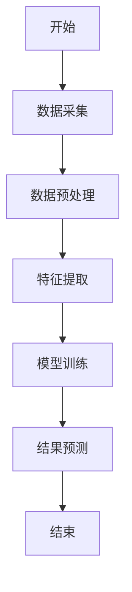
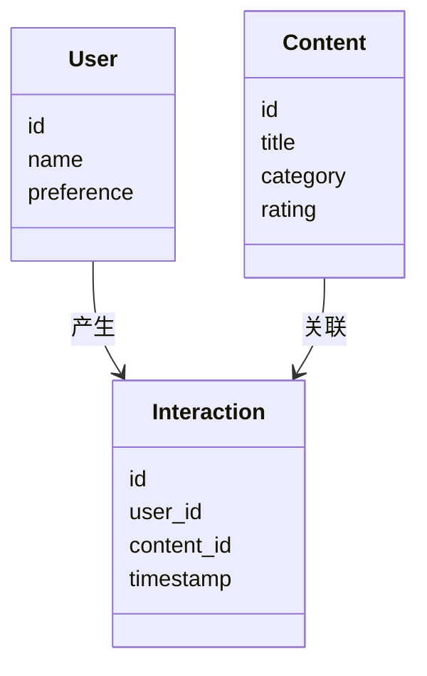
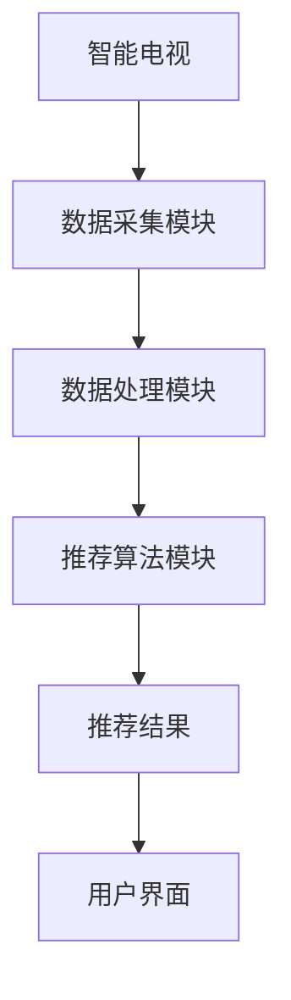
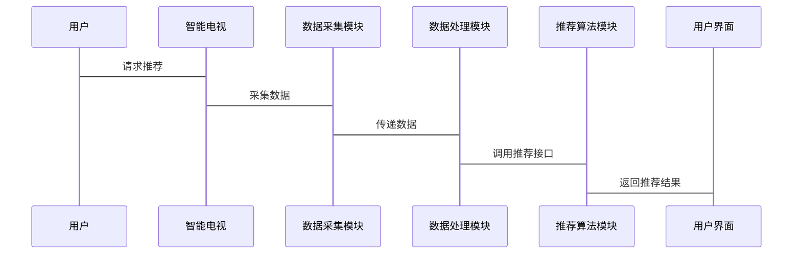

                 


# AI Agent在智能电视中的家庭观影喜好学习

## 关键词：AI Agent，智能电视，家庭观影，观影偏好，推荐算法

## 摘要：本文详细探讨了AI Agent在智能电视中的应用，特别是如何通过学习家庭成员的观影偏好来优化观影体验。文章从背景介绍、核心概念、算法原理、系统架构到项目实战，全面分析了AI Agent在智能电视中的实现过程和实际应用效果。

---

# 第一部分: 背景介绍

## 第1章: 问题背景

### 1.1 智能电视的发展现状
智能电视作为现代家庭娱乐的核心设备，已经从单纯的视频播放工具进化为集成了人工智能技术的智能终端。随着互联网的普及和大数据技术的发展，智能电视能够通过连接云端服务器，为用户提供个性化的观影推荐服务。

### 1.2 家庭观影需求的多样化
现代家庭的观影需求呈现多样化趋势。不同家庭成员的观影偏好可能完全不同，例如，父母喜欢观看电影或电视剧，而儿童可能更倾向于动画片或教育类视频。此外，观影场景也多样化，例如，家庭观影、个人观影、节日观影等。

### 1.3 AI Agent在家庭观影中的作用
AI Agent（智能代理）能够通过学习家庭成员的观影历史、偏好和行为模式，提供个性化的观影推荐。通过分析用户的观影数据，AI Agent可以预测用户的喜好，推荐符合用户口味的内容。

## 第2章: 问题描述

### 2.1 家庭观影喜好的定义
家庭观影喜好是指家庭成员在观影过程中表现出的偏好和倾向，包括但不限于喜欢的影视类型、演员、导演、播放时长、观看时间等。

### 2.2 现有观影推荐系统的局限性
现有的观影推荐系统主要基于协同过滤或基于内容的推荐算法，存在以下问题：
- 数据稀疏性：当用户观影数据不足时，推荐效果不佳。
- 个性化不足：无法充分考虑家庭成员之间的观影偏好差异。
- 动态变化：无法实时捕捉用户观影偏好的动态变化。

### 2.3 AI Agent如何解决观影偏好学习问题
AI Agent通过实时采集和分析家庭成员的观影数据，结合机器学习算法，能够动态更新用户的观影偏好模型，提供更精准的推荐服务。

## 第3章: 问题解决

### 3.1 AI Agent的核心功能
- 数据采集：实时采集家庭成员的观影数据，包括观影内容、时间、评分等。
- 数据分析：通过机器学习算法，分析观影数据，提取用户的观影偏好特征。
- 推荐生成：基于用户偏好特征，推荐符合用户口味的观影内容。

### 3.2 数据采集与处理方法
- 数据采集：通过智能电视内置的传感器和用户交互界面，采集用户的观影行为数据。
- 数据预处理：清洗和归一化数据，确保数据质量。
- 数据存储：将数据存储在云端数据库中，方便后续分析。

### 3.3 算法实现与优化
- 算法选择：基于深度学习的推荐算法，如协同过滤、矩阵分解等。
- 算法优化：通过调参和模型优化，提升推荐准确率和响应速度。

---

# 第二部分: 核心概念与联系

## 第4章: 核心概念原理

### 4.1 AI Agent的基本原理
AI Agent通过感知环境、分析数据、做出决策并执行操作，实现对家庭成员观影喜好的实时学习和推荐。

### 4.2 家庭观影喜好的学习机制
- 数据驱动：通过分析用户的观影数据，提取偏好特征。
- 模型驱动：构建用户偏好模型，预测用户的观影行为。
- 实时更新：根据用户的实时行为，动态更新偏好模型。

### 4.3 数据驱动的推荐算法
- 基于协同过滤的推荐算法：通过分析用户的观影行为，找到相似用户的观影偏好，推荐相似内容。
- 基于内容的推荐算法：通过分析影视内容的特征，推荐与用户偏好匹配的内容。

## 第5章: 概念属性特征对比

### 表5-1: AI Agent与传统推荐系统的对比

| 特性                | AI Agent推荐系统          | 传统推荐系统            |
|---------------------|--------------------------|-------------------------|
| 数据来源            | 用户行为数据、历史数据    | 用户评分、协同过滤数据  |
| 算法核心            | 深度学习、实时更新        | 协同过滤、基于内容推荐  |
| 个性化程度          | 高度个性化               | 中等个性化             |
| 实时性              | 实时更新                 | 周期性更新             |
| 适应性              | 高度适应用户变化         | 较低适应性             |

## 第6章: ER实体关系图

```mermaid
erDiagram
    user {
        id
        name
        preference
    }
    content {
        id
        title
        category
        rating
    }
    interaction {
        id
        user_id
        content_id
        timestamp
    }
    user --> interaction : 产生
    content --> interaction : 关联
```

---

# 第三部分: 算法原理讲解

## 第7章: 算法流程



## 第8章: Python源代码实现

```python
# 示例代码：基于协同过滤的推荐算法
import pandas as pd
from sklearn.metrics.pairwise import cosine_similarity

# 数据加载
ratings = pd.read_csv('ratings.csv')

# 数据处理
pivot_table = ratings.pivot('user_id', 'content_id', 'rating').fillna(0)

# 计算余弦相似度
similarity_matrix = cosine_similarity(pivot_table.values)

# 推荐算法
def get_recommendations(user_id, similarity_matrix, pivot_table):
    # 找到用户对应的行索引
    user_index = pivot_table.index.get_loc(user_id)
    # 计算相似度
    similar_users = [i for i in range(len(similarity_matrix[user_index])) if i != user_index]
    similar_scores = similarity_matrix[user_index][similar_users]
    # 找到相似度最高的用户
    similar_user = similar_users[similar_scores.argmax()]
    # 返回推荐内容
    recommendations = pivot_table.columns[pivot_table.iloc[similar_user] > 0]
    return recommendations

# 示例调用
print(get_recommendations(1, similarity_matrix, pivot_table))
```

## 第9章: 数学模型与公式

### 9.1 协同过滤算法的数学模型
$$ sim(u, v) = \frac{\sum_{i=1}^{n}(r_{u,i} - \bar{r}_u)(r_{v,i} - \bar{r}_v)}{\sqrt{\sum_{i=1}^{n}(r_{u,i} - \bar{r}_u)^2} \cdot \sqrt{\sum_{i=1}^{n}(r_{v,i} - \bar{r}_v)^2}} } $$

### 9.2 基于内容的推荐算法
$$ score(c, u) = \sum_{i=1}^{m} w_i \cdot f(c_i, u_i) $$

---

# 第四部分: 系统分析与架构设计

## 第10章: 问题场景介绍

### 10.1 智能电视的观影数据采集
- 通过智能电视的遥控器记录用户的观影行为。
- 采集用户的观影时间、内容、评分等信息。

## 第11章: 系统功能设计

### 11.1 功能模块设计


## 第12章: 系统架构设计

### 12.1 系统架构图


## 第13章: 系统接口设计

### 13.1 接口设计
- 数据采集接口：用于采集用户的观影数据。
- 数据处理接口：用于对数据进行预处理和特征提取。
- 推荐接口：用于根据用户偏好生成推荐结果。

### 13.2 交互流程


---

# 第五部分: 项目实战

## 第14章: 环境安装

### 14.1 环境要求
- Python 3.6+
- Pandas、Scikit-learn等库

## 第15章: 核心代码实现

```python
# 推荐算法实现
from sklearn.neighbors import NearestNeighbors

# 数据加载
X = pd.read_csv('features.csv').values

# 模型训练
nbrs = NearestNeighbors(n_neighbors=5, algorithm='ball_tree').fit(X)

# 推荐生成
distances, indices = nbrs.kneighbors(X[0].reshape(1, -1))
recommendations = indices[0][1:]
```

## 第16章: 实际案例分析

### 16.1 案例分析
假设用户A喜欢观看科幻电影，系统会推荐类似的科幻电影或同一导演的其他作品。

### 16.2 代码解读
```python
# 代码解读：基于最近邻算法的推荐系统
import numpy as np
from sklearn.neighbors import NearestNeighbors

# 加载数据
X = np.array([[1, 2, 3],
              [4, 5, 6],
              [7, 8, 9]])

# 模型训练
nbrs = NearestNeighbors(n_neighbors=2, algorithm='ball_tree').fit(X)

# 推荐生成
distances, indices = nbrs.kneighbors(X[0].reshape(1, -1))
print(indices)
```

---

# 第六部分: 最佳实践

## 第17章: 小结

### 17.1 核心要点总结
- AI Agent能够通过学习家庭成员的观影偏好，提供个性化的推荐服务。
- 基于协同过滤和内容的推荐算法是实现个性化推荐的核心技术。
- 系统设计需要考虑数据采集、处理、存储和推荐的全过程。

## 第18章: 注意事项

### 18.1 开发注意事项
- 数据隐私保护：确保用户数据的安全性和隐私性。
- 算法优化：实时更新模型，提升推荐准确率。
- 系统稳定性：确保推荐系统在高并发场景下的稳定性。

## 第19章: 拓展阅读

### 19.1 推荐的书籍和资源
- 《推荐系统实战》
- 《机器学习实战》
- 《深度学习导论》

---

# 作者：AI天才研究院 & 禅与计算机程序设计艺术

