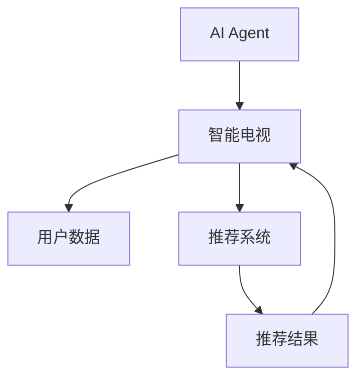

                 


# AI Agent在智能电视中的观看习惯分析

## 关键词：
AI Agent，智能电视，观看习惯分析，推荐系统，协同过滤，内容过滤，系统架构

## 摘要：
本文探讨AI Agent在智能电视中的应用，重点分析用户的观看习惯，介绍AI Agent的基本概念、算法原理、系统架构设计，通过具体案例展示如何利用AI技术优化智能电视的用户体验。

---

## 第1章: AI Agent与智能电视的背景介绍

### 1.1 AI Agent的基本概念

#### 1.1.1 什么是AI Agent
AI Agent（人工智能代理）是能够感知环境并采取行动以实现目标的智能实体。它可以自主决策，无需人工干预，通过传感器获取信息，并根据预设的目标执行任务。

#### 1.1.2 AI Agent的核心特征
- **自主性**：能够独立运作，无需外部干预。
- **反应性**：能实时感知环境变化并做出反应。
- **目标导向性**：所有行为都围绕实现特定目标展开。
- **学习能力**：通过数据和经验不断优化自身行为。

#### 1.1.3 AI Agent与传统算法的区别
AI Agent不仅执行预设的程序，还能根据环境反馈动态调整策略，具有学习和自适应能力，而传统算法通常基于固定的规则执行任务。

### 1.2 智能电视的发展与现状

#### 1.2.1 智能电视的定义与特点
智能电视是集成互联网功能的电视，能够连接网络，提供丰富的应用程序、视频点播、社交互动等功能。

#### 1.2.2 智能电视的用户行为分析
智能电视的用户行为包括观看内容的选择、观看时间、暂停/快进操作等，这些行为数据反映了用户的偏好和习惯。

#### 1.2.3 智能电视与AI技术的结合
AI技术的应用使得智能电视能够分析用户的观看行为，提供个性化推荐，优化用户体验。

### 1.3 观看习惯分析的背景与意义

#### 1.3.1 观看习惯分析的定义
通过分析用户在智能电视上的观看行为，识别用户的偏好和习惯，从而提供个性化的内容推荐。

#### 1.3.2 观看习惯分析的重要性
个性化推荐能够提高用户满意度，增加用户粘性，同时帮助内容提供商优化内容分发策略。

#### 1.3.3 当前研究现状与挑战
当前的研究主要集中在推荐算法的优化和用户隐私保护上，未来需要进一步提升算法的准确性和实时性。

---

## 第2章: AI Agent在智能电视中的核心概念

### 2.1 AI Agent的结构与功能

#### 2.1.1 AI Agent的组成模块
AI Agent通常包括感知模块、决策模块和执行模块。感知模块负责数据采集，决策模块基于数据制定策略，执行模块负责任务执行。

#### 2.1.2 AI Agent的功能特点
- 数据采集：收集用户的观看记录、行为数据等。
- 数据分析：通过机器学习算法分析数据，识别用户偏好。
- 个性化推荐：基于分析结果，推荐相关内容。

#### 2.1.3 AI Agent与智能电视的交互方式
AI Agent通过电视的遥控器、语音助手等接口与用户交互，接收指令并反馈结果。

### 2.2 智能电视用户数据的来源

#### 2.2.1 用户观看记录数据
记录用户观看的内容、时长、频率等信息，帮助分析用户的观看习惯。

#### 2.2.2 用户行为数据
包括用户的搜索记录、点击行为、暂停/快进操作等，反映用户的使用习惯。

#### 2.2.3 用户偏好数据
通过问卷调查、用户反馈等方式获取用户的兴趣偏好，用于细化推荐策略。

### 2.3 观看习惯分析的核心要素

#### 2.3.1 用户画像的构建
基于用户数据，构建用户画像，包括年龄、性别、兴趣爱好等，用于个性化推荐。

#### 2.3.2 内容特征的提取
对视频内容进行特征提取，如 genres、actors、ratings等，用于推荐系统的匹配。

#### 2.3.3 用户行为模式的识别
通过分析用户行为数据，识别用户的观看模式，如喜欢观看喜剧类节目，常在晚上观看等。

---

## 第3章: AI Agent在观看习惯分析中的算法原理

### 3.1 基于协同过滤的推荐算法

#### 3.1.1 协同过滤的基本原理
协同过滤是基于用户相似性或物品相似性推荐相关内容的算法。用户协同过滤基于用户之间的相似性推荐，物品协同过滤基于物品之间的相似性推荐。

#### 3.1.2 基于用户的协同过滤
- **步骤**：计算用户之间的相似性，找到与目标用户相似的用户，推荐这些用户喜欢的内容。
- **公式**：
  $$ sim(u, v) = \frac{\sum_{i}(u_i - \bar{u})(v_i - \bar{v})}{\sqrt{\sum_{i}(u_i - \bar{u})^2} \sqrt{\sum_{i}(v_i - \bar{v})^2}} $$
  其中，$sim(u, v)$ 表示用户u和v的相似性，$\bar{u}$ 和 $\bar{v}$ 分别是u和v的平均评分。

#### 3.1.3 基于物品的协同过滤
- **步骤**：计算物品之间的相似性，找到与目标用户感兴趣物品相似的其他物品，推荐给用户。
- **公式**：
  $$ sim(i, j) = \frac{\sum_{u}(i_u - \bar{i})(j_u - \bar{j})}{\sqrt{\sum_{u}(i_u - \bar{i})^2} \sqrt{\sum_{u}(j_u - \bar{j})^2}} $$
  其中，$sim(i, j)$ 表示物品i和j的相似性，$\bar{i}$ 和 $\bar{j}$ 分别是i和j的平均评分。

### 3.2 基于内容的推荐算法

#### 3.2.1 基于内容特征的相似
- **步骤**：提取内容特征，如电影的 genres、actors、ratings等，计算内容之间的相似性，推荐相似内容。

#### 3.2.2 内容特征的提取方法
- 使用自然语言处理（NLP）技术提取文本特征。
- 使用图像处理技术提取视频画面特征。
- 使用协同过滤算法提取用户偏好特征。

---

## 第4章: AI Agent在智能电视中的系统架构设计

### 4.1 问题场景介绍
智能电视系统需要处理大量用户数据，实时分析用户的观看行为，提供个性化推荐。

### 4.2 系统功能设计

#### 4.2.1 领域模型设计
- **领域模型**：用户、内容、推荐规则等实体之间的关系。
- **类图**：
  ```mermaid
  classDiagram
    class User {
      id
      name
      preferences
    }
    class Content {
      id
      title
      genre
    }
    class RecommendationRule {
      id
      rule_type
      condition
      action
    }
    User --> RecommendationRule
    Content --> RecommendationRule
  ```

### 4.3 系统架构设计

#### 4.3.1 架构图


---

## 第5章: AI Agent在智能电视中的项目实战

### 5.1 项目介绍

#### 5.1.1 项目背景
本项目旨在开发一个基于AI Agent的智能电视推荐系统，通过分析用户的观看行为，提供个性化的内容推荐。

### 5.1.2 环境搭建

#### 5.1.2.1 安装Python
```bash
python --version
pip install numpy scikit-learn
```

#### 5.1.2.2 安装AI Agent框架
```bash
pip install tensorflow scikit-learn
```

### 5.1.3 核心代码实现

#### 5.1.3.1 数据预处理
```python
import numpy as np
from sklearn.metrics.pairwise import cosine_similarity

# 示例数据：用户-物品评分矩阵
ratings = np.array([
    [4, 3, 0],
    [5, 1, 3],
    [2, 0, 4],
    [0, 4, 2],
    [1, 5, 0]
])

# 计算余弦相似性
similarity = cosine_similarity(ratings)
print(similarity)
```

#### 5.1.3.2 协同过滤推荐
```python
def recommend(user_id, ratings, similarity):
    user_ratings = ratings[user_id]
    similar_users = np.where(similarity[user_id] > 0.7)[0]
    recommended_items = []
    for user in similar_users:
        recommended_items.extend(np.where(user_ratings == 0)[0])
    return recommended_items

# 示例推荐
user_id = 0
recommendations = recommend(user_id, ratings, similarity)
print(f"推荐内容：{recommendations}")
```

### 5.1.4 案例分析与实际应用
通过实际数据的分析，展示AI Agent如何优化推荐效果，提高用户满意度。

### 5.1.5 项目小结
总结项目实施的经验和教训，提出改进建议。

---

## 第6章: 总结与展望

### 6.1 总结
本文详细介绍了AI Agent在智能电视中的应用，探讨了观看习惯分析的核心概念、算法原理和系统架构设计，并通过项目实战展示了如何利用AI技术优化用户的观看体验。

### 6.2 展望
未来的研究方向包括提升推荐算法的准确性和实时性，优化用户隐私保护，探索AI Agent在智能电视中的更多应用场景。

---

## 作者：AI天才研究院/AI Genius Institute & 禅与计算机程序设计艺术 /Zen And The Art of Computer Programming

---

**感谢您的阅读！希望本文能为您提供有价值的见解和启发。**

