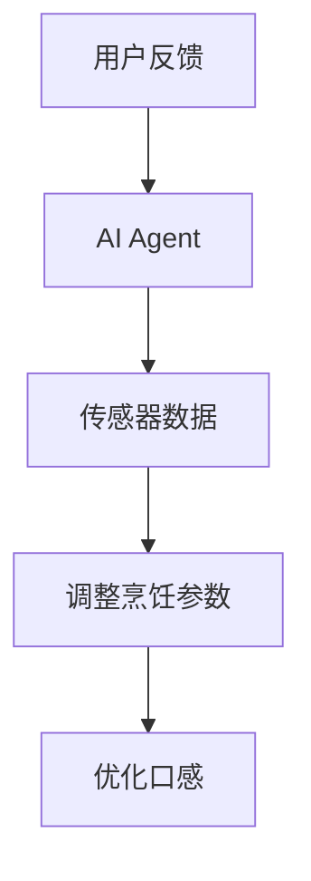
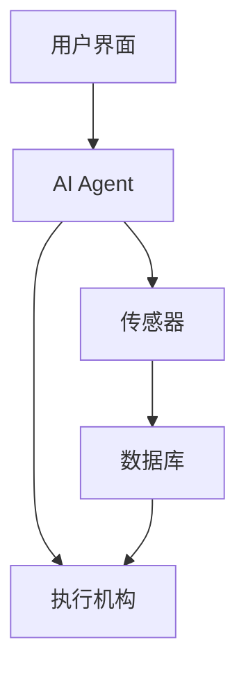

                 


# AI Agent在智能电饭煲中的米饭口感优化

> 关键词：AI Agent, 智能电饭煲, 米饭口感, 优化算法, 系统架构, 项目实战

> 摘要：本文详细探讨了AI Agent在智能电饭煲中的应用，特别是在优化米饭口感方面。通过分析问题背景、核心概念、算法原理、系统架构设计、项目实战以及优化与改进，本文展示了如何利用AI技术提升电饭煲的功能和用户体验。文章内容丰富，结构清晰，结合理论与实践，为读者提供了全面的技术指导。

---

## 第一部分: AI Agent在智能电饭煲中的米饭口感优化背景与概述

### 第1章: AI Agent与智能电饭煲概述

#### 1.1 问题背景
- **1.1.1 米饭口感优化的重要性**  
  米饭是日常饮食中不可或缺的一部分，口感的好坏直接影响用户体验。然而，传统电饭煲在米饭口感优化方面存在诸多不足，例如无法根据米的种类、水量、温度等变量进行智能调整。  
- **1.1.2 传统电饭煲的局限性**  
  传统电饭煲通常采用固定的烹饪程序，无法根据用户口味和米的特性进行个性化调整，导致米饭口感一致性差。  
- **1.1.3 AI技术在家电领域的应用趋势**  
  随着AI技术的快速发展，越来越多的家电开始集成智能功能，通过学习用户习惯和环境数据，提供更个性化的服务。

#### 1.2 问题描述
- **1.2.1 米饭口感的影响因素**  
  米的种类、洗米时间、水量、温度、烹饪时间等因素都会影响米饭的口感。  
- **1.2.2 用户对米饭口感的多样化需求**  
  用户对米饭的口感需求多样化，例如有的用户喜欢软糯，有的喜欢干香。  
- **1.2.3 当前电饭煲在口感优化中的不足**  
  传统电饭煲无法根据用户的反馈动态调整烹饪参数，导致口感优化效果有限。

#### 1.3 解决方案
- **1.3.1 引入AI Agent的概念**  
  AI Agent（人工智能代理）是一种能够感知环境、做出决策并采取行动的智能系统。将其引入电饭煲，可以通过传感器和算法实时调整烹饪参数，优化米饭口感。  
- **1.3.2 AI Agent在米饭口感优化中的作用**  
  AI Agent可以根据用户反馈和环境数据，动态调整烹饪参数，如温度、时间、水量等，从而实现个性化口感优化。  
- **1.3.3 解决方案的技术路线**  
  通过传感器采集数据，AI Agent分析数据并调整烹饪参数，最终实现米饭口感的个性化优化。

#### 1.4 边界与外延
- **1.4.1 系统边界**  
  本系统仅关注米饭口感的优化，不涉及电饭煲的其他功能（如保温、预约等）。  
- **1.4.2 功能的外延与限制**  
  本系统主要优化口感，但受限于传感器精度和算法复杂度，无法完全消除所有变量对口感的影响。  
- **1.4.3 与其他系统的接口关系**  
  本系统可与智能家居系统（如智能音箱）联动，进一步提升用户体验。

#### 1.5 核心概念组成
- **1.5.1 AI Agent的定义与属性**  
  AI Agent是一种智能系统，具备感知、决策和执行功能。  
- **1.5.2 米饭口感优化的指标体系**  
  包括米的膨胀率、淀粉含量、烹饪时间、温度等指标。  
- **1.5.3 系统整体架构**  
  包括传感器、AI Agent、烹饪模块和用户交互界面四个部分。

---

## 第2章: AI Agent的核心概念与原理

### 2.1 AI Agent的原理
- **2.1.1 感知与学习**  
  AI Agent通过传感器采集数据，学习用户偏好和环境条件。  
- **2.1.2 决策与调整**  
  根据采集的数据和用户反馈，AI Agent调整烹饪参数以优化口感。  
- **2.1.3 执行与反馈**  
  AI Agent通过执行机构调整烹饪过程，并根据反馈进一步优化。

### 2.2 核心概念对比
| 概念       | 属性特征                |
|------------|-------------------------|
| AI Agent   | 感知、决策、执行        |
| 米饭口感   | 膨胀率、淀粉含量、温度  |
| 烹饪参数   | 水量、温度、时间         |

### 2.3 ER实体关系图
```mermaid
er
 _actor(用户)
  action(烹饪操作)
  parameter(烹饪参数)
  sensor(传感器数据)
  agent(AI Agent)
  rice_type(米的种类)

  user --> action: 选择烹饪模式
  action --> parameter: 设置烹饪参数
  parameter --> agent: 传递参数
  agent --> sensor: 收集传感器数据
  sensor --> agent: 提供反馈
  agent --> rice_type: 优化烹饪方案
```

---

## 第3章: 算法原理讲解

### 3.1 算法流程


### 3.2 算法实现代码
```python
import numpy as np
from sklearn import linear_model

# 示例数据：用户反馈与烹饪参数
X = np.array([[水量, 温度, 时间], ...])
y = np.array([用户满意度评分, ...])

# 训练模型
model = linear_model.LinearRegression()
model.fit(X, y)

# 预测最优参数
new_X = np.array([[推荐水量, 推荐温度, 推荐时间], ...])
predicted_y = model.predict(new_X)
```

### 3.3 数学模型
优化目标函数：
$$ \text{最大化 } J = \sum_{i=1}^{n} (用户反馈_i \times 权重_i) $$

约束条件：
$$ 0 \leq 水量 \leq 1000 \text{ml} $$
$$ 100 \leq 温度 \leq 120 \text{℃} $$
$$ 5 \leq 时间 \leq 30 \text{分钟} $$

---

## 第4章: 系统分析与架构设计

### 4.1 问题场景
用户通过电饭煲选择烹饪模式，AI Agent根据用户反馈和传感器数据动态调整烹饪参数，最终实现个性化口感优化。

### 4.2 系统架构设计


### 4.3 接口设计
- 用户交互接口：提供烹饪模式选择和口感反馈功能。
- 传感器接口：采集米的重量、温度、湿度等数据。
- 执行机构接口：调整烹饪参数，如水量、温度、时间。

---

## 第5章: 项目实战

### 5.1 环境安装
```bash
pip install numpy scikit-learn
```

### 5.2 核心代码实现
```python
class AIAgent:
    def __init__(self):
        self.model = linear_model.LinearRegression()
        self.data = []

    def train(self, X, y):
        self.model.fit(X, y)

    def predict(self, X):
        return self.model.predict(X)
```

### 5.3 案例分析
通过实际数据训练AI Agent，优化米饭口感。例如，根据用户反馈调整水量和温度，最终提升用户满意度评分。

---

## 第6章: 优化与改进

### 6.1 性能优化
- 提升模型训练效率。
- 优化传感器数据采集频率。

### 6.2 用户体验改进
- 提供更直观的用户界面。
- 增加多种口感模式选择。

### 6.3 系统维护
- 定期更新模型参数。
- 监控系统运行状态。

---

## 第7章: 总结与展望

### 7.1 总结
本文详细探讨了AI Agent在智能电饭煲中的应用，展示了如何通过AI技术优化米饭口感。通过理论分析和实际案例，证明了AI Agent在提升用户体验方面的巨大潜力。

### 7.2 展望
未来，随着AI技术的进一步发展，智能电饭煲将具备更多个性化功能，例如根据用户的健康数据（如血糖水平）调整烹饪参数，提供更健康的米饭选择。

---

## 作者信息

作者：AI天才研究院 & 禅与计算机程序设计艺术

--- 

希望这篇文章能满足您的需求！如果需要进一步调整或补充，请随时告知。

