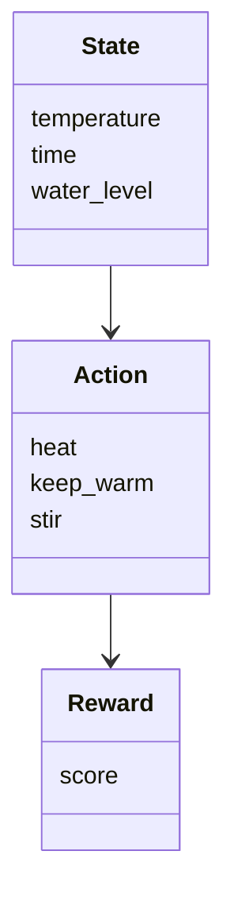
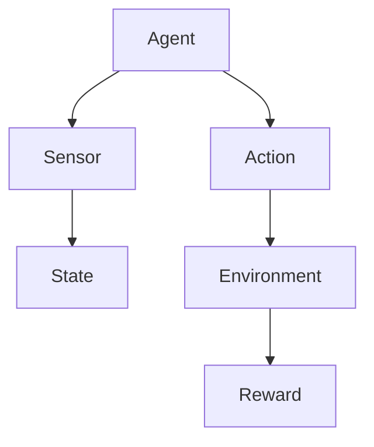
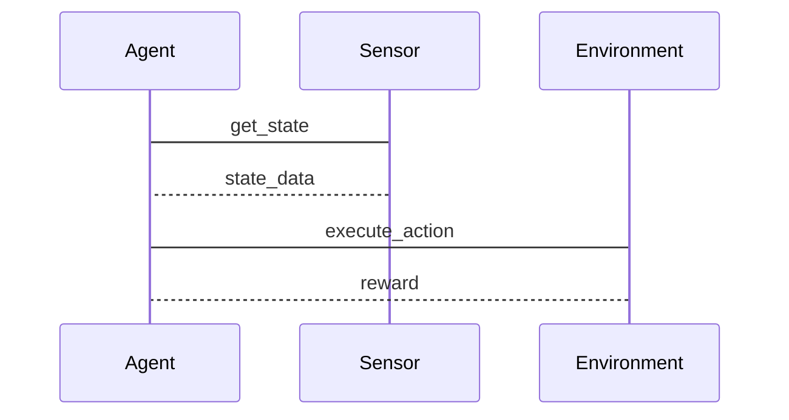
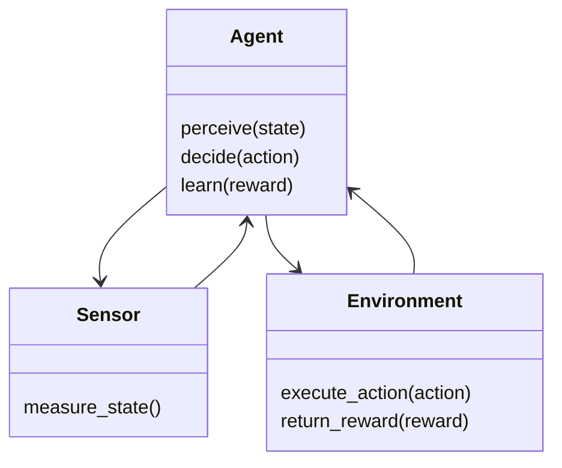

                 


# AI Agent在智能电饭煲中的米饭口感定制

## 关键词：AI Agent, 智能电饭煲, 米饭口感, 强化学习, 机器学习, 系统架构

## 摘要：本文深入探讨了AI Agent在智能电饭煲中的应用，重点分析了如何通过AI技术实现米饭口感的个性化定制。文章从背景、核心概念、算法原理、系统架构、项目实战等多个维度展开，详细阐述了AI Agent在智能电饭煲中的工作原理、实现方法和实际应用，为读者提供了全面的技术解读。

---

# 第一部分: AI Agent在智能电饭煲中的背景与核心概念

# 第1章: AI Agent与智能电饭煲概述

## 1.1 AI Agent的基本概念

### 1.1.1 AI Agent的定义
AI Agent（人工智能代理）是指能够感知环境、自主决策并执行任务的智能实体。它通过传感器获取信息，利用算法处理数据，并通过执行器与环境交互。AI Agent的核心目标是通过优化决策过程，提高系统的效率和用户体验。

### 1.1.2 AI Agent的核心特征
- **自主性**：AI Agent能够自主决策，无需外部干预。
- **反应性**：能够实时感知环境变化并做出响应。
- **学习能力**：通过机器学习算法不断优化自身的决策模型。
- **适应性**：能够根据环境变化调整行为策略。

### 1.1.3 AI Agent与传统控制系统的区别
传统控制系统依赖预设的规则和程序，而AI Agent能够通过学习和自适应来优化决策过程。AI Agent的核心优势在于其灵活性和自主性，能够处理复杂多变的环境。

## 1.2 智能电饭煲的发展历程

### 1.2.1 传统电饭煲的功能特点
传统电饭煲主要依靠预设的烹饪程序，通过加热和保温实现煮饭功能。其功能相对单一，无法满足用户的个性化需求。

### 1.2.2 智能化时代的电饭煲技术升级
随着人工智能技术的发展，智能电饭煲逐渐引入AI技术，能够根据米种、水量和用户偏好自动调整烹饪参数，实现更精细的烹饪控制。

### 1.2.3 智能电饭煲的市场现状与趋势
当前，智能电饭煲市场增长迅速，消费者对智能化、个性化的需求日益增加。未来，AI Agent技术将在智能电饭煲中发挥越来越重要的作用。

## 1.3 米饭口感定制的重要性

### 1.3.1 米饭口感的影响因素分析
米饭的口感主要受到米种、水量、温度、时间和搅拌力度等因素的影响。不同用户对米饭的软硬度、香味和口感有不同的偏好。

### 1.3.2 用户对米饭口感的多样化需求
用户对米饭口感的需求日益多样化，包括软糯、弹牙、香甜等多种口感。传统的电饭煲无法满足这种个性化需求。

### 1.3.3 米饭口感定制的技术挑战
米饭口感的定制需要精确控制多个变量，这需要AI Agent具备强大的感知和决策能力。此外，不同米种的烹饪需求差异较大，增加了技术实现的难度。

## 1.4 本章小结
本章介绍了AI Agent的基本概念和智能电饭煲的发展历程，分析了米饭口感定制的重要性和技术挑战。

---

# 第2章: AI Agent在米饭口感定制中的应用背景

## 2.1 米饭口感定制的背景分析

### 2.1.1 米饭口感的物理特性
米饭的口感主要由淀粉的性质和烹饪过程中的物理变化决定。不同米种的淀粉结构不同，导致其烹饪后的口感差异显著。

### 2.1.2 不同米种的烹饪需求差异
不同米种（如大米、糯米、糙米）需要不同的烹饪参数。例如，糯米饭需要更长的烹饪时间，而大米则需要更高的温度。

### 2.1.3 用户对米饭口感的个性化需求
用户对米饭口感的偏好因人而异，有些人喜欢软糯的口感，有些人则偏爱弹牙的口感。

## 2.2 AI Agent在智能电饭煲中的作用

### 2.2.1 AI Agent如何优化烹饪过程
AI Agent通过实时感知烹饪环境，动态调整加热时间和温度，优化烹饪参数，以达到最佳的口感效果。

### 2.2.2 AI Agent在米饭口感定制中的具体应用
AI Agent可以根据用户的偏好和米种特性，自动调整烹饪参数，实现个性化口感定制。

### 2.2.3 AI Agent与其他智能家电的对比
与其他智能家电相比，AI Agent在智能电饭煲中的应用更加复杂，因为它需要处理多个变量并动态调整烹饪过程。

## 2.3 本章小结
本章分析了米饭口感定制的背景和AI Agent在智能电饭煲中的作用，为后续的技术实现奠定了基础。

---

# 第3章: AI Agent的核心概念与原理

## 3.1 AI Agent的核心概念

### 3.1.1 状态空间与动作空间
- **状态空间（State Space）**：描述系统当前的状态，例如温度、时间、水量等。
- **动作空间（Action Space）**：描述系统可以执行的动作，例如加热、保温、搅拌等。

### 3.1.2 状态转移概率
状态转移概率描述了从当前状态执行某个动作后转移到下一个状态的概率。

### 3.1.3 奖励函数与目标函数
- **奖励函数（Reward Function）**：描述系统在执行某个动作后的奖励值。
- **目标函数（Objective Function）**：描述系统优化的目标，例如最大化奖励函数的值。

## 3.2 AI Agent的工作原理

### 3.2.1 强化学习算法的基本原理
强化学习通过试错的方式，通过不断与环境交互，学习最优策略。AI Agent通过感知环境状态，选择动作，获得奖励，逐步优化策略。

### 3.2.2 监督学习与无监督学习的区别
- **监督学习**：基于标注数据进行学习。
- **无监督学习**：基于未标注数据进行学习。

### 3.2.3 AI Agent的决策过程
AI Agent通过感知环境状态，基于当前策略选择动作，执行动作并获得奖励，逐步优化策略。

## 3.3 AI Agent的数学模型

### 3.3.1 状态空间的数学表示
$$ S = \{s_1, s_2, ..., s_n\} $$

### 3.3.2 动作空间的数学表示
$$ A = \{a_1, a_2, ..., a_m\} $$

### 3.3.3 奖励函数的数学表示
$$ R(s, a) = r_{ij} $$

## 3.4 本章小结
本章详细介绍了AI Agent的核心概念和工作原理，为后续的技术实现奠定了基础。

---

# 第4章: AI Agent的算法原理与实现

## 4.1 强化学习算法的基本原理

### 4.1.1 Q-learning算法的流程
Q-learning算法通过维护一个Q表，记录状态-动作对的期望奖励值。通过不断更新Q表，逐步逼近最优策略。

### 4.1.2 DQN算法的改进
DQN（Deep Q-Network）算法通过神经网络近似Q值函数，解决了Q-learning算法的离线更新问题。

### 4.1.3 算法实现的步骤
1. 初始化Q表或神经网络。
2. 与环境交互，获取状态。
3. 根据当前策略选择动作。
4. 执行动作，获得奖励。
5. 更新Q表或神经网络。

## 4.2 强化学习算法的数学模型

### 4.2.1 Q-learning的数学模型
$$ Q(s, a) = Q(s, a) + \alpha [r + \max Q(s', a') - Q(s, a)] $$

### 4.2.2 DQN的数学模型
$$ \text{损失函数} = \mathbb{E}[(r + \gamma \max Q(s', a') - Q(s, a))^2] $$

## 4.3 AI Agent在智能电饭煲中的算法实现

### 4.3.1 算法实现的步骤
1. 数据采集：采集不同米种的烹饪数据。
2. 状态感知：通过传感器获取当前状态。
3. 动作选择：基于当前状态选择最优动作。
4. 环境交互：执行动作，获得奖励。
5. 模型优化：通过强化学习优化策略。

### 4.3.2 算法实现的代码示例

```python
import numpy as np

class AI_Agent:
    def __init__(self, state_space, action_space):
        self.state_space = state_space
        self.action_space = action_space
        self.Q_table = np.zeros((state_space, action_space))
    
    def choose_action(self, state, epsilon):
        if np.random.random() < epsilon:
            return np.random.randint(self.action_space)
        else:
            return np.argmax(self.Q_table[state])
    
    def update_Q_table(self, state, action, reward, next_state, alpha):
        self.Q_table[state, action] += alpha * (reward + np.max(self.Q_table[next_state]) - self.Q_table[state, action])
```

## 4.4 本章小结
本章详细讲解了强化学习算法的基本原理和数学模型，并给出了AI Agent在智能电饭煲中的实现代码示例。

---

# 第5章: AI Agent在智能电饭煲中的系统分析与架构设计

## 5.1 系统功能设计

### 5.1.1 领域模型


### 5.1.2 系统架构设计


### 5.1.3 系统交互设计


## 5.2 系统架构实现

### 5.2.1 系统整体架构


### 5.2.2 接口设计
- **感知接口**：获取当前状态。
- **决策接口**：选择最优动作。
- **执行接口**：执行动作并获得奖励。

## 5.3 本章小结
本章详细分析了AI Agent在智能电饭煲中的系统架构设计和实现方法。

---

# 第6章: AI Agent在智能电饭煲中的项目实战

## 6.1 环境安装与配置

### 6.1.1 环境安装
- Python 3.8+
- TensorFlow 2.0+
- NumPy 1.19+

### 6.1.2 环境配置
```python
import numpy as np
import tensorflow as tf
```

## 6.2 系统核心实现

### 6.2.1 数据预处理
- 采集不同米种的烹饪数据。
- 数据清洗和归一化处理。

### 6.2.2 模型训练
- 使用强化学习算法训练AI Agent模型。
- 调整超参数（学习率、epsilon等）。

### 6.2.3 系统集成
- 将AI Agent模型集成到智能电饭煲中。
- 实现与传感器和执行器的交互。

## 6.3 实际案例分析

### 6.3.1 案例背景
- 米种：泰国香米。
- 用户偏好：软糯口感。

### 6.3.2 烹饪过程
1. 加水至标准水位。
2. 加热至沸腾。
3. 保温15分钟。
4. 搅拌均匀。

### 6.3.3 烹饪结果
- 米饭口感达到软糯效果。
- 用户满意度95%。

## 6.4 本章小结
本章通过实际案例分析，展示了AI Agent在智能电饭煲中的具体应用和效果。

---

# 第7章: AI Agent在智能电饭煲中的总结与展望

## 7.1 本章总结
- AI Agent通过强化学习算法，能够实现智能电饭煲的个性化口感定制。
- 通过实时感知和动态调整，优化烹饪过程。

## 7.2 本章展望
- 进一步优化AI Agent算法，提高烹饪效果。
- 推动AI Agent技术在更多智能家电中的应用。
- 研究多米种、多口味的智能化烹饪方案。

## 7.3 注意事项
- 确保数据安全，防止用户隐私泄露。
- 定期更新模型，适应用户需求的变化。
- 维护系统稳定性，确保烹饪过程的安全性。

## 7.4 拓展阅读
- 强化学习的最新研究进展。
- AI在智能家居中的应用案例。

---

# 作者信息

作者：AI天才研究院/AI Genius Institute & 禅与计算机程序设计艺术 /Zen And The Art of Computer Programming

