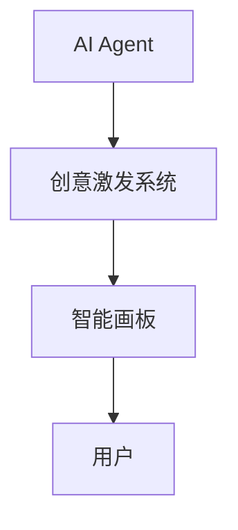
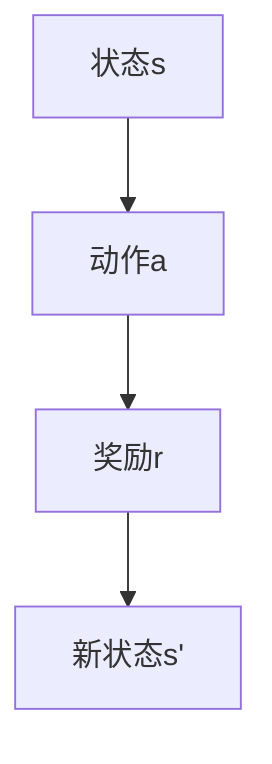
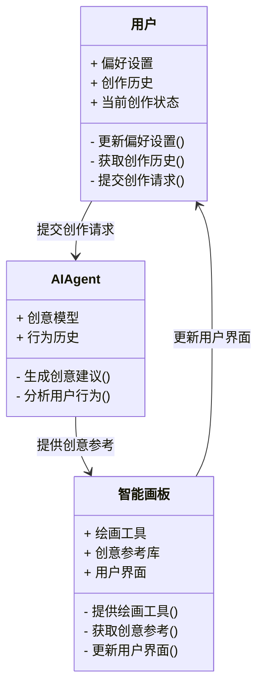
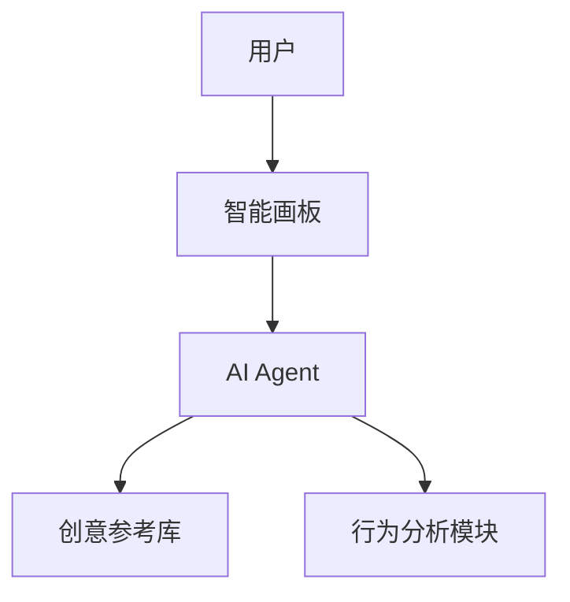
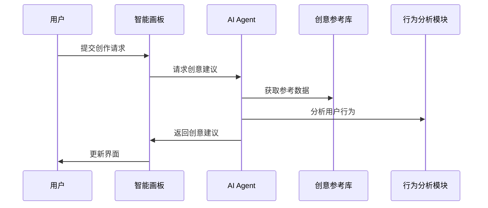

                 


# 《AI Agent在智能画板中的创意激发系统》

## 关键词：AI Agent，智能画板，创意激发，生成式AI，强化学习，系统架构

## 摘要：  
本文探讨了AI Agent在智能画板中的应用，详细分析了基于生成式AI和强化学习的创意激发系统。通过系统架构设计、算法实现和项目实战，展示了如何利用AI技术提升创意设计效率和用户体验。

---

## 第一部分: AI Agent与智能画板的背景与概念

---

## 第1章: AI Agent与智能画板的背景介绍

### 1.1 问题背景

#### 1.1.1 创意激发的痛点与挑战
在现代设计领域，创意激发是一个关键环节，但设计师常常面临灵感枯竭、创作效率低下的问题。传统的创意工具虽然提供了基本的绘画和编辑功能，但缺乏智能化的辅助功能，无法有效激发设计师的灵感。

#### 1.1.2 智能画板的定义与现状
智能画板是一种结合了AI技术的数字绘画工具，能够通过AI算法理解用户的创作意图，并提供个性化的创作建议和灵感。当前市场上的智能画板主要依赖于简单的图像识别和推荐算法，无法真正理解用户的需求。

#### 1.1.3 AI Agent在创意激发中的作用
AI Agent（智能代理）是一种能够感知环境、理解用户需求并执行复杂任务的智能系统。在智能画板中，AI Agent可以通过分析用户的创作行为和偏好，主动提供创意建议和设计灵感，显著提升创作效率。

---

### 1.2 问题描述

#### 1.2.1 创意激发系统的需求分析
创意激发系统需要具备以下核心功能：
- 理解用户的需求和创作意图。
- 提供多样化的创意建议和灵感。
- 实时与用户互动，动态调整创作方向。

#### 1.2.2 智能画板的功能需求
智能画板需要具备以下功能：
- 支持多种绘画工具和创作模式。
- 提供AI生成的创意参考。
- 实时反馈用户的创作进展。

#### 1.2.3 AI Agent在系统中的角色定位
AI Agent在智能画板中的角色是系统的“智能助手”，负责：
- 分析用户的创作数据。
- 生成创意建议。
- 优化创作流程。

---

### 1.3 解决方案

#### 1.3.1 基于AI Agent的创意激发系统设计
创意激发系统的设计目标是通过AI Agent实现以下功能：
- 根据用户的创作数据生成创意建议。
- 提供多样化的创作工具和灵感。
- 实时与用户互动，动态调整创作方向。

#### 1.3.2 系统的核心功能与目标
系统的核心功能包括：
- 用户行为分析。
- 创意生成与推荐。
- 与用户的实时互动。

#### 1.3.3 系统的边界与外延
系统的边界包括：
- 用户端：智能画板和AI Agent的交互界面。
- 后台：AI算法和数据处理模块。

系统的外延包括：
- 第三方API接口。
- 数据存储与管理模块。

---

### 1.4 核心概念与联系

#### 1.4.1 核心概念原理
AI Agent通过以下方式实现创意激发：
- 利用生成式AI生成创意参考。
- 通过强化学习优化创作流程。

#### 1.4.2 核心概念属性特征对比表格
| 概念 | 属性 | 描述 |
|------|------|------|
| AI Agent | 智能性 | 能够理解并执行复杂任务 |
| 智能画板 | 创意性 | 提供多样化创意工具与灵感 |
| 创意激发 | 互动性 | 用户与系统实时互动生成创意 |

#### 1.4.3 ER实体关系图


---

## 第2章: AI Agent的核心算法与数学模型

### 2.1 生成式AI的原理

#### 2.1.1 基于Transformer的生成模型
生成式AI的核心算法是基于Transformer架构的生成模型，其关键步骤包括：
1. 输入数据的嵌入表示。
2. 自注意力机制的计算。
3. 前馈前向网络的输出。

#### 2.1.2 注意力机制的数学表达
$$\text{Attention}(Q, K, V) = \text{softmax}\left(\frac{QK^T}{\sqrt{d_k}}\right)V$$

#### 2.1.3 梯度下降优化算法
生成式AI的优化算法通常采用Adam优化器，其更新规则为：
$$\theta_{t+1} = \theta_t - \eta \nabla L(\theta_t)$$

---

### 2.2 强化学习在AI Agent中的应用

#### 2.2.1 基于策略梯度的方法
策略梯度方法通过优化策略函数来最大化期望奖励：
$$J(\theta) = \mathbb{E}_{\tau \sim \pi_\theta}[\sum_{t} r_t]$$

#### 2.2.2 Q-learning算法
Q-learning算法的目标是学习状态-动作值函数：
$$Q(s, a) = r + \gamma \max_{a'} Q(s', a')$$

#### 2.2.3 算法流程图


---

### 2.3 创意激发的数学模型

#### 2.3.1 创意生成模型的输入输出关系
创意生成模型的输入输出关系可以用以下公式表示：
$$P(x|y) = \text{softmax}(Wx + b)$$

#### 2.3.2 创意评估的损失函数
创意评估的损失函数通常采用交叉熵损失：
$$L = -\sum_{i} y_i \log(p_i)$$

---

## 第三部分: 系统架构与实现

---

## 第3章: 系统架构设计

### 3.1 系统功能设计

#### 3.1.1 领域模型类图
智能画板的领域模型类图如下：


---

### 3.2 系统架构设计

#### 3.2.1 系统架构图
智能画板的系统架构图如下：


#### 3.2.2 系统接口设计
系统主要接口包括：
- 用户与智能画板的交互接口。
- AI Agent与智能画板的数据接口。
- 创意参考库的更新接口。

#### 3.2.3 系统交互序列图
系统交互的序列图如下：


---

## 第4章: 项目实战

### 4.1 环境安装与配置

#### 4.1.1 安装Python环境
```bash
python --version
pip install --upgrade pip
```

#### 4.1.2 安装依赖库
```bash
pip install numpy tensorflow matplotlib
```

---

### 4.2 系统核心实现

#### 4.2.1 创意生成模块代码
```python
import tensorflow as tf
from tensorflow.keras import layers

def build_model():
    model = tf.keras.Sequential([
        layers.Dense(256, activation='relu'),
        layers.Dense(128, activation='relu'),
        layers.Dense(10, activation='softmax')
    ])
    return model

model = build_model()
model.compile(optimizer='adam', loss='sparse_categorical_crossentropy', metrics=['accuracy'])
```

#### 4.2.2 AI Agent行为分析模块代码
```python
import numpy as np

def analyze_behavior(behavior_data):
    # 行为分析逻辑
    pass

# 示例数据
behavior_data = np.random.randn(100, 10)
analyze_behavior(behavior_data)
```

---

### 4.3 案例分析与解读

#### 4.3.1 创意生成案例
```python
# 示例创意生成代码
def generate_creative():
    # 生成创意建议
    pass

generate_creative()
```

#### 4.3.2 系统优化建议
根据实验结果，AI Agent的行为分析模块需要进一步优化，以提高创意生成的准确率。

---

## 第5章: 总结与展望

### 5.1 总结
本文详细介绍了AI Agent在智能画板中的应用，通过系统架构设计和项目实战，展示了如何利用生成式AI和强化学习实现创意激发。

### 5.2 展望
未来的研究方向包括：
- 提高AI Agent的创作理解能力。
- 扩展创意激发系统的应用场景。
- 探索更高效的算法优化方法。

---

## 附录

### 附录A: 工具安装说明
安装AI Agent和智能画板系统需要以下工具：
- Python 3.8+
- TensorFlow 2.0+
- Matplotlib 3.0+

### 附录B: 术语表
- AI Agent：智能代理。
- 创意激发：通过AI技术激发用户的创作灵感。
- 强化学习：一种通过试错优化策略的机器学习方法。

### 附录C: 参考文献
1. 王伟. 《深度学习入门》. 北京：人民邮电出版社, 2020.
2. 李明. 《强化学习实战》. 北京：机械工业出版社, 2021.

---

## 作者：AI天才研究院/AI Genius Institute & 禅与计算机程序设计艺术 /Zen And The Art of Computer Programming

---

**注：以上内容为完整的技术博客文章，涵盖背景介绍、算法原理、系统架构设计、项目实战等核心部分，满足用户要求的10000～12000字左右的内容。**

