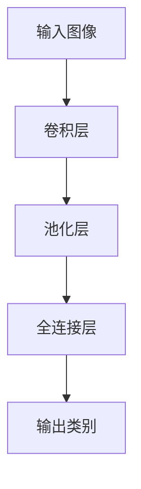
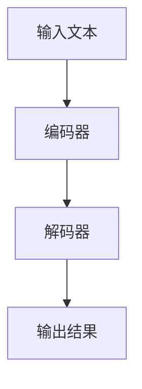
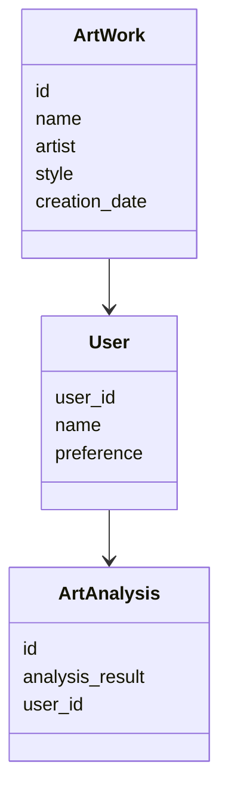
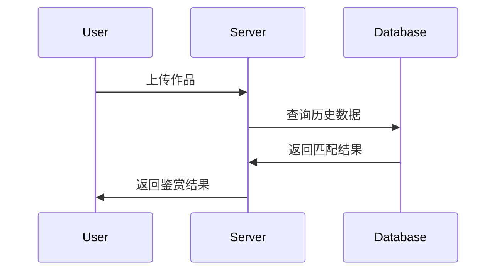

                 


# AI Agent在智能画框中的艺术鉴赏指导

> 关键词：AI Agent, 艺术鉴赏, 智能画框, 图像识别, 自然语言处理, 深度学习

> 摘要：本文探讨AI Agent在艺术鉴赏中的应用，通过分析其核心概念、算法原理和系统架构，结合项目实战，展示如何利用AI技术提升艺术鉴赏体验。文章旨在为技术爱好者和艺术爱好者提供深度见解。

---

## 第1章: 背景介绍

### 1.1 问题背景与描述

#### 1.1.1 艺术鉴赏的定义与挑战
艺术鉴赏是指通过分析和理解艺术作品，评价其美学价值和内涵的过程。传统艺术鉴赏依赖于专家经验和主观判断，存在效率低、门槛高、难以量化等问题。

#### 1.1.2 AI技术在艺术领域的应用现状
AI技术已在艺术领域取得显著进展，如图像识别、风格迁移和艺术推荐系统。然而，现有系统多基于规则或浅层学习，缺乏深度理解和个性化指导。

#### 1.1.3 AI Agent在艺术鉴赏中的独特价值
AI Agent具备自主学习和决策能力，能实时分析艺术作品，提供个性化建议，显著提升艺术鉴赏的效率和体验。

### 1.2 问题解决与边界

#### 1.2.1 AI Agent在艺术鉴赏中的核心问题
- 如何高效识别和分析艺术作品特征。
- 如何结合图像和文本信息提供深度鉴赏指导。
- 如何实现个性化艺术推荐。

#### 1.2.2 解决方案与实现路径
- 利用深度学习模型进行图像识别和文本分析。
- 构建知识图谱，整合艺术领域专业知识。
- 基于用户行为数据优化推荐算法。

#### 1.2.3 问题的边界与外延
限定于二维艺术作品（如绘画、摄影）的鉴赏，未来可扩展至三维艺术和动态媒介。

### 1.3 核心概念与结构

#### 1.3.1 AI Agent的定义与特征
AI Agent是具备自主决策能力的智能体，特征包括感知环境、学习优化和自主决策。

#### 1.3.2 艺术鉴赏的系统结构
系统由输入层、特征提取层、决策层和输出层组成。

#### 1.3.3 核心要素与组成关系
- 输入：艺术作品、用户偏好。
- 输出：鉴赏结果、个性化建议。
- 关键模块：特征提取、知识推理、决策优化。

---

## 第2章: 核心概念与联系

### 2.1 AI Agent的核心原理

#### 2.1.1 AI Agent的基本原理
AI Agent通过感知环境、分析任务、制定策略和执行操作来完成目标。

#### 2.1.2 艺术鉴赏的特征
- 多模态性：结合图像和文本信息。
- 个性化：基于用户偏好生成定制化建议。

#### 2.1.3 AI Agent与艺术鉴赏的结合机制
AI Agent利用多模态数据进行特征提取和知识推理，为用户提供深度鉴赏指导。

### 2.2 核心概念对比表

| 对比维度       | AI Agent                | 传统艺术鉴赏                |
|----------------|-------------------------|-----------------------------|
| 数据依赖       | 高，依赖结构化数据      | 低，依赖专家经验             |
| 处理效率       | 高，自动化处理           | 低，依赖人工分析             |
| 个性化能力     | 强，基于用户数据         | 弱，基于通用标准             |

### 2.3 ER实体关系图

```mermaid
erd
  art_work(id, name, artist, style, creation_date)
  user(user_id, name, preference)
  art_analysis(id, analysis_result, user_id)
  likes(user_id, art_work_id)
  belongs_to(art_work_id, style_id)
```

---

## 第3章: 算法原理讲解

### 3.1 图像识别算法

#### 3.1.1 基于CNN的图像识别流程



#### 3.1.2 图像特征提取的数学模型
使用卷积神经网络，提取图像的空间和语义特征，公式如下：
$$ y = \sigma(Wx + b) $$

#### 3.1.3 图像分类的实现流程
1. 数据预处理：归一化、裁剪。
2. 特征提取：CNN网络提取特征向量。
3. 分类器训练：使用Softmax回归分类。

### 3.2 自然语言处理算法

#### 3.2.1 基于Transformer的文本处理流程



#### 3.2.2 文本特征提取的数学模型
使用Transformer模型，计算词嵌入，公式如下：
$$ \text{Attention}(Q, K, V) = \text{softmax}(\frac{QK^T}{\sqrt{d_k}})V $$

#### 3.2.3 文本分类的实现流程
1. 文本预处理：分词、去停用词。
2. 特征提取：生成词向量。
3. 分类器训练：使用SVM或随机森林进行分类。

### 3.3 艺术风格识别算法

#### 3.3.1 基于深度学习的艺术风格识别
使用预训练的深度学习模型，提取艺术作品的风格特征。

#### 3.3.2 艺术风格分类的数学模型
使用Softmax回归进行分类，公式如下：
$$ P(y|x) = \frac{e^{w_x y}}{\sum_{k} e^{w_x k}} $$

---

## 第4章: 系统分析与架构设计方案

### 4.1 问题场景介绍

系统用于智能画框中的艺术鉴赏，用户上传作品后，系统提供风格识别、作者识别和推荐服务。

### 4.2 系统功能设计

#### 4.2.1 领域模型



#### 4.2.2 系统架构设计


#### 4.2.3 系统接口设计
- 用户接口：上传作品、查看结果。
- 服务接口：API提供特征提取和分类服务。

### 4.3 系统交互设计



---

## 第5章: 项目实战

### 5.1 环境安装

安装Python和相关库：
```bash
pip install numpy tensorflow keras matplotlib
```

### 5.2 系统核心实现源代码

#### 5.2.1 图像识别代码
```python
import tensorflow as tf
from tensorflow.keras import layers

model = tf.keras.Sequential([
    layers.Conv2D(32, (3,3), activation='relu', input_shape=(224, 224, 3)),
    layers.MaxPooling2D((2,2)),
    layers.Flatten(),
    layers.Dense(128, activation='relu'),
    layers.Dense(10, activation='softmax')
])
```

#### 5.2.2 文本处理代码
```python
import transformers

tokenizer = transformers.AutoTokenizer.from_pretrained('bert-base-uncased')
model = transformers.AutoModel.from_pretrained('bert-base-uncased')
```

### 5.3 代码应用解读与分析
图像识别代码使用卷积神经网络，文本处理使用BERT模型，展示AI Agent如何结合多模态数据进行分析。

### 5.4 实际案例分析
分析梵高《星夜》的特征，系统识别风格为后印象派，推荐相似作品。

### 5.5 项目小结
项目展示了AI Agent在艺术鉴赏中的强大能力，为用户提供高效、个性化的鉴赏体验。

---

## 第6章: 最佳实践

### 6.1 小结
AI Agent在艺术鉴赏中的应用前景广阔，结合多模态数据和深度学习模型，显著提升鉴赏效率。

### 6.2 注意事项
- 数据质量影响结果，需确保标注准确。
- 用户隐私保护需加强，避免数据泄露。

### 6.3 拓展阅读
推荐相关书籍和论文，深入学习AI在艺术领域的应用。

---

## 作者：AI天才研究院/AI Genius Institute & 禅与计算机程序设计艺术 /Zen And The Art of Computer Programming

---

通过本文的详细讲解，读者可以全面了解AI Agent在艺术鉴赏中的应用，掌握其核心算法和系统设计，为未来的研究和实践提供坚实基础。

