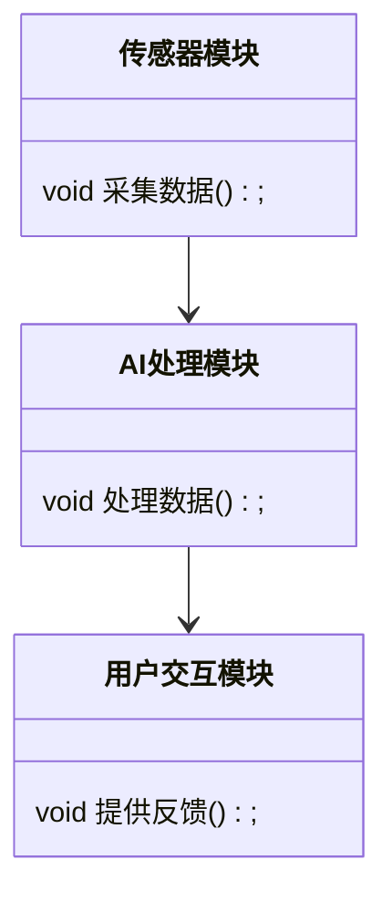
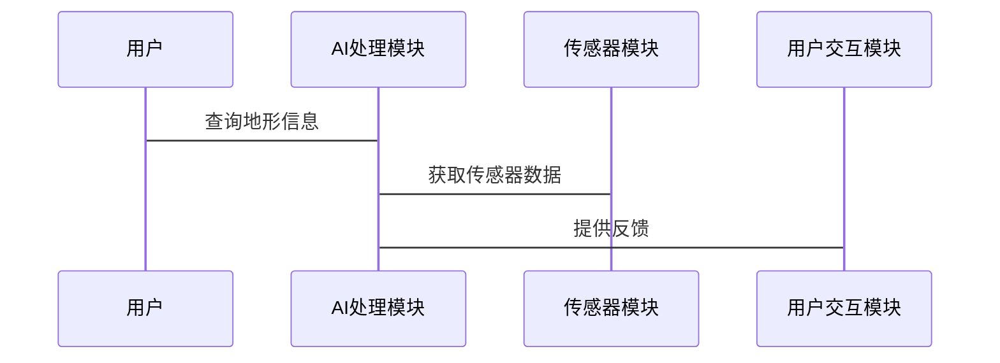

                 


# AI Agent在智能登山杖中的地形适应指导

**关键词：** AI Agent, 智能登山杖, 地形适应, 传感器数据, 路径规划, 机器学习, 算法实现

**摘要：**  
本文详细探讨了AI Agent在智能登山杖中的应用，特别是在地形适应指导方面。文章从AI Agent的基本原理出发，分析其在智能设备中的作用，详细阐述了AI Agent如何通过传感器数据和机器学习算法实现地形识别和路径规划。文章还提供了具体的算法实现和系统架构设计，最后通过实际案例分析，展示了AI Agent在智能登山杖中的实际应用效果。

---

## 第1章: AI Agent与智能登山杖概述

### 1.1 AI Agent的核心概念

#### 1.1.1 AI Agent的定义与特点
AI Agent（人工智能代理）是一种能够感知环境、做出决策并执行任务的智能实体。其特点包括：
- **自主性**：能够在没有外部干预的情况下独立运行。
- **反应性**：能够实时感知环境并做出响应。
- **目标导向**：基于预设目标执行任务。
- **学习能力**：通过数据和经验不断优化性能。

#### 1.1.2 AI Agent在智能设备中的应用
AI Agent广泛应用于自动驾驶、智能家居、医疗设备等领域。在智能登山杖中，AI Agent主要用于地形识别、路径规划和用户行为指导。

#### 1.1.3 智能登山杖的基本概念与功能
智能登山杖是一种结合了传感器、AI算法和用户交互界面的高科技登山工具。其主要功能包括：
- **地形识别**：通过传感器收集环境数据，识别地形特征。
- **路径规划**：基于地形数据，为用户提供最佳行走路线。
- **用户反馈**：通过震动或语音提示指导用户调整步伐。

### 1.2 智能登山杖的地形适应问题

#### 1.2.1 地形适应的定义与重要性
地形适应是指设备根据环境特征调整其行为或输出。在智能登山杖中，地形适应直接关系到用户的行走安全和舒适度。

#### 1.2.2 智能登山杖面临的地形挑战
- **复杂地形**：如陡坡、岩石、泥泞地面等。
- **动态变化**：地形可能因天气或用户行为而发生变化。
- **环境干扰**：如光线不足、传感器噪声等。

#### 1.2.3 AI Agent在地形适应中的作用
AI Agent通过实时感知和分析环境数据，帮助智能登山杖做出最优决策，确保用户在复杂地形中的安全和效率。

---

## 第2章: AI Agent的原理与技术基础

### 2.1 AI Agent的核心原理

#### 2.1.1 传感器数据的收集与处理
智能登山杖通常配备多种传感器，如加速度计、陀螺仪、激光测距仪等。传感器数据通过AI算法进行处理，提取地形特征。

#### 2.1.2 地形特征的识别与分析
AI Agent利用深度学习模型（如卷积神经网络）对地形图像进行分类，识别出不同的地形类型（如草地、岩石、泥泞地等）。

#### 2.1.3 AI算法的决策机制
基于传感器数据和地形分析结果，AI Agent通过路径规划算法生成最优行走路径，并通过用户交互界面提供反馈。

### 2.2 AI Agent的算法基础

#### 2.2.1 常见的路径规划算法
- **A*算法**：基于启发式搜索的路径规划算法，适用于静态环境。
- **RRT算法**：用于动态环境的路径规划，适合复杂地形。

#### 2.2.2 基于深度学习的地形识别
使用卷积神经网络（CNN）对地形图像进行分类，识别出潜在的危险区域。

#### 2.2.3 多传感器融合技术
通过融合多种传感器数据（如激光测距、惯性测量单元），提高地形识别的准确性和鲁棒性。

---

## 第3章: AI Agent的数学模型与算法实现

### 3.1 地形适应的数学模型

#### 3.1.1 地形特征的数学表示
地形特征可以通过多种数学模型表示，如高度图（elevation map）或网格模型（grid model）。

#### 3.1.2 用户行为的数学建模
用户的行为可以通过马尔可夫链（Markov chain）进行建模，分析用户的行走模式和偏好。

#### 3.1.3 风险评估的数学公式
风险评估公式：
$$ \text{风险值} = \sum_{i=1}^{n} w_i \cdot f_i $$
其中，$w_i$是第i个特征的权重，$f_i$是第i个特征的函数值。

### 3.2 基于AI的路径规划算法

#### 3.2.1 A*算法的数学推导
A*算法的核心是寻找从起点到终点的最短路径，使用启发式函数估算剩余距离：
$$ h(n) = \text{曼哈顿距离}(n, 目标) $$

#### 3.2.2 RRT算法的实现原理
RRT算法通过随机采样生成树，逐步逼近目标区域。算法步骤如下：
1. 随机采样环境中的点。
2. 计算从当前点到目标点的路径。
3. 更新树结构。

#### 3.2.3 算法复杂度分析
A*算法的时间复杂度为$O(n \log n)$，RRT算法的时间复杂度为$O(mn)$，其中$m$是采样次数，$n$是环境中的点数。

---

## 第4章: 智能登山杖的系统架构设计

### 4.1 系统功能模块划分

#### 4.1.1 传感器模块
负责采集环境数据，如加速度、倾斜度等。

#### 4.1.2 AI处理模块
负责数据处理、地形识别和路径规划。

#### 4.1.3 用户交互模块
通过震动或语音提示用户调整步伐。

### 4.2 系统架构设计

#### 4.2.1 模块之间的关系
使用mermaid类图表示模块关系：


#### 4.2.2 系统的高可用性设计
通过冗余设计和故障切换机制确保系统的可靠性。

#### 4.2.3 系统的可扩展性设计
采用模块化设计，便于未来功能扩展。

---

## 第5章: AI Agent在智能登山杖中的实现

### 5.1 环境搭建与开发工具

#### 5.1.1 硬件环境配置
需要配备传感器模块、处理器和无线通信模块。

#### 5.1.2 软件环境安装
安装Python、TensorFlow和ROS（Robot Operating System）。

#### 5.1.3 开发工具选择
推荐使用PyCharm和ROS环境进行开发。

### 5.2 核心代码实现

#### 5.2.1 传感器数据处理代码
```python
import numpy as np

def process_sensor_data(data):
    # 提取加速度和倾斜度
    acceleration = data['acceleration']
    tilt = data['tilt']
    # 处理数据
    processed_data = {'acceleration_mean': np.mean(acceleration),
                      'tilt_angle': np.mean(tilt)}
    return processed_data
```

#### 5.2.2 AI算法实现代码
```python
import tensorflow as tf
from tensorflow.keras import layers

def build_model():
    model = tf.keras.Sequential([
        layers.Conv2D(32, (3, 3), activation='relu', input_shape=(64, 64, 3)),
        layers.MaxPooling2D(),
        layers.Conv2D(64, (3, 3), activation='relu'),
        layers.MaxPooling2D(),
        layers.Flatten(),
        layers.Dense(128, activation='relu'),
        layers.Dense(10, activation='softmax')
    ])
    return model
```

#### 5.2.3 用户交互界面代码
```python
def provide_feedback(path):
    # 提供震动反馈
    if path['risk'] > 0.5:
        print("震动提示：前方有风险，请调整步伐。")
```

---

## 第6章: 项目实战与案例分析

### 6.1 实际案例分析

#### 6.1.1 案例背景
在复杂地形中测试智能登山杖的地形适应能力。

#### 6.1.2 数据分析
通过传感器数据和AI算法生成行走路径。

#### 6.1.3 结果展示
使用mermaid序列图展示系统交互流程：


### 6.2 项目总结与经验教训

#### 6.2.1 项目总结
AI Agent在智能登山杖中的应用显著提高了地形适应能力。

#### 6.2.2 经验教训
传感器校准和算法优化是项目成功的关键。

### 6.3 最佳实践 tips

- **传感器校准**：定期校准传感器以确保数据准确性。
- **算法优化**：根据实际需求调整AI算法的参数。
- **系统维护**：定期更新系统软件以提高性能。

---

## 第7章: 总结与展望

### 7.1 总结
AI Agent在智能登山杖中的应用为用户提供了更安全、更高效的行走体验。通过传感器数据和AI算法，智能登山杖能够实时适应复杂地形，显著提升用户的安全性和舒适度。

### 7.2 未来展望
未来，随着AI技术的不断进步，智能登山杖将具备更强的地形适应能力和更高的智能化水平，为用户提供更全面的服务。

---

**作者：AI天才研究院/AI Genius Institute & 禅与计算机程序设计艺术 /Zen And The Art of Computer Programming**

