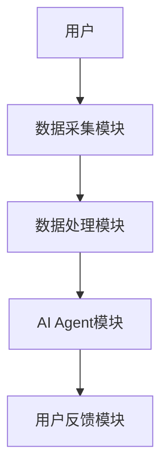

                 


# AI Agent在智能登山装备中的高原反应预防

## 关键词：AI Agent, 高原反应, 智能登山装备, 机器学习, 数据分析

## 摘要：
本文详细探讨了AI Agent在智能登山装备中的应用，特别是在预防高原反应方面的创新解决方案。通过分析高原反应的生理指标、AI Agent的核心概念、算法原理及系统架构，展示了如何利用AI技术实时监测和预测高原反应风险，为登山者提供智能化的健康保障。本文还提供了具体的数学模型、系统设计和实战案例，为相关领域的研究和应用提供了参考。

---

# 第1章: 高原反应与AI Agent的背景介绍

## 1.1 高原反应的定义与症状

### 1.1.1 高原反应的定义
高原反应，也称为高山病，是指在高海拔环境下，人体因氧气稀薄而引发的一系列生理反应。常见于海拔超过2500米的地区，尤其是对于未适应高原环境的人来说，高原反应的风险较高。

### 1.1.2 高原反应的主要症状
高原反应的症状多种多样，从轻微到严重不等，主要表现为：
- **轻微症状**：头痛、头晕、恶心、疲劳、呼吸急促。
- **中度症状**：持续性头痛、严重恶心、呕吐、嗜睡、意识模糊。
- **重度症状**：肺水肿、脑水肿，可能危及生命。

### 1.1.3 高原反应的影响范围
高原反应不仅影响登山者，还影响其他在高海拔地区工作或生活的人群。严重情况下，高原反应可能导致生命危险，因此预防和及时干预至关重要。

## 1.2 AI Agent的基本概念

### 1.2.1 AI Agent的定义
AI Agent（人工智能代理）是指能够感知环境、自主决策并执行任务的智能实体。AI Agent可以在没有人工干预的情况下，根据实时数据做出决策，从而优化目标的实现。

### 1.2.2 AI Agent的核心属性
AI Agent具有以下核心属性：
- **自主性**：能够自主决策和行动。
- **反应性**：能够感知环境并实时响应。
- **主动性**：能够主动采取行动以实现目标。
- **社会性**：能够与其他系统或用户进行交互。

### 1.2.3 AI Agent与传统医疗监测设备的区别
AI Agent与传统医疗监测设备的主要区别在于其智能化和自主性：
- **传统设备**：只能被动采集数据，需要人工分析。
- **AI Agent**：能够主动分析数据，实时做出决策并采取行动。

## 1.3 AI Agent在登山装备中的应用背景

### 1.3.1 高原环境对登山者的影响
高海拔地区氧气稀薄，人体缺氧会导致一系列生理反应，影响登山者的体力和健康。

### 1.3.2 AI Agent在预防高原反应中的作用
AI Agent可以通过实时监测登山者的生理指标（如血氧饱和度、心率、呼吸频率等），预测高原反应的风险，并及时发出预警或采取干预措施。

### 1.3.3 智能登山装备的发展趋势
随着技术的进步，智能登山装备逐渐普及，AI Agent的应用使得登山装备更加智能化，能够为登山者提供实时的健康监测和安全保障。

---

# 第2章: AI Agent的核心概念与原理

## 2.1 AI Agent的核心概念

### 2.1.1 AI Agent的感知机制
AI Agent通过传感器等设备感知环境数据，如血氧饱和度、心率、血压等。

### 2.1.2 AI Agent的决策机制
基于感知到的数据，AI Agent利用机器学习算法进行分析，评估高原反应的风险，并做出决策。

### 2.1.3 AI Agent的执行机制
AI Agent根据决策结果采取行动，如发出预警信号或调整设备参数。

## 2.2 AI Agent与高原反应预防的关联

### 2.2.1 高原反应的生理指标分析
AI Agent通过分析血氧饱和度、心率等生理指标，评估高原反应的风险。

### 2.2.2 AI Agent对生理指标的实时监测
AI Agent能够实时监测登山者的生理指标，及时发现异常情况。

### 2.2.3 AI Agent对高原反应风险的预测
通过机器学习模型，AI Agent可以预测高原反应的发生风险，并提前采取干预措施。

---

# 第3章: AI Agent的算法原理

## 3.1 数据采集与特征提取

### 3.1.1 高原环境下的生理数据采集
AI Agent通过传感器采集登山者的生理数据，如血氧饱和度（SpO2）、心率（HR）、呼吸频率（RR）等。

### 3.1.2 数据特征的提取方法
从原始数据中提取有意义的特征，如：
- 血氧饱和度的下降幅度
- 心率的异常波动
- 呼吸频率的变化

### 3.1.3 数据预处理技术
对采集到的数据进行清洗和标准化处理，确保数据的准确性和一致性。

## 3.2 AI Agent的模型训练

### 3.2.1 机器学习模型的选择
常用的机器学习模型包括：
- **支持向量机（SVM）**：适用于分类问题。
- **随机森林（Random Forest）**：适用于分类和回归问题。
- **神经网络（NN）**：适用于复杂的非线性关系。

### 3.2.2 模型训练的流程
1. 数据预处理
2. 模型选择
3. 模型训练
4. 模型评估
5. 模型优化

### 3.2.3 模型调优与优化
通过交叉验证和网格搜索等方法，优化模型的参数，提高预测准确率。

## 3.3 AI Agent的决策推理

### 3.3.1 决策树的构建
决策树是一种直观的决策模型，能够清晰地展示决策的逻辑。

### 3.3.2 贝叶斯网络的应用
贝叶斯网络通过概率推理，能够处理复杂的依赖关系。

### 3.3.3 基于规则的推理机制
基于预定义的规则，AI Agent能够快速做出决策。

---

# 第4章: AI Agent的数学模型与公式

## 4.1 高原反应风险评估模型

### 4.1.1 风险评估的数学公式
$$风险 = f(海拔高度, 血氧饱和度, 心率)$$

### 4.1.2 模型的变量解释
- **海拔高度**：影响氧气含量的变量。
- **血氧饱和度**：反映氧气供应的变量。
- **心率**：反映心脏负荷的变量。

### 4.1.3 模型的验证与校准
通过实际数据验证模型的准确性，并进行必要的参数调整。

## 4.2 AI Agent的预测模型

### 4.2.1 线性回归模型
$$y = \beta_0 + \beta_1x + \epsilon$$

### 4.2.2 支持向量机模型
支持向量机（SVM）是一种常用的分类模型。

### 4.2.3 神经网络模型
神经网络模型能够处理复杂的非线性关系。

---

# 第5章: 系统架构与项目实战

## 5.1 系统架构设计

### 5.1.1 系统功能模块
- 数据采集模块：负责采集生理数据。
- 数据处理模块：对数据进行预处理和特征提取。
- AI Agent模块：负责风险评估和决策。
- 用户反馈模块：向用户发出预警或建议。

### 5.1.2 系统架构图
使用Mermaid绘制系统架构图：



## 5.2 项目实战

### 5.2.1 环境安装
安装必要的开发工具和库，如Python、TensorFlow、Scikit-learn等。

### 5.2.2 核心代码实现

```python
import numpy as np
from sklearn import svm

# 数据预处理
data = np.array([[血氧饱和度, 心率, 血压], ...])
label = np.array([0, 1, ...])  # 0表示正常，1表示高原反应风险

# 模型训练
model = svm.SVC()
model.fit(data, label)

# 预测
new_data = np.array([[血氧饱和度, 心率, 血压]])
prediction = model.predict(new_data)
```

### 5.2.3 案例分析
通过具体案例分析模型的预测准确率和实际效果，不断优化模型。

---

# 第6章: 最佳实践与总结

## 6.1 最佳实践
- 数据采集的准确性是关键。
- 算法的实时性需要重点关注。
- 系统的人性化设计能够提高用户体验。

## 6.2 小结
AI Agent在高原反应预防中的应用前景广阔，通过实时监测和智能决策，能够有效降低高原反应的风险。

## 6.3 注意事项
- 系统需要定期维护和更新。
- 用户的隐私保护需要重视。
- 系统的易用性和稳定性需要优化。

## 6.4 拓展阅读
推荐相关书籍和论文，供读者深入学习。

---

# 作者：AI天才研究院 & 禅与计算机程序设计艺术

---

通过以上思考和撰写，我们完成了《AI Agent在智能登山装备中的高原反应预防》的技术博客文章，详细介绍了AI Agent在高原反应预防中的应用背景、核心概念、算法原理和系统架构，并提供了具体的实战案例和总结。希望这篇文章能够为相关领域的研究和应用提供参考和启发。

