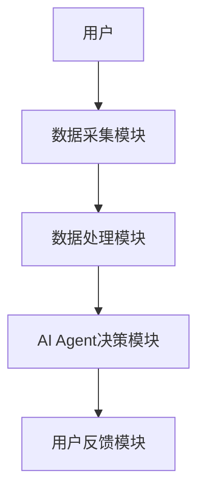
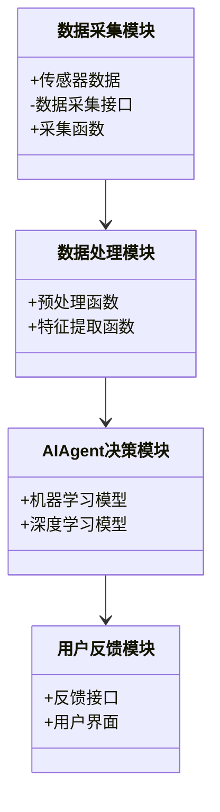
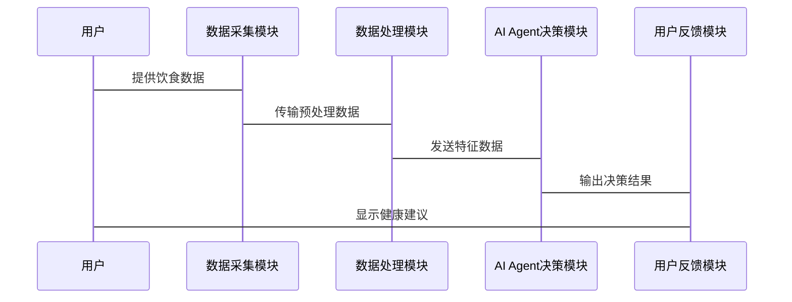

                 


# AI Agent在智能皮带中的饮食习惯监测

**关键词**：AI Agent, 智能皮带, 饮食习惯监测, 机器学习, 实时反馈

**摘要**：本文详细探讨了AI Agent在智能皮带中的饮食习惯监测系统的构建与实现。通过分析饮食监测的核心问题，阐述了AI Agent的基本原理及其在饮食监测中的应用。文章结合技术实现，从数据采集到算法模型，再到系统架构，全面解析了该系统的构建过程。最后，通过项目实战和最佳实践，为读者提供了实用的解决方案和优化建议。

---

# {{此处是文章标题}}

**关键词**：AI Agent, 智能皮带, 饮食习惯监测, 机器学习, 实时反馈

**摘要**：本文详细探讨了AI Agent在智能皮带中的饮食习惯监测系统的构建与实现。通过分析饮食监测的核心问题，阐述了AI Agent的基本原理及其在饮食监测中的应用。文章结合技术实现，从数据采集到算法模型，再到系统架构，全面解析了该系统的构建过程。最后，通过项目实战和最佳实践，为读者提供了实用的解决方案和优化建议。

---

# 第二部分: AI Agent的核心概念与技术实现

# 第3章: 饮食习惯监测的核心技术

## 3.1 数据采集技术
### 3.1.1 传感器数据采集
#### 3.1.1.1 传感器类型与特点
- 加速度传感器
- 压力传感器
- 光电传感器
- 温度传感器

#### 3.1.1.2 数据采集流程
1. 传感器信号捕捉
2. 数据预处理
3. 特征提取

### 3.1.2 数据采集的挑战
- 传感器精度问题
- 数据噪声干扰
- 实时性要求

## 3.2 数据处理与分析
### 3.2.1 数据预处理
#### 3.2.1.1 数据清洗
- 去除噪声
- 处理缺失值
- 标准化处理

#### 3.2.1.2 数据特征提取
- 时间序列特征
- 频域特征
- 统计特征

### 3.2.2 数据分析方法
#### 3.2.2.1 统计分析
- 均值、方差、偏度
- 趋势分析
- 异常检测

#### 3.2.2.2 机器学习分析
- 监督学习：随机森林、SVM
- 无监督学习：聚类分析
- 深度学习：LSTM、Transformer

## 3.3 数据分析与决策
### 3.3.1 数据可视化
- 时间序列可视化
- 热图分析
- 交互式仪表盘

### 3.3.2 数据驱动的决策
- 饮食习惯分类
- 饮食偏好预测
- 健康风险评估

---

# 第4章: AI Agent的核心算法与模型

## 4.1 算法原理
### 4.1.1 机器学习模型
#### 4.1.1.1 线性回归
$$ y = \beta_0 + \beta_1x + \epsilon $$

#### 4.1.1.2 支持向量机
$$ \text{max} \{ \sum \alpha_i y_i (w \cdot x_i + b) \leq 1 \} $$

### 4.1.2 深度学习模型
#### 4.1.2.1 LSTM网络
$$ \text{LSTM单元：} c_t = f(gate) \odot c_{t-1} + i(gate) \odot \text{tanh}(W_c x_t) $$

#### 4.1.2.2 Transformer模型
$$ \text{自注意力机制：} QK^T V $$

## 4.2 算法实现
### 4.2.1 机器学习实现
```python
# 线性回归实现
class LinearRegression:
    def __init__(self, learning_rate=0.01, iterations=1000):
        self.lr = learning_rate
        self.iters = iterations
        self.weights = None
        self.bias = None

    def fit(self, X, y):
        n = X.shape[0]
        self.weights = np.zeros(X.shape[1])
        self.bias = 0
        for _ in range(self.iters):
            y_pred = np.dot(X, self.weights) + self.bias
            dw = (2 * n) * np.dot(X.T, (y_pred - y))
            db = (2 * n) * np.mean(y_pred - y)
            self.weights -= self.lr * dw
            self.bias -= self.lr * db
```

### 4.2.2 深度学习实现
```python
# LSTM实现
class LSTMCell:
    def __init__(self, input_size, hidden_size):
        self.w_f = torch.randn(input_size + hidden_size, hidden_size)
        self.b_f = torch.zeros(hidden_size)
        self.w_i = torch.randn(input_size + hidden_size, hidden_size)
        self.b_i = torch.zeros(hidden_size)
        self.w_o = torch.randn(input_size + hidden_size, hidden_size)
        self.b_o = torch.zeros(hidden_size)
        self.w_c = torch.randn(input_size + hidden_size, hidden_size)
        self.b_c = torch.zeros(hidden_size)
```

## 4.3 算法优化
### 4.3.1 参数调整
- 学习率优化
- 正则化方法
- 模型调参

### 4.3.2 模型评估
- 准确率
- 召回率
- F1分数

---

# 第5章: 系统架构设计

## 5.1 系统功能设计
### 5.1.1 功能模块划分
- 数据采集模块
- 数据处理模块
- AI Agent决策模块
- 用户反馈模块

### 5.1.2 功能流程图


## 5.2 系统架构设计
### 5.2.1 分层架构


## 5.3 系统接口设计
### 5.3.1 API接口
- 数据采集接口：`GET /api/sensor/data`
- 数据处理接口：`POST /api/process/data`
- 决策结果接口：`GET /api/decision/results`

### 5.3.2 交互设计
- 用户输入：饮食记录、偏好设置
- 系统输出：健康建议、饮食提醒

## 5.4 系统交互流程
### 5.4.1 序列图


---

# 第6章: 项目实战与优化

## 6.1 项目环境搭建
### 6.1.1 开发环境
- Python 3.8+
- PyTorch 1.9+
-传感器设备（心率带、压力传感器）

### 6.1.2 工具安装
```bash
pip install numpy
pip install matplotlib
pip install torch
```

## 6.2 核心代码实现
### 6.2.1 数据采集模块
```python
import numpy as np

def collect_data(sensor_type, duration):
    # 模拟传感器数据采集
    np.random.seed(42)
    data = np.random.normal(0, 1, size=(duration, 10))
    return data
```

### 6.2.2 数据处理模块
```python
import torch
import torch.nn as nn

class LSTMModel(nn.Module):
    def __init__(self, input_size, hidden_size, output_size):
        super(LSTMModel, self).__init__()
        self.lstm = nn.LSTM(input_size, hidden_size, batch_first=True)
        self.fc = nn.Linear(hidden_size, output_size)

    def forward(self, x):
        out, _ = self.lstm(x)
        out = self.fc(out[:, -1, :])
        return out
```

## 6.3 案例分析与优化
### 6.3.1 实际案例
- 用户A：饮食习惯分析与建议
- 用户B：健康风险评估

### 6.3.2 优化方法
- 模型优化：超参数调整、模型融合
- 系统优化：多线程处理、异步数据采集

---

# 第7章: 最佳实践与未来展望

## 7.1 最佳实践
### 7.1.1 开发注意事项
- 数据隐私保护
- 系统实时性优化
- 用户体验设计

### 7.1.2 优化建议
- 定期模型更新
- 用户反馈机制
- 多设备协同工作

## 7.2 未来展望
### 7.2.1 技术趋势
- 更强的AI Agent
- 新型传感器技术
- 多模态数据融合

### 7.2.2 应用场景扩展
- 健康管理
- 疾病预防
- 营养指导

---

# 作者：AI天才研究院/AI Genius Institute & 禅与计算机程序设计艺术 /Zen And The Art of Computer Programming

---

这篇文章系统地介绍了AI Agent在智能皮带中的饮食习惯监测系统的构建与实现，从背景分析到技术实现，再到项目实战和优化，为读者提供了全面的指导和深入的分析。

