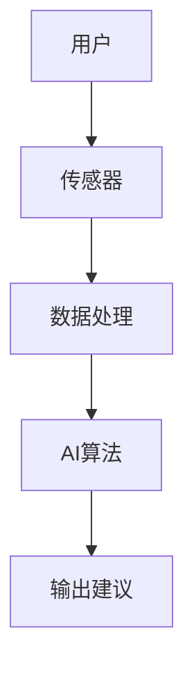
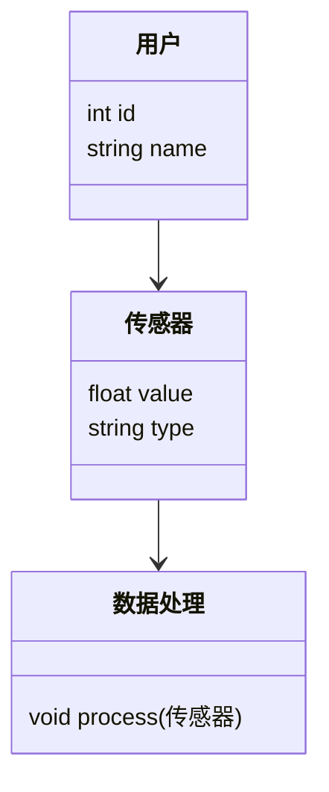
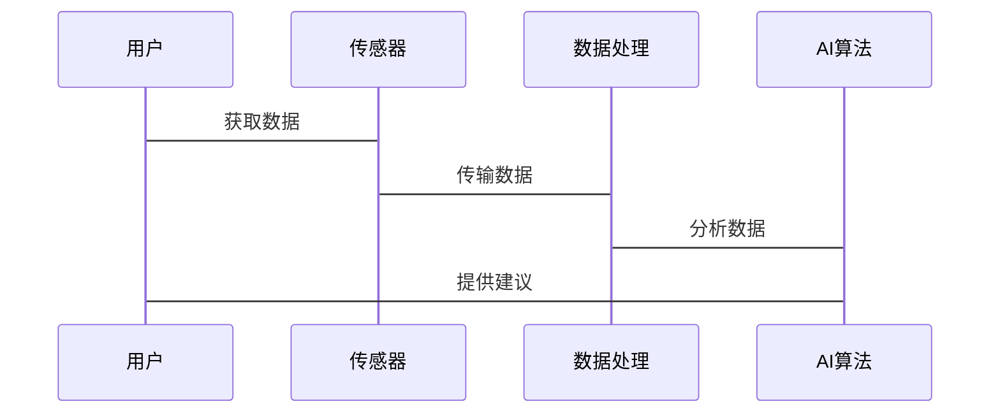

                 


# AI Agent在智能眼罩中的深度睡眠诱导

> 关键词：AI Agent，智能眼罩，深度睡眠，睡眠诱导，算法原理，系统架构，项目实战

> 摘要：本文详细探讨了AI Agent在智能眼罩中的应用，特别是在深度睡眠诱导方面的技术实现。通过分析AI Agent的核心原理、智能眼罩的技术基础，结合具体的算法模型和系统架构设计，展示了如何利用AI技术优化睡眠质量。文章还提供了实际的项目实现和案例分析，为读者提供了全面的技术指导。

---

## 第一章: AI Agent与智能眼罩的背景与基础

### 1.1 深度睡眠的基本概念

深度睡眠是睡眠周期中的重要阶段，通常出现在睡眠周期的后半部分。以下是深度睡眠的关键点：

- **睡眠周期**：分为非快速眼动（NREM）和快速眼动（REM）阶段，深度睡眠属于NREM阶段的第三阶段（N3）。
- **重要性**：深度睡眠对身体修复、记忆 consolidation 和整体健康至关重要。
- **现状**：现代人由于生活方式、工作压力等因素，深度睡眠质量普遍下降。

### 1.2 AI Agent的基本原理

AI Agent是一种智能体，能够感知环境并采取行动以实现目标。以下是AI Agent的核心特点：

- **自主性**：能够独立决策。
- **反应性**：能实时感知并响应环境变化。
- **目标导向**：所有行为都围绕目标展开。

### 1.3 智能眼罩的技术基础

智能眼罩是一种 wearable device，集成多种传感器，用于监测和改善用户的睡眠质量。以下是其关键组成部分：

- **传感器**：包括EEG（脑电图）、EMG（肌电图）、 accelerometer等。
- **数据处理**：通过AI算法分析传感器数据，提供个性化的睡眠改善建议。

### 1.4 深度睡眠诱导的科学依据

深度睡眠受多种因素影响，如生理节奏、环境因素和生活习惯。AI技术可以分析这些因素，提供个性化的睡眠改善方案。

---

## 第二章: AI Agent在智能眼罩中的核心概念

### 2.1 AI Agent与智能眼罩的关系

AI Agent在智能眼罩中扮演关键角色，通过分析数据，优化用户的睡眠质量。以下是AI Agent的作用：

- **数据采集**：通过传感器收集用户的睡眠数据。
- **数据分析**：利用AI算法，分析数据，识别睡眠模式。
- **个性化建议**：根据分析结果，提供改善睡眠的建议。

### 2.2 智能眼罩的传感器与数据采集

传感器是智能眼罩的核心组件，以下是主要传感器类型：

- **EEG传感器**：监测脑电活动，识别睡眠阶段。
- **Accelerometer**：监测体动，评估睡眠深度。

### 2.3 AI Agent的算法模型

常用的算法模型包括机器学习和深度学习。以下是具体模型：

- **机器学习**：用于分类和回归，如KNN、SVM。
- **深度学习**：如RNN、LSTM，用于时间序列分析。

### 2.4 智能眼罩的系统架构

系统架构分为功能模块、架构图和交互设计。以下是架构图：



---

## 第三章: AI Agent的算法原理与实现

### 3.1 算法原理概述

AI Agent的算法原理包括数据预处理、模型训练和优化。以下是详细步骤：

- **数据预处理**：清洗和归一化数据。
- **模型训练**：使用训练数据优化模型参数。
- **模型评估**：通过测试数据评估模型性能。

### 3.2 算法实现的详细步骤

以下是实现AI Agent算法的代码示例：

```python
import numpy as np
from sklearn import svm

# 数据预处理
data = np.array([[1, 2], [3, 4], [5, 6]])
labels = np.array([0, 1, 0])

# 模型训练
model = svm.SVC()
model.fit(data, labels)

# 模型预测
new_data = np.array([[2, 3]])
print(model.predict(new_data))
```

### 3.3 算法的数学模型与公式

模型的数学表达如下：

$$y = f(x)$$

优化目标：

$$\min_{\theta} \sum_{i=1}^{n} (y_i - f(x_i))^2$$

---

## 第四章: 系统分析与架构设计方案

### 4.1 系统功能设计

系统功能模块包括数据采集、数据处理、AI算法和用户反馈。以下是领域模型：



### 4.2 系统架构设计

系统架构图如下：


### 4.3 系统接口设计

接口设计包括传感器接口和用户接口。以下是交互序列图：



---

## 第五章: 项目实战

### 5.1 环境安装

安装Python和必要的库：

```bash
pip install numpy scikit-learn
```

### 5.2 核心代码实现

实现AI Agent算法的代码：

```python
import numpy as np
from sklearn import svm

# 数据预处理
data = np.array([[1, 2], [3, 4], [5, 6]])
labels = np.array([0, 1, 0])

# 模型训练
model = svm.SVC()
model.fit(data, labels)

# 模型预测
new_data = np.array([[2, 3]])
print(model.predict(new_data))
```

### 5.3 案例分析

通过实际案例分析，展示AI Agent如何优化用户的睡眠质量。例如，通过EEG数据识别用户的睡眠阶段，调整光照和声音，帮助用户进入深度睡眠。

---

## 总结

本文详细探讨了AI Agent在智能眼罩中的应用，特别是在深度睡眠诱导方面的技术实现。通过分析AI Agent的核心原理、智能眼罩的技术基础，结合具体的算法模型和系统架构设计，展示了如何利用AI技术优化睡眠质量。文章还提供了实际的项目实现和案例分析，为读者提供了全面的技术指导。

---

**作者：AI天才研究院/AI Genius Institute & 禅与计算机程序设计艺术 /Zen And The Art of Computer Programming**

