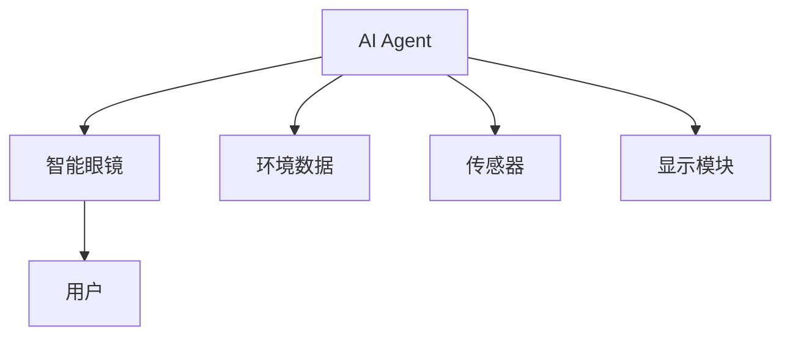
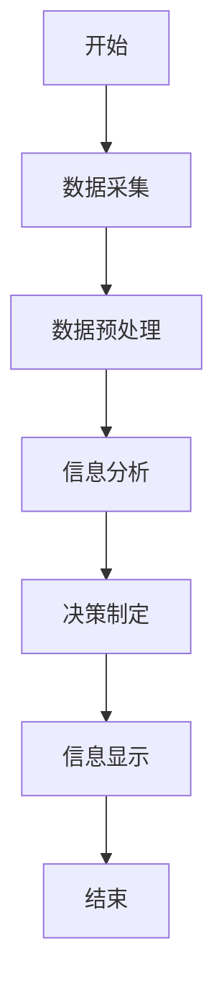
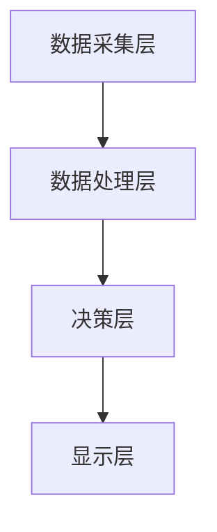
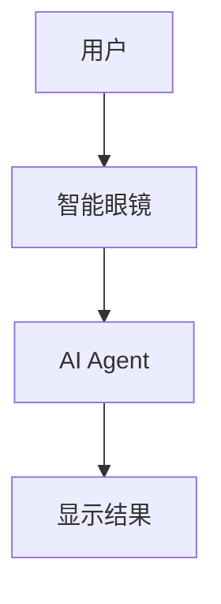

                 


# AI Agent在智能眼镜中的实时信息显示

> 关键词：AI Agent，智能眼镜，实时信息显示，算法原理，系统架构

> 摘要：本文探讨了AI Agent在智能眼镜中的实时信息显示技术，从背景、概念、算法原理到系统架构，再到项目实战和总结，全面分析了AI Agent在智能眼镜中的应用及其技术实现。

---

## 第一部分: AI Agent与智能眼镜的背景与概念

### 第1章: AI Agent的基本概念与背景

#### 1.1 AI Agent的定义与特点
- **1.1.1 AI Agent的定义**  
  AI Agent（人工智能代理）是指能够感知环境、自主决策并执行任务的智能实体。它具备目标导向性、自主性、反应性和社会性等特征。

- **1.1.2 AI Agent的核心特点**  
  - **目标导向性**：AI Agent的行为以实现特定目标为导向。  
  - **自主性**：能够在没有外部干预的情况下自主运作。  
  - **反应性**：能够实时感知环境变化并做出响应。  
  - **社会性**：能够与其他Agent或人类进行交互和协作。

- **1.1.3 AI Agent与传统程序的区别**  
  AI Agent与传统程序的主要区别在于其自主性和智能性。传统程序通常遵循固定的逻辑执行任务，而AI Agent能够自主决策、学习和适应环境。

#### 1.2 AI Agent的应用场景
- **1.2.1 AI Agent在智能眼镜中的应用**  
  AI Agent可以为智能眼镜提供实时信息处理、决策支持和用户交互功能。例如，实时翻译、语音助手、环境监测等。

- **1.2.2 其他领域中的AI Agent应用**  
  AI Agent广泛应用于自动驾驶、智能家居、机器人控制等领域。例如，自动驾驶中的路径规划和决策系统，智能家居中的设备联动控制。

#### 1.3 智能眼镜的基本概念
- **1.3.1 智能眼镜的定义**  
  智能眼镜是一种集成了计算机、通信和传感器技术的 wearable device，能够通过语音、手势或触摸等方式与用户交互。

- **1.3.2 智能眼镜的主要功能**  
  - 实时信息显示：如天气、日历、通知等。  
  - 语音助手：如Siri、Google Assistant等。  
  - 健康监测：如心率监测、步数统计等。  
  - 增强现实（AR）显示：如导航、翻译等。

- **1.3.3 智能眼镜的技术发展**  
  随着AI技术的进步，智能眼镜的功能日益丰富，从最初的单一功能（如时间显示）发展到现在的多任务处理和增强现实显示。

#### 1.4 AI Agent在智能眼镜中的应用价值
- **1.4.1 提高用户体验**  
  AI Agent能够实时处理信息并提供个性化服务，显著提升了智能眼镜的用户体验。

- **1.4.2 增强智能眼镜的功能**  
  通过AI Agent，智能眼镜能够实现更复杂的任务，如实时翻译、多语言支持、智能助手等。

- **1.4.3 未来发展趋势**  
  随着AI技术的进一步发展，智能眼镜将更加智能化和个性化，AI Agent将在其中发挥越来越重要的作用。

#### 1.5 本章小结  
本章介绍了AI Agent的基本概念和特点，讨论了其在智能眼镜中的应用场景，并分析了AI Agent在智能眼镜中的应用价值和发展趋势。

---

### 第2章: AI Agent在智能眼镜中的问题背景

#### 2.1 智能眼镜实时信息显示的核心问题
- **2.1.1 信息获取与处理的实时性**  
  智能眼镜需要实时获取环境信息（如语音、图像、传感器数据等）并快速处理，这对AI Agent的实时性提出了较高的要求。

- **2.1.2 信息显示的准确性与效率**  
  实时信息显示需要保证信息的准确性和显示的效率，避免信息延迟或错误显示。

- **2.1.3 用户需求的多样性**  
  不同用户对智能眼镜的功能需求存在差异，AI Agent需要具备灵活性和适应性，以满足多样化的需求。

#### 2.2 AI Agent在智能眼镜中的解决方案
- **2.2.1 AI Agent的核心作用**  
  AI Agent通过实时感知环境、分析数据并做出决策，为智能眼镜提供智能化的信息处理和显示服务。

- **2.2.2 解决方案的技术路线**  
  - 数据采集与处理：通过传感器和网络获取环境数据。  
  - 信息分析与决策：利用机器学习和自然语言处理技术分析数据并做出决策。  
  - 信息显示与交互：通过AR技术将处理后的信息实时显示在用户面前，并支持用户交互。

- **2.2.3 解决方案的优缺点**  
  - 优点：提高信息处理效率，增强用户体验。  
  - 缺点：对硬件和算法的实时性要求较高，开发和维护成本较高。

#### 2.3 本章小结  
本章分析了智能眼镜实时信息显示的核心问题，并提出了AI Agent的解决方案，讨论了其优缺点。

---

### 第3章: AI Agent与智能眼镜的核心概念与联系

#### 3.1 AI Agent与智能眼镜的关系
- **3.1.1 AI Agent作为智能眼镜的核心模块**  
  AI Agent是智能眼镜的“大脑”，负责处理数据、做出决策并控制显示模块。

- **3.1.2 智能眼镜作为AI Agent的交互界面**  
  智能眼镜是AI Agent与用户交互的主要界面，通过它用户可以与AI Agent进行互动。

- **3.1.3 两者协同工作的机制**  
  AI Agent通过传感器获取环境数据，经过处理后通过智能眼镜的显示模块将信息呈现给用户，并通过用户的反馈进一步优化决策。

#### 3.2 AI Agent在智能眼镜中的功能模块
- **3.2.1 数据采集与处理模块**  
  该模块负责采集环境数据（如语音、图像、传感器数据等）并进行初步处理。

- **3.2.2 信息分析与决策模块**  
  该模块利用机器学习和自然语言处理技术对数据进行分析并做出决策。

- **3.2.3 信息显示与交互模块**  
  该模块负责将处理后的信息以AR形式显示在用户面前，并支持用户的交互操作。

#### 3.3 AI Agent与智能眼镜的实体关系图



---

## 第二部分: AI Agent的算法原理与实现

### 第4章: AI Agent的算法原理

#### 4.1 AI Agent的信息处理流程
- **数据采集**：通过传感器和网络获取环境数据。  
- **数据预处理**：对数据进行清洗和特征提取。  
- **信息分析**：利用机器学习模型对数据进行分析和预测。  
- **决策制定**：基于分析结果制定决策。  
- **信息显示**：将处理后的信息通过智能眼镜显示模块呈现给用户。

#### 4.2 AI Agent的算法流程图



#### 4.3 AI Agent的数学模型与公式
- **概率计算**：例如，贝叶斯定理用于计算某种事件发生的概率。  
  $$ P(A|B) = \frac{P(B|A)P(A)}{P(B)} $$  
- **分类算法**：例如，支持向量机（SVM）用于分类任务。  
- **回归算法**：例如，线性回归用于预测任务。  

#### 4.4 本章小结  
本章详细讲解了AI Agent的信息处理流程，通过流程图和数学公式展示了其算法原理。

---

### 第5章: AI Agent在智能眼镜中的系统架构设计

#### 5.1 系统架构概述
- **分层架构**：系统分为数据采集层、数据处理层、决策层和显示层。  
- **模块化设计**：每个功能模块独立开发并相互协作。

#### 5.2 系统架构图



#### 5.3 系统接口设计
- **数据接口**：AI Agent与传感器、网络之间的数据接口。  
- **显示接口**：AI Agent与智能眼镜显示模块之间的接口。  
- **用户交互接口**：AI Agent与用户的交互接口。

#### 5.4 系统交互图



#### 5.5 本章小结  
本章设计了AI Agent在智能眼镜中的系统架构，并通过架构图和交互图展示了系统的整体结构。

---

## 第三部分: 项目实战与总结

### 第6章: 项目实战

#### 6.1 环境搭建
- **安装Python**：安装Python 3.x及以上版本。  
- **安装依赖库**：安装numpy、pandas、scikit-learn等库。  
- **安装智能眼镜开发工具**：安装OpenCV、TensorFlow等工具。

#### 6.2 核心功能实现
- **数据采集**：编写代码采集环境数据。  
  ```python
  import numpy as np

  def collect_data():
      # 模拟传感器数据采集
      data = np.random.randn(100, 10)
      return data
  ```

- **数据预处理**：对数据进行清洗和特征提取。  
  ```python
  def preprocess(data):
      # 数据标准化
      data_normalized = (data - np.mean(data)) / np.std(data)
      return data_normalized
  ```

- **信息分析与决策**：利用机器学习模型进行分类或回归。  
  ```python
  from sklearn.svm import SVC

  def decision(data):
      model = SVC()
      model.fit(data, labels)
      return model.predict(new_data)
  ```

- **信息显示**：通过AR技术将信息显示在智能眼镜上。  
  ```python
  import cv2

  def display_info(frame, info):
      # 在帧上添加文字信息
      cv2.putText(frame, info, (10, 30), cv2.FONT_HERSHEY_SIMPLEX, 1, (255, 255, 255), 2)
      return frame
  ```

#### 6.3 项目案例分析
- **案例1：实时翻译**  
  AI Agent实时获取用户语音并翻译成目标语言，通过智能眼镜的AR显示模块将翻译结果呈现给用户。

- **案例2：健康监测**  
  AI Agent通过智能眼镜的传感器实时监测用户的心率、步数等健康指标，并在发现异常时及时提醒用户。

#### 6.4 代码应用解读与分析
- **代码功能解读**  
  代码实现了AI Agent从数据采集到信息显示的整个流程，展示了AI Agent在智能眼镜中的具体应用。

- **代码优化建议**  
  - 使用异步编程提高数据处理效率。  
  - 引入更高效的机器学习模型（如深度学习模型）提升决策准确性。

#### 6.5 本章小结  
本章通过实际案例展示了AI Agent在智能眼镜中的应用，并通过代码实现和解读帮助读者理解其技术实现。

---

## 第四部分: 总结与展望

### 第7章: 总结与展望

#### 7.1 本项目总结
- **技术总结**  
  本项目实现了AI Agent在智能眼镜中的实时信息显示，通过分层架构和模块化设计，确保了系统的高效性和可扩展性。

- **经验总结**  
  在开发过程中，需要注意硬件和算法的实时性问题，同时要确保系统的灵活性和可维护性。

#### 7.2 未来展望
- **技术进步**  
  随着AI技术的不断发展，智能眼镜的功能将更加智能化和个性化。  
- **应用拓展**  
  AI Agent在智能眼镜中的应用将扩展到更多领域，如医疗、教育、娱乐等。  
- **挑战与机遇**  
  开发者需要克服硬件性能和算法效率的限制，同时抓住市场对智能眼镜的需求，推动技术的发展。

#### 7.3 最佳实践 Tips
- **硬件与算法的协同优化**  
  硬件性能的提升和算法的优化是实现高效实时信息显示的关键。  
- **用户体验的设计**  
  在开发过程中，要注重用户体验的优化，确保用户能够方便、直观地使用智能眼镜。

#### 7.4 本章小结  
本章总结了项目的开发经验，并展望了AI Agent在智能眼镜中的未来发展方向，同时给出了最佳实践的建议。

---

## 作者信息

作者：AI天才研究院/AI Genius Institute & 禅与计算机程序设计艺术 /Zen And The Art of Computer Programming

---

以上是《AI Agent在智能眼镜中的实时信息显示》的技术博客文章的完整大纲和内容。希望这篇文章能够帮助读者全面理解AI Agent在智能眼镜中的应用和技术实现。

