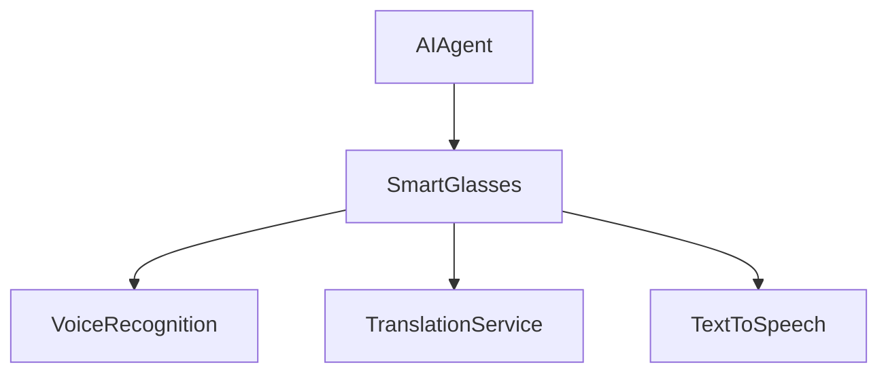
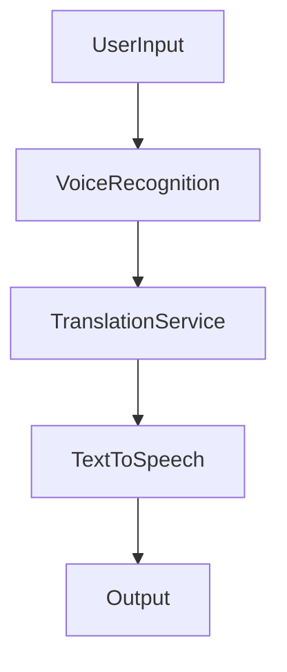
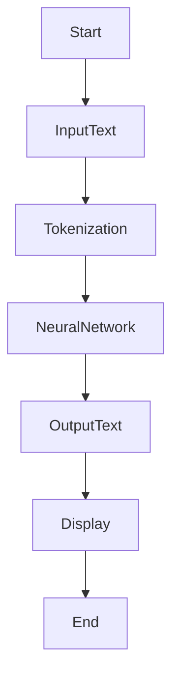
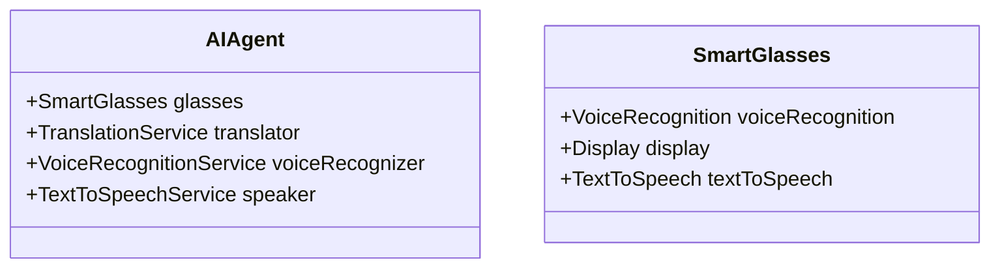
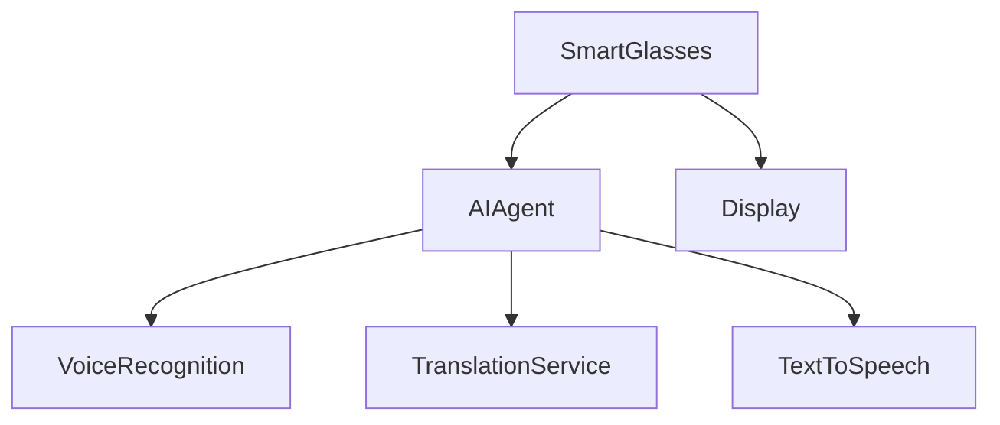

                 


# AI Agent在智能眼镜中的实时翻译功能

> 关键词：AI Agent, 智能眼镜, 实时翻译, 自然语言处理, 增强现实

> 摘要：本文详细探讨了AI Agent在智能眼镜中的实时翻译功能，从背景介绍到系统架构设计，再到项目实战和最佳实践，全面解析了该技术的核心原理和实现方法。文章内容丰富，逻辑清晰，旨在为读者提供一个深入的技术视角，帮助理解并实现这一前沿技术。

---

# 第一部分: AI Agent在智能眼镜中的实时翻译功能概述

## 第1章: 背景介绍

### 1.1 问题背景
#### 1.1.1 AI Agent与智能眼镜的结合
随着人工智能技术的快速发展，AI Agent（人工智能代理）逐渐成为智能设备的核心组件。智能眼镜作为一种便携式增强现实（AR）设备，结合AI Agent，能够为用户提供更智能、更便捷的服务。实时翻译功能作为智能眼镜的重要应用之一，能够帮助用户在跨语言交流中更加高效。

#### 1.1.2 实时翻译功能的需求场景
在实际生活中，跨语言交流的需求日益增长。智能眼镜的用户可能在旅游、商务会议、国际交流等多种场景中需要实时翻译功能。例如，用户在旅途中遇到不懂当地语言的情况，可以通过智能眼镜实时翻译对话，避免误解和尴尬。

#### 1.1.3 当前技术的局限性与挑战
尽管当前的翻译技术已经取得了显著进展，但仍然存在一些局限性。例如，实时翻译的延迟问题、翻译准确性的问题，以及智能眼镜硬件性能的限制。此外，如何在有限的资源下实现高效的实时翻译功能，也是一个重要的挑战。

### 1.2 问题描述
#### 1.2.1 实时翻译的核心需求
实时翻译的核心需求包括：快速响应、高准确性、低延迟、支持多种语言、适应不同场景等。这些需求需要在智能眼镜的软硬件限制下实现。

#### 1.2.2 智能眼镜的硬件与软件限制
智能眼镜的硬件性能有限，包括计算能力、存储空间、电池寿命等。软件方面，需要设计高效的算法以适应实时翻译的需求。

#### 1.2.3 用户体验的关键因素
用户体验是实时翻译功能成功与否的关键。用户希望翻译功能能够快速响应、准确无误，并且操作简便。此外，翻译结果的显示方式也需要符合用户的使用习惯。

### 1.3 问题解决
#### 1.3.1 AI Agent的解决方案
AI Agent可以通过实时语音识别、自然语言处理和语音合成等技术，实现智能眼镜的实时翻译功能。AI Agent能够根据用户的需求，动态调用相应的翻译服务，确保翻译的高效性和准确性。

#### 1.3.2 实时翻译的技术实现路径
实时翻译的技术实现路径包括：语音识别、自然语言处理、机器翻译、语音合成等。这些技术需要协同工作，确保翻译的快速响应和准确结果。

#### 1.3.3 边界与外延
实时翻译功能的边界包括：支持的语言种类、翻译的准确率、响应时间等。外延则包括与其他功能的集成，例如与语音助手的结合。

### 1.4 核心概念与联系
#### 1.4.1 AI Agent的定义与属性
AI Agent是一种智能代理，能够根据用户的指令执行相应的任务。在智能眼镜中，AI Agent负责接收用户的指令，调用相应的服务，并将结果反馈给用户。

#### 1.4.2 实时翻译功能的实现要素
实时翻译功能的实现要素包括：语音识别、自然语言处理、机器翻译、语音合成等。这些要素需要协同工作，确保翻译的高效性和准确性。

#### 1.4.3 翻译技术与智能眼镜的结合
翻译技术与智能眼镜的结合需要考虑硬件和软件的限制。例如，语音识别需要低延迟，机器翻译需要快速响应，而语音合成则需要高质量的语音输出。

---

## 第2章: 核心概念与联系

### 2.1 AI Agent的原理
#### 2.1.1 AI Agent的基本工作原理
AI Agent通过接收用户的指令，解析指令内容，调用相应的服务，并将结果反馈给用户。在实时翻译功能中，AI Agent负责接收用户的语音输入，调用翻译服务，并将翻译结果反馈给用户。

#### 2.1.2 实时翻译的核心算法
实时翻译的核心算法包括：语音识别算法、机器翻译算法、语音合成算法等。这些算法需要高效运行，确保翻译的快速响应和准确结果。

#### 2.1.3 翻译技术的演进
翻译技术从基于规则的翻译到基于神经网络的翻译，经历了多次演进。当前，基于神经网络的翻译技术已经成为主流，能够实现更准确的翻译结果。

### 2.2 核心概念对比
#### 2.2.1 翻译技术对比表格
| 技术 | 基于规则的翻译 | 基于神经网络的翻译 |
|------|----------------|---------------------|
| 精度 | 较低            | 较高                |
| 延迟 | 较高            | 较低                |
| 资源需求 | 较低          | 较高                |

#### 2.2.2 AI Agent与传统翻译工具的对比
| 特性       | AI Agent集成的实时翻译 | 传统翻译工具 |
|------------|-------------------------|---------------|
| 实时性     | 高                      | 低            |
| 移动性     | 高                      | 低            |
| 用户体验   | 无缝集成                | 离散          |

#### 2.2.3 翻译质量与实时性的权衡
在实时翻译中，翻译质量与实时性之间存在权衡。高精度的翻译可能需要更多的计算资源和时间，而实时翻译则需要快速响应，可能在精度上有所牺牲。

### 2.3 实体关系图
#### 2.3.1 AI Agent与智能眼镜的实体关系


#### 2.3.2 翻译功能的模块化设计


#### 2.3.3 用户与系统的交互流程
```mermaid
graph TD
User<Input> --> SmartGlasses
SmartGlasses --> AIAgent
AIAgent --> VoiceRecognition
VoiceRecognition --> TranslationService
TranslationService --> TextToSpeech
TextToSpeech --> User<Output>
```

---

## 第3章: 算法原理讲解

### 3.1 翻译算法的实现
#### 3.1.1 翻译流程的mermaid流程图


#### 3.1.2 翻译算法的Python代码实现
```python
import requests

def translate(text, source_lang, target_lang):
    api_key = "your_api_key"
    url = f"https://api.example.com/translate?text={text}&source={source_lang}&target={target_lang}"
    headers = {"Authorization": f"Bearer {api_key}"}
    response = requests.get(url, headers=headers)
    return response.json()['result']

# 示例用法
text = "Hello, how are you?"
source_lang = "en"
target_lang = "zh"
result = translate(text, source_lang, target_lang)
print(result)  # 输出：你好，你怎么样？
```

#### 3.1.3 翻译算法的数学模型
机器翻译的核心是建立源语言和目标语言之间的映射关系。常用的数学模型包括：
$$ P(y|x) = p(y_1|y_2, x) p(y_2|x) $$
其中，$$x$$表示源语言句子，$$y$$表示目标语言句子。

---

## 第4章: 系统分析与架构设计

### 4.1 问题场景介绍
智能眼镜实时翻译功能的用户场景包括：用户佩戴智能眼镜，在跨语言交流中使用实时翻译功能，例如与外国友人对话、阅读外文菜单等。

### 4.2 系统功能设计
#### 4.2.1 领域模型的mermaid类图


#### 4.2.2 系统架构设计的mermaid架构图


#### 4.2.3 接口设计
实时翻译功能的接口设计包括：
- `translate(text: str, source_lang: str, target_lang: str) -> str`
- `speak(text: str) -> None`
- `listen() -> str`

#### 4.2.4 交互流程图
```mermaid
graph TD
User<Input> --> AIAgent
AIAgent --> TranslationService
TranslationService --> TextToSpeech
TextToSpeech --> User<Output>
```

---

## 第5章: 项目实战

### 5.1 环境搭建
#### 5.1.1 Python环境的安装与配置
安装Python和必要的库：
```bash
pip install requests
pip install googletrans
```

#### 5.1.2 开发工具的安装与配置
安装Jupyter Notebook或其他IDE，用于编写和调试代码。

### 5.2 系统核心实现
#### 5.2.1 语音识别模块的实现
使用Google的语音识别API：
```python
import googletrans
from googletrans import Translator

def recognize_speech():
    translator = Translator()
    # 语音识别部分需要具体实现
    pass
```

#### 5.2.2 翻译模块的实现
使用Google翻译API：
```python
def translate_text(text, source_lang, target_lang):
    translator = googletrans.Translator()
    result = translator.translate(text, dest=target_lang, src=source_lang)
    return result.text
```

#### 5.2.3 语音合成模块的实现
使用Google的文本到语音API：
```python
def speak_text(text):
    # 语音合成部分需要具体实现
    pass
```

### 5.3 代码解读与分析
#### 5.3.1 核心代码解读
```python
def main():
    text = input("请输入要翻译的文本：")
    source_lang = input("请输入源语言：")
    target_lang = input("请输入目标语言：")
    translated_text = translate_text(text, source_lang, target_lang)
    print("翻译结果：", translated_text)
    
if __name__ == "__main__":
    main()
```

#### 5.3.2 代码运行与测试
运行上述代码，输入待翻译的文本、源语言和目标语言，输出翻译结果。

### 5.4 案例分析与详细讲解
#### 5.4.1 案例分析
用户输入中文“你好，今天天气怎么样？”，源语言为“zh”，目标语言为“en”。翻译结果为“Hello, how's the weather today?”

#### 5.4.2 详细讲解
整个过程包括：语音识别、翻译、语音合成。用户通过智能眼镜输入中文，AI Agent调用翻译服务，将中文翻译成英文，并通过语音输出给用户。

### 5.5 项目小结
实时翻译功能的实现需要多个模块的协同工作，包括语音识别、翻译和语音合成。通过集成AI Agent，可以实现高效的实时翻译功能，满足用户的跨语言交流需求。

---

## 第6章: 最佳实践与优化

### 6.1 优化技巧
#### 6.1.1 性能优化
- 使用高效的翻译API
- 优化语音识别和语音合成的延迟
- 减少不必要的计算

#### 6.1.2 代码优化
- 使用异步调用
- 优化内存使用
- 减少API调用次数

### 6.2 小结
实时翻译功能的实现需要综合考虑硬件和软件的限制，通过优化算法和架构设计，可以显著提升翻译的效率和准确性。

### 6.3 注意事项
- 翻译结果的准确性需要权衡延迟
- 翻译功能的用户交互设计需要符合用户的习惯
- 需要处理翻译过程中可能出现的错误和异常

### 6.4 拓展阅读
- 推荐书籍：《自然语言处理入门》
- 推荐论文：《基于神经网络的机器翻译研究》

---

## 第7章: 总结

### 7.1 本章总结
本文详细探讨了AI Agent在智能眼镜中的实时翻译功能，从背景介绍到系统架构设计，再到项目实战和最佳实践，全面解析了该技术的核心原理和实现方法。通过本文的学习，读者可以深入了解实时翻译功能的实现细节，并能够将其应用到实际项目中。

### 7.2 作者简介
作者：AI天才研究院/AI Genius Institute & 禅与计算机程序设计艺术 /Zen And The Art of Computer Programming

