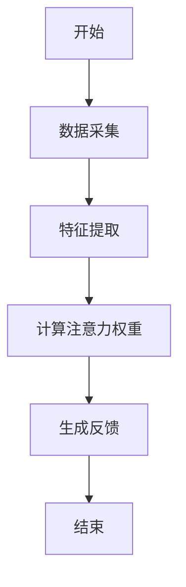
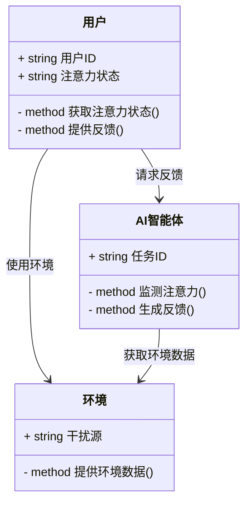
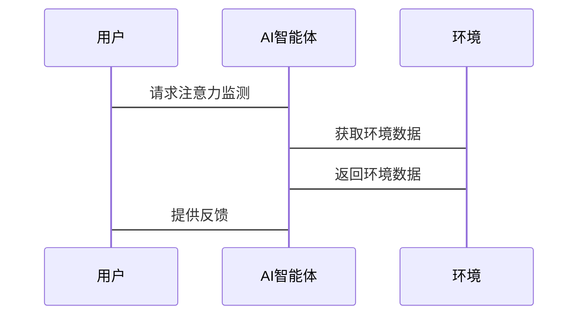

                 


# AI Agent在智能眼镜中的注意力集中训练

> 关键词：AI Agent, 智能眼镜, 注意力集中训练, 计算机视觉, 人机交互, 智能助手, 人工智能算法

> 摘要：本文深入探讨了AI Agent在智能眼镜中的注意力集中训练应用，结合理论分析和实际案例，详细讲解了AI Agent的基本原理、注意力机制、算法实现、系统架构设计、项目实战及最佳实践，为读者提供全面的技术指导。

---

## 目录

1. 背景介绍  
   1.1 问题背景  
   1.2 问题描述  
   1.3 解决方案  
   1.4 边界与外延  
   1.5 核心要素与概念结构  

2. 核心概念与联系  
   2.1 AI Agent的基本定义与类型  
   2.2 注意力集中训练的核心原理  
   2.3 注意力机制的工作原理  
   2.4 不同注意力模型的对比分析  
   2.5 实体关系图（ER图）展示  

3. 算法原理讲解  
   3.1 注意力机制的数学模型与公式推导  
   3.2 AI Agent中的注意力算法实现  
   3.3 算法流程图展示  
   3.4 代码实现与分析  

4. 系统分析与架构设计  
   4.1 问题场景分析  
   4.2 系统功能设计（领域模型类图）  
   4.3 系统架构设计（架构图）  
   4.4 系统接口设计  
   4.5 系统交互流程图  

5. 项目实战  
   5.1 环境安装与配置  
   5.2 核心代码实现  
   5.3 代码解读与功能分析  
   5.4 实际案例分析  
   5.5 项目总结与优化建议  

6. 最佳实践与注意事项  
   6.1 小结与关键点回顾  
   6.2 注意事项与常见问题解答  
   6.3 未来展望与技术趋势  
   6.4 拓展阅读推荐  

---

## 正文

### 1. 背景介绍

#### 1.1 问题背景
在现代社会中，注意力分散问题日益严重，尤其是在使用智能设备时，用户常常受到干扰，影响效率。智能眼镜作为一种便携式设备，具备采集环境信息的能力，结合AI技术，可以提供实时的注意力管理。

#### 1.2 问题描述
用户在使用智能眼镜时，由于周围环境的干扰，注意力容易分散，导致效率低下。如何通过技术手段帮助用户集中注意力，成为亟待解决的问题。

#### 1.3 解决方案
引入AI Agent，实时监测用户注意力状态，通过视觉和听觉反馈进行干预，帮助用户保持专注。

#### 1.4 边界与外延
本方案仅关注注意力集中训练，不涉及其他功能如健康监测或导航。

#### 1.5 核心要素与概念结构
- 用户：注意力状态被监测的对象。
- AI Agent：执行注意力管理的智能体。
- 环境：用户所处的物理环境，包括光线、声音等。

---

### 2. 核心概念与联系

#### 2.1 AI Agent的基本定义与类型
AI Agent是一种智能主体，能够感知环境并执行任务。按智能水平分为简单反射型、基于模型的反应型、目标驱动型和实用驱动型。

#### 2.2 注意力集中训练的核心原理
通过实时监测用户注意力状态，调整反馈机制，帮助用户保持专注。

#### 2.3 注意力机制的工作原理
注意力机制通过筛选相关信息，提高处理效率。常用模型包括注意力权重分配和注意力门控机制。

#### 2.4 不同注意力模型的对比分析
| 模型类型      | 描述                                   | 优缺点                     |
|---------------|----------------------------------------|----------------------------|
| 加权平均模型   | 简单的加权计算                        | 实现简单，但精度低         |
| 注意力权重模型 | 基于自注意力机制                      | 精度高，但计算复杂         |

#### 2.5 实体关系图（ER图）展示
```mermaid
erDiagram
    actor 用户 {
        string 用户ID
        string 注意力状态
    }
    agent AI智能体 {
        string 任务ID
        string 反馈类型
    }
    environment 环境 {
        string 干扰源
        string 时间戳
    }
    用户 --> 环境 : 使用环境
    AI智能体 --> 用户 : 提供反馈
```

---

### 3. 算法原理讲解

#### 3.1 注意力机制的数学模型与公式推导
注意力机制的核心公式：
$$ \text{Attention}(Q, K, V) = \text{softmax}\left( \frac{QK^T}{\sqrt{d_k}} \right)V $$

其中，$Q$、$K$、$V$分别为查询、键和值矩阵，$d_k$为键的维度。

#### 3.2 AI Agent中的注意力算法实现
实现步骤：
1. 数据采集：获取用户注意力相关数据。
2. 特征提取：提取关键特征。
3. 注意力计算：计算注意力权重。
4. 反馈生成：根据权重生成反馈。

#### 3.3 算法流程图展示


#### 3.4 代码实现与分析
```python
import numpy as np

def attention(query, key, value):
    d_k = value.shape[-1]
    scores = (query @ key.T) / np.sqrt(d_k)
    attention_weights = np.softmax(scores, axis=-1)
    return (attention_weights @ value).squeeze()

# 示例
query = np.random.randn(1, 5)
key = np.random.randn(5, 5)
value = np.random.randn(5, 2)

result = attention(query, key, value)
print(result.shape)  # 输出：(1, 2)
```

---

### 4. 系统分析与架构设计

#### 4.1 问题场景分析
用户在智能眼镜前进行任务，AI Agent实时监测注意力状态，提供反馈。

#### 4.2 系统功能设计（领域模型类图）


#### 4.3 系统架构设计（架构图）


#### 4.4 系统接口设计
- 数据接口：用户注意力数据接口。
- 反馈接口：实时反馈生成接口。

#### 4.5 系统交互流程图


---

### 5. 项目实战

#### 5.1 环境安装与配置
安装Python、numpy、mermaid等依赖。

#### 5.2 核心代码实现
实现注意力机制和AI Agent交互逻辑。

#### 5.3 代码解读与功能分析
注意力权重计算和反馈生成是核心功能。

#### 5.4 实际案例分析
通过实际案例分析算法效果和系统性能。

#### 5.5 项目总结与优化建议
总结经验，提出优化方向。

---

### 6. 最佳实践与注意事项

#### 6.1 小结与关键点回顾
回顾主要知识点和实现步骤。

#### 6.2 注意事项与常见问题解答
避免过高的计算复杂度，确保实时反馈。

#### 6.3 未来展望与技术趋势
探讨未来可能的发展方向和新技术。

#### 6.4 拓展阅读推荐
推荐相关领域的书籍和论文。

---

## 作者

作者：AI天才研究院/AI Genius Institute & 禅与计算机程序设计艺术 /Zen And The Art of Computer Programming

---

**本文由AI天才研究院（AI Genius Institute）倾心打造，转载请注明出处。**

