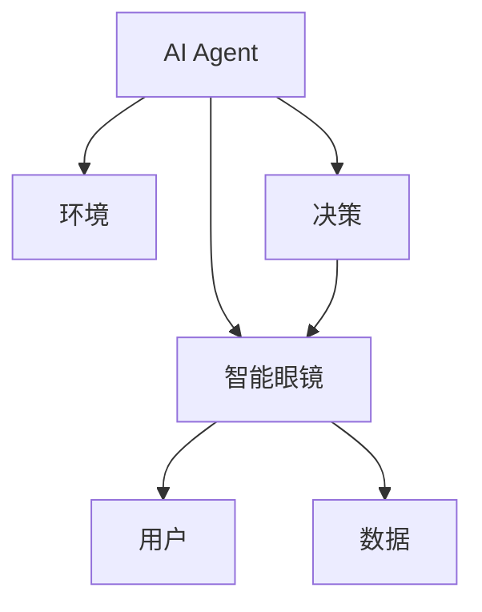
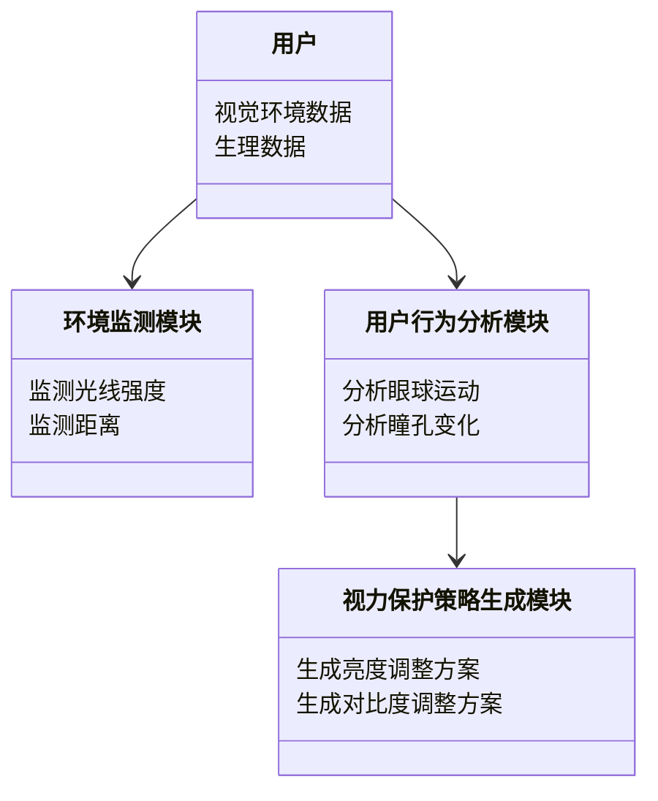
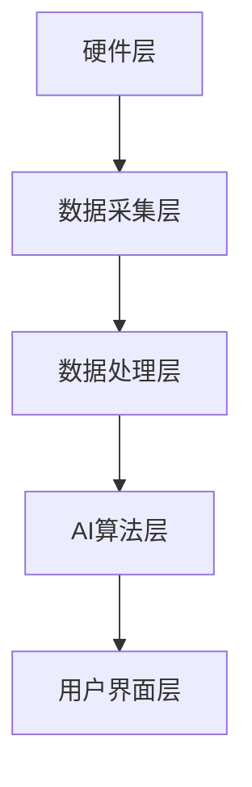
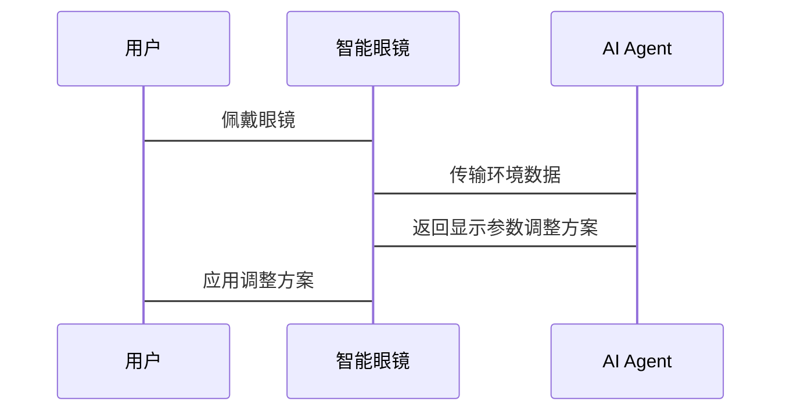

                 


# AI Agent在智能眼镜中的视力保护功能

> **关键词**：AI Agent，智能眼镜，视力保护，算法原理，系统架构设计

> **摘要**：本文详细探讨了AI Agent在智能眼镜中的视力保护功能，从背景介绍、核心概念、算法原理到系统架构设计，再到项目实战，全面分析了AI Agent如何通过智能眼镜实现有效的视力保护。

---

# 第一部分: AI Agent与智能眼镜的背景介绍

## 第1章: 问题背景与概念解析

### 1.1 问题背景

#### 1.1.1 数字化时代下的视力问题
在数字化时代，人们使用电子设备的时间显著增加，导致视力问题日益严重。长时间使用手机、电脑等设备容易引发近视、干眼症等问题。智能眼镜作为一种新兴的科技产品，可以有效监测和改善用户的视力健康。

#### 1.1.2 智能眼镜的发展现状
智能眼镜结合了增强现实（AR）技术和智能传感器，能够实时监测用户的视觉环境和生理状态。然而，当前的智能眼镜在视力保护功能上仍有提升空间，尤其是在个性化矫正和主动保护方面。

#### 1.1.3 AI技术在健康领域的应用趋势
AI技术在医疗健康领域的应用越来越广泛，尤其是在个性化诊断和健康管理方面。AI Agent（智能体）能够通过实时数据分析为用户提供智能化的健康建议。

---

### 1.2 问题描述

#### 1.2.1 视力保护的重要性
视力保护不仅是个人健康问题，也是社会问题。据世界卫生组织统计，全球约有2.2亿人患有近视，这一数字还在不断增加。

#### 1.2.2 智能眼镜在视力保护中的潜力
智能眼镜可以通过实时监测用户的视觉环境和生理状态，提供个性化的视力保护建议。例如，自动调整屏幕亮度、优化字体大小，或者提醒用户休息眼睛。

#### 1.2.3 当前视力保护技术的局限性
现有的视力保护技术大多基于固定的规则，缺乏个性化和主动性。用户需要手动调整设备或遵循固定的休息提醒，这在实际使用中不够便捷。

---

### 1.3 问题解决

#### 1.3.1 AI Agent的核心作用
AI Agent能够实时分析用户的视觉环境和生理数据，动态调整智能眼镜的显示参数，提供个性化的视力保护建议。例如，根据用户的眼球运动和瞳孔变化，自动调整屏幕亮度和对比度。

#### 1.3.2 智能眼镜的硬件支持
智能眼镜配备了多种传感器，如眼球追踪传感器、环境光线传感器和心率传感器。这些硬件为AI Agent提供了丰富的数据源，支持实时分析和决策。

#### 1.3.3 综合解决方案的构建
通过结合AI Agent和智能眼镜的硬件支持，构建一个动态的、个性化的视力保护系统。该系统能够实时监测用户的视觉环境和生理状态，主动调整显示参数并提供健康建议。

---

### 1.4 边界与外延

#### 1.4.1 AI Agent的功能边界
AI Agent在智能眼镜中的功能主要集中在视力保护和用户体验优化方面，不涉及其他健康功能（如心率监测）。

#### 1.4.2 智能眼镜的适用场景
智能眼镜的视力保护功能适用于长时间使用电子设备的用户，尤其是办公人士和学生群体。其适用场景包括电脑使用、阅读和视频观看等。

#### 1.4.3 相关技术的扩展性探讨
虽然本文主要讨论AI Agent在智能眼镜中的应用，但其核心算法和思路可以扩展到其他领域，如智能家居和健康监测设备。

---

### 1.5 概念结构与核心要素

#### 1.5.1 AI Agent的组成要素
AI Agent由感知模块、决策模块和执行模块组成。感知模块负责采集用户数据，决策模块基于数据进行分析和决策，执行模块负责调整智能眼镜的显示参数。

#### 1.5.2 智能眼镜的功能模块
智能眼镜的功能模块包括环境监测模块、用户行为分析模块和视力保护策略生成模块。这些模块协同工作，实现动态的视力保护。

#### 1.5.3 交互机制的核心要素
交互机制的核心要素包括实时数据采集、动态参数调整和用户反馈。通过高效的交互机制，确保AI Agent能够快速响应用户需求。

---

# 第二部分: 核心概念与联系

## 第2章: AI Agent的核心原理

### 2.1 AI Agent的基本原理

#### 2.1.1 定义与分类
AI Agent是一种智能体，能够感知环境、自主决策并执行任务。根据应用场景的不同，AI Agent可以分为简单反射型、基于模型的反应型和目标驱动型。

#### 2.1.2 基于强化学习的决策机制
强化学习是一种常用的AI算法，通过奖励机制优化决策策略。例如，AI Agent可以根据用户的视觉舒适度调整屏幕亮度，逐步优化显示参数。

#### 2.1.3 AI Agent的感知与决策流程
1. 感知环境：通过传感器采集用户视觉环境和生理数据。
2. 数据分析：基于感知数据，分析用户的视觉需求。
3. 决策生成：根据分析结果，生成最优的显示参数调整方案。
4. 执行调整：将决策结果反馈给智能眼镜，动态调整显示参数。

---

### 2.2 AI Agent与智能眼镜的联系

#### 2.2.1 技术上的协同作用
AI Agent通过分析智能眼镜采集的数据，优化显示参数和用户体验。智能眼镜则为AI Agent提供了实时的数据支持和执行载体。

#### 2.2.2 应用上的互补性
AI Agent的智能化决策能力弥补了智能眼镜在个性化保护方面的不足，而智能眼镜的硬件支持则为AI Agent提供了丰富的数据源。

---

### 2.3 AI Agent与智能眼镜的关系模型



---

## 第3章: AI Agent在智能眼镜中的应用

### 3.1 应用场景分析

#### 3.1.1 视力保护场景
AI Agent可以根据用户的视觉需求，动态调整屏幕亮度、对比度和字体大小，减少眼睛疲劳。

#### 3.1.2 个性化矫正场景
通过分析用户的视力数据，AI Agent可以生成个性化的矫正方案，帮助用户矫正视力问题。

---

### 3.2 应用优势分析

#### 3.2.1 实时性
AI Agent能够实时分析用户的视觉环境和生理数据，快速调整显示参数，提供即时的视力保护。

#### 3.2.2 个性化
基于用户的数据，AI Agent可以提供个性化的视力保护方案，满足不同用户的需求。

#### 3.2.3 主动性
AI Agent不仅能够被动响应用户需求，还能够主动监测用户的视觉环境，预防视力问题的发生。

---

# 第三部分: 算法原理与数学模型

## 第4章: 算法原理讲解

### 4.1 基于强化学习的优化算法

#### 4.1.1 强化学习的基本概念
强化学习是一种通过试错学习的算法，通过不断尝试和调整，找到最优的决策策略。

#### 4.1.2 在视力保护中的应用
AI Agent通过强化学习算法，动态调整屏幕亮度和对比度，以优化用户的视觉舒适度。

#### 4.1.3 具体实现步骤
1. 初始化参数：设置亮度和对比度的初始值。
2. 数据采集：采集用户的视觉环境和生理数据。
3. 状态识别：分析用户当前的视觉需求。
4. 决策生成：基于强化学习模型，生成最优的显示参数调整方案。
5. 执行调整：将决策结果反馈给智能眼镜，动态调整显示参数。

---

### 4.2 数学模型与公式

#### 4.2.1 强化学习的目标函数
$$
\text{目标函数} = \text{最大化准确率} - \lambda \times \text{计算成本}
$$

其中，$\lambda$ 是调节参数，用于平衡准确率和计算成本。

#### 4.2.2 状态转移方程
$$
s_{t+1} = f(s_t, a_t)
$$

其中，$s_t$ 是当前状态，$a_t$ 是当前动作，$s_{t+1}$ 是下一个状态。

---

## 第5章: 算法实现与优化

### 5.1 算法实现步骤

#### 5.1.1 数据预处理
将采集的用户数据进行标准化处理，确保数据格式一致。

#### 5.1.2 模型训练
使用强化学习算法训练AI Agent，使其能够根据用户数据动态调整显示参数。

#### 5.1.3 模型优化
通过调整学习率和奖励机制，优化模型的性能，提高视觉保护效果。

---

### 5.2 算法优化策略

#### 5.2.1 离线训练与在线调整
在离线阶段训练模型，然后在实际使用中不断调整模型参数。

#### 5.2.2 分层优化
将模型分为多个层次，分别优化不同部分的参数，提高整体性能。

---

# 第四部分: 系统分析与架构设计

## 第6章: 系统分析与架构设计

### 6.1 问题场景介绍

#### 6.1.1 用户需求分析
用户希望通过智能眼镜实现个性化的视力保护，减少眼睛疲劳。

#### 6.1.2 功能需求分析
智能眼镜需要具备环境监测、用户行为分析和视力保护策略生成等功能。

---

### 6.2 系统功能设计

#### 6.2.1 领域模型


#### 6.2.2 系统架构设计


---

### 6.3 接口设计与交互流程

#### 6.3.1 系统接口设计


---

## 第7章: 项目实战

### 7.1 环境安装与配置

#### 7.1.1 安装Python
```bash
# 安装Python
sudo apt-get install python3
```

#### 7.1.2 安装依赖库
```bash
pip install numpy matplotlib scikit-learn
```

---

### 7.2 核心代码实现

#### 7.2.1 环境监测模块
```python
import numpy as np

def monitor_environment():
    # 模拟环境数据采集
    light_intensity = np.random.uniform(0, 100)
    distance = np.random.uniform(20, 60)
    return light_intensity, distance
```

#### 7.2.2 用户行为分析模块
```python
def analyze_user_behavior():
    # 模拟眼球运动分析
    eye_movement = np.random.choice(['left', 'right', 'center'])
    return eye_movement
```

#### 7.2.3 视力保护策略生成模块
```python
def generate_protection_strategy():
    # 模拟亮度和对比度调整
    brightness = np.random.uniform(50, 100)
    contrast = np.random.uniform(50, 100)
    return brightness, contrast
```

---

### 7.3 实际案例分析

#### 7.3.1 案例背景
用户长时间使用智能眼镜阅读，AI Agent需要根据环境光线和用户眼球运动，动态调整亮度和对比度。

#### 7.3.2 实施方案
1. 采集环境光线强度和用户距离。
2. 分析用户眼球运动，判断用户的注意力状态。
3. 根据分析结果，生成亮度和对比度调整方案。
4. 应用调整方案，优化用户的视觉体验。

---

## 第8章: 最佳实践与小结

### 8.1 最佳实践

#### 8.1.1 系统优化建议
定期更新AI Agent的模型参数，确保系统性能最优。

#### 8.1.2 使用建议
用户应定期校准智能眼镜，确保传感器的准确性。

---

### 8.2 小结

本文详细探讨了AI Agent在智能眼镜中的视力保护功能，从背景介绍到算法实现，再到系统架构设计，全面分析了其实现过程和应用效果。通过本文的分析，读者可以深入了解AI Agent在智能眼镜中的潜力和应用价值。

---

# 作者：AI天才研究院 & 禅与计算机程序设计艺术

