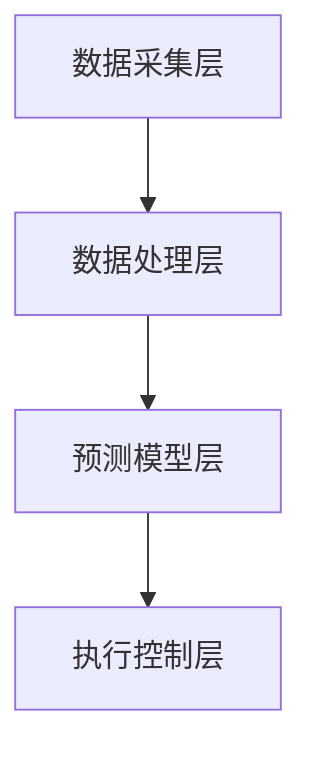

                 


# AI Agent在智能空气质量管理中的实践

## 关键词：AI Agent, 智能空气质量管理, 空气质量预测, 数据分析, 系统架构

## 摘要：  
本文详细探讨了AI Agent在智能空气质量管理中的实践应用，从背景介绍到系统实现，结合实际案例分析，深入剖析了AI Agent在空气质量监测、预测和优化中的关键作用。通过理论与实践相结合的方式，本文为读者提供了从概念到落地的完整解决方案。

---

# 第1章: 智能空气质量管理的背景与问题背景

## 1.1 空气质量管理的背景

### 1.1.1 空气质量问题的现状
- 全球范围内空气污染问题日益严重，尤其是发展中国家。
- 空气污染对人类健康、环境和经济造成巨大损失。

### 1.1.2 智能化管理的必要性
- 传统空气质量管理依赖人工监测和简单的统计方法，效率低且精度差。
- 智能化管理可以实时监测、分析和优化空气质量，减少污染对人类和环境的影响。

### 1.1.3 AI Agent在空气质量管理中的作用
- AI Agent能够实时感知空气质量数据，自动分析并做出决策，实现智能化管理。
- AI Agent可以优化空气质量监测网络，提高监测效率和精度。

## 1.2 问题背景与问题描述

### 1.2.1 空气质量监测的挑战
- 数据来源多样，包括传感器、气象数据等，数据清洗和融合难度大。
- 空气质量预测模型需要考虑多种因素，如气象条件、污染源排放等，模型复杂性高。

### 1.2.2 传统空气质量管理的局限性
- 依赖人工监测和简单统计方法，效率低且精度差。
- 无法实时响应污染变化，难以实现精准治理。

### 1.2.3 AI Agent如何解决这些问题
- AI Agent能够实时感知空气质量数据，自动分析并做出决策，实现智能化管理。
- AI Agent可以优化空气质量监测网络，提高监测效率和精度。

## 1.3 AI Agent的核心概念与定义

### 1.3.1 AI Agent的基本定义
- AI Agent是一种智能体，能够感知环境、做出决策并执行动作。
- AI Agent在空气质量管理中的应用，主要是通过传感器数据实时感知空气质量，结合预测模型做出优化决策。

### 1.3.2 AI Agent的特征与属性
- 感知能力：能够从多种数据源获取空气质量数据。
- 决策能力：能够基于数据做出优化决策。
- 执行能力：能够通过执行机构（如空气净化设备）改善空气质量。

### 1.3.3 AI Agent与传统自动化的区别
- 传统自动化依赖固定的规则和程序，而AI Agent具有学习和适应能力。
- AI Agent能够处理复杂和不确定的环境，而传统自动化适用于规则固定的场景。

## 1.4 本章小结
- 介绍了空气质量管理的背景和挑战。
- 阐述了AI Agent的核心概念和作用。
- 分析了AI Agent与传统自动化的区别。

---

# 第2章: AI Agent的核心概念与原理

## 2.1 AI Agent的核心原理

### 2.1.1 AI Agent的感知机制
- 通过多种传感器（如PM2.5、NO2等）感知空气质量数据。
- 从气象数据、交通流量等外部数据源获取相关信息。

### 2.1.2 AI Agent的决策机制
- 基于实时数据和历史数据，利用机器学习模型预测未来空气质量。
- 根据预测结果，制定优化策略，如调整空气净化设备的运行参数。

### 2.1.3 AI Agent的执行机制
- 通过执行机构（如空气净化设备、交通管理系统）改善空气质量。
- 根据实时反馈调整执行策略，实现动态优化。

## 2.2 AI Agent的特征对比分析

### 2.2.1 基于表格的核心概念特征对比
| 特征 | AI Agent | 传统自动化 |
|------|-----------|-------------|
| 感知能力 | 高         | 低           |
| 决策能力 | 高         | 低           |
| 学习能力 | 高         | 无           |
| 灵活性 | 高         | 低           |

### 2.2.2 基于ER图的核心概念实体关系图
```mermaid
er
  actor AI-Agent
  actor 空气质量监测系统
  actor 空气净化设备
  actor 交通管理系统
  actor 气象监测系统
  boundary 空气质量数据
  boundary 优化策略
  boundary 执行指令
  boundary 反馈数据
  AI-Agent ↔ 空气质量监测系统
  AI-Agent ↔ 空气净化设备
  AI-Agent ↔ 交通管理系统
  AI-Agent ↔ 气象监测系统
```

## 2.3 本章小结
- 阐述了AI Agent的核心原理，包括感知、决策和执行机制。
- 通过表格和ER图对比分析了AI Agent与传统自动化的区别。

---

# 第3章: 空气质量数据采集与分析

## 3.1 空气质量数据的采集

### 3.1.1 传感器技术与数据采集
- 使用多种传感器（如PM2.5、NO2等）采集空气质量数据。
- 数据采集过程中的挑战：传感器漂移、数据噪声等。

### 3.1.2 数据预处理与清洗
- 数据清洗：去除异常值、填补缺失值。
- 数据标准化：将不同传感器的数据统一到同一尺度。

### 3.1.3 数据特征提取
- 时间特征：小时、天、周、月等。
- 空间特征：地理位置、气象条件等。
- 统计特征：均值、方差、最大值、最小值等。

## 3.2 空气质量数据的分析方法

### 3.2.1 时间序列分析
- 时间序列分析的基本概念。
- 常用的时间序列分析方法：ARIMA模型、LSTM等。

### 3.2.2 统计分析与数据可视化
- 数据可视化工具：Matplotlib、Seaborn等。
- 常用的统计分析方法：回归分析、聚类分析等。

## 3.3 数据分析的数学模型

### 3.3.1 时间序列模型（ARIMA）
- ARIMA模型的基本概念。
- ARIMA模型的三个参数：p（自回归阶数）、d（差分阶数）、q（移动平均阶数）。
- ARIMA模型的数学表达式：
  $$
  ARIMA(p, d, q) = y_t = \phi_1 y_{t-1} + \phi_2 y_{t-2} + ... + \phi_p y_{t-p} + \theta_1 \epsilon_{t-1} + ... + \theta_q \epsilon_{t-q} + \epsilon_t
  $$

### 3.3.2 数据特征提取的主成分分析（PCA）
- PCA的基本概念。
- PCA的数学表达式：
  $$
  Y = X \cdot P
  $$
  其中，X是原始数据矩阵，P是特征向量矩阵。

## 3.4 本章小结
- 介绍了空气质量数据采集和分析的基本方法。
- 阐述了时间序列模型和主成分分析等数学模型。

---

# 第4章: 空气质量预测模型的构建

## 4.1 空气质量预测模型的原理

### 4.1.1 时间序列预测模型
- 时间序列预测模型的分类：ARIMA、LSTM、Prophet等。
- 时间序列预测模型的选择：根据数据特性选择合适的模型。

### 4.1.2 机器学习模型（随机森林、神经网络）
- 随机森林的基本概念。
- 神经网络的基本概念。
- 常用的机器学习框架：Scikit-learn、XGBoost等。

## 4.2 模型的训练与优化

### 4.2.1 数据集的划分与交叉验证
- 数据集的划分：训练集、验证集、测试集。
- 交叉验证的基本概念：K折交叉验证。

### 4.2.2 模型的调参与优化
- 超参数调优：网格搜索、随机搜索等。
- 模型优化：正则化、集成学习等。

## 4.3 模型的评估与性能分析

### 4.3.1 常见评估指标
- �均方误差（MSE）：
  $$
  MSE = \frac{1}{n}\sum_{i=1}^{n}(y_i - \hat{y}_i)^2
  $$
- 平均绝对误差（MAE）：
  $$
  MAE = \frac{1}{n}\sum_{i=1}^{n}|y_i - \hat{y}_i|
  $$
- R平方系数（R²）：
  $$
  R^2 = 1 - \frac{\sum_{i=1}^{n}(y_i - \hat{y}_i)^2}{\sum_{i=1}^{n}(y_i - \bar{y})^2}
  $$

## 4.4 本章小结
- 阐述了空气质量预测模型的构建过程。
- 介绍了时间序列模型和机器学习模型的训练与优化方法。

---

# 第5章: 空气质量预测系统的系统架构设计

## 5.1 问题场景介绍
- 系统目标：实时监测和预测空气质量，优化空气净化策略。
- 系统需求：高实时性、高准确性、高可靠性。

## 5.2 系统功能设计

### 5.2.1 系统功能模块划分
- 数据采集模块：负责采集空气质量数据。
- 数据分析模块：负责数据预处理和特征提取。
- 预测模型模块：负责空气质量预测和优化策略生成。
- 执行控制模块：负责根据优化策略控制空气净化设备。

### 5.2.2 系统功能交互流程
```mermaid
flow
    title 系统功能交互流程
    actor 用户
    actor 数据采集模块
    actor 数据分析模块
    actor 预测模型模块
    actor 执行控制模块
    用户 -> 数据采集模块: 请求空气质量数据
    数据采集模块 -> 数据分析模块: 传输空气质量数据
    数据分析模块 -> 预测模型模块: 传输预处理后的数据
    预测模型模块 -> 执行控制模块: 传输优化策略
    执行控制模块 -> 用户: 响应优化策略执行结果
```

## 5.3 系统架构设计

### 5.3.1 系统架构设计
- 分层架构：数据采集层、数据处理层、预测模型层、执行控制层。
- 每层的职责：
  - 数据采集层：负责数据的采集和传输。
  - 数据处理层：负责数据的预处理和特征提取。
  - 预测模型层：负责空气质量预测和优化策略生成。
  - 执行控制层：负责根据优化策略控制空气净化设备。

### 5.3.2 系统架构图


## 5.4 系统接口设计

### 5.4.1 系统接口描述
- 数据采集模块接口：提供数据采集API。
- 数据分析模块接口：提供数据预处理和特征提取的API。
- 预测模型模块接口：提供空气质量预测和优化策略生成的API。
- 执行控制模块接口：提供空气净化设备控制的API。

### 5.4.2 接口交互流程
```mermaid
sequence
    title 系统接口交互流程
    用户 -> 数据采集模块: 请求空气质量数据
    数据采集模块 -> 数据分析模块: 传输空气质量数据
    数据分析模块 -> 预测模型模块: 传输预处理后的数据
    预测模型模块 -> 执行控制模块: 传输优化策略
    执行控制模块 -> 用户: 响应优化策略执行结果
```

## 5.5 系统交互流程图

### 5.5.1 系统交互流程图
```mermaid
sequence
    title 系统交互流程图
    用户 -> 数据采集模块: 请求空气质量数据
    数据采集模块 -> 数据分析模块: 传输空气质量数据
    数据分析模块 -> 预测模型模块: 传输预处理后的数据
    预测模型模块 -> 执行控制模块: 传输优化策略
    执行控制模块 -> 用户: 响应优化策略执行结果
```

## 5.6 本章小结
- 介绍了空气质量预测系统的系统架构设计。
- 描述了系统功能模块划分和接口设计。

---

# 第6章: 项目实战与实现

## 6.1 项目环境配置

### 6.1.1 系统环境
- 操作系统：Linux/Windows/MacOS
- 开发工具：Jupyter Notebook/PyCharm
- 依赖库安装：
  ```
  pip install numpy pandas scikit-learn matplotlib seaborn xgboost
  ```

## 6.2 系统核心实现源代码

### 6.2.1 数据采集与预处理代码
```python
import pandas as pd
import numpy as np

# 数据采集
data = pd.read_csv('airquality.csv')

# 数据清洗
data.dropna(inplace=True)
data['datetime'] = pd.to_datetime(data['datetime'])
data.set_index('datetime', inplace=True)

# 数据特征提取
data['hour'] = data.index.hour
data['day'] = data.index.day
data['month'] = data.index.month
```

### 6.2.2 空气质量预测模型实现
```python
from sklearn.ensemble import RandomForestRegressor
from sklearn.model_selection import train_test_split
from sklearn.metrics import mean_squared_error

# 数据分割
X = data[['PM2.5', 'NO2', 'hour', 'day', 'month']]
y = data['AQI']

X_train, X_test, y_train, y_test = train_test_split(X, y, test_size=0.2, random_state=42)

# 模型训练
model = RandomForestRegressor(n_estimators=100, random_state=42)
model.fit(X_train, y_train)

# 模型预测
y_pred = model.predict(X_test)

# 模型评估
mse = mean_squared_error(y_test, y_pred)
rmse = np.sqrt(mse)
print(f'MSE: {mse}, RMSE: {rmse}')
```

### 6.2.3 优化策略生成与执行控制
```python
from datetime import datetime

# 优化策略生成
current_time = datetime.now().strftime('%Y-%m-%d %H:%M:%S')
print(f'当前时间：{current_time}')
print(f'建议采取的优化策略：调整空气净化设备至最大功率')

# 执行控制
# 这里假设有一个执行机构，如空气净化设备
# 实际应用中需要与硬件或API对接
print('执行优化策略...')
```

## 6.3 代码实现解读与分析

### 6.3.1 数据采集与预处理
- 数据采集：从CSV文件中读取空气质量数据。
- 数据清洗：去除缺失值，转换为时间索引。
- 数据特征提取：提取小时、天、月等特征。

### 6.3.2 空气质量预测模型实现
- 数据分割：将数据划分为训练集和测试集。
- 模型训练：使用随机森林回归模型进行训练。
- 模型预测：对测试集进行预测，并计算均方误差和根均方误差。

### 6.3.3 优化策略生成与执行控制
- 优化策略生成：根据模型预测结果，生成优化策略。
- 执行控制：通过执行机构（如空气净化设备）执行优化策略。

## 6.4 实际案例分析

### 6.4.1 案例背景
- 案例地点：某城市空气质量监测站。
- 案例时间：2023年10月1日。

### 6.4.2 数据分析与预测
- 数据分析：PM2.5、NO2等污染物浓度变化趋势。
- 模型预测：预测未来24小时的空气质量指数。

### 6.4.3 优化策略执行
- 根据模型预测结果，调整空气净化设备的运行参数。

## 6.5 本章小结
- 详细讲解了空气质量预测系统的实现过程。
- 通过实际案例分析，展示了AI Agent在空气质量管理中的实践应用。

---

# 第7章: 总结与展望

## 7.1 总结
- 本文详细探讨了AI Agent在智能空气质量管理中的实践应用。
- 从背景介绍到系统实现，结合实际案例分析，深入剖析了AI Agent在空气质量监测、预测和优化中的关键作用。

## 7.2 未来展望
- AI Agent在空气质量管理中的应用前景广阔，未来可以进一步研究和优化。
- 结合边缘计算和物联网技术，进一步提升系统的实时性和准确性。

## 7.3 最佳实践 tips
- 数据预处理是关键，需要仔细清洗和特征提取。
- 模型选择和调优是提升预测精度的重要环节。
- 系统架构设计需要考虑高实时性和高可靠性。

## 7.4 小结
- 通过本文的讲解，读者可以全面了解AI Agent在智能空气质量管理中的实践应用。
- 未来的工作可以进一步研究和优化AI Agent在空气质量管理中的应用。

---

# 作者：AI天才研究院/AI Genius Institute & 禅与计算机程序设计艺术 /Zen And The Art of Computer Programming

