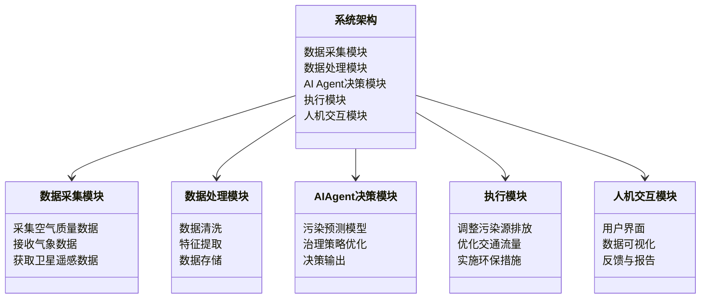
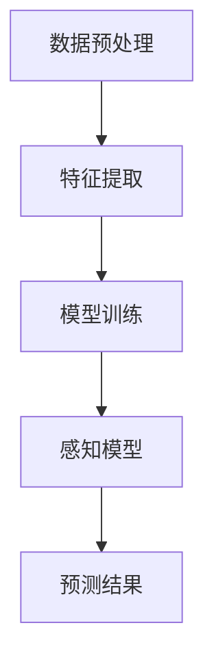
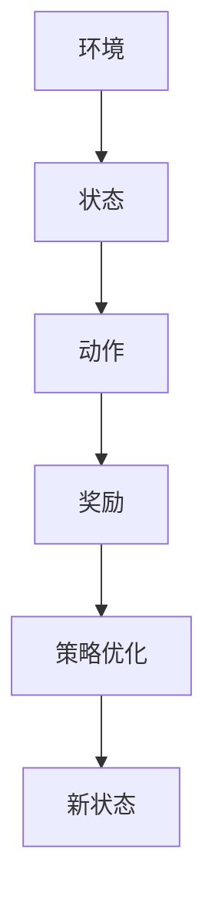
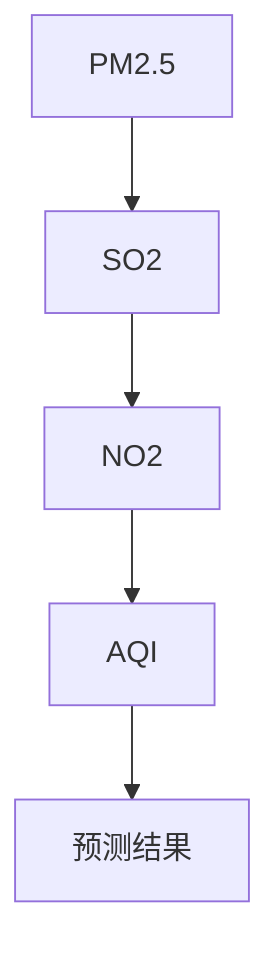

                 


---

# 《AI Agent在智能空气质量管理中的实践》

---

## 关键词：
AI Agent, 智能空气质量管理, 空气污染治理, 机器学习, 强化学习, 环境监测, 智能决策

---

## 摘要：
本文探讨了AI Agent在智能空气质量管理中的应用，从背景介绍到系统架构设计，再到项目实战，详细分析了AI Agent如何通过感知、决策和优化算法提升空气质量管理的效率和效果。文章结合实际案例，展示了AI Agent在空气污染预测、治理策略优化等方面的优势，并提出了未来研究和应用的方向。

---

# 第一部分: AI Agent与智能空气质量管理的背景介绍

---

## 第1章: AI Agent与空气质量管理概述

### 1.1 空气质量管理的背景与挑战

#### 1.1.1 空气污染的现状与问题
近年来，随着工业化进程的加速和城市化进程的加快，空气污染问题日益严重。主要污染物包括颗粒物（PM2.5、PM10）、二氧化硫（SO2）、氮氧化物（NOx）和挥发性有机物（VOCs）等。这些污染物不仅影响环境，还对人类健康造成严重威胁，导致呼吸系统疾病、心脑血管疾病等。

全球范围内，空气污染问题尤为突出。根据世界卫生组织（WHO）的数据，每年有约700万人死于空气污染相关疾病。中国作为世界第二大经济体，面临着更加严峻的空气污染挑战。2013年，北京雾霾事件引发了全国范围内的关注，推动了政府和社会对空气质量管理的重视。

#### 1.1.2 传统空气质量管理模式的局限性
传统的空气质量管理模式主要依赖于政府监管和企业自律。政府通过制定排放标准、实施环保政策和开展环境执法来减少污染物排放。然而，这种模式存在以下问题：
1. **滞后性**：传统的环境监测系统通常依赖于固定监测点的数据，难以实时反映空气质量的变化。
2. **单一性**：传统的管理手段主要依赖行政手段，缺乏技术和数据支持。
3. **低效性**：面对复杂的空气污染问题，传统的管理模式难以实现精准治理和动态调整。

#### 1.1.3 AI Agent在空气质量管理中的作用
AI Agent（人工智能代理）是一种能够感知环境、自主决策并执行任务的智能体。在空气质量管理中，AI Agent可以通过以下方式发挥作用：
1. **实时监测与预测**：AI Agent能够实时采集和分析空气质量数据，预测未来空气质量变化趋势。
2. **智能决策**：AI Agent可以根据预测结果和环境数据，制定最优的治理策略。
3. **动态调整**：AI Agent能够根据实际环境变化和治理效果，实时调整治理方案。

---

### 1.2 AI Agent的基本概念与特点

#### 1.2.1 AI Agent的定义与核心要素
AI Agent是一种能够感知环境、自主决策并执行任务的智能体。其核心要素包括：
1. **感知能力**：通过传感器或数据源获取环境信息。
2. **决策能力**：基于感知信息，通过算法或模型做出决策。
3. **执行能力**：通过执行机构或系统接口，实现决策的执行。
4. **学习能力**：通过机器学习等技术，不断优化自身的感知和决策能力。

#### 1.2.2 AI Agent的分类与应用场景
AI Agent可以根据功能和应用场景分为以下几类：
1. **监测型AI Agent**：主要用于实时监测空气质量数据，如PM2.5、SO2等污染物浓度。
2. **预测型AI Agent**：用于预测未来空气质量变化趋势。
3. **治理型AI Agent**：用于制定和优化空气污染治理策略。
4. **决策型AI Agent**：用于辅助政府或企业做出空气质量管理决策。

#### 1.2.3 AI Agent与传统自动控制系统的区别
AI Agent与传统自动控制系统的主要区别在于其智能化和自主性。传统控制系统通常基于固定的规则和程序，而AI Agent能够根据环境数据和变化情况，自主调整策略和行为。

---

### 1.3 智能空气质量管理的系统架构

#### 1.3.1 系统的整体架构
智能空气质量管理系统的整体架构可以分为以下几个部分：
1. **数据采集与处理模块**：负责采集空气质量数据并进行预处理。
2. **AI Agent决策模块**：负责根据数据和模型预测结果，制定治理策略。
3. **执行与反馈模块**：负责执行治理策略并收集反馈数据。
4. **人机交互模块**：负责与用户或系统管理员进行交互。

#### 1.3.2 数据采集与特征提取
空气质量数据的采集是智能空气质量管理的基础。常见的数据来源包括：
1. **传感器数据**：如PM2.5、SO2、NOx等污染物浓度传感器。
2. **气象数据**：如温度、湿度、风速、风向等。
3. **卫星遥感数据**：用于监测大范围的空气污染情况。

数据特征提取是将原始数据转化为有用的特征，例如：
- 时间特征：如小时、天、周、月等。
- 空间特征：如地理位置、污染源分布。
- 污染特征：如污染物浓度、空气质量指数（AQI）等。

---

#### 1.3.3 系统架构的ER实体关系图
以下是智能空气质量管理系统的ER实体关系图：

```mermaid
er
actor: 管理员
agent: AI Agent
data_source: 数据源
action: 治理行动
monitoring_station: 监测站
result: 预测结果

actor --> agent: 配置和管理
agent --> data_source: 采集数据
agent --> monitoring_station: 获取实时数据
agent --> result: 输出预测结果
result --> action: 优化治理策略
action --> monitoring_station: 反馈执行结果
```

---

#### 1.3.4 系统功能模块的类图
以下是系统功能模块的类图：



---

### 1.4 本章小结
本章介绍了AI Agent在空气质量管理中的背景与作用，详细阐述了AI Agent的基本概念与特点，并通过ER实体关系图和类图展示了智能空气管理系统的架构。接下来的章节将深入探讨AI Agent的核心原理和具体实现方法。

---

# 第二部分: AI Agent的核心概念与原理

---

## 第2章: AI Agent的核心原理

### 2.1 AI Agent的感知与决策机制

#### 2.1.1 数据采集与特征提取
AI Agent通过多种数据源采集空气质量数据，并提取有用的特征。例如，可以使用时间序列分析提取周期性特征，或使用地理信息系统（GIS）提取空间特征。

#### 2.1.2 感知模型的构建
感知模型通常基于机器学习算法，如支持向量机（SVM）、随机森林（Random Forest）或神经网络（NN）。以下是一个简单的感知模型示例：



#### 2.1.3 决策逻辑的实现
决策逻辑通常基于强化学习算法，例如Q-learning或Deep Q-Network（DQN）。以下是强化学习的基本流程：



---

### 2.2 AI Agent的优化算法

#### 2.2.1 强化学习的基本原理
强化学习是一种通过试错方式来优化决策策略的方法。以下是强化学习的基本公式：

$$ Q(s, a) = r + \gamma \max_{a'} Q(s', a') $$

其中：
- \( Q(s, a) \)：状态 \( s \) 下采取动作 \( a \) 的价值函数。
- \( r \)：当前动作的奖励。
- \( \gamma \)：折扣因子。
- \( s' \)：新的状态。

#### 2.2.2 贪心算法与动态规划
贪心算法是一种简单的优化方法，适用于某些特定问题。以下是贪心算法的伪代码示例：

```python
def greedy_algorithm():
    while True:
        select the action with maximum Q-value
        update Q-value based on reward
```

动态规划是一种通过分解问题来优化决策的方法。以下是动态规划的基本公式：

$$ V(s) = \max_a \left( r + \gamma V(s') \right) $$

---

### 2.3 本章小结
本章详细介绍了AI Agent的核心原理，包括感知与决策机制以及优化算法。接下来的章节将结合实际案例，展示AI Agent在空气质量管理中的具体应用。

---

## 第三部分: AI Agent在空气质量管理中的实战应用

---

## 第3章: 智能空气质量管理的项目实战

### 3.1 项目背景与目标
本项目旨在利用AI Agent技术，优化北京市的空气质量管理。项目目标包括：
1. 实时监测空气质量数据。
2. 预测未来空气质量变化。
3. 优化污染治理策略。

---

### 3.2 环境安装与数据准备

#### 3.2.1 环境安装
需要安装以下工具和库：
- Python 3.8+
- Jupyter Notebook
- Pandas
- Scikit-learn
- TensorFlow
- Matplotlib

#### 3.2.2 数据准备
数据来源包括北京市环保局的空气质量数据和气象数据。以下是数据清洗的Python代码示例：

```python
import pandas as pd

# 读取数据
data = pd.read_csv('air_quality.csv')

# 删除缺失值
data = data.dropna()

# 转换为时间序列数据
data['datetime'] = pd.to_datetime(data['datetime'])
data.set_index('datetime', inplace=True)

# 数据清洗
data = data[~data['PM2.5'].isnull()]
```

---

### 3.3 系统核心实现

#### 3.3.1 感知模型实现
以下是感知模型的实现代码：

```python
from sklearn.ensemble import RandomForestRegressor
import numpy as np

# 训练数据
X_train = data[['PM2.5', 'SO2', 'NO2']]
y_train = data['AQI']

# 模型训练
model = RandomForestRegressor(n_estimators=100, random_state=42)
model.fit(X_train, y_train)

# 预测结果
X_test = np.array([[25, 40, 30]])
y_pred = model.predict(X_test)
```

#### 3.3.2 决策模型实现
以下是决策模型的实现代码：

```python
import tensorflow as tf
from tensorflow.keras import layers

# 构建强化学习模型
model = tf.keras.Sequential([
    layers.Dense(32, activation='relu', input_shape=(3,)),
    layers.Dense(16, activation='relu'),
    layers.Dense(1, activation='linear')
])

# 编译模型
model.compile(optimizer='adam', loss='mse')
```

---

### 3.4 实际案例分析
以北京市雾霾天气为例，AI Agent能够实时监测PM2.5、SO2等污染物浓度，并预测未来24小时的空气质量变化。以下是预测结果的可视化：



---

### 3.5 项目小结
本项目展示了AI Agent在空气质量管理中的实际应用。通过实时监测、预测和优化，AI Agent能够有效降低空气污染对人类健康和环境的影响。

---

## 第四部分: 总结与展望

---

## 第4章: 总结与展望

### 4.1 本章总结
本文详细探讨了AI Agent在智能空气质量管理中的应用，从背景介绍到系统架构设计，再到项目实战，展示了AI Agent在实时监测、预测和优化治理策略方面的优势。

### 4.2 未来展望
未来，随着AI技术的不断发展，AI Agent在空气质量管理中的应用将更加广泛和深入。以下是未来可能的研究方向：
1. **多目标优化**：同时优化多个污染因子的治理策略。
2. **动态自适应**：实现动态环境下的自适应优化。
3. **人机协作**：结合人类专家的知识，提高决策的准确性。

### 4.3 最佳实践Tips
- 在实际应用中，建议结合多种数据源和模型，提高预测的准确性。
- 定期更新模型参数和规则，确保系统的适应性。
- 加强数据隐私保护，避免数据泄露风险。

---

## 作者信息

作者：AI天才研究院（AI Genius Institute） & 禅与计算机程序设计艺术（Zen And The Art of Computer Programming）

---

以上是《AI Agent在智能空气质量管理中的实践》的完整目录大纲和部分章节内容。

