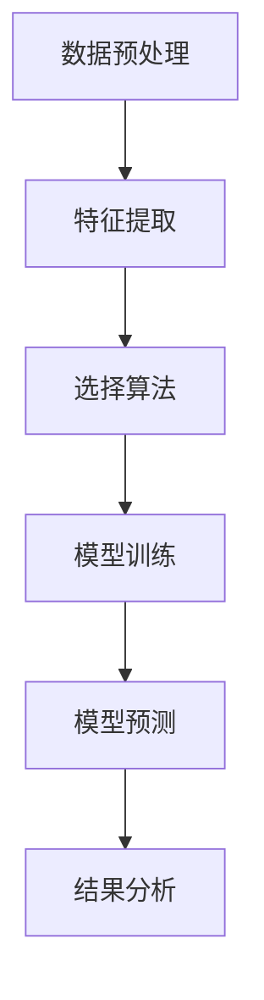
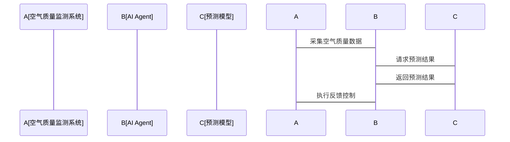

                 


# AI Agent在智能空气质量预测中的实践

> 关键词：AI Agent，空气质量预测，机器学习，环境监测，智能系统

> 摘要：本文探讨了AI Agent在空气质量预测中的应用，从背景、算法原理、系统架构到项目实战，全面分析了如何利用AI技术提升空气质量预测的准确性和实时性，实现智能监测与决策。

---

## 第一部分: AI Agent与空气质量预测的背景与概念

### 第1章: 空气质量预测的背景与挑战

#### 1.1 空气质量预测的重要性
空气质量是影响人类健康和环境的重要因素。随着工业化和城市化的快速发展，空气污染问题日益严重。准确的空气质量预测可以帮助政府制定有效的环保政策，帮助公众做好健康防护措施。传统的空气质量预测方法依赖于物理模型，存在计算复杂、实时性差的问题。

#### 1.2 AI Agent的基本概念
AI Agent（智能代理）是指能够感知环境、自主决策并采取行动的智能实体。AI Agent具有自主性、反应性和目标导向性，能够通过传感器获取数据，利用算法进行分析，并根据结果执行相应的操作。

#### 1.3 AI Agent与空气质量预测的结合
空气质量预测需要实时监测和分析多种环境因素，如温度、湿度、风速、污染物浓度等。AI Agent可以通过传感器实时采集数据，结合机器学习算法，快速生成预测结果，并根据预测结果采取相应的控制措施。

---

### 第2章: 核心概念与联系

#### 2.1 空气质量预测的核心原理
空气质量预测通常基于多源数据，如气象数据、污染物排放数据、历史监测数据等。通过建立数学模型，预测未来某一时刻的空气质量指数（AQI）。常用的模型包括支持向量机（SVM）、神经网络（NN）和随机森林（RF）等。

#### 2.2 AI Agent的核心特征
AI Agent在空气质量预测中的作用包括数据采集、特征提取、模型训练和结果反馈。AI Agent能够实时采集空气质量数据，利用机器学习算法进行预测，并根据预测结果优化监测网络。

#### 2.3 核心概念属性对比表

| 概念       | 属性                           |
|------------|--------------------------------|
| 空气质量预测 | 数据驱动、实时性、准确性         |
| AI Agent    | 自主性、反应性、目标导向性       |

#### 2.4 ER实体关系图

```mermaid
erd
  entity AirQualityPrediction {
    - 测量数据 (测量值)
    - 时间戳 (timestamp)
    - 地理位置 (longitude, latitude)
    - 预测结果 (预测值)
    - 模型参数 (参数值)
  }
  entity AirQualityAgent {
    - 感知数据 (传感器数据)
    - 决策逻辑 (规则)
    - 执行动作 (反馈控制)
    - 通信接口 (API)
  }
```

---

## 第二部分: 算法原理与数学模型

### 第4章: 支持向量机与神经网络在空气质量预测中的应用

#### 4.1 支持向量机原理
支持向量机（SVM）是一种监督学习算法，常用于分类和回归问题。在空气质量预测中，SVM可以用于预测AQI的分类。SVM的目标是找到一个超平面，使得训练数据中的正类和负类数据点被正确分类。

- **数学模型**
  $$ \text{目标函数: } \min_{w,b,\xi} \frac{1}{2}||w||^2 + C\sum_{i=1}^n \xi_i $$
  $$ \text{约束条件: } y_i(w \cdot x_i + b) \geq 1 - \xi_i $$
  $$ \xi_i \geq 0 $$

- **优点**：适用于小样本数据，泛化能力强。

#### 4.2 神经网络原理
神经网络（NN）是一种非线性回归模型，能够捕捉复杂的特征关系。在空气质量预测中，多层感知机（MLP）可以用于预测AQI的数值。

- **网络结构**
  - 输入层：空气质量相关特征（如污染物浓度、气象参数）。
  - 隐藏层：多层神经网络，提取非线性特征。
  - 输出层：AQI预测值。

- **训练过程**
  使用反向传播算法（Backpropagation）和梯度下降法（SGD）优化权重参数。

#### 4.3 算法流程图



---

## 第三部分: 系统架构设计

### 第5章: 系统架构与交互流程

#### 5.1 系统功能设计
系统包括数据采集模块、特征提取模块、模型训练模块、预测模块和反馈控制模块。

#### 5.2 系统架构设计


#### 5.3 系统交互流程图



---

## 第四部分: 项目实战

### 第6章: 项目实战与代码实现

#### 6.1 环境搭建
- 安装Python、NumPy、Scikit-learn、Keras等库。

#### 6.2 数据集准备
使用公开的空气质量数据集，如美国环保局（ EPA ）的数据。

#### 6.3 特征工程
- 数据清洗：处理缺失值、异常值。
- 特征选择：选择对AQI影响较大的特征，如PM2.5、SO2、NO2等。

#### 6.4 模型实现

```python
# 支持向量机模型实现
from sklearn.svm import SVC
from sklearn.metrics import accuracy_score

# 数据预处理
X = ...  # 特征矩阵
y = ...  # 标签向量

# 模型训练
model = SVC()
model.fit(X_train, y_train)

# 模型预测
y_pred = model.predict(X_test)
print("准确率:", accuracy_score(y_test, y_pred))
```

#### 6.5 模型部署
使用Flask框架搭建一个Web服务，提供API接口，供其他系统调用。

#### 6.6 代码实现流程图


---

## 第五部分: 总结与展望

### 第7章: 总结与展望

#### 7.1 项目总结
本文通过AI Agent结合机器学习算法，实现了智能空气质量预测系统。系统能够实时采集数据，快速生成预测结果，并提供反馈控制。

#### 7.2 未来展望
未来的研究方向包括：
- 更高效的特征提取方法。
- 更精准的预测模型，如深度学习模型（LSTM、Transformer）。
- 多源数据融合，提高预测的准确性和实时性。

---

## 附录

### 附录A: 参考文献

1. Bishop, C. M. (2006). Pattern Recognition and Machine Learning.
2. Hastie, T., Tibshirani, R., & Friedman, J. (2009). The Elements of Statistical Learning.

### 附录B: 工具与库

- Python
- NumPy
- Scikit-learn
- Keras
- Flask

---

作者：AI天才研究院/AI Genius Institute & 禅与计算机程序设计艺术 /Zen And The Art of Computer Programming

