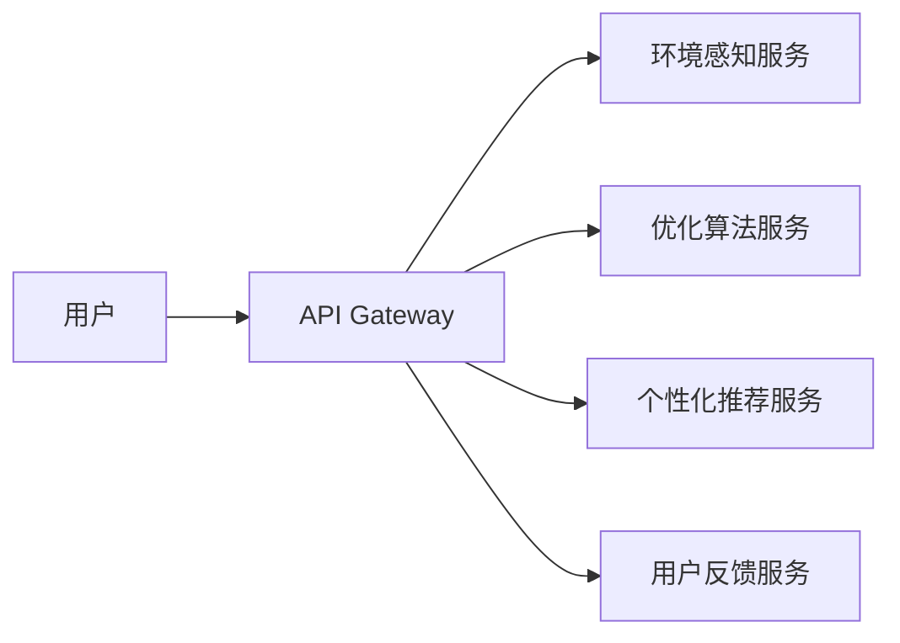
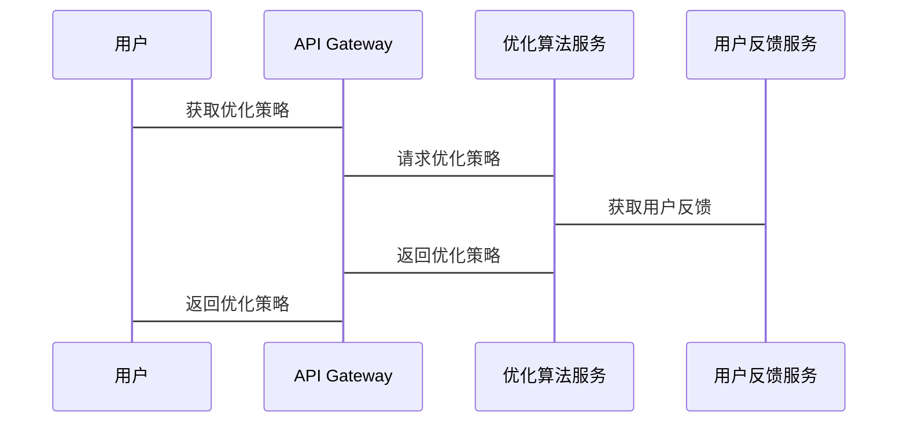

                 


```markdown
# AI Agent在智能空调中的个性化舒适度优化

> 关键词：AI Agent, 智能空调, 个性化舒适度, 优化算法, 系统架构, 项目实战, 最佳实践

> 摘要：本文深入探讨了AI Agent在智能空调中的应用，特别是在个性化舒适度优化方面的技术实现与创新。通过分析AI Agent的核心概念、优化算法原理、系统架构设计以及实际项目案例，全面展示了如何利用AI技术提升智能空调的用户体验。文章内容丰富，结构清晰，旨在为技术开发者和研究人员提供有价值的参考。

---

## 第1章: AI Agent与智能空调概述

### 1.1 AI Agent的基本概念
#### 1.1.1 AI Agent的定义与特点
- AI Agent的定义
- AI Agent的主要特点：自主性、反应性、目标导向、社会性
- AI Agent与传统算法的区别

#### 1.1.2 AI Agent在智能空调中的应用背景
- 智能空调的发展需求
- AI Agent在智能空调中的应用场景
- 个性化舒适度优化的必要性

### 1.2 智能空调的发展历程
#### 1.2.1 传统空调的工作原理
- 传统空调的基本结构
- 传统空调的控制方式
- 传统空调的局限性

#### 1.2.2 智能空调的定义与分类
- 智能空调的定义
- 智能空调的分类：根据功能、技术、应用场景
- 智能空调的发展趋势

---

## 第2章: 个性化舒适度优化的背景与问题描述

### 2.1 用户舒适度需求的多样性
#### 2.1.1 不同用户的舒适度需求差异
- 不同人群对温度、湿度、空气质量的需求差异
- 不同环境条件下的舒适度变化
- 舒适度优化的目标与挑战

#### 2.1.2 不同环境条件下的舒适度变化
- 室内环境参数对舒适度的影响
- 时间、地点、季节对舒适度的影响
- 用户行为模式对舒适度的影响

### 2.2 AI Agent在舒适度优化中的作用
#### 2.2.1 AI Agent如何感知用户需求
- 多模态数据采集与分析
- 用户行为模式识别
- 个性化需求预测

#### 2.2.2 AI Agent如何优化空调运行策略
- 基于历史数据的优化策略
- 基于实时数据的动态调整
- 基于用户反馈的自适应优化

#### 2.2.3 AI Agent如何实现个性化舒适度
- 个性化舒适度模型的构建
- 个性化控制策略的设计与实现
- 用户反馈的实时响应与优化

---

## 第3章: AI Agent在智能空调中的核心概念与联系

### 3.1 AI Agent的核心概念原理
#### 3.1.1 感知层: 数据采集与特征提取
- 数据采集方式：传感器、用户输入、环境数据
- 特征提取方法：基于机器学习的特征提取、统计特征、时间序列特征

#### 3.1.2 决策层: 优化算法与策略生成
- 常见优化算法：遗传算法、模拟退火、粒子群优化
- 策略生成方法：基于规则的策略、基于模型的策略、基于强化学习的策略

#### 3.1.3 执行层: 空调控制与反馈机制
- 空调控制方式：直接控制、间接控制、智能控制
- 反馈机制设计：实时反馈、延迟反馈、用户反馈

### 3.2 核心概念属性特征对比表格
| 概念       | 感知层属性 | 决策层属性 | 执行层属性 |
|------------|------------|------------|------------|
| 数据采集   | 实时性      | 可行性      | 可控性      |
| 特征提取   | 有效性      | 优化性      | 反馈性      |
| 优化策略   | 精准性      | 可解释性     | 稳定性      |

### 3.3 ER实体关系图


---

## 第4章: AI Agent的优化算法原理

### 4.1 优化算法概述
#### 4.1.1 常见优化算法介绍
- 遗传算法：编码、选择、交叉、变异
- 模拟退火：降温过程、状态转移
- 粒子群优化：粒子运动、全局最优与局部最优

#### 4.1.2 AI Agent优化算法的选择依据
- 算法的计算复杂度
- 算法的收敛速度
- 算法的可解释性

### 4.2 基于强化学习的优化算法
#### 4.2.1 强化学习的基本原理
- 状态、动作、奖励的定义
- Q-learning算法的基本流程
- 策略的更新与优化

#### 4.2.2 强化学习在舒适度优化中的应用
- 状态空间的构建：温度、湿度、空气质量
- 动作空间的设计：空调运行模式、风速调节
- 奖励函数的定义：舒适度提升、能耗降低

### 4.3 优化算法的数学模型
#### 4.3.1 基于回归分析的舒适度预测模型
$$ y = \beta_0 + \beta_1x_1 + \beta_2x_2 + \dots + \beta_nx_n + \epsilon $$
其中，$y$是舒适度评分，$x_i$是环境参数，$\beta_i$是回归系数，$\epsilon$是误差项。

#### 4.3.2 基于聚类分析的用户行为模式识别
$$ \text{目标函数} = \sum_{i=1}^k \sum_{j=1}^n w_{ij}d_{ij} $$
其中，$w_{ij}$是样本i属于簇j的概率，$d_{ij}$是样本i到簇j中心的距离。

---

## 第5章: 系统分析与架构设计方案

### 5.1 系统功能设计
#### 5.1.1 系统功能模块划分
- 环境感知模块：温度、湿度、空气质量传感器
- 优化算法模块：舒适度预测、策略生成
- 个性化推荐模块：用户偏好、历史数据分析
- 用户反馈模块：实时反馈、满意度评分

#### 5.1.2 功能模块的交互流程
1. 环境感知模块采集实时环境数据
2. 优化算法模块基于历史数据生成舒适度预测
3. 个性化推荐模块结合用户偏好生成控制策略
4. 用户反馈模块收集用户满意度评分并优化模型

### 5.2 系统架构设计
#### 5.2.1 微服务架构设计


#### 5.2.2 系统架构的扩展性设计
- 微服务的可扩展性：按需扩展各个服务
- 数据存储的高可用性：使用分布式数据库
- 系统接口的标准化：RESTful API、GraphQL

### 5.3 系统接口设计
#### 5.3.1 API接口定义
- 数据采集接口：`/api/sensors`
- 优化策略接口：`/api/optimization`
- 用户反馈接口：`/api/feedback`

#### 5.3.2 接口交互流程图


---

## 第6章: 项目实战

### 6.1 环境安装与配置
#### 6.1.1 安装Python环境
- 安装Python 3.8以上版本
- 安装必要的库：TensorFlow、Keras、Scikit-learn

#### 6.1.2 安装TensorFlow与Keras
- 使用pip安装：`pip install tensorflow keras`
- 验证安装：运行简单的模型训练脚本

### 6.2 核心代码实现
#### 6.2.1 数据采集与预处理
```python
import pandas as pd
import numpy as np

# 读取数据
data = pd.read_csv('comfort_data.csv')

# 数据清洗
data = data.dropna()
data = (data - data.mean()) / data.std()
```

#### 6.2.2 模型训练与优化
```python
from tensorflow.keras import layers

# 构建模型
model = keras.Sequential([
    layers.Dense(64, activation='relu'),
    layers.Dense(1, activation='linear')
])

# 编译模型
model.compile(optimizer='adam', loss='mean_squared_error')

# 训练模型
model.fit(X_train, y_train, epochs=100, batch_size=32)
```

#### 6.2.3 模型评估与优化
```python
# 评估模型
loss = model.evaluate(X_test, y_test)
print(f'测试损失: {loss}')

# 模型优化：调整学习率、改变网络结构、增加正则化
```

### 6.3 实际案例分析
#### 6.3.1 案例背景
- 用户群体：不同年龄段、职业、生活习惯的用户
- 环境条件：不同地区、季节、天气

#### 6.3.2 案例分析
- 不同用户群体的舒适度优化策略
- 不同环境条件下的优化效果对比
- 用户反馈的实时优化效果

### 6.4 项目经验总结
- 项目实施中的关键问题与解决方案
- 项目成果与实际应用价值
- 项目的可扩展性与未来优化方向

---

## 第7章: 最佳实践与小结

### 7.1 最佳实践
#### 7.1.1 AI Agent在智能空调中的最佳实践
- 数据采集的准确性与实时性
- 模型训练的高效性与可解释性
- 用户反馈的及时性与有效性

#### 7.1.2 系统设计中的注意事项
- 系统架构的可扩展性与可维护性
- 接口设计的标准化与安全性
- 数据存储的高可用性与安全性

### 7.2 项目小结
- 项目目标的实现情况
- 项目成果的总结与反思
- 项目对行业发展的意义

### 7.3 未来展望
- AI Agent在智能空调中的未来发展方向
- 新技术的应用前景：如边缘计算、联邦学习
- 个性化舒适度优化的进一步提升

---

## 作者

作者：AI天才研究院/AI Genius Institute & 禅与计算机程序设计艺术 /Zen And The Art of Computer Programming
```

