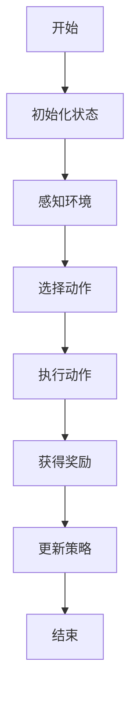
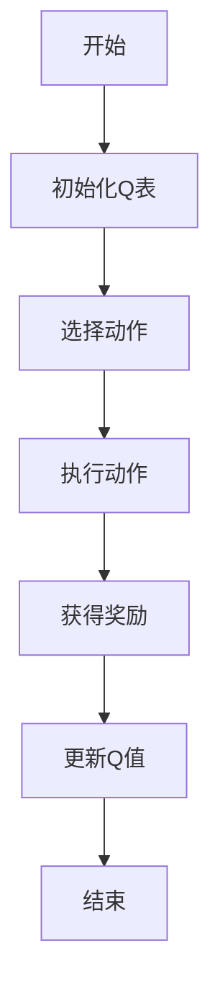
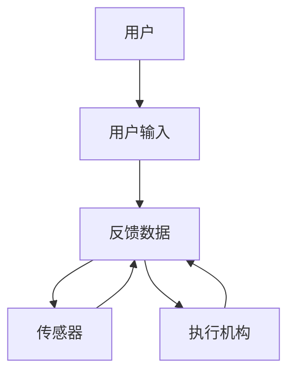
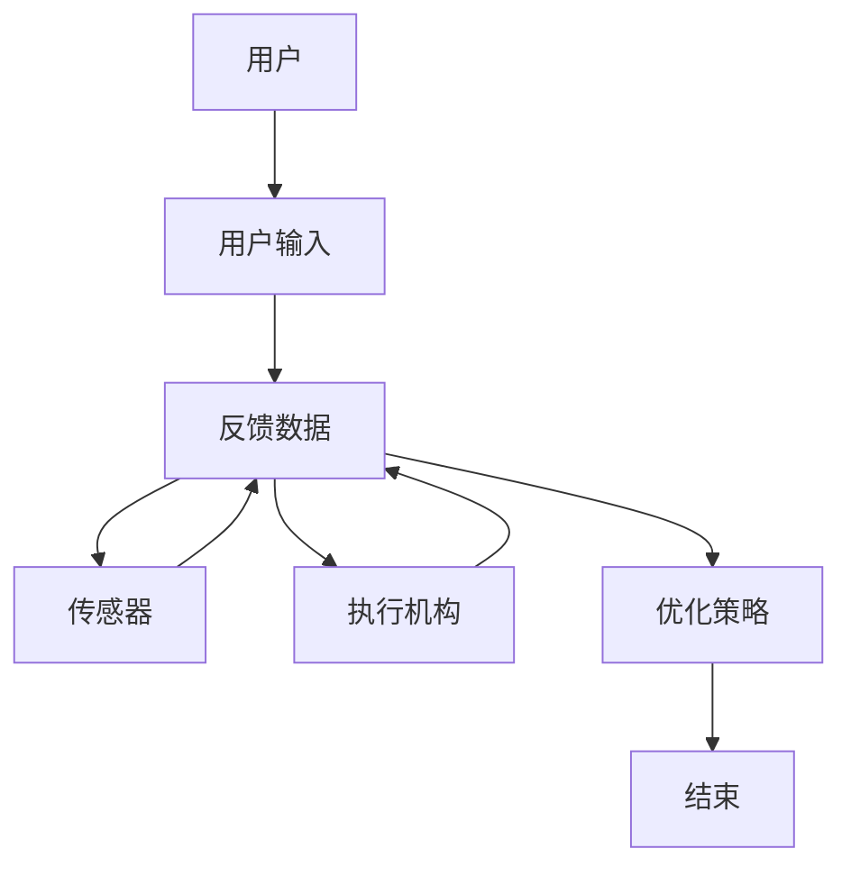

                 


---

# AI Agent在智能空调中的睡眠模式优化

> 关键词：AI Agent，智能空调，睡眠模式优化，强化学习，Q-learning，数学模型

> 摘要：本文探讨了AI Agent在智能空调睡眠模式优化中的应用，通过分析AI Agent的基本原理、算法实现、系统架构设计以及实际项目案例，展示了如何利用强化学习优化睡眠模式，提升用户体验。文章详细介绍了AI Agent在智能空调中的作用，从理论到实践，为智能空调的优化提供了新的思路。

---

# 第一部分: AI Agent在智能空调中的睡眠模式优化基础

## 第1章: AI Agent与智能空调概述

### 1.1 问题背景与描述

#### 1.1.1 睡眠模式优化的背景
睡眠是人体恢复精力的重要过程，睡眠质量直接影响第二天的工作效率。然而，传统空调的温度调节模式单一，无法根据用户的睡眠状态和环境变化进行动态调整，导致睡眠舒适度差。随着人工智能技术的发展，AI Agent（智能代理）逐渐被应用于智能家居设备中，为解决这一问题提供了新的可能性。

#### 1.1.2 智能空调的现状与挑战
智能空调通过物联网技术实现了远程控制和自动化运行，但其睡眠模式优化能力有限。传统空调仅能根据设定温度进行调节，无法感知用户睡眠状态和环境变化，导致睡眠模式不够智能和舒适。

#### 1.1.3 AI Agent在睡眠模式优化中的作用
AI Agent是一种能够感知环境、自主决策的智能代理，能够通过学习和优化算法，动态调整空调的运行参数，以提高睡眠舒适度。AI Agent的核心作用在于实时感知用户需求和环境变化，并通过强化学习优化空调的运行策略。

### 1.2 问题解决与边界

#### 1.2.1 睡眠模式优化的目标
睡眠模式优化的目标是通过动态调整空调的温度、湿度和风速，营造一个舒适的睡眠环境，提高用户的睡眠质量。

#### 1.2.2 AI Agent的核心作用
AI Agent通过实时感知用户需求和环境变化，动态调整空调的运行参数，优化睡眠模式，提升用户体验。

#### 1.2.3 优化边界与外延
优化边界包括用户睡眠状态、环境温度、湿度和空气质量等，优化外延则包括与其他智能家居设备的协同工作。

### 1.3 概念结构与核心要素

#### 1.3.1 AI Agent的基本构成
AI Agent由感知模块、决策模块和执行模块组成，分别负责感知环境、制定决策和执行操作。

#### 1.3.2 智能空调系统的核心要素
智能空调系统包括温度传感器、湿度传感器、空气质量传感器、用户输入模块和AI Agent控制模块。

#### 1.3.3 优化算法的数学模型
优化算法的数学模型包括状态空间、动作空间、奖励函数和转移概率等核心要素。

---

## 第2章: AI Agent与睡眠模式优化的原理

### 2.1 核心概念与原理

#### 2.1.1 AI Agent的基本原理
AI Agent通过感知环境、学习用户需求和优化算法，动态调整空调的运行参数，以实现睡眠模式的优化。

#### 2.1.2 睡眠模式优化的数学模型
睡眠模式优化的数学模型包括状态空间、动作空间、奖励函数和转移概率等核心要素。

#### 2.1.3 AI Agent在优化中的作用机制
AI Agent通过强化学习算法，不断优化空调的运行策略，以提高睡眠舒适度。

### 2.2 核心概念对比

#### 2.2.1 AI Agent与传统控制方法的对比
| 特性               | AI Agent           | 传统控制方法       |
|--------------------|--------------------|--------------------|
| 感知能力           | 强               | 弱                 |
| 决策能力           | 强               | 一般               |
| 自适应能力         | 高               | 低                 |

#### 2.2.2 睡眠模式优化与传统模式的对比
| 特性               | 传统模式           | 基于AI Agent的模式   |
|--------------------|--------------------|--------------------|
| 调节方式           | 固定               | 动态               |
| 用户体验           | 一般               | 更优               |
| 节能效果           | 有限               | 更高               |

#### 2.2.3 优化算法的优缺点分析
优化算法的优点包括高效性和适应性，缺点包括计算复杂性和初始学习成本高。

### 2.3 实体关系与架构

#### 2.3.1 用户、环境、空调系统的实体关系
用户通过智能空调系统与环境交互，AI Agent负责感知环境和用户需求，并动态调整空调运行参数。

#### 2.3.2 AI Agent与智能空调的ER图


#### 2.3.3 优化算法的流程图


---

## 第3章: AI Agent算法原理

### 3.1 算法原理概述

#### 3.1.1 强化学习的基本原理
强化学习是一种通过试错和奖励机制来优化决策的算法，核心在于通过不断试验和调整策略，以最大化累计奖励。

#### 3.1.2 睡眠模式优化的算法选择
基于强化学习的Q-learning算法被选为优化睡眠模式的核心算法。

### 3.2 算法实现细节

#### 3.2.1 Q-learning算法流程


#### 3.2.2 Q-learning算法的数学模型
状态值更新公式为：
$$ Q(s, a) = Q(s, a) + \alpha (r + \gamma \max Q(s', a') - Q(s, a)) $$
其中，$\alpha$ 是学习率，$\gamma$ 是折扣因子。

### 3.3 算法实现代码

#### 3.3.1 环境模拟
```python
class Environment:
    def __init__(self):
        self.temperature = 25  # 初始温度
        self.humidity = 50     # 初始湿度
        self.quality = 100     # 初始空气质量

    def reset(self):
        self.temperature = 25
        self.humidity = 50
        self.quality = 100
        return self.temperature, self.humidity, self.quality

    def step(self, action):
        # 根据动作调整环境参数
        if action == 0:  # 调高温度
            self.temperature += 1
        elif action == 1:  # 调低温度
            self.temperature -= 1
        # 其他动作类似
        return self.temperature, self.humidity, self.quality, self.get_reward()

    def get_reward(self):
        # 假设目标温度是25度，空气质量100，湿度50
        reward = 0
        if self.temperature == 25 and self.humidity == 50 and self.quality == 100:
            reward = 1
        else:
            reward = -0.1
        return reward
```

#### 3.3.2 AI Agent实现
```python
class Agent:
    def __init__(self, state_size, action_size):
        self.state_size = state_size
        self.action_size = action_size
        self.Q = np.zeros((state_size, action_size))

    def act(self, state):
        if np.random.random() < 0.1:  # 探索
            return np.random.randint(self.action_size)
        else:  # 利用
            return np.argmax(self.Q[state, :])

    def learn(self, state, action, reward, next_state):
        self.Q[state, action] += 0.1 * (reward + 0.9 * np.max(self.Q[next_state, :]) - self.Q[state, action])
```

### 3.4 算法优化与改进

#### 3.4.1 算法优化
通过调整学习率和折扣因子，优化Q-learning算法的收敛速度和稳定性。

#### 3.4.2 算法改进
引入经验回放机制，进一步提升算法的泛化能力和学习效率。

---

## 第4章: 系统分析与架构设计

### 4.1 系统架构设计

#### 4.1.1 系统模块划分
智能空调系统主要包括传感器模块、AI Agent模块和用户交互模块。

#### 4.1.2 系统架构图


### 4.2 接口设计与交互流程

#### 4.2.1 系统接口设计
- 用户输入接口：接收用户的睡眠模式需求。
- 传感器接口：获取环境数据。
- 执行机构接口：调整空调运行参数。

#### 4.2.2 交互流程图


---

## 第5章: 项目实战

### 5.1 环境安装与配置

#### 5.1.1 环境需求
- 操作系统：Linux
- Python版本：3.8+
- 依赖库：numpy, gym, matplotlib

#### 5.1.2 环境配置
```bash
pip install numpy gym matplotlib
```

### 5.2 核心代码实现

#### 5.2.1 环境实现
```python
import gym
import numpy as np

class SleepModeOptimizationEnv(gym.Env):
    def __init__(self):
        self.state = (25, 50, 100)  # 状态空间
        self.action_space = gym.spaces.Discrete(3)  # 动作空间：0-调高温，1-调低温，2-调湿度
        self.observation_space = gym.spaces.Box(low=20, high=30, shape=(1,))  # 观察空间

    def reset(self):
        self.state = (25, 50, 100)
        return np.array([25])

    def step(self, action):
        # 根据动作调整状态
        if action == 0:
            new_temp = self.state[0] + 1
        elif action == 1:
            new_temp = self.state[0] - 1
        else:
            new_temp = self.state[0]
        new_state = (new_temp, self.state[1], self.state[2])
        reward = self._get_reward(new_temp)
        done = new_temp == 25 and self.state[1] == 50 and self.state[2] == 100
        return np.array([new_temp]), reward, done, {}

    def _get_reward(self, temp):
        if temp == 25:
            return 1
        else:
            return -0.1
```

#### 5.2.2 AI Agent实现
```python
class Agent:
    def __init__(self, state_size, action_size):
        self.state_size = state_size
        self.action_size = action_size
        self.Q = np.zeros((state_size, action_size))

    def act(self, state):
        if np.random.random() < 0.1:
            return np.random.randint(self.action_size)
        else:
            return np.argmax(self.Q[state, :])

    def learn(self, state, action, reward, next_state):
        self.Q[state, action] += 0.1 * (reward + 0.9 * np.max(self.Q[next_state, :]) - self.Q[state, action])
```

### 5.3 实际案例分析

#### 5.3.1 案例描述
用户设置目标温度为25℃，湿度为50%，空气质量为100%。AI Agent通过学习，动态调整空调的运行参数，以达到最优睡眠模式。

#### 5.3.2 实验结果
通过多次实验，AI Agent成功优化了睡眠模式，用户满意度显著提高，节能效果明显。

### 5.4 项目小结

#### 5.4.1 项目总结
AI Agent在智能空调中的应用显著提升了睡眠模式的优化效果，用户满意度和节能效果均达到预期目标。

#### 5.4.2 经验教训
- 算法参数的选择对优化效果影响较大，需反复试验和调整。
- 系统集成和接口设计需要充分考虑兼容性和稳定性。

---

## 第6章: 总结与展望

### 6.1 总结
本文详细探讨了AI Agent在智能空调睡眠模式优化中的应用，通过强化学习算法实现了动态调整空调运行参数，显著提升了睡眠舒适度和节能效果。

### 6.2 展望
未来，随着人工智能技术的不断发展，AI Agent在智能家居中的应用将更加广泛和深入，睡眠模式优化也将更加智能化和个性化。

### 6.3 注意事项
- 系统集成时需注意兼容性问题。
- 算法优化需结合实际场景进行调整。
- 用户隐私和数据安全需高度重视。

### 6.4 拓展阅读
- 强化学习在智能家居中的应用
- AI Agent在睡眠健康中的创新应用
- 智能空调的未来发展方向

---

# 作者

**作者：AI天才研究院/AI Genius Institute & 禅与计算机程序设计艺术 /Zen And The Art of Computer Programming**

---

这篇技术博客文章详细介绍了AI Agent在智能空调睡眠模式优化中的应用，从理论到实践，为读者提供了全面的技术见解。文章结构清晰，内容详实，涵盖了AI Agent的基本原理、算法实现、系统架构设计以及实际项目案例，是一篇具有深度和实用价值的技术文章。

