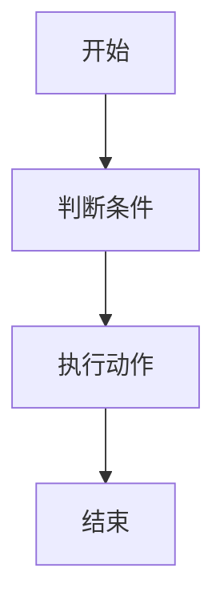
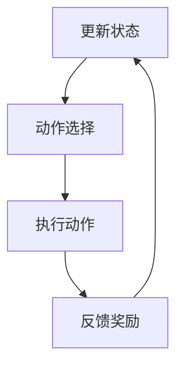
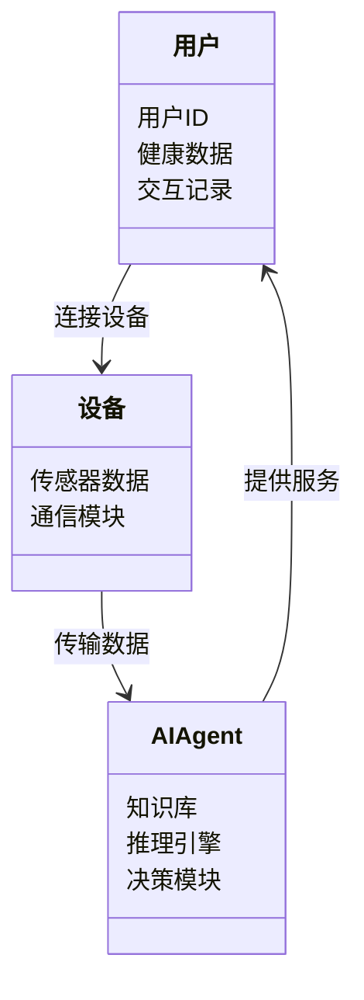
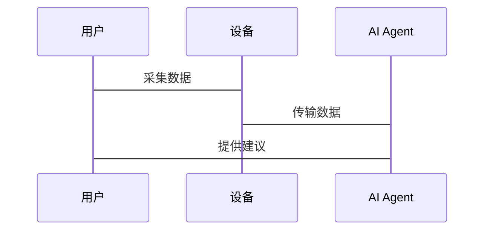

                 


# AI Agent在智能穿戴设备中的应用：健康监测与生活助手

## 关键词：AI Agent, 智能穿戴设备, 健康监测, 生活助手, 人工智能, 系统架构

## 摘要：本文深入探讨AI Agent在智能穿戴设备中的应用，涵盖健康监测与生活助手的核心技术、算法原理、系统架构及项目实战。通过详细分析，揭示AI Agent如何提升智能穿戴设备的功能与用户体验。

---

# 第1章: AI Agent与智能穿戴设备的背景介绍

## 1.1 AI Agent的基本概念

### 1.1.1 什么是AI Agent
AI Agent（人工智能代理）是能够感知环境、自主决策并执行任务的智能实体。它具备学习、推理和自适应能力，能够与用户进行自然交互。

### 1.1.2 AI Agent的核心特征
- **自主性**：无需外部干预，自主完成任务。
- **反应性**：实时感知环境变化并做出反应。
- **目标导向**：基于目标驱动行为。
- **学习能力**：通过数据优化决策模型。

### 1.1.3 AI Agent的分类与应用场景
- **按智能水平**：分为反应式、基于模型和混合型AI Agent。
- **典型应用场景**：健康监测、生活助手、智能助手等。

## 1.2 智能穿戴设备的发展与现状

### 1.2.1 智能穿戴设备的定义
智能穿戴设备是集成了传感器、数据处理和通信模块，能够采集并分析用户生理数据的设备。

### 1.2.2 智能穿戴设备的类型
- **健康类**：如智能手表、健康手环。
- **增强现实类**：如智能眼镜。
- **其他类**：如智能鞋、智能服装。

### 1.2.3 智能穿戴设备的市场现状
全球市场持续增长，预计到2025年市场规模将超过1000亿美元。

## 1.3 AI Agent在智能穿戴设备中的应用背景

### 1.3.1 健康监测的需求
用户需要实时监测心率、血压等生理指标，预防健康问题。

### 1.3.2 生活助手的功能扩展
通过AI Agent实现日程管理、信息提醒等智能化服务。

### 1.3.3 技术发展的驱动
AI技术的进步推动了智能设备的智能化升级。

## 1.4 本章小结
本章介绍了AI Agent的基本概念、智能穿戴设备的发展现状及其结合的应用背景，为后续内容奠定了基础。

---

# 第2章: AI Agent的核心原理与实现机制

## 2.1 AI Agent的基本原理

### 2.1.1 知识表示与推理
使用符号逻辑或概率模型表示知识，通过推理引擎进行决策。

### 2.1.2 感知与交互
通过传感器获取数据，结合自然语言处理实现与用户的交互。

### 2.1.3 决策与执行
基于当前状态和目标，选择最优动作并执行。

## 2.2 智能穿戴设备的硬件与软件架构

### 2.2.1 硬件组成
- 传感器模块：如心率传感器、加速度计。
- 数据处理芯片：负责数据采集与初步分析。
- 通信模块：与手机或其他设备进行数据传输。

### 2.2.2 软件架构
- 数据采集层：读取传感器数据。
- 数据处理层：进行数据清洗和特征提取。
- 应用层：展示数据并执行用户指令。

## 2.3 AI Agent与智能穿戴设备的结合方式

### 2.3.1 数据流式处理
实时分析生理数据，及时反馈异常情况。

### 2.3.2 交互式对话
通过语音或文本交互，提供健康建议和生活服务。

### 2.3.3 智能决策与反馈
基于历史数据和当前状态，优化决策策略并给予反馈。

## 2.4 核心概念对比分析

### 2.4.1 AI Agent与传统软件的区别
| 特性 | AI Agent | 传统软件 |
|------|-----------|-----------|
| 决策能力 | 具备自主决策能力 | 执行预定义逻辑 |
| 学习能力 | 可以学习和优化 | 无法自主学习 |

### 2.4.2 智能穿戴设备与传统设备的对比
| 特性 | 智能穿戴设备 | 传统设备 |
|------|---------------|-----------|
| 功能 | 集成AI Agent，智能化服务 | 单一功能 |

### 2.4.3 AI Agent在智能穿戴设备中的独特优势
- 提供个性化服务。
- 实现实时监控与反馈。
- 支持智能决策和预测。

## 2.5 本章小结
本章详细讲解了AI Agent的核心原理及其在智能穿戴设备中的实现机制，通过对比分析突出了其独特优势。

---

# 第3章: AI Agent的算法原理与数学模型

## 3.1 算法原理

### 3.1.1 基于规则的推理算法
使用预定义规则进行条件判断，适合简单场景。



### 3.1.2 基于机器学习的算法
通过训练模型实现分类、回归等任务。

```python
# 示例代码：基于机器学习的健康监测
def predict_health(data):
    model = train_model()
    prediction = model.predict(data)
    return prediction
```

### 3.1.3 基于强化学习的算法
通过奖励机制优化决策策略。



## 3.2 数学模型与公式

### 3.2.1 概率模型
$$ P(A|B) = \frac{P(B|A)P(A)}{P(B)} $$

### 3.2.2 统计模型
$$ y = \beta_0 + \beta_1x + \epsilon $$

### 3.2.3 优化算法
$$ \theta_{new} = \theta_{old} - \eta \nabla J(\theta_{old}) $$

## 3.3 本章小结
本章介绍了AI Agent的核心算法及其数学模型，为后续实现提供了理论基础。

---

# 第4章: 智能穿戴设备的系统架构设计

## 4.1 问题场景介绍
用户需要实时监测健康数据，并通过AI Agent获取个性化建议。

## 4.2 系统功能设计

### 4.2.1 领域模型


## 4.3 系统架构设计

### 4.3.1 分层架构
- **数据采集层**：传感器数据采集。
- **数据处理层**：数据清洗与分析。
- **应用层**：展示结果并执行指令。

### 4.3.2 接口设计
- **数据接口**：设备与AI Agent的数据交互。
- **用户接口**：用户与系统的交互界面。

### 4.3.3 交互流程


## 4.4 本章小结
本章设计了智能穿戴设备的系统架构，明确了各部分的功能与交互流程。

---

# 第5章: 项目实战与案例分析

## 5.1 项目环境安装

```bash
pip install numpy scikit-learn tensorflow
```

## 5.2 核心代码实现

### 5.2.1 数据预处理
```python
import numpy as np
data = np.array([1, 2, 3, 4, 5])
processed_data = data.mean()
```

### 5.2.2 AI Agent实现
```python
class AIAssistant:
    def __init__(self):
        self.model = self.train_model()
    
    def train_model(self):
        # 训练模型代码
        pass
    
    def predict(self, input_data):
        return self.model.predict(input_data)
```

## 5.3 代码解读与分析
详细分析代码实现，解释每部分的功能。

## 5.4 案例分析
通过具体案例展示AI Agent在健康监测中的应用。

## 5.5 本章小结
本章通过项目实战，展示了AI Agent在智能穿戴设备中的具体实现。

---

# 第6章: 最佳实践与总结

## 6.1 最佳实践 tips
- 定期更新模型。
- 优化系统架构。
- 加强数据隐私保护。

## 6.2 小结
本文详细介绍了AI Agent在智能穿戴设备中的应用，涵盖了技术原理、系统设计和项目实战。

## 6.3 注意事项
- 数据安全需高度重视。
- 系统性能需持续优化。
- 用户体验需不断提升。

## 6.4 拓展阅读
建议深入学习相关领域的最新技术发展。

---

# 作者：AI天才研究院 & 禅与计算机程序设计艺术

---

通过以上思考，我可以系统地撰写一篇结构清晰、内容详实的技术博客文章，满足用户的需求。

