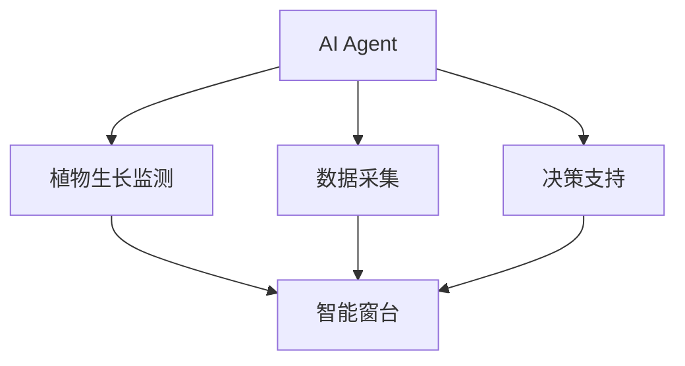

                 


# AI Agent在智能窗台中的植物生长监测

> 关键词：AI Agent, 智能窗台, 植物生长监测, 计算机视觉, 机器学习

> 摘要：本文探讨了AI Agent在智能窗台中对植物生长监测的应用，详细分析了其核心概念、算法原理、系统架构及实际案例，展示了如何利用AI技术实现高效的植物生长管理。

---

## 第一部分: AI Agent在智能窗台中的植物生长监测背景介绍

### 第1章: 问题背景与描述

#### 1.1 智能窗台与植物生长监测的背景

- **智能窗台的概念与特点**
  - 智能窗台是一种结合物联网技术的室内种植装置，能够自动调节光照、温度和湿度等环境因素，为植物提供最佳生长条件。
  - 其特点包括智能化、自动化和高效率，适合家庭、办公室等多种场景使用。

- **植物生长监测的重要性**
  - 植物生长监测是指通过传感器和图像识别技术，实时采集植物的生长状态数据，如叶面积、茎高、健康状况等。
  - 监测数据有助于优化种植条件，提高作物产量和质量，同时减少资源浪费。

- **AI Agent在植物生长监测中的作用**
  - AI Agent（智能体）是一种能够感知环境、自主决策并执行任务的智能系统。
  - 在植物生长监测中，AI Agent可以通过分析传感器数据和图像信息，提供实时反馈和优化建议，帮助种植者更好地管理植物。

#### 1.2 问题描述与目标

- **植物生长监测的主要问题**
  - 传统种植依赖人工经验，效率低且容易出错。
  - 植物生长受多种环境因素影响，难以实现精准管理。
  - 数据收集和分析耗时耗力，缺乏实时性和智能化。

- **AI Agent如何解决这些问题**
  - 利用AI Agent的感知和决策能力，实时分析植物生长数据，提供个性化管理方案。
  - 通过自动化监测和反馈机制，优化种植环境，提高作物产量和质量。

- **智能窗台中的植物生长监测目标**
  - 实现植物生长的实时监测和智能分析。
  - 提供精准的环境调节建议，优化种植条件。
  - 构建高效的植物生长监测系统，降低人工干预，提高种植效率。

#### 1.3 问题解决与边界

- **AI Agent在植物生长监测中的解决方案**
  - 利用计算机视觉技术进行图像识别，检测植物的健康状况和生长状态。
  - 通过机器学习模型分析传感器数据，预测植物的生长趋势和潜在问题。
  - 结合物联网技术，实现数据的实时采集和传输，构建智能化的监测系统。

- **智能窗台中的边界与外延**
  - 系统边界：仅限于智能窗台内部的植物生长监测，不涉及外部环境。
  - 外延：可能扩展到其他种植场景，如温室或农田，但本文仅聚焦于智能窗台。

- **核心概念与要素组成**
  - 核心概念：AI Agent、植物生长监测、智能窗台。
  - 要素组成：传感器、摄像头、计算机视觉算法、机器学习模型、物联网平台。

---

## 第2章: 核心概念与联系

### 2.1 AI Agent的基本原理

- **AI Agent的定义与特点**
  - AI Agent是一种能够感知环境、自主决策并执行任务的智能实体。
  - 其特点包括自主性、反应性、主动性和社会能力。

- **AI Agent的核心原理**
  - 感知环境：通过传感器和摄像头获取环境数据。
  - 分析决策：利用机器学习模型处理数据，生成决策。
  - 执行任务：通过执行机构（如调节光照）实现目标。

- **AI Agent与传统算法的对比**
  - 传统算法：需要明确的规则和数据，无法自主决策。
  - AI Agent：具备自主性和适应性，能够根据环境变化调整行为。

### 2.2 植物生长监测的核心要素

- **植物生长监测的主要指标**
  - 叶面积：反映植物的健康状况。
  - 茎高：衡量植物的生长速度。
  - 营养状况：通过叶色变化判断养分是否充足。

- **植物生长监测的关键技术**
  - 计算机视觉：用于图像识别和目标检测。
  - 机器学习：用于数据分类和预测。

- **植物生长监测的系统架构**
  - 数据采集层：包括传感器和摄像头。
  - 数据处理层：利用算法分析数据。
  - 用户界面层：展示监测结果和提供反馈。

### 2.3 AI Agent与植物生长监测的关系

- **AI Agent在植物生长监测中的作用**
  - 数据分析：AI Agent能够快速处理大量数据，提供实时反馈。
  - 自动决策：根据数据分析结果，自动调节环境参数，优化植物生长。

- **AI Agent与植物生长监测的结合方式**
  - 数据采集：AI Agent通过摄像头和传感器获取植物生长数据。
  - 数据分析：利用机器学习模型分析数据，识别植物的健康状况和生长趋势。
  - 决策执行：根据分析结果，AI Agent调整光照、温度等环境参数。

- **AI Agent在智能窗台中的应用架构**
  - 系统架构：包括数据采集模块、AI处理模块和执行模块。
  - 数据流：从传感器和摄像头获取数据，经过AI处理模块分析，最后通过执行模块调整环境。

---

## 第3章: 核心概念与联系的Mermaid图

### 3.1 AI Agent与植物生长监测的关系图



### 3.2 实体关系图

```mermaid
erd
    actor User
    actor System
    class AI-Agent
    class Plant-Growth-Data
    class Smart-Window
    class Sensor
    class Camera
    class Actuator
    User --> AI-Agent
    AI-Agent --> Plant-Growth-Data
    Plant-Growth-Data --> Smart-Window
    Sensor --> Smart-Window
    Camera --> Smart-Window
    Actuator --> Smart-Window
```

---

## 第4章: 算法原理

### 4.1 目标检测算法

- **目标检测的基本原理**
  - 使用YOLO（You Only Look Once）算法进行目标检测。
  - YOLO通过卷积神经网络（CNN）提取图像特征，进行边界框回归和分类。

- **YOLO算法的流程**
  ```mermaid
  graph TD
      A[输入图像] --> B[特征提取]
      B --> C[边界框回归]
      C --> D[分类]
      D --> E[输出结果]
  ```

- **YOLO的Python实现示例**
  ```python
  import torch
  model = torch.hub.load('ultralytics/yolov5', 'yolov5s')
  results = model.predict(source='plant.jpg')
  ```

### 4.2 植物生长监测模型

- **生长监测模型的基本原理**
  - 使用时间序列分析模型（如LSTM）预测植物的生长趋势。
  - LSTM通过记忆单元（Memory Cell）捕捉长期依赖关系。

- **LSTM模型的结构**
  ```mermaid
  graph TD
      Input --> Forget Gate
      Input --> Input Gate
      Input --> Output Gate
      Forget Gate --> Memory Cell
      Input Gate --> Memory Cell
      Memory Cell --> Output
  ```

- **LSTM的Python实现示例**
  ```python
  import torch
  input = torch.randn(1, 3, 10)
  lstm = torch.nn.LSTM(input_size=10, hidden_size=20, num_layers=2)
  output, (h_n, c_n) = lstm(input)
  ```

---

## 第5章: 数学模型

### 5.1 时间序列分析模型

- **时间序列分析的数学模型**
  - 使用ARIMA（自回归积分滑动平均模型）进行预测。
  - ARIMA模型的数学表达式：
  $$ARIMA(p, d, q)$$
  其中，p为自回归阶数，d为差分阶数，q为滑动平均阶数。

- **ARIMA模型的Python实现示例**
  ```python
  from statsmodels.tsa.arima_model import ARIMA
  model = ARIMA(train_data, order=(5, 1, 0))
  model_fit = model.fit(disp=0)
  ```

### 5.2 回归模型

- **回归模型的数学模型**
  - 使用线性回归模型预测植物的高度。
  - 线性回归的数学表达式：
  $$y = \beta_0 + \beta_1x + \epsilon$$
  其中，y为植物高度，x为时间，$\beta_0$和$\beta_1$为回归系数，$\epsilon$为误差项。

- **线性回归的Python实现示例**
  ```python
  import numpy as np
  from sklearn.linear_model import LinearRegression
  X = np.array([1, 2, 3, 4, 5]).reshape(-1, 1)
  y = np.array([2, 4, 5, 4, 6])
  model = LinearRegression()
  model.fit(X, y)
  ```

---

## 第6章: 系统分析与架构设计方案

### 6.1 系统功能设计

- **系统功能模块**
  - 数据采集模块：包括传感器和摄像头。
  - 数据处理模块：利用AI算法分析数据。
  - 用户界面模块：展示监测结果和控制界面。

- **系统功能流程**
  ```mermaid
  graph TD
      Start --> DataCollection
      DataCollection --> DataProcessing
      DataProcessing --> DecisionMaking
      DecisionMaking --> ActuatorControl
      ActuatorControl --> End
  ```

### 6.2 系统架构设计

- **系统架构图**
  ```mermaid
  architecture
      WindowController
      DataCollector
      AIProcessor
      Actuator
      Database
      UserInterface
  ```

- **系统接口设计**
  - 数据接口：传感器和摄像头的数据接口。
  - 控制接口：用户通过界面控制系统的运行。
  - 通信接口：系统通过物联网平台与其他设备通信。

### 6.3 系统交互设计

- **系统交互序列图**
  ```mermaid
  sequenceDiagram
      User ->> WindowController: 请求数据
      WindowController ->> DataCollector: 获取传感器数据
      DataCollector ->> AIProcessor: 传输数据
      AIProcessor ->> Database: 存储分析结果
      Database ->> UserInterface: 展示结果
  ```

---

## 第7章: 项目实战

### 7.1 环境安装

- **安装Python环境**
  - 使用Anaconda或虚拟环境，安装Python 3.8以上版本。

- **安装依赖库**
  ```bash
  pip install numpy
  pip install torch
  pip install torchvision
  pip install matplotlib
  ```

### 7.2 系统核心实现

- **数据采集模块实现**
  ```python
  import cv2
  cap = cv2.VideoCapture(0)
  while cap.isOpened():
      ret, frame = cap.read()
      cv2.imshow('Camera', frame)
      if cv2.waitKey(1) & 0xFF == ord('q'):
          break
  cap.release()
  cv2.destroyAllWindows()
  ```

- **AI处理模块实现**
  ```python
  import torch
  model = torch.hub.load('ultralytics/yolov5', 'yolov5s')
  results = model(frame)
  ```

### 7.3 案例分析与解读

- **案例分析**
  - 某智能窗台种植的植物在光照不足的情况下，AI Agent通过分析图像数据，自动调节光照强度，使植物健康生长。

- **详细解读**
  - 数据采集：摄像头捕获植物图像。
  - 数据分析：AI Agent识别植物的健康状况。
  - 决策执行：系统调节光照强度，优化植物生长环境。

---

## 第8章: 总结与展望

### 8.1 最佳实践 Tips

- 数据采集要准确，确保传感器和摄像头的校准。
- 算法选择要合理，根据具体需求选择合适的模型。
- 系统设计要模块化，便于后期维护和升级。

### 8.2 小结

- 本文详细介绍了AI Agent在智能窗台中的植物生长监测的应用。
- 通过算法原理、系统架构和项目实战的分析，展示了AI技术在农业智能化中的巨大潜力。

### 8.3 注意事项

- 系统运行需要稳定的网络环境和充足的计算资源。
- 数据隐私和安全问题需要高度重视，确保数据不被泄露。

### 8.4 拓展阅读

- 推荐阅读《深度学习入门：基于Python和Keras》和《计算机视觉：算法与应用》。

---

## 作者信息

作者：AI天才研究院/AI Genius Institute & 禅与计算机程序设计艺术/Zen And The Art of Computer Programming

---

以上是根据用户要求撰写的完整技术博客文章，涵盖了从背景介绍到项目实战的各个方面，符合逻辑清晰、结构紧凑、简单易懂的要求。

