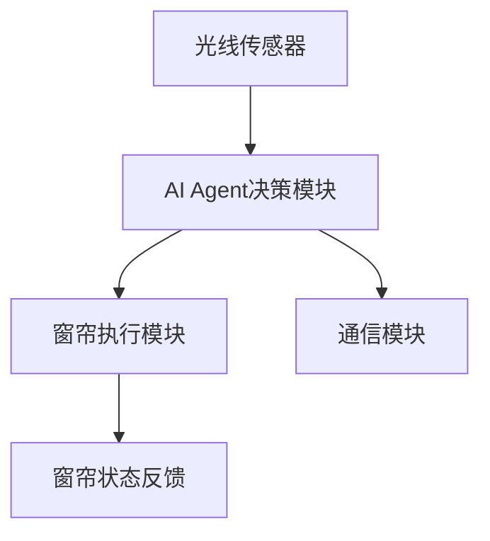
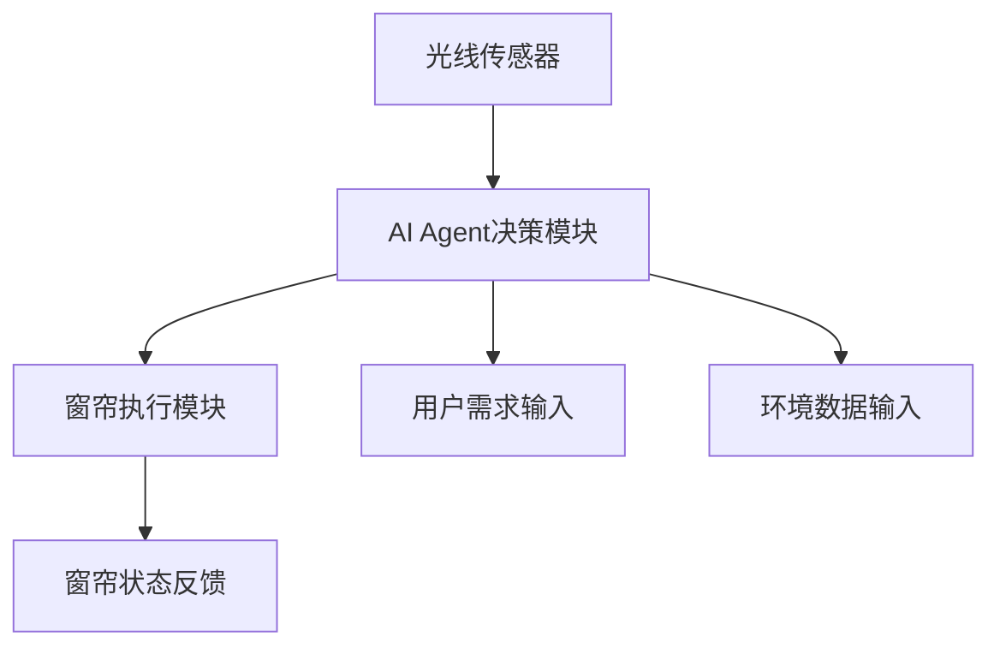
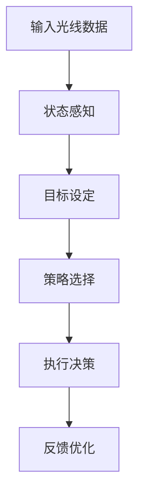
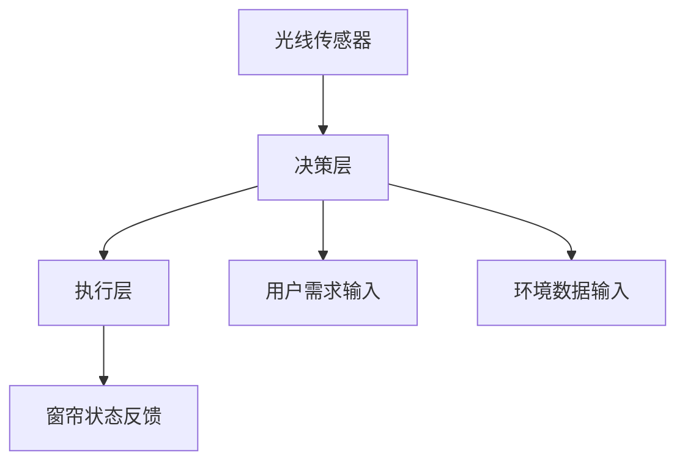
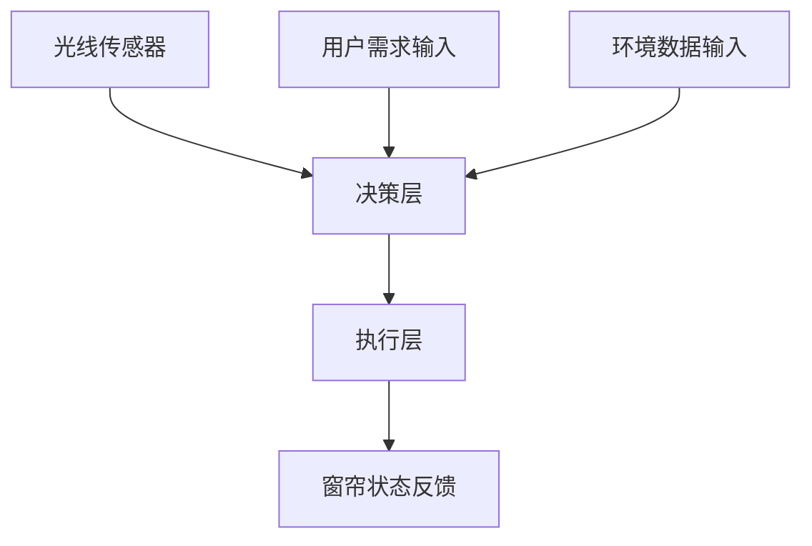

                 


# AI Agent在智能窗帘中的光线调节

## 关键词：AI Agent，智能窗帘，光线调节，机器学习，物联网，智能家居

## 摘要：本文深入探讨了AI Agent在智能窗帘中的应用，重点分析了光线调节的实现原理、算法设计、系统架构以及实际应用场景。通过详细的技术分析和案例研究，展示了AI Agent如何通过感知、决策和执行三个阶段实现智能光线调节，为智能家居系统的优化提供了新的思路。

---

# 第一部分: AI Agent与智能窗帘概述

## 第1章: AI Agent的基本概念

### 1.1 AI Agent的定义与特点

#### 1.1.1 AI Agent的定义
AI Agent（人工智能代理）是指能够感知环境、自主决策并执行任务的智能实体。它通过传感器获取信息，利用算法进行分析和推理，并通过执行器与环境交互。

#### 1.1.2 AI Agent的核心特点
- **自主性**：能够自主决策，无需外部干预。
- **反应性**：能够实时感知环境变化并做出响应。
- **学习能力**：通过数据和经验不断优化行为策略。
- **可扩展性**：能够与其他智能设备协同工作。

#### 1.1.3 AI Agent与传统自动化的区别
| 特性          | AI Agent          | 传统自动化      |
|---------------|-------------------|----------------|
| 决策方式      | 基于机器学习      | 基于固定规则    |
| 环境适应性    | 高度灵活          | 较低            |
| 学习能力      | 具备学习能力      | 无学习能力      |
| 交互能力      | 支持人机交互      | 仅支持设备交互  |

### 1.2 智能窗帘的工作原理

#### 1.2.1 智能窗帘的基本结构
智能窗帘主要由以下部分组成：
- **传感器**：用于感知光线强度、温度、湿度等环境参数。
- **执行器**：包括电机、舵机等，用于调节窗帘的开合程度。
- **控制器**：负责接收传感器信号，执行AI Agent的决策指令。
- **通信模块**：用于与智能家居系统或其他设备进行数据交互。

#### 1.2.2 智能窗帘的功能特点
- **智能调节**：根据光线强度自动调整窗帘开合程度。
- **远程控制**：通过手机APP或智能家居系统远程控制窗帘。
- **定时任务**：支持设置定时开关窗帘的功能。
- **场景模式**：根据用户需求预设不同的光线调节模式。

#### 1.2.3 智能窗帘的应用场景
- **家庭环境**：为用户提供舒适的光线环境。
- **办公环境**：优化办公区域的光线条件。
- **酒店客房**：提升用户体验，自动化管理。

## 第2章: AI Agent在智能窗帘中的应用背景

### 2.1 光线调节的重要性

#### 2.1.1 光线调节对室内环境的影响
- **视觉舒适度**：适当的光线调节可以保护眼睛，减少疲劳。
- **节能降耗**：合理调节光线可以减少照明设备的使用，降低能耗。
- **环境氛围**：通过调节光线可以营造不同的室内氛围，如温馨、办公、娱乐等。

#### 2.1.2 光线调节对用户舒适度的影响
- **健康影响**：过强或过弱的光线可能对用户健康造成影响。
- **工作效率**：适当的光线可以提高工作效率，增强专注力。
- **情绪调节**：光线的明暗变化可以影响人的情绪状态。

#### 2.1.3 光线调节的智能化需求
- **自动化控制**：用户希望窗帘能够自动调节，无需手动操作。
- **个性化需求**：不同用户对光线的需求不同，需要个性化的调节方案。
- **智能化决策**：基于环境和用户需求，动态调整光线调节策略。

### 2.2 AI Agent在智能窗帘中的作用

#### 2.2.1 AI Agent如何实现智能光线调节
AI Agent通过以下步骤实现智能光线调节：
1. **感知环境**：获取光线强度、时间、位置等信息。
2. **分析需求**：根据用户需求和环境条件，制定光线调节策略。
3. **执行决策**：通过执行器调节窗帘的开合程度。
4. **反馈优化**：根据执行结果和用户反馈，优化决策模型。

#### 2.2.2 AI Agent在智能窗帘中的核心功能
- **光线感知与分析**：通过传感器获取光线数据，并结合时间、位置信息进行分析。
- **用户需求建模**：根据用户的偏好和生活习惯，建立个性化的需求模型。
- **动态决策**：基于实时环境和用户需求，动态调整光线调节策略。
- **反馈优化**：根据执行结果和用户反馈，不断优化决策模型。

#### 2.2.3 AI Agent与其他智能设备的协同工作
AI Agent可以通过智能家居系统与其他设备协同工作，例如：
- 与智能灯光系统联动，实现光线调节与照明控制的协调统一。
- 与智能空调系统联动，根据光线调节策略调整室温。
- 与智能安防系统联动，根据光线调节策略优化室内监控环境。

## 第3章: AI Agent与智能窗帘的系统架构

### 3.1 系统整体架构

#### 3.1.1 系统组成模块
智能窗帘系统主要由以下模块组成：
- **光线传感器**：用于感知室内光线强度。
- **AI Agent决策模块**：负责分析环境数据和用户需求，制定调节策略。
- **窗帘执行模块**：根据决策模块的指令调节窗帘的开合程度。
- **通信模块**：用于与智能家居系统或其他设备进行数据交互。

#### 3.1.2 各模块之间的关系


#### 3.1.3 系统的输入输出流程
1. 光线传感器采集光线强度数据，并传递给AI Agent决策模块。
2. AI Agent决策模块结合用户需求和环境条件，制定光线调节策略。
3. 调节策略通过通信模块传递给窗帘执行模块。
4. 窗帘执行模块根据调节策略调节窗帘的开合程度，并将执行结果反馈给AI Agent决策模块。
5. AI Agent决策模块根据反馈结果优化调节策略，确保光线调节达到最佳效果。

### 3.2 系统功能模块详解

#### 3.2.1 光线感知模块

- **功能描述**：通过光线传感器实时感知室内光线强度。
- **核心算法**：基于光强度传感器的数据采集和预处理算法。
- **应用场景**：在不同光照条件下，自动调节窗帘的开合程度。

#### 3.2.2 AI Agent决策模块

- **功能描述**：分析环境数据和用户需求，制定光线调节策略。
- **核心算法**：基于机器学习的决策算法，例如：
  - **规则引擎**：根据预设规则进行决策。
  - **监督学习模型**：基于历史数据训练光线调节策略。
  - **强化学习模型**：通过试错优化调节策略。

#### 3.2.3 窗帘执行模块

- **功能描述**：根据调节策略驱动窗帘的开合动作。
- **核心算法**：基于电机控制的运动控制算法。
- **执行流程**：
  1. 接收调节策略指令。
  2. 根据指令驱动电机或舵机调节窗帘位置。
  3. 实时反馈执行状态。

### 3.3 系统架构图



---

# 第四部分: AI Agent的算法原理

## 第4章: AI Agent的算法原理

### 4.1 状态感知与目标设定

#### 4.1.1 光线强度的感知与数据采集
- **光线强度的测量**：通过光强度传感器获取实时光线强度数据。
- **数据预处理**：对采集的数据进行去噪和归一化处理。
- **数据存储**：将处理后的数据存储在本地数据库或云端。

#### 4.1.2 用户需求的分析与建模
- **用户偏好分析**：通过用户行为数据，分析用户的光线偏好。
- **需求建模**：根据用户需求，建立个性化的光线调节模型。
- **动态调整**：根据用户的实时需求和环境条件，动态调整光线调节策略。

#### 4.1.3 环境条件的动态变化
- **环境感知**：通过传感器感知环境条件的变化，例如光照强度、时间、天气等。
- **环境建模**：建立环境模型，用于预测和分析环境变化。
- **动态响应**：根据环境变化，实时调整光线调节策略。

### 4.2 AI Agent的决策算法

#### 4.2.1 基于规则的决策算法
- **规则引擎**：通过预设规则进行决策，例如：
  - 如果光线强度大于100 lux，则关闭窗帘。
  - 如果光线强度小于50 lux，则打开窗帘。
- **规则优化**：根据用户反馈和环境数据，动态优化规则库。

#### 4.2.2 基于机器学习的决策算法
- **监督学习模型**：基于历史数据训练分类器，预测最佳的调节策略。
  ```python
  # 示例代码：基于机器学习的决策算法
  import numpy as np
  from sklearn.linear_model import LinearRegression

  # 训练数据
  X = np.array([[100], [200], [300], [400]])  # 光强度
  y = np.array([0.5, 0.7, 0.8, 1.0])         # 窗帘开合度

  # 训练模型
  model = LinearRegression()
  model.fit(X, y)

  # 预测
  new_light = np.array([[250]])
  predicted = model.predict(new_light)
  print(predicted)
  ```

- **非监督学习模型**：基于无监督学习算法发现数据中的潜在规律。

#### 4.2.3 基于强化学习的决策算法
- **强化学习模型**：通过试错优化调节策略，例如：
  ```python
  # 示例代码：基于强化学习的决策算法
  import gym
  import numpy as np

  class WindowRegulatorEnv(gym.Env):
      # 定义环境状态和动作空间
      pass

  # 初始化环境
  env = WindowRegulatorEnv()
  # 初始化策略
  policy = ...  # 具体策略实现

  # 训练过程
  for _ in range(1000):
      action = policy(env.observation_space)
      observation, reward, done, info = env.step(action)
      policy.update(observation, reward)
  ```

### 4.3 算法实现流程

#### 4.3.1 算法流程图


#### 4.3.2 算法数学模型
- **状态空间**：S = {s₁, s₂, ..., sₙ}，其中s_i表示第i个状态。
- **动作空间**：A = {a₁, a₂, ..., aₘ}，其中a_i表示第i个动作。
- **奖励函数**：R(s, a) 表示在状态s下执行动作a的奖励值。
- **转移概率**：P(s' | s, a) 表示在状态s下执行动作a后转移到状态s'的概率。

---

# 第五部分: 系统分析与架构设计方案

## 第5章: 系统分析与架构设计

### 5.1 项目背景与需求分析

#### 5.1.1 项目背景
随着智能家居的普及，用户对智能窗帘的期望越来越高。传统的智能窗帘主要基于固定规则进行调节，无法满足个性化和动态变化的需求。通过引入AI Agent技术，可以实现更加智能和个性化的光线调节。

#### 5.1.2 用户需求分析
- **功能需求**：
  - 自动调节窗帘开合程度。
  - 远程控制窗帘。
  - 个性化调节模式。
- **性能需求**：
  - 实时响应。
  - 高度准确的光线感知。
  - 稳定可靠的执行机构。

### 5.2 系统功能设计

#### 5.2.1 系统功能模块
- **光线感知模块**：负责采集光线强度数据。
- **用户需求模块**：负责获取用户的个性化需求。
- **环境监测模块**：负责监测室内环境条件。
- **AI Agent决策模块**：负责分析数据并制定调节策略。
- **窗帘执行模块**：负责执行调节指令。

#### 5.2.2 系统功能流程
1. 光线传感器采集光线强度数据。
2. 用户需求模块获取用户的个性化需求。
3. AI Agent决策模块结合光线数据和用户需求，制定调节策略。
4. 窗帘执行模块根据调节策略驱动窗帘的开合动作。
5. 系统通过反馈优化调节策略，确保光线调节达到最佳效果。

#### 5.2.3 系统功能流程图


### 5.3 系统架构设计

#### 5.3.1 系统架构概述
系统架构采用分层设计，主要包括以下层次：
- **感知层**：负责数据采集和初步处理。
- **决策层**：负责数据分析和策略制定。
- **执行层**：负责指令执行和状态反馈。

#### 5.3.2 系统架构图


### 5.4 系统接口设计

#### 5.4.1 系统接口描述
- **输入接口**：光线传感器数据、用户需求输入、环境数据输入。
- **输出接口**：窗帘开合指令、系统状态反馈。

#### 5.4.2 系统交互流程
1. 光线传感器采集光线强度数据，并传递给决策层。
2. 用户需求输入模块获取用户的个性化需求，并传递给决策层。
3. 决策层结合光线数据和用户需求，制定调节策略。
4. 调节策略通过执行层驱动窗帘的开合动作。
5. 执行层将执行结果反馈给决策层，优化调节策略。

#### 5.4.3 系统交互流程图


---

# 第六部分: 项目实战

## 第6章: 项目实战

### 6.1 环境安装与配置

#### 6.1.1 环境安装
- **安装Python**：确保Python 3.6或更高版本已安装。
- **安装依赖库**：
  ```bash
  pip install numpy scikit-learn gym matplotlib
  ```

#### 6.1.2 系统配置
- **硬件配置**：安装光线传感器、电机驱动板等硬件设备。
- **软件配置**：配置AI Agent决策模块和窗帘执行模块的运行环境。

### 6.2 系统核心实现

#### 6.2.1 光线感知模块实现
```python
# 示例代码：光线感知模块
import numpy as np
from sklearn.linear_model import LinearRegression

# 训练数据
X = np.array([[100], [200], [300], [400]])  # 光强度
y = np.array([0.5, 0.7, 0.8, 1.0])         # 窗帘开合度

# 训练模型
model = LinearRegression()
model.fit(X, y)

# 预测
new_light = np.array([[250]])
predicted = model.predict(new_light)
print(predicted)
```

#### 6.2.2 AI Agent决策模块实现
```python
# 示例代码：AI Agent决策模块
import gym
import numpy as np

class WindowRegulatorEnv(gym.Env):
    def __init__(self):
        super().__init__()
        self.observation_space = gym.spaces.Box(low=0, high=1000, shape=(1,))
        self.action_space = gym.spaces.Box(low=0, high=1, shape=(1,))

    def reset(self):
        self.current_light = np.random.uniform(0, 1000)
        return np.array([self.current_light])

    def step(self, action):
        reward = action * 100  # 示例奖励函数
        done = False
        info = {}
        return np.array([self.current_light]), reward, done, info

# 初始化环境
env = WindowRegulatorEnv()
# 初始化策略
policy = ...  # 具体策略实现

# 训练过程
for _ in range(1000):
    action = policy(env.observation_space)
    observation, reward, done, info = env.step(action)
    policy.update(observation, reward)
```

#### 6.2.3 窗帘执行模块实现
```python
# 示例代码：窗帘执行模块
def调节窗帘(开合度):
    # 驱动电机调节窗帘
    pass
```

### 6.3 项目实战总结

#### 6.3.1 项目实现的关键点
- **光线传感器的精确性**：确保光线传感器能够准确采集光线强度数据。
- **AI Agent决策模型的优化**：通过不断优化算法模型，提高调节策略的准确性和响应速度。
- **执行机构的稳定性**：确保窗帘执行机构能够稳定、准确地执行调节指令。

#### 6.3.2 项目实现的注意事项
- **数据采集的实时性**：确保光线数据采集的实时性，避免数据滞后。
- **算法模型的可扩展性**：确保算法模型能够适应不同的环境和用户需求。
- **系统安全性和稳定性**：确保系统的安全性，防止恶意攻击和数据泄露。

---

# 第七部分: 总结与展望

## 第7章: 总结与展望

### 7.1 总结
本文深入探讨了AI Agent在智能窗帘中的应用，重点分析了光线调节的实现原理、算法设计、系统架构以及实际应用场景。通过详细的技术分析和案例研究，展示了AI Agent如何通过感知、决策和执行三个阶段实现智能光线调节，为智能家居系统的优化提供了新的思路。

### 7.2 展望
随着人工智能和物联网技术的不断发展，AI Agent在智能窗帘中的应用将更加广泛和深入。未来的研究方向包括：
- **更智能的决策算法**：探索更高效的机器学习和强化学习算法，提高光线调节的准确性和智能化水平。
- **多设备协同优化**：研究AI Agent在多设备协同工作中的优化策略，进一步提升系统的整体性能。
- **用户个性化需求满足**：通过深度学习技术，更好地理解和满足用户的个性化需求，提供更加个性化的光线调节服务。

---

# 作者：AI天才研究院/AI Genius Institute & 禅与计算机程序设计艺术 /Zen And The Art of Computer Programming

