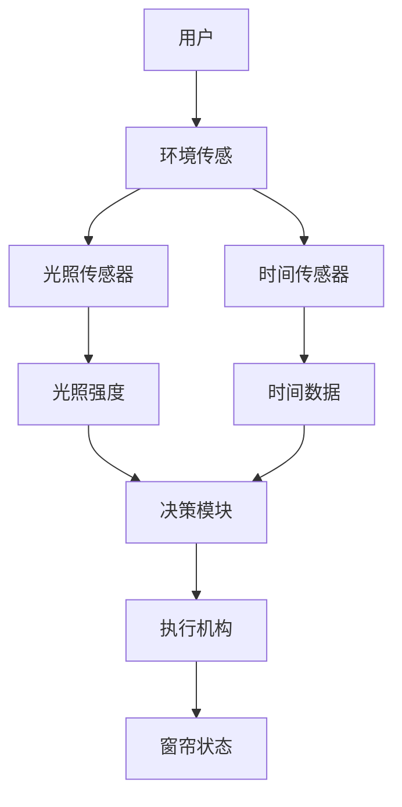
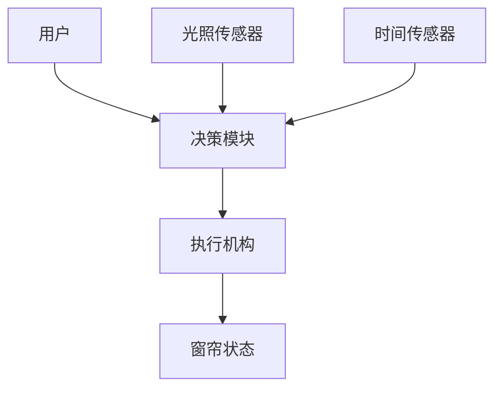

                 


# AI Agent在智能窗帘中的日光与隐私平衡

> 关键词：AI Agent, 智能窗帘, 日光调节, 隐私保护, 算法原理, 系统架构

> 摘要：本文探讨AI Agent在智能窗帘中的应用，重点分析如何通过AI技术实现日光调节与隐私保护的平衡。文章从背景、核心概念、算法原理、系统架构到项目实战，全面解析AI Agent在智能窗帘中的功能实现与技术细节。

---

# 第一部分: AI Agent在智能窗帘中的日光与隐私平衡背景介绍

## 第1章: 问题背景与需求分析

### 1.1 问题背景
#### 1.1.1 智能窗帘的发展现状
智能窗帘作为智能家居的重要组成部分，近年来得到了广泛应用。然而，现有的智能窗帘主要依赖于简单的定时控制或手动调节，无法根据环境变化自动调整，导致日光调节和隐私保护效果有限。

#### 1.1.2 日光与隐私平衡的必要性
日光调节不仅影响室内的舒适度，还关系到能源消耗和隐私保护。如何在不同时间段平衡日光进入和隐私保护的需求，是智能窗帘系统面临的重要挑战。

#### 1.1.3 AI Agent在智能窗帘中的应用潜力
AI Agent（智能代理）通过感知环境、自主决策和执行操作，能够有效解决智能窗帘的日光与隐私平衡问题。AI Agent的应用可以显著提升智能窗帘的智能化水平。

### 1.2 问题描述
#### 1.2.1 日光调节的核心问题
如何根据光照强度、时间、天气等因素，动态调整窗帘的开合程度，以实现最佳的日光调节效果。

#### 1.2.2 隐私保护的关键挑战
在确保室内隐私的同时，如何避免外界窥视，特别是在光照不足或夜晚时段。

#### 1.2.3 AI Agent在平衡日光与隐私中的角色
AI Agent通过实时感知环境数据，结合用户偏好和隐私需求，自动调整窗帘状态，实现日光与隐私的动态平衡。

### 1.3 问题解决思路
#### 1.3.1 AI Agent的基本功能
- 状态感知：采集光照强度、时间、天气等环境数据。
- 决策逻辑：基于感知数据和用户需求，制定窗帘调节策略。
- 执行机构：通过电机或其他执行机构调整窗帘状态。

#### 1.3.2 日光与隐私平衡的实现机制
- 光照强度阈值设定：根据用户需求，设置光照强度阈值，自动调节窗帘开合程度。
- 隐私保护策略：在特定时间段（如夜晚）自动关闭窗帘，防止外界窥视。

#### 1.3.3 系统架构设计的初步思路
- 传感器数据采集：光照、时间、天气等传感器数据输入。
- AI Agent决策：基于传感器数据和用户需求，生成窗帘调节指令。
- 执行机构控制：通过电机或其他执行机构调整窗帘状态。

### 1.4 问题的边界与外延
#### 1.4.1 系统边界定义
系统仅关注窗帘的开合状态，不涉及其他智能家居设备的联动控制。

#### 1.4.2 外延功能分析
- 数据存储与分析：记录用户偏好和系统运行数据，优化日光与隐私平衡策略。
- 用户交互界面：提供用户设置和调整系统参数的功能。

#### 1.4.3 系统与其他设备的交互
系统通过标准接口与智能家居平台或其他设备（如智能灯泡）进行数据交互，但本文仅讨论窗帘系统的内部实现。

### 1.5 核心概念与组成要素
#### 1.5.1 AI Agent的核心要素
- 状态感知模块：负责采集环境数据。
- 决策逻辑模块：基于感知数据和用户需求，制定调节策略。
- 执行机构：通过电机或其他机构调整窗帘状态。

#### 1.5.2 日光与隐私平衡的系统组成
- 光照传感器：实时监测室内光照强度。
- 时间传感器：获取当前时间，判断日光需求。
- 用户偏好数据库：存储用户的日光调节偏好和隐私设置。
- 执行机构：电机驱动窗帘开合。

#### 1.5.3 系统功能模块的划分
- 数据采集模块：负责环境数据的采集。
- 数据处理模块：对采集的数据进行分析和处理。
- 决策模块：基于处理后的数据，生成调节指令。
- 执行模块：根据指令调整窗帘状态。

---

# 第二部分: AI Agent的核心概念与原理

## 第2章: AI Agent的基本原理

### 2.1 AI Agent的定义与特点
AI Agent是一种智能代理系统，能够感知环境、自主决策并执行操作。其特点包括：
- **自主性**：无需人工干预，自主完成任务。
- **反应性**：实时感知环境变化并做出反应。
- **主动性**：主动调整窗帘状态，以实现日光与隐私平衡。

### 2.2 AI Agent的工作流程
AI Agent在智能窗帘中的工作流程如下：
1. **状态感知**：采集光照强度、时间、天气等环境数据。
2. **数据处理**：分析感知数据，判断当前环境状态。
3. **决策制定**：根据环境数据和用户需求，生成窗帘调节指令。
4. **执行操作**：通过执行机构调整窗帘开合状态。

### 2.3 AI Agent与智能窗帘的结合
AI Agent通过与智能窗帘的硬件和软件结合，实现日光与隐私的动态平衡。硬件部分包括光照传感器、电机驱动等，软件部分包括数据处理和决策逻辑。

---

## 第3章: AI Agent的核心概念与联系

### 3.1 核心概念的对比分析
#### 3.1.1 日光调节与隐私保护的对比
- **日光调节**：根据光照强度和时间，动态调整窗帘开合程度。
- **隐私保护**：在特定时间段（如夜晚）自动关闭窗帘，防止外界窥视。

#### 3.1.2 AI Agent与其他智能设备的对比
- **智能音箱**：主要通过语音交互控制设备，不具备自主决策能力。
- **智能灯泡**：通过传感器和自动化场景设置实现灯光调节，但不具备AI Agent的自主决策能力。

#### 3.1.3 不同算法的对比
- **规则引擎**：基于预定义规则进行决策，缺乏灵活性。
- **机器学习模型**：通过训练数据，学习最优决策策略，具备更强的适应性。

### 3.2 实体关系图


---

## 第4章: AI Agent的算法原理

### 4.1 算法原理概述
AI Agent的算法主要包括状态感知算法和决策算法。状态感知算法用于采集和处理环境数据，决策算法基于感知数据生成调节指令。

### 4.2 算法的实现步骤
#### 4.2.1 状态感知算法
1. 采集光照强度和时间数据。
2. 对采集数据进行预处理和特征提取。

#### 4.2.2 决策算法
1. 根据光照强度和时间数据，判断当前环境状态。
2. 根据环境状态和用户需求，生成窗帘调节指令。

#### 4.2.3 执行算法
1. 通过电机或其他执行机构调整窗帘开合状态。

### 4.3 算法的数学模型
AI Agent的决策算法可以表示为一个函数：
$$
f(t, l) = \text{调节指令}
$$
其中，$t$表示时间，$l$表示光照强度。

---

## 第5章: 系统分析与架构设计

### 5.1 系统功能设计
智能窗帘系统的功能模块包括：
- **光照传感器**：采集室内光照强度。
- **时间传感器**：获取当前时间。
- **决策模块**：根据传感器数据和用户需求，生成调节指令。
- **执行机构**：调整窗帘开合状态。

### 5.2 系统架构设计


### 5.3 接口设计
系统通过标准接口与智能家居平台或其他设备进行数据交互。

---

## 第6章: 项目实战

### 6.1 环境安装
需要安装光照传感器、时间传感器和电机驱动等硬件设备。

### 6.2 核心代码实现
以下是AI Agent的核心代码实现：
```python
import time
import numpy as np

class AI-Agent:
    def __init__(self):
        self光照强度 = 0
        self时间 = 0
        self调节指令 = "关闭"

    def 感知环境(self):
        # 获取光照强度
        self.光照强度 = self.获取光照强度()
        # 获取时间
        self.时间 = time.time()

    def 决策(self):
        # 根据光照强度和时间生成调节指令
        if self.时间 < 600:  # 早6点之前
            self.调节指令 = "关闭"
        elif self.光照强度 > 100:  # 光照强度过高
            self.调节指令 = "完全打开"
        else:
            self.调节指令 = "部分打开"

    def 执行(self):
        # 根据调节指令调整窗帘状态
        if self.调节指令 == "关闭":
            self.关闭窗帘()
        elif self.调节指令 == "完全打开":
            self.完全打开窗帘()
        else:
            self.部分打开窗帘()

# 示例用法
agent = AI-Agent()
agent.感知环境()
agent.决策()
agent.执行()
```

### 6.3 代码解读与分析
- **感知环境**：通过传感器获取光照强度和时间数据。
- **决策**：根据环境数据和用户需求生成调节指令。
- **执行**：通过电机或其他执行机构调整窗帘状态。

### 6.4 实际案例分析
假设当前时间为上午9点，光照强度为120。AI Agent会生成“完全打开”的调节指令，调整窗帘至完全打开状态。

---

## 第7章: 总结与展望

### 7.1 最佳实践 tips
- 定期校准传感器，确保数据准确性。
- 根据用户需求调整调节策略，提升用户体验。

### 7.2 小结
本文详细探讨了AI Agent在智能窗帘中的应用，重点分析了日光与隐私平衡的实现机制。通过AI Agent的技术实现，智能窗帘系统能够根据环境变化和用户需求，自动调整窗帘状态，实现日光与隐私的动态平衡。

### 7.3 注意事项
- 确保系统安全性，防止数据泄露。
- 定期维护硬件设备，确保系统稳定运行。

### 7.4 拓展阅读
- 探索AI Agent在其他智能家居设备中的应用。
- 研究更复杂的决策算法，提升系统智能化水平。

---

作者：AI天才研究院/AI Genius Institute & 禅与计算机程序设计艺术/Zen And The Art of Computer Programming

