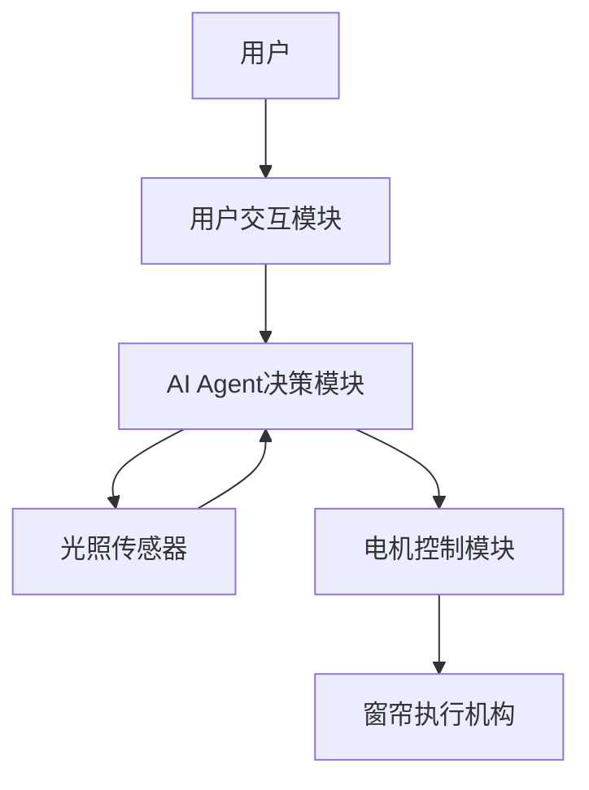

                 


# AI Agent在智能窗帘中的日光优化调节

> 关键词：AI Agent, 智能窗帘, 日光调节, 光照优化, 智能家居

> 摘要：本文探讨了AI Agent在智能窗帘中的日光优化调节应用，分析了光照调节的原理、算法实现、系统设计及实际案例。文章从背景介绍、核心概念、算法原理、系统架构、项目实战等方面进行详细阐述，为智能窗帘的日光优化调节提供了理论与实践指导。

---

# 第1章: 引言

## 1.1 智能窗帘的发展背景
智能家居的普及为生活带来了极大的便利，而智能窗帘作为智能家居的重要组成部分，逐渐成为提升居住舒适度的核心设备。随着AI技术的发展，智能窗帘的功能不再局限于简单的开合控制，而是向着智能化、个性化方向发展。

## 1.2 AI Agent与智能窗帘的基本概念
AI Agent（智能代理）是一种能够感知环境、自主决策并执行任务的智能实体。在智能窗帘中，AI Agent可以通过感知光照强度、用户行为和环境条件，自动调节窗帘的开合状态，以实现光照优化。

## 1.3 本章小结
本章介绍了智能窗帘的发展背景，阐述了AI Agent的基本概念及其在智能窗帘中的应用价值。

---

# 第2章: 光照优化调节的原理与方法

## 2.1 光环境感知
光照调节的第一步是感知环境中的光照条件。智能窗帘需要通过传感器采集光照强度、色温和光谱信息，并结合天气预报和时间信息，分析光照环境的变化规律。

## 2.2 用户行为分析
用户对光照的需求因人而异。通过分析用户的日常行为模式，AI Agent可以预测用户的光照偏好，并在特定时间点提供个性化的调节建议。

## 2.3 智能决策与调节策略
基于感知到的光照信息和用户行为数据，AI Agent会生成最优的调节策略。本文提出了一种基于强化学习的决策算法，通过动态调整窗帘的开合角度，实现光照的最优配置。

## 2.4 本章小结
本章从环境感知和用户行为分析的角度，探讨了光照优化调节的实现方法，并提出了基于强化学习的智能决策算法。

---

# 第3章: AI Agent的核心算法与实现

## 3.1 强化学习算法
### 3.1.1 Q-learning算法
Q-learning是一种经典的强化学习算法，适用于离散动作空间的问题。在光照调节中，Q-learning算法可以通过状态-动作-奖励机制，优化窗帘的开合策略。

### 3.1.2 算法实现
以下是Q-learning算法的伪代码实现：
```python
def q_learning():
    初始化Q表为全0
    while True:
        状态s = 获取当前光照强度
        动作a = 选择动作（基于ε-greedy策略）
        执行动作a，观察下一个状态s'
        奖励r = 计算光照优化的奖励值
        Q(s,a) = Q(s,a) + α*(r + γ*max(Q(s',a')) - Q(s,a))
```

## 3.2 模糊控制算法
### 3.2.1 模糊逻辑的基本概念
模糊控制是一种基于模糊逻辑的控制方法，适用于处理光照调节中的不确定性问题。通过模糊化、规则推理和解模糊三个步骤，实现对窗帘开合角度的精确控制。

### 3.2.2 模糊控制的实现
以下是模糊控制算法的实现示例：
```python
def fuzzy_control():
    输入光照强度x
    模糊化：将x映射到模糊集合{暗, 普通, 亮}
    规则推理：根据模糊规则生成控制动作
    解模糊：将模糊结果转换为具体的开合角度
    返回开合角度
```

## 3.3 组合优化算法
### 3.3.1 强化学习与模糊控制的结合
通过将强化学习和模糊控制相结合，可以实现更高效的光照调节。强化学习负责全局优化，模糊控制负责局部调整，两者互补。

## 3.4 本章小结
本章详细介绍了AI Agent的核心算法，包括强化学习和模糊控制，并探讨了它们在光照调节中的应用。

---

# 第4章: 智能窗帘系统的架构与设计

## 4.1 系统架构设计
智能窗帘系统主要由感知层、决策层和执行层组成。感知层通过光照传感器采集环境信息，决策层基于AI算法生成调节策略，执行层通过电机控制窗帘的开合。

## 4.2 系统功能设计
### 4.2.1 光照优化模块
- 光照强度检测
- 光谱分析
- 用户偏好分析

### 4.2.2 用户交互模块
- 手动调节
- 自动调节
- 用户反馈

## 4.3 系统接口设计
系统接口包括传感器接口、电机控制接口和用户交互接口。通过标准化的接口设计，确保各模块之间的协同工作。

## 4.4 系统交互流程
以下是系统交互的mermaid流程图：


## 4.5 本章小结
本章从系统架构、功能设计和接口设计的角度，详细阐述了智能窗帘系统的实现方案。

---

# 第5章: 项目实战

## 5.1 环境搭建
### 5.1.1 硬件设备
- 光照传感器
- 电机控制模块
- 微处理器（如Arduino或Raspberry Pi）

### 5.1.2 软件环境
- Python编程环境
- 机器学习库（如TensorFlow、Scikit-learn）

## 5.2 核心功能实现
### 5.2.1 光照强度检测
```python
import numpy as np

def get_light_intensity():
    sensor_value = read_sensor()
    intensity = np.interp(sensor_value, [0, 255], [0, 100])
    return intensity
```

### 5.2.2 强化学习算法实现
```python
class QLearningAgent:
    def __init__(self):
        self.q_table = np.zeros((3, 3))  # 状态和动作空间
        self.learning_rate = 0.1
        self.discount_factor = 0.9
        self.epsilon = 0.1

    def choose_action(self, state):
        if np.random.random() < self.epsilon:
            return np.random.randint(0, 3)  # 随机选择动作
        else:
            return np.argmax(self.q_table[state])

    def update_q_table(self, state, action, reward, next_state):
        self.q_table[state, action] += self.learning_rate * (reward + self.discount_factor * np.max(self.q_table[next_state]) - self.q_table[state, action])
```

## 5.3 系统测试与优化
通过实际测试，验证系统的光照调节效果。根据用户反馈，优化算法参数和系统性能。

## 5.4 本章小结
本章通过实际案例，详细讲解了智能窗帘系统的搭建、实现和测试过程。

---

# 第6章: 总结与展望

## 6.1 本章总结
本文详细探讨了AI Agent在智能窗帘中的日光优化调节应用，从算法实现到系统设计，再到项目实战，为智能窗帘的智能化发展提供了理论与实践指导。

## 6.2 未来展望
随着AI技术的不断进步，智能窗帘的功能将更加智能化和个性化。未来的研究方向包括更高效的算法优化、更精准的环境感知和更人性化的用户交互。

---

# 作者：AI天才研究院 & 禅与计算机程序设计艺术

---

以上是《AI Agent在智能窗帘中的日光优化调节》的完整目录和内容大纲，涵盖了从背景介绍到算法实现、系统设计和项目实战的各个方面。

