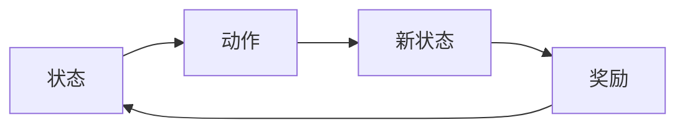

                 


# AI Agent在智能窗帘中的昼夜节律调节

> 关键词：AI Agent, 昼夜节律, 智能窗帘, 强化学习, 系统架构

> 摘要：本文探讨了AI Agent在智能窗帘中的应用，特别是如何通过调节昼夜节律来改善用户的生活质量。文章详细分析了AI Agent的算法原理、系统架构，并通过实际案例展示了如何在智能窗帘中实现昼夜节律调节，最后提出了最佳实践和未来研究方向。

---

## 目录大纲

### 第1章 背景介绍

#### 1.1 问题背景
- 1.1.1 现代生活方式对昼夜节律的影响
- 1.1.2 睡眠障碍与健康问题
- 1.1.3 智能家居的发展趋势

#### 1.2 问题描述
- 1.2.1 昼夜节律调节的重要性
- 1.2.2 智能窗帘的功能局限性
- 1.2.3 用户需求与现有技术的差距

#### 1.3 问题解决
- 1.3.1 引入AI Agent的必要性
- 1.3.2 AI Agent在智能窗帘中的应用目标
- 1.3.3 解决方案的可行性分析

#### 1.4 边界与外延
- 1.4.1 系统边界
- 1.4.2 功能范围
- 1.4.3 与其他系统的接口

#### 1.5 核心概念
- 1.5.1 昼夜节律调节的定义
- 1.5.2 AI Agent的基本概念
- 1.5.3 智能窗帘的功能模块

### 第2章 核心概念与联系

#### 2.1 AI Agent的原理
- 2.1.1 基于强化学习的决策机制
- 2.1.2 状态感知与反馈
- 2.1.3 行为规划与执行

#### 2.2 昼夜节律调节的生物基础
- 2.2.1 生物钟的基本原理
- 2.2.2 光照对生物钟的影响
- 2.2.3 温度对睡眠的影响

#### 2.3 AI Agent与昼夜节律调节的联系
- 2.3.1 数据采集与分析
- 2.3.2 个性化调节策略
- 2.3.3 实时反馈与优化

#### 2.4 对比分析
- 2.4.1 AI Agent与传统自动化系统的对比（表格）
- 2.4.2 昼夜节律调节系统的ER实体关系图（Mermaid）

### 第3章 AI Agent算法原理

#### 3.1 强化学习算法
- 3.1.1 Q-learning算法（Mermaid流程图）
- 3.1.2 算法实现（Python代码示例）

#### 3.2 反馈机制
- 3.2.1 状态空间与动作空间
- 3.2.2 奖励函数的设计
- 3.2.3 算法的数学模型与公式

### 第4章 系统分析与架构设计

#### 4.1 项目背景
- 4.1.1 项目目标
- 4.1.2 项目范围
- 4.1.3 项目约束

#### 4.2 系统功能设计
- 4.2.1 领域模型（Mermaid类图）
- 4.2.2 功能模块划分
- 4.2.3 用例分析

#### 4.3 系统架构设计
- 4.3.1 分层架构（Mermaid架构图）
- 4.3.2 组件交互（Mermaid序列图）
- 4.3.3 接口设计

### 第5章 项目实战

#### 5.1 环境安装
- 5.1.1 开发环境配置
- 5.1.2 第三方库安装
- 5.1.3 依赖管理

#### 5.2 核心功能实现
- 5.2.1 数据采集与处理
- 5.2.2 AI Agent算法实现
- 5.2.3 系统集成与测试

#### 5.3 代码解读与分析
- 5.3.1 核心算法代码
- 5.3.2 系统配置文件
- 5.3.3 交互界面设计

#### 5.4 案例分析
- 5.4.1 实际应用场景
- 5.4.2 数据分析与结果展示
- 5.4.3 性能优化与问题解决

#### 5.5 项目小结
- 5.5.1 项目成果
- 5.5.2 经验总结
- 5.5.3 改进建议

### 第6章 最佳实践

#### 6.1 小结
- 6.1.1 核心要点回顾
- 6.1.2 关键技术总结
- 6.1.3 项目经验分享

#### 6.2 注意事项
- 6.2.1 数据隐私保护
- 6.2.2 系统安全性考虑
- 6.2.3 用户体验优化

#### 6.3 未来趋势
- 6.3.1 技术发展预测
- 6.3.2 应用场景扩展
- 6.3.3 新技术融合

#### 6.4 拓展阅读
- 6.4.1 相关技术文献
- 6.4.2 优秀项目案例
- 6.4.3 进一步学习资源

### 作者信息

作者：AI天才研究院/AI Genius Institute & 禅与计算机程序设计艺术 /Zen And The Art of Computer Programming

---

### 附录

#### 附录A: 算法代码示例
```python
import numpy as np
from collections import defaultdict

class QLearningAgent:
    def __init__(self, actions, learning_rate=0.1, discount_factor=0.9):
        self.actions = actions
        self.lr = learning_rate
        self.gamma = discount_factor
        self.q_table = defaultdict(dict)

    def get_action(self, state):
        if state not in self.q_table or all(v == 0 for v in self.q_table[state].values()):
            return np.random.choice(self.actions)
        else:
            return max(self.q_table[state], key=lambda k: self.q_table[state][k])

    def update_q_table(self, state, action, reward, next_state):
        current_q = self.q_table[state].get(action, 0)
        next_max_q = max(self.q_table[next_state].values(), default=0)
        new_q = current_q + self.lr * (reward + self.gamma * next_max_q - current_q)
        self.q_table[state][action] = new_q
```

#### 附录B: Mermaid图表示例


---

通过以上目录大纲，文章将系统地介绍AI Agent在智能窗帘中的昼夜节律调节技术，从理论到实践，为读者提供全面而深入的指导。

