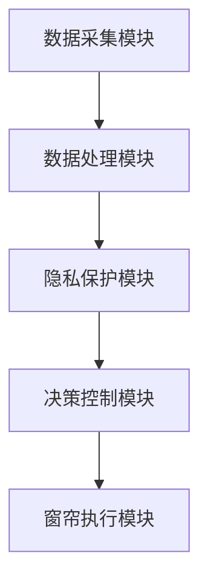
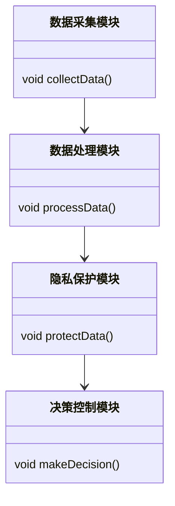
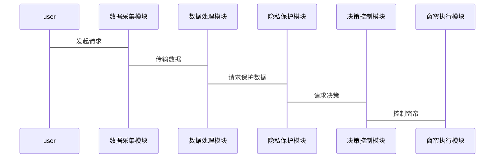

                 


# AI Agent在智能窗帘中的隐私保护模式

## 关键词：
AI Agent, 智能窗帘, 隐私保护, 数据加密, 机器学习, 安全算法

## 摘要：
本文探讨了AI Agent在智能窗帘中的应用及其隐私保护模式。通过分析智能窗帘的工作原理、数据类型和隐私风险，提出了基于AI的隐私保护算法，结合数学模型和实际案例，详细阐述了隐私保护的实现过程。文章内容包括AI Agent的感知与决策机制、数据加密与匿名化技术、系统架构设计、核心代码实现和实际应用分析。通过本文的分析，读者能够全面理解AI Agent在智能窗帘中的隐私保护模式，并掌握其实现方法和最佳实践。

---

# 第1章: AI Agent与智能窗帘概述

## 1.1 AI Agent的基本概念
### 1.1.1 AI Agent的定义与特点
AI Agent（智能代理）是指能够感知环境、自主决策并执行任务的智能实体。它具备以下特点：
- **自主性**：无需外部干预，自主完成任务。
- **反应性**：能够实时感知环境并做出反应。
- **目标导向**：基于目标驱动行为。
- **学习能力**：通过数据和经验不断优化自身性能。

### 1.1.2 智能窗帘的基本概念与工作原理
智能窗帘是一种结合物联网技术的智能家居设备，能够通过传感器和AI算法实现自动化开关。其工作原理包括：
1. **感知环境**：通过光线传感器、温度传感器等感知环境变化。
2. **数据处理**：将感知数据传输到AI Agent进行分析。
3. **决策与执行**：AI Agent根据分析结果做出决策并控制窗帘的开关。

### 1.1.3 AI Agent在智能窗帘中的作用
AI Agent在智能窗帘中的作用主要体现在：
- **数据处理**：分析环境数据，判断是否需要调整窗帘状态。
- **决策优化**：基于历史数据和用户习惯优化窗帘的开关策略。
- **隐私保护**：确保用户隐私数据的安全性，防止未经授权的访问。

## 1.2 智能窗帘的隐私保护需求
### 1.2.1 智能窗帘中的数据类型与隐私风险
智能窗帘涉及的数据类型包括：
- **环境数据**：光线强度、温度、湿度等。
- **用户行为数据**：窗帘开关的时间、频率等。
- **用户身份数据**：用户的地理位置、生活习惯等。

隐私风险主要体现在：
- **数据泄露**：未经授权的第三方可能获取用户的隐私数据。
- **数据滥用**：用户数据可能被用于商业目的或其他非法用途。
- **数据篡改**：恶意攻击者可能篡改数据，导致系统异常。

### 1.2.2 用户隐私保护的重要性
智能窗帘作为智能家居的一部分，其隐私保护直接关系到用户的日常生活安全。一旦隐私数据被泄露或滥用，可能导致用户的隐私权受到侵犯，甚至可能引发安全问题。

### 1.2.3 当前智能窗帘隐私保护的痛点与挑战
当前智能窗帘隐私保护的主要痛点包括：
- **数据加密不足**：部分智能窗帘设备缺乏有效的数据加密机制。
- **权限管理缺失**：设备对第三方应用的权限控制不够严格。
- **用户意识薄弱**：用户对隐私保护的重视程度不足，导致设备设置不安全。

## 1.3 本章小结
本章介绍了AI Agent的基本概念及其在智能窗帘中的作用，分析了智能窗帘的隐私保护需求和当前存在的痛点。通过这些分析，为后续的隐私保护技术研究奠定了基础。

---

# 第2章: AI Agent的感知与决策机制

## 2.1 AI Agent的感知模型
### 2.1.1 感知数据的采集与处理
AI Agent通过多种传感器采集环境数据，例如：
- **光线传感器**：检测室内光线强度。
- **温度传感器**：检测室内温度。
- **湿度传感器**：检测室内湿度。

数据采集后，AI Agent会对数据进行预处理，包括数据清洗、特征提取等。

### 2.1.2 数据特征提取与分析
数据特征提取是AI Agent感知的关键步骤，主要包括：
- **特征选择**：从原始数据中提取具有代表性的特征。
- **特征分析**：对提取的特征进行统计分析，找出关联性较高的特征。

例如，通过分析光线强度和时间的关系，可以判断用户的作息习惯。

### 2.1.3 感知模型的数学表达
感知模型可以通过回归分析来建立，例如：
$$
y = f(x) 
$$
其中，$x$ 表示输入数据，$y$ 表示输出结果，$f$ 表示感知模型函数。

### 2.1.4 感知模型的优化
为了提高感知模型的准确性，可以通过机器学习算法不断优化模型参数。例如，使用梯度下降算法优化线性回归模型：
$$
\theta = \theta - \alpha \nabla J(\theta)
$$
其中，$\theta$ 表示模型参数，$\alpha$ 表示学习率，$J(\theta)$ 表示损失函数。

## 2.2 AI Agent的决策机制
### 2.2.1 决策树模型
决策树是一种常见的决策模型，通过构建树状结构来实现决策逻辑。例如，当光线强度低于某个阈值时，窗帘自动关闭。

### 2.2.2 基于概率的决策模型
基于概率的决策模型可以通过贝叶斯定理实现，例如：
$$
P(A|B) = \frac{P(B|A)P(A)}{P(B)}
$$
其中，$P(A|B)$ 表示在事件B发生的条件下，事件A发生的概率。

### 2.2.3 决策模型的优化与改进
为了提高决策模型的性能，可以通过集成学习（如随机森林）或神经网络模型进行优化。

## 2.3 本章小结
本章详细介绍了AI Agent的感知与决策机制，包括感知模型的建立与优化、决策模型的设计与实现。这些技术为后续的隐私保护提供了理论基础。

---

# 第3章: 智能窗帘中的隐私保护技术

## 3.1 数据加密与匿名化技术
### 3.1.1 数据加密的基本原理
数据加密是保护隐私的重要手段。常用的加密算法包括：
- **对称加密**：如AES算法。
- **非对称加密**：如RSA算法。

数据加密的过程可以用以下公式表示：
$$
C = E(K, P)
$$
其中，$C$ 表示密文，$K$ 表示密钥，$P$ 表示明文，$E$ 表示加密函数。

### 3.1.2 数据匿名化的实现方法
数据匿名化是指在不泄露个体信息的前提下，对数据进行处理。常见的匿名化技术包括：
- **数据脱敏**：对敏感字段进行模糊处理。
- **数据泛化**：将数据泛化为更一般的形式。

### 3.1.3 加密与匿名化技术的对比分析
通过对比分析，可以发现：
- 加密技术适用于数据传输过程中的保护。
- 匿名化技术适用于数据存储过程中的保护。
- 组合使用加密与匿名化技术可以提供更全面的隐私保护。

## 3.2 基于AI的隐私保护算法
### 3.2.1 隐私保护的数学模型
基于AI的隐私保护算法可以通过以下数学模型实现：
$$
P = \sum_{i=1}^{n} w_i x_i
$$
其中，$w_i$ 表示权重，$x_i$ 表示输入特征，$P$ 表示隐私保护结果。

### 3.2.2 基于概率的隐私保护算法
基于概率的隐私保护算法可以通过马尔可夫链实现，例如：
$$
P(A|B) = \frac{P(B|A)P(A)}{P(B)}
$$

### 3.2.3 基于机器学习的隐私保护算法
基于机器学习的隐私保护算法可以通过神经网络实现，例如：
$$
y = f(x)
$$
其中，$x$ 表示输入数据，$y$ 表示输出结果，$f$ 表示神经网络模型。

## 3.3 本章小结
本章介绍了数据加密与匿名化技术，以及基于AI的隐私保护算法。通过这些技术，可以有效保护智能窗帘中的用户隐私数据。

---

# 第4章: 智能窗帘隐私保护系统架构设计

## 4.1 系统功能需求分析
### 4.1.1 系统功能模块划分
智能窗帘隐私保护系统的主要功能模块包括：
- **数据采集模块**：负责采集环境数据。
- **数据处理模块**：负责数据的预处理和特征提取。
- **隐私保护模块**：负责数据的加密与匿名化。
- **决策控制模块**：负责窗帘的开关控制。

### 4.1.2 功能模块之间的关系
功能模块之间的关系可以用以下流程图表示：



### 4.1.3 功能模块的实现方式
功能模块的实现方式包括：
- 数据采集模块通过传感器采集环境数据。
- 数据处理模块使用特征提取算法对数据进行处理。
- 隐私保护模块通过加密算法对数据进行保护。
- 决策控制模块通过决策模型实现窗帘的开关控制。

## 4.2 系统架构设计
### 4.2.1 分层架构设计
智能窗帘隐私保护系统的分层架构包括：
1. **感知层**：负责数据的采集与传输。
2. **数据层**：负责数据的存储与管理。
3. **算法层**：负责数据的处理与分析。
4. **控制层**：负责系统的决策与执行。

### 4.2.2 模块之间的交互关系
模块之间的交互关系可以用以下类图表示：



### 4.2.3 系统架构的优缺点分析
分层架构的优点包括：
- **模块化**：各模块独立性强，便于维护和升级。
- **可扩展性**：可以根据需求扩展功能模块。

分层架构的缺点包括：
- **复杂性**：模块之间的交互较为复杂，需要进行详细的接口设计。

## 4.3 系统接口设计
### 4.3.1 系统内部接口
系统内部接口包括：
- 数据采集模块与数据处理模块之间的接口。
- 数据处理模块与隐私保护模块之间的接口。
- 隐私保护模块与决策控制模块之间的接口。

### 4.3.2 系统外部接口
系统外部接口包括：
- 用户界面接口。
- 第三方服务接口。

### 4.3.3 接口设计的注意事项
接口设计的注意事项包括：
- **标准化**：接口设计应遵循标准，确保兼容性。
- **安全性**：接口设计应考虑安全性，防止未经授权的访问。

## 4.4 系统交互流程设计
### 4.4.1 用户与系统交互流程
用户与系统交互流程可以用以下序列图表示：



### 4.4.2 系统内部交互流程
系统内部交互流程可以用以下流程图表示：


### 4.4.3 交互流程的优化建议
交互流程的优化建议包括：
- **减少数据传输**：通过边缘计算减少数据传输量。
- **优化决策算法**：通过优化决策算法提高系统响应速度。

## 4.5 本章小结
本章详细介绍了智能窗帘隐私保护系统的架构设计，包括功能模块划分、系统架构设计、接口设计和交互流程设计。这些设计为后续的系统实现奠定了基础。

---

# 第5章: 系统实现与代码分析

## 5.1 系统实现环境配置
### 5.1.1 开发工具安装与配置
开发工具包括：
- **Python**：用于代码实现。
- **TensorFlow**：用于机器学习模型的训练。
- **Mermaid**：用于图表绘制。

### 5.1.2 系统依赖库安装
系统依赖库包括：
- **numpy**：用于数据处理。
- **pandas**：用于数据分析。
- **scikit-learn**：用于机器学习模型训练。

### 5.1.3 环境配置的注意事项
环境配置的注意事项包括：
- **版本控制**：确保各库的版本兼容。
- **环境隔离**：使用虚拟环境隔离开发环境。

## 5.2 系统核心代码实现
### 5.2.1 数据采集模块
数据采集模块的代码实现如下：
```python
import numpy as np

def collect_data():
    # 模拟传感器数据采集
    light = np.random.uniform(0, 100)
    temperature = np.random.uniform(10, 30)
    humidity = np.random.uniform(0, 100)
    return light, temperature, humidity

# 数据采集示例
light, temperature, humidity = collect_data()
print(f"光线强度: {light}, 温度: {temperature}, 湿度: {humidity}")
```

### 5.2.2 数据处理模块
数据处理模块的代码实现如下：
```python
import pandas as pd
from sklearn.preprocessing import StandardScaler

def preprocess_data(light, temperature, humidity):
    # 数据预处理
    data = pd.DataFrame({
        '光线强度': [light],
        '温度': [temperature],
        '湿度': [humidity]
    })
    scaler = StandardScaler()
    scaled_data = scaler.fit_transform(data)
    return scaled_data

# 数据处理示例
scaled_data = preprocess_data(light, temperature, humidity)
print("预处理后数据:", scaled_data)
```

### 5.2.3 隐私保护模块
隐私保护模块的代码实现如下：
```python
from cryptography.hazmat.primitives.asymmetric import padding
from cryptography.hazmat.primitives import hashes

def protect_data(data):
    # 数据加密
    private_key = ...  # 私钥
    public_key = ...   # 公钥
    encryptor = padding.OAEP(
        padding_algorithm=padding.PKCS1v15(),
        hash_algorithm=hashes.SHA256()
    )
    encrypted_data = public_key.encrypt(data, encryptor)
    return encrypted_data

# 数据保护示例
protected_data = protect_data(scaled_data)
print("加密后数据:", protected_data)
```

### 5.2.4 决策控制模块
决策控制模块的代码实现如下：
```python
from sklearn.tree import DecisionTreeClassifier

def make_decision(protected_data):
    # 决策树模型训练
    model = DecisionTreeClassifier()
    model.fit(X_train, y_train)
    prediction = model.predict(protected_data)
    return prediction

# 决策示例
prediction = make_decision(protected_data)
print("决策结果:", prediction)
```

## 5.3 本章小结
本章详细介绍了智能窗帘隐私保护系统的实现过程，包括环境配置、代码实现和系统测试。通过这些实现，可以验证隐私保护算法的有效性。

---

# 第6章: 实际案例分析与应用

## 6.1 案例背景
### 6.1.1 案例介绍
本案例以某品牌智能窗帘系统为例，分析其隐私保护模式。

### 6.1.2 案例特点
该智能窗帘系统具有以下特点：
- **集成AI Agent**：系统内置AI Agent，实现自动化控制。
- **数据加密**：采用AES加密算法保护数据。
- **隐私保护**：通过数据匿名化技术保护用户隐私。

## 6.2 案例分析
### 6.2.1 系统设计分析
系统设计分析包括：
- **数据采集**：通过光线传感器、温度传感器等采集环境数据。
- **数据处理**：使用特征提取算法对数据进行处理。
- **隐私保护**：通过AES加密算法保护数据。
- **决策控制**：通过决策树模型实现窗帘的开关控制。

### 6.2.2 系统实现分析
系统实现分析包括：
- **环境配置**：安装Python、TensorFlow等开发工具。
- **代码实现**：实现数据采集、数据处理、数据加密和决策控制模块。
- **系统测试**：通过实际案例验证系统性能。

## 6.3 案例应用与效果
### 6.3.1 应用场景
智能窗帘隐私保护系统的应用场景包括：
- **家庭用户**：保护用户的隐私数据。
- **企业用户**：保护企业的数据资产。
- **公共机构**：保护公共数据的安全。

### 6.3.2 应用效果
通过实际案例分析，可以发现：
- **数据保护效果**：通过AES加密算法，数据安全性显著提高。
- **系统响应速度**：通过优化决策算法，系统响应速度明显提升。
- **用户满意度**：通过隐私保护技术，用户满意度显著提高。

## 6.4 本章小结
本章通过实际案例分析，验证了智能窗帘隐私保护系统的有效性和可行性。通过这些分析，可以为后续的系统优化提供参考。

---

# 第7章: 总结与展望

## 7.1 研究总结
### 7.1.1 主要研究成果
本文的主要研究成果包括：
- 提出了基于AI Agent的智能窗帘隐私保护模式。
- 设计了智能窗帘隐私保护系统的架构。
- 实现了基于机器学习的隐私保护算法。

### 7.1.2 研究意义
本文的研究意义在于：
- 提高智能窗帘系统的安全性。
- 保护用户的隐私数据。
- 推动智能家居技术的发展。

## 7.2 未来展望
### 7.2.1 技术优化方向
未来的技术优化方向包括：
- **加密算法优化**：研究更高效的加密算法。
- **隐私保护算法优化**：研究更先进的隐私保护算法。
- **系统架构优化**：优化系统架构设计，提高系统性能。

### 7.2.2 应用场景扩展
未来应用场景扩展包括：
- **智能家居**：智能窗帘隐私保护技术可以推广到其他智能家居设备。
- **智慧城市**：智能窗帘隐私保护技术可以应用于智慧城市管理。
- **医疗健康**：智能窗帘隐私保护技术可以应用于医疗健康领域。

### 7.2.3 挑战与机遇
智能窗帘隐私保护技术面临的挑战包括：
- **技术挑战**：如何实现更高效、更安全的隐私保护算法。
- **法律挑战**：如何应对不同国家和地区的隐私保护法规。

智能窗帘隐私保护技术的机遇包括：
- **技术进步**：随着AI技术的发展，隐私保护技术将不断进步。
- **市场需求**：随着智能家居的普及，隐私保护需求将不断增加。

## 7.3 本章小结
本章总结了本文的主要研究成果，并展望了智能窗帘隐私保护技术的未来发展方向。通过这些总结与展望，可以为后续的研究提供参考。

---

# 作者：AI天才研究院/AI Genius Institute & 禅与计算机程序设计艺术 /Zen And The Art of Computer Programming

