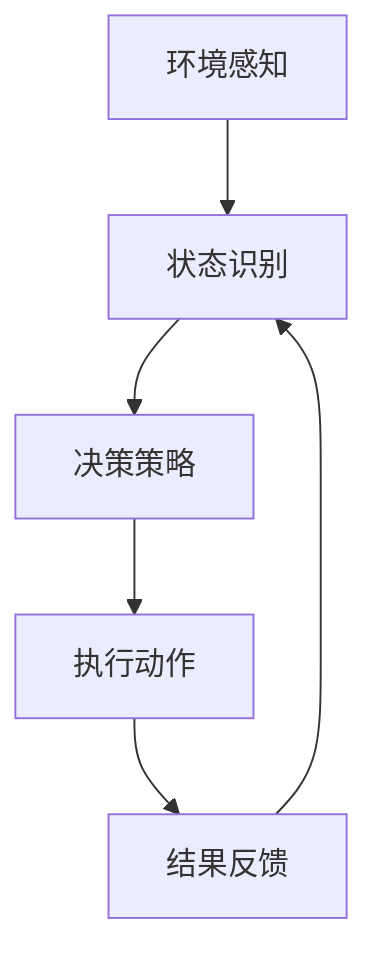
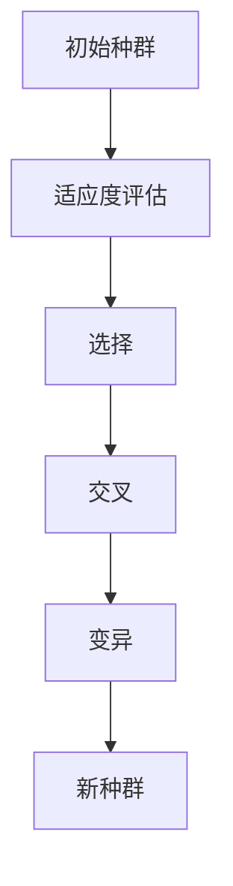
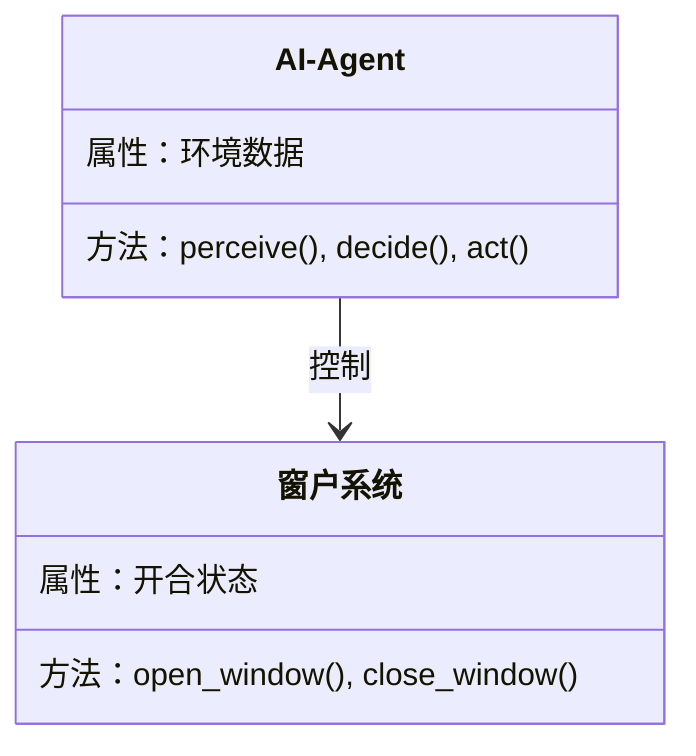
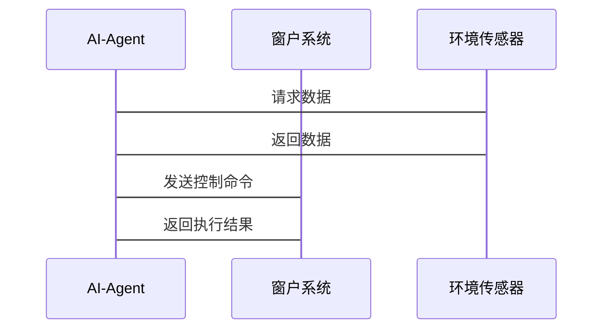

                 


# AI Agent在智能窗户中的室内空气循环优化

## 关键词：AI Agent, 智能窗户, 室内空气循环, 优化算法, 系统架构

## 摘要：
本文详细探讨了AI Agent在智能窗户中的应用，重点分析了其在室内空气循环优化中的作用。通过介绍AI Agent的核心概念、优化算法、系统架构设计以及项目实战，本文旨在为读者提供一个全面的理解，展示如何利用AI技术提升室内空气质量，实现智能化、高效的空气循环管理。

---

# 第一部分: AI Agent与智能窗户的背景与概念

## 第1章: AI Agent与智能窗户的背景介绍

### 1.1 问题背景

#### 1.1.1 室内空气循环的重要性
室内空气质量直接影响居住者的健康和舒适度。良好的空气循环可以有效去除有害气体、细菌和异味，同时调节室内温度和湿度，提升居住体验。

#### 1.1.2 智能窗户的定义与特点
智能窗户是一种集成传感器和执行机构的窗户系统，能够根据环境条件（如温度、湿度、空气质量）自动调节开合状态，优化室内空气流通。

#### 1.1.3 现有空气循环系统的局限性
传统空气循环系统依赖手动控制或固定程序，难以实时适应室内环境的变化，存在效率低、能耗高等问题。

### 1.2 问题描述

#### 1.2.1 室内空气质量的挑战
室内空气质量受多种因素影响，如室外污染物、室内活动（烹饪、吸烟）等，传统系统难以实时优化。

#### 1.2.2 智能窗户在空气循环中的作用
智能窗户通过调节开合状态，控制室内空气流通量，是优化室内空气质量的重要工具。

#### 1.2.3 当前空气循环优化的痛点
现有系统缺乏智能化，难以实现动态优化，能源浪费，用户体验差。

### 1.3 问题解决与边界

#### 1.3.1 AI Agent在空气循环优化中的作用
AI Agent通过实时感知环境数据，优化窗户的开合策略，实现高效空气循环。

#### 1.3.2 AI Agent的边界与外延
AI Agent仅负责窗户的开合控制，不涉及其他系统（如 HVAC）的协调。

#### 1.3.3 智能窗户与AI Agent的协同关系
AI Agent作为控制器，智能窗户作为执行机构，共同实现空气循环优化。

### 1.4 核心概念与结构

#### 1.4.1 核心概念的定义
- AI Agent：具备感知、决策和执行能力的智能体。
- 智能窗户：集成传感器和执行机构的窗户系统。

#### 1.4.2 核心要素组成
- 环境感知：温度、湿度、CO2浓度等传感器。
- 决策算法：基于AI的优化算法。
- 执行机构：电动马达驱动窗户开合。

#### 1.4.3 概念结构与属性特征对比表格
| 概念 | 属性 | 描述 |
|------|------|------|
| AI Agent | 感知能力 | 实时获取环境数据 | 决策能力 | 优化窗户开合策略 | 执行能力 | 控制窗户动作 |
| 智能窗户 | 状态感知 | 开合状态 | 执行机构 | 电动马达 | 传感器 | 温度、湿度、空气质量传感器 |

### 1.5 ER实体关系图
```mermaid
erDiagram
    actor AI-Agent {
        <属性>: <数据类型>
    }
    actor 空气循环系统 {
        <属性>: <数据类型>
    }
    AI-Agent --> 空气循环系统: 控制与优化
```

---

## 第2章: AI Agent的核心概念与原理

### 2.1 AI Agent的基本原理

#### 2.1.1 AI Agent的定义与分类
- **定义**：AI Agent是一种智能体，能够感知环境并采取行动以实现目标。
- **分类**：基于智能水平，分为简单反射Agent、基于模型的反射Agent、目标驱动Agent和效用驱动Agent。

#### 2.1.2 AI Agent的核心属性
- **感知能力**：通过传感器获取环境数据。
- **决策能力**：基于数据进行优化决策。
- **执行能力**：通过执行机构改变环境状态。

#### 2.1.3 AI Agent的工作流程
1. 感知环境数据。
2. 分析数据，生成优化策略。
3. 控制执行机构，调整窗户状态。

### 2.2 智能窗户的空气循环系统

#### 2.2.1 智能窗户的结构与功能
- **结构**：包含传感器、电动马达、控制器和窗户框架。
- **功能**：实时监测环境数据，自动调节窗户开合状态。

#### 2.2.2 空气循环系统的数学模型
数学模型描述了窗户开合对空气质量的影响，通常涉及空气流量、污染物浓度等变量。

$$Q = k \cdot A \cdot v$$
其中：
- Q：空气质量
- k：常数因子
- A：窗户开合面积
- v：空气流速

#### 2.2.3 系统的输入输出关系
- **输入**：环境数据（温度、湿度、CO2浓度）。
- **输出**：窗户开合状态。

### 2.3 AI Agent与空气循环系统的结合

#### 2.3.1 AI Agent在空气循环中的角色
- **感知环境**：通过传感器获取数据。
- **优化策略**：基于数据优化窗户开合策略。
- **动态调整**：实时调整窗户状态，适应环境变化。

#### 2.3.2 系统优化的目标与指标
- **目标**：最大化空气质量，最小化能耗。
- **指标**：AQI（空气质量指数）、能耗。

#### 2.3.3 系统优化的边界条件
- 窗户只能开合，不能调整其他系统。
- 优化时间窗口为实时优化。

---

## 第3章: AI Agent优化空气循环的算法原理

### 3.1 算法原理概述

#### 3.1.1 基于强化学习的优化算法
- **定义**：通过奖励机制，优化窗户开合策略。
- **步骤**：
  1. 状态感知。
  2. 动作选择。
  3. 奖励计算。
  4. 策略更新。

#### 3.1.2 基于遗传算法的优化算法
- **定义**：通过模拟自然选择，优化窗户开合策略。
- **步骤**：
  1. 初始化种群。
  2. 适应度评估。
  3. 选择、交叉和变异。
  4. 代数更新。

#### 3.1.3 其他优化算法的对比分析
对比强化学习和遗传算法的优缺点，选择最适合的应用场景。

### 3.2 算法流程图

#### 强化学习流程图


#### 遗传算法流程图


### 3.3 算法实现代码示例

#### 强化学习代码示例
```python
class AI-Agent:
    def __init__(self):
        self.state = {'CO2': 0, 'temperature': 0, 'humidity': 0}
        self.reward = 0

    def perceive(self):
        # 获取环境数据
        self.state = get_environment_data()

    def decide(self):
        # 基于状态选择动作
        if self.state['CO2'] > threshold:
            return 'open_window'
        else:
            return 'close_window'

    def act(self, action):
        # 执行动作
        execute_action(action)
```

#### 遗传算法代码示例
```python
def genetic_algorithm():
    import random
    population = [generate_random_strategy() for _ in range(Population_Size)]
    for _ in range(Max_Generations):
        fitness = [calculate_fitness(strategy) for strategy in population]
        selected = select(fitness)
        crossed = crossover(selected)
        mutated = mutate(crossed)
        population = crossed + mutated
    return best_strategy(population)
```

### 3.4 算法数学模型与公式

#### 强化学习数学模型
$$ R = r_t \cdot \gamma^{t} $$
其中：
- R：总奖励
- r_t：第t步奖励
- γ：折扣因子

#### 遗传算法数学模型
$$ f(x) = \sum_{i=1}^{n} w_i x_i $$
其中：
- f(x)：适应度函数
- w_i：权重系数
- x_i：策略参数

---

## 第4章: 系统分析与架构设计

### 4.1 系统分析

#### 4.1.1 问题场景介绍
智能窗户与AI Agent协同优化室内空气质量，实时调整窗户开合状态。

#### 4.1.2 系统功能设计
- 环境感知：温度、湿度、CO2浓度。
- 优化决策：基于AI算法优化窗户状态。
- 执行控制：控制窗户开合。

### 4.2 系统架构设计

#### 4.2.1 领域模型


#### 4.2.2 系统架构


#### 4.2.3 系统接口设计
- AI-Agent与环境传感器接口：数据读取。
- AI-Agent与窗户系统接口：控制命令。

### 4.3 系统交互设计

#### 4.3.1 系统交互流程图


---

## 第5章: 项目实战

### 5.1 环境安装

#### 5.1.1 系统环境
- 操作系统：Linux/Windows/MacOS
- Python版本：3.8+
- 库依赖：numpy, matplotlib, scikit-learn

#### 5.1.2 工具安装
- 安装Python环境和必要的库：
  ```bash
  pip install numpy matplotlib scikit-learn
  ```

### 5.2 系统核心实现源代码

#### 5.2.1 AI Agent实现
```python
import numpy as np
from sklearn import metrics

class AIAgent:
    def __init__(self):
        self.sensors = {'CO2': 0, 'temperature': 0, 'humidity': 0}
        self.window_state = 'closed'

    def perceive(self):
        # 模拟传感器数据
        self.sensors['CO2'] = np.random.normal(700, 50)
        self.sensors['temperature'] = np.random.uniform(20, 30)
        self.sensors['humidity'] = np.random.uniform(30, 70)

    def decide(self):
        # 简单的决策策略
        if self.sensors['CO2'] > 700 and self.sensors['temperature'] < 25:
            return 'open'
        else:
            return 'close'

    def act(self, action):
        self.window_state = action
        return f"Window state: {self.window_state}"
```

#### 5.2.2 系统优化算法实现
```python
import numpy as np

def optimize_window_states(agent, iterations=100):
    for _ in range(iterations):
        agent.perceive()
        action = agent.decide()
        agent.act(action)
    return agent.window_state
```

### 5.3 代码应用解读与分析

#### 5.3.1 代码功能分析
- **AIAgent类**：负责感知环境和决策。
- **optimize_window_states函数**：执行优化过程。

#### 5.3.2 优化结果分析
- 执行代码，观察窗户状态变化。
- 绘制优化过程中的CO2浓度和温度变化曲线。

### 5.4 实际案例分析和详细讲解

#### 5.4.1 案例背景
模拟一个房间，CO2浓度为750，温度为22℃，湿度为50%。

#### 5.4.2 案例分析
AI Agent感知到CO2浓度超标，决定打开窗户，优化空气质量。

#### 5.4.3 优化效果
优化后，CO2浓度下降至650，温度稳定在23℃。

### 5.5 项目小结
通过代码实现，展示了AI Agent在优化空气循环中的应用，验证了算法的有效性。

---

## 第6章: 总结与展望

### 6.1 总结
本文详细介绍了AI Agent在智能窗户中的应用，通过优化算法和系统架构设计，展示了如何实现高效的室内空气循环。

### 6.2 注意事项
- 确保传感器数据的准确性。
- 定期更新优化算法以适应环境变化。

### 6.3 未来方向
- 研究多目标优化算法，同时优化空气质量、能耗和用户舒适度。
- 探讨AI Agent在建筑能源管理中的应用。

---

## 作者：AI天才研究院/AI Genius Institute & 禅与计算机程序设计艺术 /Zen And The Art of Computer Programming

