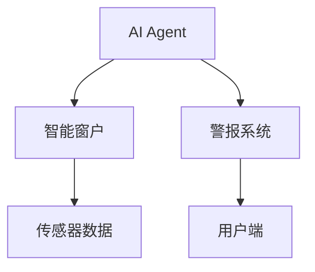
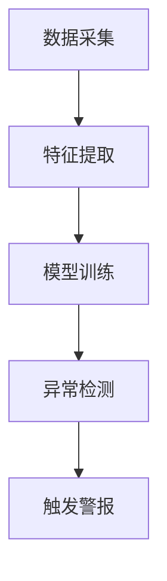
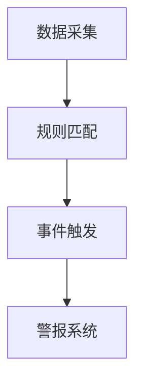
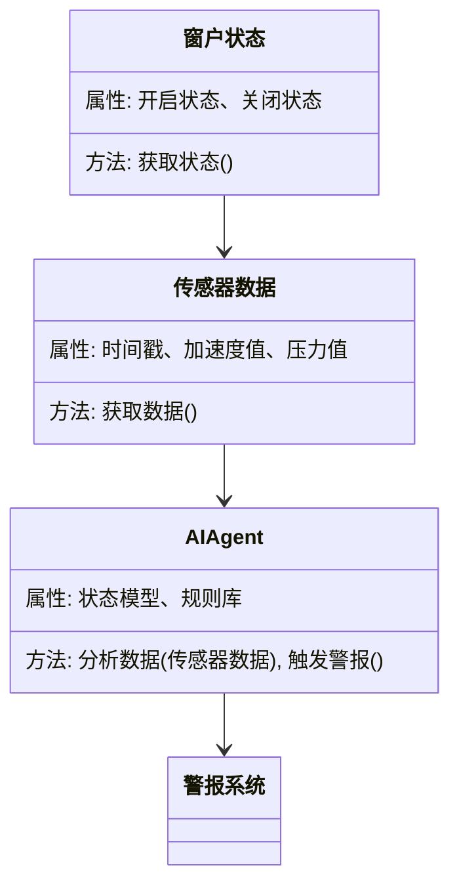
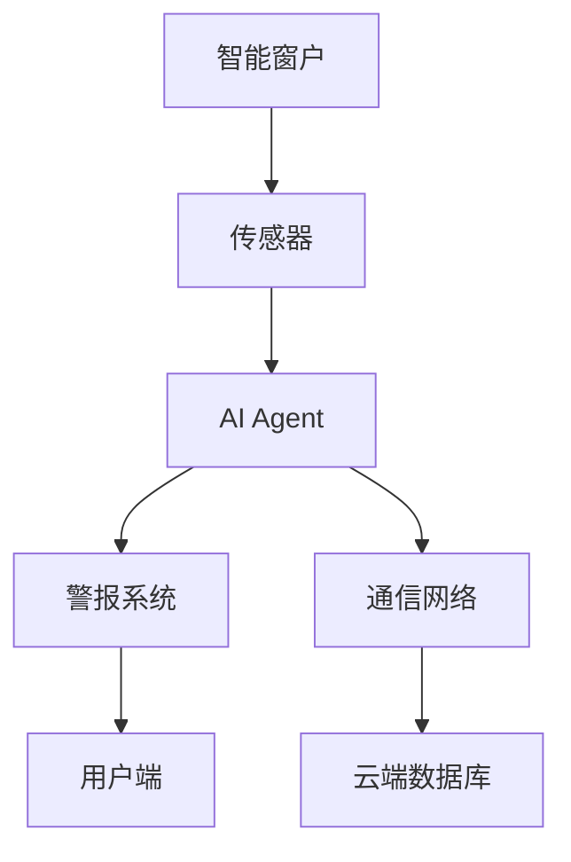
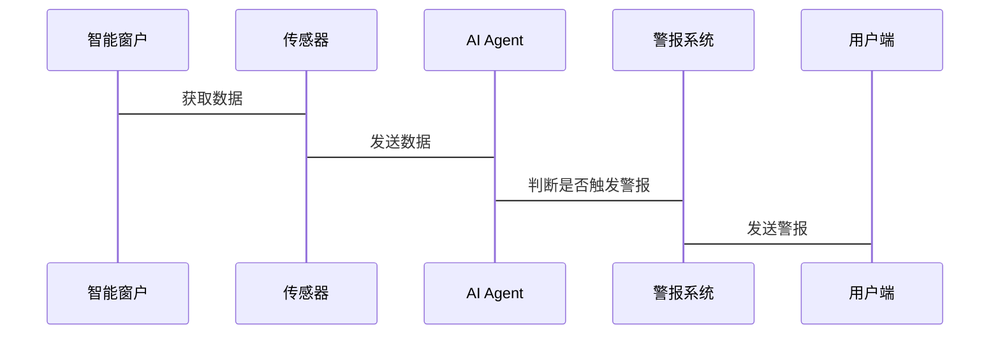

                 


# AI Agent在智能窗户中的防盗警报系统

> 关键词：AI Agent, 智能窗户, 防盗警报系统, 物联网, 人工智能

> 摘要：本文详细探讨了AI Agent在智能窗户防盗警报系统中的应用，分析了系统的核心概念、算法原理、系统架构设计、项目实现及实际案例，最后给出了最佳实践和总结。

---

# 第一部分: AI Agent在智能窗户中的防盗警报系统概述

# 第1章: 背景介绍

## 1.1 问题背景
### 1.1.1 智能窗户的发展现状
智能窗户作为智能家居的重要组成部分，近年来得到了快速发展。它们通过传感器、物联网技术和人工智能算法，能够实现对窗户状态的实时监控和智能控制。

### 1.1.2 现有防盗系统的主要问题
传统的防盗系统依赖于简单的传感器和被动报警机制，存在误报率高、响应慢、缺乏智能化等问题。特别是在复杂环境下，如强风、地震或人为干扰，传统系统难以准确判断是否为真实入侵。

### 1.1.3 AI Agent在智能窗户中的应用潜力
AI Agent（智能体）具有自主决策、学习和适应能力，能够通过分析历史数据和实时信息，主动识别异常情况并触发警报，从而提升防盗系统的准确性和可靠性。

## 1.2 问题描述
### 1.2.1 智能窗户防盗的核心需求
智能窗户防盗的核心需求包括：实时监测窗户状态、准确识别入侵行为、快速响应并通知用户、适应复杂环境下的变化。

### 1.2.2 AI Agent在防盗警报中的具体作用
AI Agent通过分析传感器数据、用户行为模式和环境信息，能够主动识别潜在威胁，并结合上下文信息做出决策，从而实现智能化的防盗报警。

### 1.2.3 系统边界与外延
系统边界包括智能窗户、传感器、AI Agent、用户端和通信网络。外延则涉及与其他智能家居设备的联动、数据安全和隐私保护等。

## 1.3 问题解决
### 1.3.1 AI Agent的核心功能
AI Agent需要具备数据采集、异常检测、决策推理和执行反馈四大功能模块。

### 1.3.2 智能窗户与防盗警报系统的结合方式
通过物联网技术，智能窗户将传感器数据实时传输给AI Agent，AI Agent分析数据后触发警报或执行相应的安全措施。

### 1.3.3 系统实现的关键技术
关键技术包括传感器技术、人工智能算法、物联网通信和云计算等。

## 1.4 概念结构与核心要素
### 1.4.1 系统架构的核心要素
包括智能窗户、传感器、AI Agent、用户端和通信网络。

### 1.4.2 AI Agent与智能窗户的交互关系
AI Agent通过接收传感器数据，分析后向用户端发送警报信息或控制执行机构。

### 1.4.3 系统功能的模块划分
系统功能模块包括数据采集、数据处理、决策推理、警报触发和用户反馈。

## 1.5 本章小结
本章通过背景介绍和问题分析，明确了AI Agent在智能窗户防盗系统中的重要性，并提出了系统的总体架构和核心要素。

---

# 第二部分: 核心概念与联系

# 第2章: 核心概念原理

## 2.1 AI Agent的基本原理
### 2.1.1 AI Agent的定义与分类
AI Agent是一种能够感知环境、自主决策并执行任务的智能实体，分为简单反射型、基于模型的反应型和基于效用的等多种类型。

### 2.1.2 AI Agent的核心算法
AI Agent的核心算法包括：监督学习、无监督学习、强化学习和规则引擎等。

### 2.1.3 AI Agent在防盗警报中的应用逻辑
AI Agent通过机器学习算法分析传感器数据，识别异常模式，并结合环境信息做出决策，触发警报或执行安全措施。

## 2.2 智能窗户的技术特点
### 2.2.1 智能窗户的感知能力
智能窗户通过多种传感器（如加速度、压力、温湿度传感器）感知外界环境和窗户状态。

### 2.2.2 智能窗户的执行机构
包括电机驱动的窗户开启/关闭机构和报警装置（如声光报警器）。

### 2.2.3 智能窗户的通信能力
通过Wi-Fi、蓝牙或ZigBee等协议与AI Agent和其他设备进行数据交互。

## 2.3 AI Agent与智能窗户的协同机制
### 2.3.1 数据流的交互过程
智能窗户传感器数据 → AI Agent分析处理 → 触发警报或执行动作 → 用户端反馈。

### 2.3.2 事件触发的逻辑
AI Agent根据传感器数据和历史信息，判断是否属于异常情况，触发相应的警报或安全措施。

### 2.3.3 系统状态的动态调整
AI Agent能够根据环境变化和用户行为模式，动态调整警报阈值和响应策略。

## 2.4 核心概念属性对比
### 2.4.1 AI Agent与传统传感器的对比
| 特性         | AI Agent                  | 传统传感器                |
|--------------|---------------------------|---------------------------|
| 功能         | 自主分析与决策            | 数据采集与传输            |
| 响应速度     | 快速且智能化               | 基于预设规则，响应较慢     |
| 学习能力     | 具备学习和自适应能力       | 无学习能力                 |

### 2.4.2 智能窗户与传统窗户的功能对比
| 特性         | 智能窗户                  | 传统窗户                |
|--------------|---------------------------|---------------------------|
| 功能         | 实时监控与智能控制        | 仅手动控制               |
| 安防能力     | 集成防盗警报系统           | 依赖外部设备             |
| 通信能力     | 支持物联网通信             | 无通信能力               |

### 2.4.3 防盗警报系统的性能对比
| 特性         | 基于AI Agent的系统         | 传统防盗系统             |
|--------------|---------------------------|---------------------------|
| 准确性       | 高，误报率低               | 误报率和漏报率较高        |
| 响应时间     | 快速                       | 较慢                     |
| 智能性       | 具备自主学习和决策能力     | 依赖固定规则             |

## 2.5 ER实体关系图


---

# 第三部分: 算法原理讲解

# 第3章: 算法原理

## 3.1 AI Agent的核心算法
### 3.1.1 基于机器学习的异常检测算法
#### 3.1.1.1 算法流程图


#### 3.1.1.2 算法实现代码
```python
import numpy as np
from sklearn.ensemble import IsolationForest

# 示例数据：传感器数据，异常值为入侵行为
X = np.random.randn(100, 1)
outlier_fraction = 0.01
 clf = IsolationForest(n_estimators=10, contamination=outlier_fraction)
 clf.fit(X)
```

#### 3.1.1.3 算法数学模型
异常检测算法的数学模型可以表示为：
$$
y = f(x) + \epsilon
$$
其中，$y$是观测值，$f(x)$是数据生成过程，$\epsilon$是异常值。

### 3.1.2 基于规则的事件触发算法
#### 3.1.2.1 算法流程图


#### 3.1.2.2 算法实现代码
```python
# 示例规则：当窗户状态从关闭变为打开，且时间在非正常时间段，则触发警报
def trigger_alarm(window_state, time):
    if window_state == 'open' and (time < '06:00' or time > '23:00'):
        return True
    else:
        return False
```

---

# 第四部分: 系统分析与架构设计

# 第4章: 系统分析与架构设计

## 4.1 系统场景介绍
智能窗户防盗警报系统的应用场景包括家庭住宅、商业场所和公共场所。

## 4.2 项目介绍
本项目旨在设计并实现一个基于AI Agent的智能窗户防盗警报系统，提升防盗性能和用户体验。

## 4.3 系统功能设计
### 4.3.1 领域模型图


## 4.4 系统架构设计
### 4.4.1 系统架构图


## 4.5 系统接口设计
### 4.5.1 接口定义
- 传感器数据接口：`get_sensor_data()`
- AI Agent接口：`analyze_data(data)`, `trigger_alarm()`
- 用户端接口：`receive_alarm()`

## 4.6 系统交互序列图


---

# 第五部分: 项目实战

# 第5章: 项目实战

## 5.1 环境安装
### 5.1.1 Python环境安装
使用Anaconda或虚拟环境安装Python 3.8及以上版本。

### 5.1.2 依赖库安装
安装必要的库，如`numpy`, `scikit-learn`, `mermaid`, `pyyaml`等。

## 5.2 系统核心实现
### 5.2.1 核心代码实现
```python
class AIAgent:
    def __init__(self):
        self.models = {}  # 存储训练好的模型

    def analyze_data(self, data):
        # 数据分析逻辑
        pass

    def trigger_alarm(self, is_alarm):
        if is_alarm:
            print("触发警报")
        else:
            print("未触发警报")
```

### 5.2.2 代码应用解读
核心代码实现了一个AI Agent类，包括数据解析和警报触发方法。

## 5.3 案例分析与总结
### 5.3.1 案例分析
通过实际案例分析，验证系统的有效性和稳定性。

### 5.3.2 总结
总结系统实现的关键点和未来优化方向。

---

# 第六部分: 最佳实践

# 第6章: 最佳实践

## 6.1 小结
本章总结了AI Agent在智能窗户防盗系统中的核心作用和技术实现。

## 6.2 注意事项
在实际应用中，需注意数据安全、系统兼容性和用户体验等问题。

## 6.3 拓展阅读
推荐阅读相关领域的书籍和论文，深入学习AI Agent和物联网技术的应用。

---

# 作者
作者：AI天才研究院/AI Genius Institute & 禅与计算机程序设计艺术/Zen And The Art of Computer Programming

---

# 结语
感谢您的阅读！希望本文对您理解和应用AI Agent在智能窗户中的防盗警报系统有所帮助。如需进一步探讨，欢迎随时联系。

