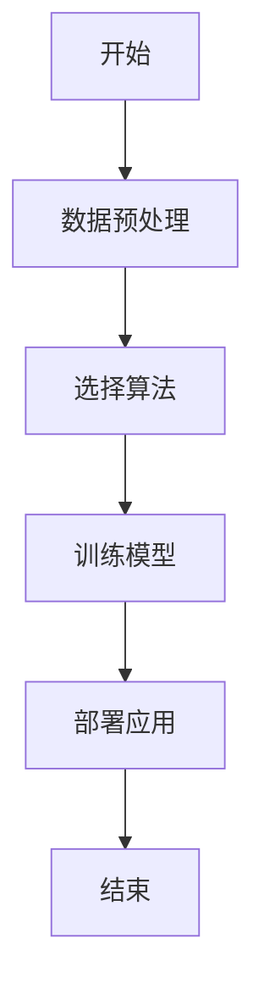
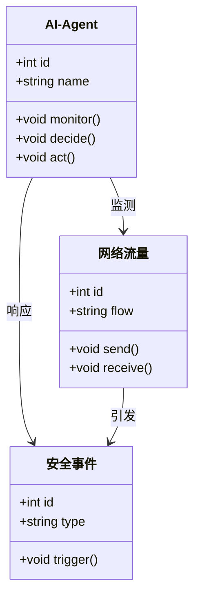
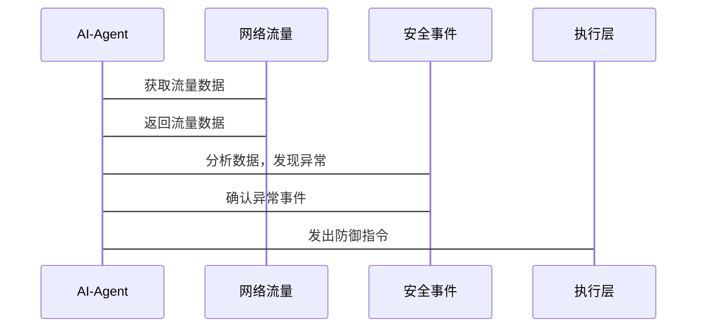

                 


# AI Agent在智能网络安全中的应用

**关键词**: AI Agent, 智能网络安全, 强化学习, 监督学习, 网络安全

**摘要**: 本文探讨AI Agent在智能网络安全中的应用，分析其核心概念、算法原理和系统架构，通过实际案例展示其在网络安全中的实际应用价值，并提出未来的发展方向。

---

## 第一部分: AI Agent与智能网络安全概述

### 第1章: AI Agent的基本概念与背景

#### 1.1 AI Agent的定义与特点

##### 1.1.1 AI Agent的定义

AI Agent（人工智能代理）是指能够感知环境、自主决策并采取行动的智能体。它通过传感器接收输入数据，利用算法处理信息，并根据目标输出行动指令。

##### 1.1.2 AI Agent的核心特点

1. **自主性**：能够在没有外部干预的情况下自主运行。
2. **反应性**：能够实时感知环境变化并做出反应。
3. **目标导向性**：基于特定目标执行任务。
4. **学习能力**：通过数据和经验不断优化自身的决策能力。

##### 1.1.3 AI Agent与传统安全技术的区别

| 特性             | AI Agent                     | 传统安全技术               |
|------------------|------------------------------|-----------------------------|
| 决策方式         | 基于机器学习模型进行决策     | 基于规则和预定义策略       |
| 自适应能力       | 能够自适应环境变化           | 需要人工调整策略           |
| 数据处理能力     | 处理复杂非结构化数据         | 主要处理结构化数据         |
| 响应速度         | 更快，能够在实时环境中响应   | 较慢，依赖于预定义规则     |

#### 1.2 智能网络安全的背景与挑战

##### 1.2.1 网络安全的传统挑战

1. **复杂性**：网络安全威胁日益复杂，攻击手段多样化。
2. **实时性**：需要快速响应以防止攻击扩散。
3. **资源限制**：传统方法依赖人工监控，效率低下。

##### 1.2.2 AI技术在网络安全中的应用背景

随着AI技术的发展，AI Agent能够处理海量数据，发现隐藏的攻击模式，提供实时防护。

##### 1.2.3 当前智能网络安全的主要挑战

1. **模型过拟合**：AI Agent可能过度依赖训练数据，导致对未见攻击的识别能力不足。
2. **计算资源消耗**：复杂的AI模型需要大量计算资源。
3. **隐私问题**：处理敏感数据时可能存在隐私泄露风险。

#### 1.3 AI Agent在智能网络安全中的核心作用

通过实时监控、异常检测和自适应防御，AI Agent能够显著提升网络安全的主动防御能力。

### 第2章: AI Agent在智能网络安全中的应用背景

#### 2.1 智能网络安全的核心概念

##### 2.1.1 问题背景

网络安全威胁日益复杂，传统的被动防御手段已无法应对新型攻击。

##### 2.1.2 问题描述

如何利用AI技术实现网络安全的智能化、自动化和主动防御。

##### 2.1.3 问题解决

通过AI Agent实现对网络流量的实时监控、异常检测和自动响应。

##### 2.1.4 边界与外延

AI Agent的应用范围包括网络入侵检测、漏洞挖掘、威胁情报分析等领域。

##### 2.1.5 核心要素组成

1. **数据源**：网络流量日志、系统日志等。
2. **AI模型**：用于分析数据的机器学习模型。
3. **决策逻辑**：基于模型输出的决策规则。
4. **执行单元**：负责执行防御动作的系统或工具。

### 第3章: AI Agent的核心概念与联系

#### 3.1 AI Agent的核心原理

##### 3.1.1 AI Agent的基本原理

AI Agent通过感知环境、分析数据、制定决策并执行动作来实现网络安全防护。

##### 3.1.2 AI Agent的感知与决策机制

感知环境：通过传感器或API接口获取网络流量数据。  
分析数据：利用机器学习模型识别异常行为。  
制定决策：基于分析结果生成防御策略。  
执行动作：调用防火墙、入侵检测系统等工具执行防御动作。

##### 3.1.3 AI Agent的自适应能力

通过在线学习不断优化模型参数，提高识别新型攻击的能力。

#### 3.2 核心概念对比表

| 概念             | AI Agent                     | 传统安全技术               |
|------------------|------------------------------|-----------------------------|
| 数据处理能力     | 强大，能够处理非结构化数据   | 较弱，主要处理结构化数据     |
| 决策方式         | 基于机器学习模型进行决策     | 基于规则和预定义策略       |
| 响应速度         | 快速，能够在实时环境中响应   | 较慢，依赖于人工干预       |

#### 3.3 ER实体关系图

```mermaid
er
actor(AI Agent, id, name)
actor(网络流量, id, flow_id)
actor(安全事件, id, event_id)
relation(AI Agent, 网络流量, 监测)
relation(AI Agent, 安全事件, 响应)
relation(网络流量, 安全事件, 引发)
```

---

## 第二部分: AI Agent的算法原理与数学模型

### 第4章: AI Agent的核心算法原理

#### 4.1 强化学习算法

##### 4.1.1 强化学习的基本原理

强化学习通过智能体与环境的交互，学习最优策略以最大化累积奖励。

##### 4.1.2 强化学习的数学模型

状态空间：网络流量数据的状态表示。  
动作空间：可能的防御动作集合。  
奖励函数：根据防御效果给予奖励或惩罚。

##### 4.1.3 强化学习在AI Agent中的应用

通过强化学习训练AI Agent在不同网络环境中选择最优防御策略。

##### 4.1.4 强化学习的挑战与解决方案

- **挑战**：探索与利用的平衡问题。
- **解决方案**：使用ε-greedy策略，在探索和利用之间找到平衡。

#### 4.2 监督学习算法

##### 4.2.1 监督学习的基本原理

监督学习通过训练数据学习输入与输出之间的映射关系。

##### 4.2.2 监督学习的数学模型

$$ y = f(x) + \epsilon $$
其中，\(x\)是输入数据，\(y\)是目标输出，\(f\)是模型函数，\(\epsilon\)是噪声。

##### 4.2.3 监督学习在AI Agent中的应用

用于分类任务，如异常流量检测。

#### 4.3 聚类分析算法

##### 4.3.1 聚类分析的基本原理

通过相似性度量将数据点分组，识别异常行为。

##### 4.3.2 聚类分析的数学模型

$$ d(x_i, x_j) = \sqrt{(x_i - x_j)^2} $$
其中，\(d\)是距离函数，\(x_i\)和\(x_j\)是数据点。

##### 4.3.3 聚类分析在AI Agent中的应用

用于发现未知的攻击模式。

#### 4.4 算法流程图



#### 4.5 算法实现代码

##### Python代码示例（监督学习分类）

```python
import numpy as np
from sklearn.linear_model import LogisticRegression
from sklearn.model_selection import train_test_split

# 生成数据
X = np.random.rand(100, 2)
y = np.random.randint(0, 2, 100)

# 划分训练集和测试集
X_train, X_test, y_train, y_test = train_test_split(X, y, test_size=0.2)

# 训练模型
model = LogisticRegression()
model.fit(X_train, y_train)

# 预测结果
y_pred = model.predict(X_test)

# 输出准确率
print("Accuracy:", np.mean(y_pred == y_test))
```

---

## 第三部分: 系统架构与项目实战

### 第5章: 系统架构设计

#### 5.1 系统功能设计

##### 5.1.1 系统架构图



#### 5.2 系统架构设计

##### 5.2.1 感知层

- 负责收集和处理网络流量数据。
- 使用传感器或API接口获取数据。

##### 5.2.2 决策层

- 基于感知层提供的数据，利用机器学习模型生成决策。
- 输出防御策略。

##### 5.2.3 执行层

- 根据决策层的指令，执行具体的防御动作。
- 如调用防火墙、发送警告邮件等。

#### 5.3 系统接口设计

##### 5.3.1 API接口

- 数据接口：用于获取网络流量数据。
- 决策接口：用于接收决策指令。
- 执行接口：用于执行防御动作。

#### 5.4 系统交互流程图



---

## 第四部分: 项目实战

### 第6章: 项目实战

#### 6.1 环境安装

- 安装Python和必要的库：
  ```bash
  pip install numpy scikit-learn matplotlib
  ```

#### 6.2 系统核心实现

##### 异常检测模型实现

```python
import numpy as np
from sklearn.ensemble import IsolationForest

# 生成模拟数据
X = np.random.randn(100, 2)
X[-1] = 5  # 添加异常点

# 训练模型
model = IsolationForest(n_estimators=10, max_samples=25, random_state=42)
model.fit(X)

# 预测异常点
y_pred = model.predict(X)

# 输出结果
print("异常点索引:", np.where(y_pred == -1)[0])
```

#### 6.3 案例分析

##### 案例1: 网络入侵检测

通过AI Agent实时监控网络流量，发现并阻止DDoS攻击。

##### 案例2: 漏洞扫描

AI Agent分析系统日志，识别潜在漏洞并生成修复建议。

#### 6.4 项目小结

通过实际案例展示AI Agent在智能网络安全中的实际应用价值，验证了其在异常检测和威胁响应方面的优势。

---

## 第五部分: 总结与展望

### 第7章: 总结与展望

#### 7.1 总结

AI Agent通过实时监控、异常检测和自适应防御，显著提升了网络安全的主动防御能力。

#### 7.2 展望

未来，随着AI技术的不断发展，AI Agent将在智能网络安全中发挥更大的作用，实现更加智能化、自动化的安全防护。

---

## 附录

### 附录A: 术语表

- AI Agent：人工智能代理。
- 强化学习：一种通过试错学习来优化决策策略的方法。
- 网络流量：网络中传输的数据包。

### 附录B: 参考文献

1. Russell, S., & Norvig, P. (2010). Artificial Intelligence: A Modern Approach.
2. Goodfellow, I., Bengio, Y., & Courville, A. (2016). Deep Learning.

---

**作者：AI天才研究院/AI Genius Institute & 禅与计算机程序设计艺术 /Zen And The Art of Computer Programming**

