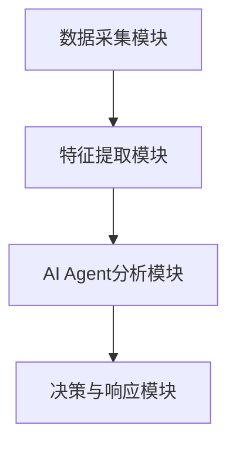

                 


# AI Agent在智能网络安全防御中的角色

> **关键词：** AI Agent, 智能网络安全, 入侵检测, 机器学习, 网络防御

> **摘要：**  
本文探讨了AI Agent在智能网络安全防御中的角色，分析了AI Agent的核心原理、算法模型及其在入侵检测中的具体应用。文章详细介绍了AI Agent的基本概念、技术优势以及在实际场景中的系统架构设计，并通过项目实战展示了AI Agent的实际应用效果。最后，文章总结了AI Agent在智能网络安全中的重要性，并提出了未来的研究方向。

---

## 第1章: AI Agent与智能网络安全概述

### 1.1 AI Agent的基本概念

#### 1.1.1 AI Agent的定义与特点

AI Agent（人工智能代理）是一种能够感知环境、自主决策并执行任务的智能实体。与传统程序不同，AI Agent具备以下特点：

- **自主性**：能够在没有外部干预的情况下自主运行。
- **反应性**：能够实时感知环境变化并做出响应。
- **目标导向性**：具备明确的目标，能够为实现目标而采取行动。
- **学习能力**：能够通过数据和经验不断优化自身性能。

#### 1.1.2 AI Agent在网络安全中的应用背景

随着网络安全威胁的日益复杂化，传统的基于规则的安全防护手段逐渐暴露出响应速度慢、适应性差等问题。AI Agent凭借其强大的学习能力和自主决策能力，为智能网络安全防御提供了新的解决方案。

#### 1.1.3 智能网络安全防御的核心概念

智能网络安全防御是指通过人工智能技术（如机器学习、深度学习）来提升网络安全防护能力的一种新型安全模式。其核心在于利用AI Agent的感知、决策和执行能力，实现对网络威胁的实时监测、智能分析和自主响应。

---

### 1.2 AI Agent与传统网络安全的对比

#### 1.2.1 传统网络安全的局限性

传统网络安全主要依赖于预定义的规则和签名，难以应对未知的、复杂的威胁。例如：

- **规则基础的检测**：依赖于预先定义的规则，无法有效检测未知威胁。
- **响应速度**：人工干预和固定规则导致响应速度较慢。
- **适应性差**：难以应对快速演变的威胁。

#### 1.2.2 AI Agent的优势与创新

AI Agent在网络安全中的应用具有以下优势：

- **自主学习能力**：能够通过历史数据和新数据不断优化模型。
- **实时响应**：能够快速识别和应对新的威胁。
- **适应性强**：能够适应不断变化的网络安全环境。

#### 1.2.3 AI Agent在网络安全中的角色定位

AI Agent在网络安全中扮演着多重角色，包括：

- **威胁检测**：实时监测网络流量，识别潜在威胁。
- **决策支持**：基于数据分析为安全决策提供支持。
- **自动响应**：在检测到威胁后，自动执行防御措施。

---

## 第2章: AI Agent的核心原理

### 2.1 AI Agent的基本原理

#### 2.1.1 AI Agent的感知与决策机制

AI Agent的感知机制通过收集网络中的数据（如流量、日志）来理解当前的网络安全状态。基于这些数据，AI Agent利用机器学习算法进行分析，生成决策。

#### 2.1.2 基于机器学习的AI Agent模型

AI Agent的核心是机器学习模型，常见的模型包括：

- **监督学习**：适用于已知威胁的分类任务。
- **无监督学习**：适用于发现未知威胁的异常检测。
- **强化学习**：适用于动态调整安全策略的场景。

#### 2.1.3 AI Agent的自主学习与进化

AI Agent通过持续学习和优化，不断提升自身的威胁检测和响应能力。例如，基于强化学习的AI Agent可以通过奖励机制不断优化其决策策略。

---

### 2.2 AI Agent的关键技术

#### 2.2.1 自然语言处理在AI Agent中的应用

自然语言处理（NLP）技术用于分析安全报告、日志等文本数据，帮助AI Agent理解上下文信息。

#### 2.2.2 计算机视觉在AI Agent中的应用

计算机视觉技术用于分析网络中的图像数据，如监控画面中的异常行为检测。

#### 2.2.3 自监督学习在AI Agent中的应用

自监督学习技术适用于数据不足的情况，能够通过自我监督的方式进行模型训练。

---

## 第3章: AI Agent在入侵检测中的应用

### 3.1 入侵检测的基本概念

#### 3.1.1 入侵检测的定义与分类

入侵检测系统（IDS）是一种用于监测网络或计算机系统中是否存在未经授权的访问或异常行为的技术。常见的入侵检测方法包括：

- **基于主机的入侵检测系统（HIDS）**：部署在单个主机上，检测该主机上的异常行为。
- **基于网络的入侵检测系统（NIDS）**：部署在网络中，监测整个网络的流量。

#### 3.1.2 AI Agent在入侵检测中的优势

AI Agent能够通过机器学习模型实现对入侵行为的智能识别和分类，显著提高检测的准确性和效率。

---

### 3.2 基于AI Agent的入侵检测系统设计

#### 3.2.1 系统架构设计

基于AI Agent的入侵检测系统通常包括以下组件：

1. **数据采集模块**：负责收集网络流量、日志等数据。
2. **特征提取模块**：从原始数据中提取有用的特征。
3. **AI Agent分析模块**：利用机器学习模型进行威胁检测。
4. **决策与响应模块**：根据检测结果采取相应的安全措施。

#### 3.2.2 数据采集与处理

数据采集是入侵检测的第一步，常见的数据源包括网络流量、系统日志、用户行为数据等。数据预处理步骤包括数据清洗、特征提取和数据标准化。

---

### 3.3 实际案例分析

#### 3.3.1 某企业网络入侵检测案例

假设某企业部署了一种基于AI Agent的入侵检测系统，该系统能够实时监测网络流量，并利用机器学习模型识别异常行为。在实际运行中，该系统成功检测并阻止了一次针对企业服务器的DDoS攻击。

#### 3.3.2 AI Agent在入侵检测中的具体表现

通过实验数据对比，基于AI Agent的入侵检测系统在准确率和召回率上均优于传统入侵检测系统。

---

## 第4章: AI Agent的算法原理与数学模型

### 4.1 AI Agent的算法原理

#### 4.1.1 监督学习在AI Agent中的应用

监督学习是一种基于标签数据的机器学习方法，常用于分类任务。例如，可以利用随机森林算法对网络流量进行分类，识别正常流量和异常流量。

#### 4.1.2 无监督学习在AI Agent中的应用

无监督学习适用于无标签数据的分析，常用于异常检测。例如，可以利用K-means算法对网络流量进行聚类分析，识别异常流量。

#### 4.1.3 强化学习在AI Agent中的应用

强化学习通过奖励机制优化AI Agent的决策过程。例如，可以利用Q-learning算法优化AI Agent的安全策略。

---

### 4.2 AI Agent的数学模型

#### 4.2.1 监督学习模型

随机森林是一种常用的监督学习算法，其数学模型如下：

$$
y = \text{sign}(\sum_{i=1}^{n} w_i x_i)
$$

其中，$w_i$ 是特征权重，$x_i$ 是输入特征，$y$ 是输出类别。

#### 4.2.2 无监督学习模型

K-means是一种常用的无监督学习算法，其目标是最小化簇内距离平方和：

$$
\text{minimize} \sum_{i=1}^{k} \sum_{j=1}^{n_i} \|x_j - c_i\|^2
$$

其中，$k$ 是簇的数量，$c_i$ 是第$i$个簇的中心，$x_j$ 是数据点。

---

## 第5章: 系统分析与架构设计方案

### 5.1 系统架构设计

基于AI Agent的入侵检测系统架构如下：



---

## 第6章: 项目实战

### 6.1 环境安装

以下是安装所需工具和库的命令示例：

```bash
pip install scikit-learn
pip install tensorflow
pip install matplotlib
```

---

### 6.2 核心代码实现

以下是入侵检测模型的Python实现示例：

```python
from sklearn.ensemble import RandomForestClassifier
from sklearn.model_selection import train_test_split
import pandas as pd

# 数据加载
data = pd.read_csv('network_traffic.csv')

# 特征与目标分离
X = data.drop('label', axis=1)
y = data['label']

# 数据分割
X_train, X_test, y_train, y_test = train_test_split(X, y, test_size=0.2)

# 模型训练
model = RandomForestClassifier()
model.fit(X_train, y_train)

# 模型预测
y_pred = model.predict(X_test)
```

---

## 第7章: 总结与扩展阅读

### 7.1 最佳实践

- 数据预处理是关键，确保数据质量和完整性。
- 定期更新模型，以适应新的威胁。

### 7.2 小结

本文详细探讨了AI Agent在智能网络安全防御中的角色，分析了其核心原理和实际应用。通过案例分析和系统设计，展示了AI Agent在入侵检测中的巨大潜力。

### 7.3 注意事项

- 数据隐私和模型解释性是实际应用中的重要问题。
- 模型的泛化能力需要通过交叉验证等方法进行评估。

### 7.4 拓展阅读

- 《机器学习实战》
- 《深度学习》

---

**作者：AI天才研究院/AI Genius Institute & 禅与计算机程序设计艺术/Zen And The Art of Computer Programming**

---

以上是文章的完整目录和内容框架，涵盖了从基础概念到实际应用的各个方面，结合了理论分析和实战案例，旨在为读者提供全面而深入的了解。

