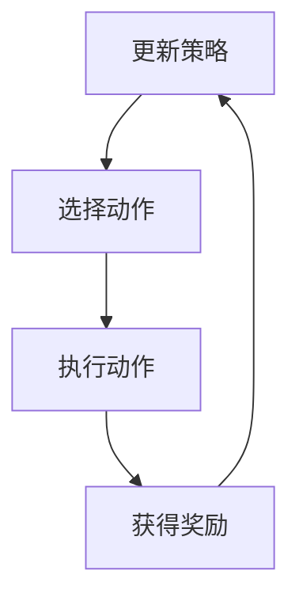
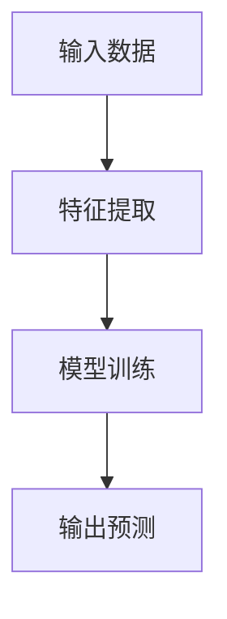
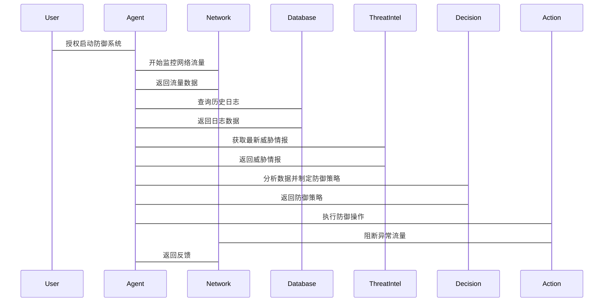

                 


# AI Agent在智能网络安全防御系统中的角色

**关键词：** AI Agent, 智能网络安全, 防御系统, 强化学习, 网络安全威胁

**摘要：**  
随着网络安全威胁的日益复杂化和智能化，传统的被动防御手段已难以应对新型攻击方式。AI Agent（人工智能代理）作为一种智能化的安全防御工具，通过自主学习和决策能力，能够实时感知网络环境，识别潜在威胁，并采取相应的防御措施。本文将详细探讨AI Agent在智能网络安全防御系统中的角色，分析其核心概念、算法原理、系统架构以及实际应用场景，揭示其在网络安全领域的巨大潜力和应用价值。

---

## 第一章: AI Agent的基本概念与背景

### 1.1 AI Agent的定义与特点
#### 1.1.1 AI Agent的定义  
AI Agent是一种能够感知环境、自主决策并采取行动的智能实体。在网络安全领域，AI Agent通常指具备学习和推理能力的软件系统，能够实时分析网络流量、识别异常行为，并执行防御操作。

#### 1.1.2 AI Agent的核心特点  
- **自主性**：AI Agent能够独立执行任务，无需人工干预。  
- **反应性**：能够实时感知环境变化并迅速做出反应。  
- **学习性**：通过机器学习算法不断优化自身的决策能力。  
- **适应性**：能够根据新的威胁情报动态调整防御策略。  

#### 1.1.3 AI Agent与传统安全防御的区别  
传统的网络安全防御系统通常依赖预定义的规则和签名，难以应对未知的零日攻击。而AI Agent通过学习和推理，能够识别未知威胁，并动态调整防御策略，具有更强的适应性和主动性。

### 1.2 智能网络安全防御的背景  
#### 1.2.1 网络安全面临的挑战  
- 网络攻击手段日益复杂化，传统的防御方法已难以应对。  
- 零日攻击、APT（高级持续性威胁）等新型攻击方式对传统防御系统构成巨大挑战。  
- 网络环境的动态变化要求防御系统具备更强的适应性和实时性。  

#### 1.2.2 AI技术在网络安全中的应用现状  
- AI技术广泛应用于威胁检测、入侵防御、流量分析等领域。  
- 基于AI的网络安全解决方案正在逐步取代传统的基于规则的防御系统。  

#### 1.2.3 AI Agent在智能防御中的作用  
AI Agent通过实时监控网络流量、分析日志数据、识别异常行为，能够快速发现潜在威胁，并采取相应的防御措施，如阻断攻击、隔离受感染设备等。其智能化特性使其能够应对复杂的网络安全威胁。

---

## 第二章: AI Agent的核心概念与原理

### 2.1 AI Agent的核心概念
#### 2.1.1 状态感知  
AI Agent通过传感器或数据采集模块获取网络环境的状态信息，包括网络流量、系统日志、用户行为等。  
**示例：** 通过分析网络流量，AI Agent可以识别出异常流量模式，如DDoS攻击的特征。

#### 2.1.2 行动决策  
AI Agent根据感知到的环境状态，结合历史数据和当前威胁情报，利用机器学习算法进行推理和决策，确定最佳的防御行动。  
**示例：** 当检测到可疑的登录行为时，AI Agent可以决定执行账号锁定或触发警报。

#### 2.1.3 自适应学习  
AI Agent通过强化学习、监督学习等算法，不断优化自身的决策模型，提升威胁检测和防御的准确性。  
**数学模型：** 强化学习的目标函数可以表示为：  
$$ V(s) = \max_{a} [ r + V(s') ] $$
其中，$s$ 是当前状态，$s'$ 是下一个状态，$r$ 是奖励。

### 2.2 AI Agent的类型
#### 2.2.1 监督式AI Agent  
- 基于监督学习算法，通过标记的训练数据进行分类和预测。  
- 适用于已知威胁的检测和防御。  
**示例：** 使用标记的数据训练一个分类器，识别垃圾邮件。

#### 2.2.2 无监督式AI Agent  
- 基于无监督学习算法，通过聚类、异常检测等技术发现未知威胁。  
- 适用于未知威胁的检测。  
**示例：** 使用聚类算法发现网络中的异常行为模式。

#### 2.2.3 强化学习AI Agent  
- 基于强化学习算法，通过与环境的交互不断优化决策策略。  
- 适用于动态变化的网络安全环境。  
**数学模型：** 强化学习的目标函数可以表示为：  
$$ Q(s, a) = r + \gamma \max_{a'} Q(s', a') $$
其中，$\gamma$ 是折扣因子。

### 2.3 AI Agent的实体关系图
```mermaid
er
  actor: 用户
  agent: AI Agent
  threat: �威脅
  action: 行動
  status: 狀況
  actor --> agent: 用戶授權
  threat --> agent: 檢測威脅
  agent --> action: 設計行動
  action --> status: 更新狀態
```

---

## 第三章: AI Agent的算法原理

### 3.1 强化学习算法
#### 3.1.1 算法流程

- **步骤1：** 初始化状态$s$。  
- **步骤2：** 选择一个动作$a$，并执行该动作。  
- **步骤3：** 获得环境的反馈，包括奖励$r$和新的状态$s'$。  
- **步骤4：** 更新策略，以最大化未来的累积奖励。

#### 3.1.2 数学模型
$$ Q(s, a) = r + \gamma \max_{a'} Q(s', a') $$

### 3.2 监督学习算法
#### 3.2.1 算法流程

- **步骤1：** 输入数据经过特征提取模块，提取关键特征。  
- **步骤2：** 使用训练数据对模型进行训练。  
- **步骤3：** 模型输出预测结果，用于分类或回归任务。

#### 3.2.2 数学模型
$$ y = \theta^T x + b $$

---

## 第四章: 系统分析与架构设计

### 4.1 系统架构
#### 4.1.1 系统架构图
```mermaid
graph TD
  Agent --> [网络流量分析]
  Agent --> [日志数据分析]
  Agent --> [威胁情报整合]
  Agent --> [决策与行动]
```

#### 4.1.2 系统功能设计
- **网络流量分析：** 监控网络流量，识别异常行为。  
- **日志数据分析：** 分析系统日志，发现潜在威胁。  
- **威胁情报整合：** 结合外部威胁情报，优化防御策略。  
- **决策与行动：** 根据分析结果，采取防御措施，如阻断攻击、报警等。

### 4.2 系统交互流程图


---

## 第五章: 项目实战

### 5.1 环境配置
- **工具与库：** Python、TensorFlow、Keras、Scikit-learn、NetworkX等。  
- **数据来源：** 网络流量日志、系统日志、第三方威胁情报数据。

### 5.2 核心代码实现
#### 5.2.1 强化学习AI Agent实现
```python
import numpy as np
import tensorflow as tf

class AI-Agent:
    def __init__(self):
        self.model = self.build_model()
    
    def build_model(self):
        model = tf.keras.Sequential([
            tf.keras.layers.Dense(64, activation='relu'),
            tf.keras.layers.Dense(1, activation='linear')
        ])
        model.compile(optimizer='adam', loss='mse')
        return model
    
    def act(self, state):
        prediction = self.model.predict(np.array([state]))
        return prediction[0][0]
    
    def learn(self, state, action, reward, next_state):
        self.model.fit(np.array([state]), np.array([reward]), epochs=1, verbose=0)
```

#### 5.2.2 网络流量分析实现
```python
import networkx as nx

def analyze_traffic(data):
    graph = nx.DiGraph()
    for edge in data:
        graph.add_edge(edge[0], edge[1])
    return graph
```

### 5.3 案例分析
#### 5.3.1 案例背景
某企业网络遭受DDoS攻击，传统的防火墙规则无法有效防御。引入AI Agent后，系统能够实时识别异常流量并自动阻断攻击。

#### 5.3.2 实施过程
1. 数据采集：收集网络流量日志。  
2. 数据分析：使用AI Agent分析流量，识别出攻击模式。  
3. 决策与行动：AI Agent触发防火墙规则，阻断攻击流量。  
4. 反馈与优化：根据攻击事件优化模型参数，提升检测准确率。

---

## 第六章: 最佳实践与未来展望

### 6.1 最佳实践
- **数据质量：** 确保训练数据的多样性和代表性。  
- **模型更新：** 定期更新模型参数，应对新的威胁。  
- **人机协作：** 结合人类专家的判断，避免AI决策的误判。

### 6.2 小结
AI Agent通过其智能化的感知、决策和学习能力，正在改变传统的网络安全防御方式。随着AI技术的不断发展，AI Agent将在未来的网络安全防御中发挥越来越重要的作用。

### 6.3 未来展望
- **更智能的决策算法：** 结合多种机器学习算法，提升决策的准确性和效率。  
- **多Agent协作：** 实现多个AI Agent的协作，构建更复杂的防御系统。  
- **边缘计算应用：** 将AI Agent部署在边缘设备，提升实时响应能力。  

---

**作者：AI天才研究院/AI Genius Institute & 禅与计算机程序设计艺术 /Zen And The Art of Computer Programming**

