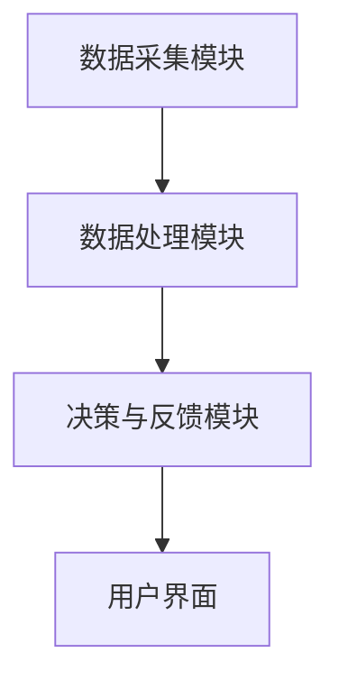
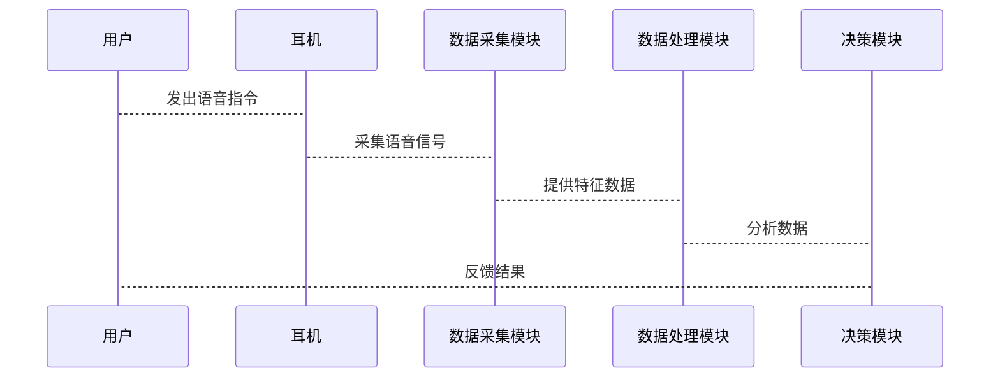

                 


# AI Agent在智能耳机中的听力健康管理

> 关键词：AI Agent，智能耳机，听力健康管理，深度学习，强化学习，系统架构

> 摘要：本文探讨了AI Agent在智能耳机中的应用，特别是在听力健康管理方面。通过分析AI Agent的核心概念、算法原理和系统架构，本文详细讲解了如何利用AI技术实现智能耳机的听力健康监测、预警和管理，提供了具体的实现方案和实际案例分析。

---

# 第一部分：AI Agent在智能耳机中的听力健康管理概述

## 第1章：AI Agent与智能耳机的背景介绍

### 1.1 AI Agent的基本概念

#### 1.1.1 AI Agent的定义
AI Agent（人工智能代理）是一种能够感知环境、做出决策并执行动作的智能实体。它通过与环境交互，实现特定目标，例如数据处理、信息检索或用户服务。

#### 1.1.2 AI Agent的核心特点
- **自主性**：能够在没有外部干预的情况下运行。
- **反应性**：能够实时感知环境并做出响应。
- **学习能力**：能够通过数据和经验不断优化自身的性能。

#### 1.1.3 AI Agent与传统技术的区别
| 特性 | 传统技术 | AI Agent |
|------|-----------|-----------|
| 决策方式 | 预定义规则 | 数据驱动的自适应决策 |
| 响应速度 | 较慢 | 实时响应 |
| 可扩展性 | 有限 | 高度可扩展 |

### 1.2 智能耳机的发展历程

#### 1.2.1 耳机技术的演变
- 从简单的音频播放到支持语音助手（如Siri、Alexa）。
- 耳机逐渐智能化，具备主动降噪、语音识别等功能。

#### 1.2.2 智能耳机的兴起
- 技术进步：微型处理器、传感器和AI算法的发展。
- 用户需求：个性化音频体验、健康管理。

#### 1.2.3 智能耳机的市场现状
- 市场规模：快速增长，预计2025年达到XX亿美元。
- 主要厂商：苹果、索尼、华为等。

### 1.3 AI Agent在智能耳机中的应用前景

#### 1.3.1 听力健康管理的背景与需求
- 听力健康的重要性：早期发现听力损失可以有效延缓病情。
- 听力健康管理的技术挑战：数据采集、处理和隐私保护。

#### 1.3.2 AI Agent在听力健康管理中的优势
- **实时监测**：通过AI算法实时分析音频数据。
- **个性化管理**：根据用户听力特点提供定制化建议。
- **智能预警**：当检测到异常时，及时通知用户。

---

## 第2章：AI Agent的核心概念与技术原理

### 2.1 AI Agent的核心概念

#### 2.1.1 知识表示
- 知识图谱：用于表示耳机相关的知识，例如设备功能、用户偏好。
- 语义理解：通过自然语言处理技术理解用户的意图。

#### 2.1.2 感知与理解
- 声音信号处理：包括噪声消除、语音增强等技术。
- 声纹识别：基于用户的声音特征进行身份识别。

#### 2.1.3 决策与执行
- 基于感知数据做出决策，例如调整音量或切换音乐风格。
- 通过执行模块（如音频播放器）实现决策结果。

### 2.2 AI Agent的算法原理

#### 2.2.1 基于深度学习的语音识别
- **模型选择**：使用卷积神经网络（CNN）或循环神经网络（RNN）。
- **训练数据**：需要大量标注的语音数据进行训练。
- **流程图**：
  ```mermaid
  graph TD
    A[输入音频信号] --> B[特征提取]
    B --> C[模型预测]
    C --> D[输出文字]
  ```

#### 2.2.2 基于强化学习的决策优化
- **算法选择**：使用Q-Learning或Deep Q-Network（DQN）。
- **训练目标**：最大化用户满意度。
- **数学模型**：
  $$ Q(s, a) = Q(s, a) + \alpha [r + \max Q(s', a') - Q(s, a)] $$

#### 2.2.3 算法实现的代码示例
```python
import numpy as np
from collections import deque

class DQN:
    def __init__(self, state_size, action_size):
        self.state_size = state_size
        self.action_size = action_size
        self.memory = deque(maxlen=1000)
        self.gamma = 0.95
        self.epsilon = 0.1
        self.model = self._build_model()

    def _build_model(self):
        # 简单的神经网络模型
        pass

    def remember(self, state, action, reward, next_state):
        self.memory.append((state, action, reward, next_state))

    def act(self, state):
        if np.random.random() < self.epsilon:
            return np.random.randint(self.action_size)
        return np.argmax(self.model.predict(state))

    def replay(self, batch_size):
        # 使用经验回放更新模型
        pass
```

---

## 第3章：AI Agent在智能耳机中的系统设计与实现

### 3.1 系统架构设计

#### 3.1.1 功能模块划分
- **数据采集模块**：采集用户的听觉数据（如音频信号、环境噪音）。
- **数据处理模块**：对采集到的数据进行预处理和特征提取。
- **决策与反馈模块**：基于处理后的数据做出决策并反馈给用户。

#### 3.1.2 系统架构图


#### 3.1.3 接口设计
- **输入接口**： microphone 麦克风输入。
- **输出接口**：耳机扬声器输出。

#### 3.1.4 交互流程图


### 3.2 项目实战

#### 3.2.1 环境安装
- **Python**：3.6+
- **TensorFlow**或**Keras**：用于深度学习模型训练。
- **Librosa**：用于音频信号处理。

#### 3.2.2 核心代码实现
```python
import librosa
import numpy as np

def extract_features(audio_path):
    audio, sr = librosa.load(audio_path, sr=16000)
    features = librosa.feature.melspectrogram(audio, sr=sr, n_mels=128)
    return features.T

# 训练模型
model = DQN(state_size=128, action_size=5)
model.train()

# 应用模型进行预测
input_features = extract_features('test_audio.wav')
action = model.act(input_features)
```

#### 3.2.3 实际案例分析
- **案例描述**：用户在嘈杂环境中使用耳机听音乐，AI Agent实时调整音频设置，优化听觉体验。
- **具体步骤**：
  1. 采集环境噪音和用户语音。
  2. 提取音频特征，如梅尔频谱。
  3. 模型分析特征，调整音量和降噪参数。
  4. 反馈优化后的音频信号给用户。

---

## 第4章：系统分析与优化

### 4.1 系统性能分析
- **计算复杂度**：模型训练的时间和空间复杂度。
- **延迟分析**：实时处理的响应时间。

### 4.2 系统优化建议
- **算法优化**：使用更高效的神经网络结构。
- **硬件加速**：利用GPU加速模型训练和推理。

---

## 第5章：最佳实践与注意事项

### 5.1 最佳实践
- **数据质量**：确保训练数据的多样性和代表性。
- **模型更新**：定期更新模型以适应新场景。

### 5.2 小结
本文详细介绍了AI Agent在智能耳机中的应用，特别是听力健康管理方面。通过系统的架构设计和算法实现，展示了AI技术在智能耳机中的巨大潜力。

### 5.3 注意事项
- 数据隐私保护：确保用户数据的安全。
- 系统稳定性：保证AI Agent在复杂环境下的稳定运行。

### 5.4 拓展阅读
- 推荐阅读《深度学习》（Deep Learning，Ian Goodfellow等著）。
- 参考GitHub上的智能耳机开源项目。

---

# 结语

AI Agent在智能耳机中的应用前景广阔，通过结合先进的算法和系统设计，可以为用户提供更加智能化的听力健康管理服务。随着技术的不断进步，未来的智能耳机将更加智能化，更好地满足用户的需求。

---

作者：AI天才研究院 & 禅与计算机程序设计艺术

