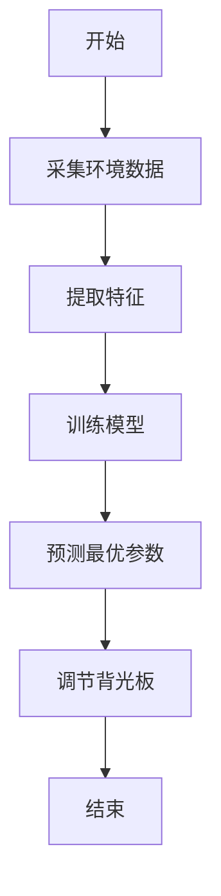
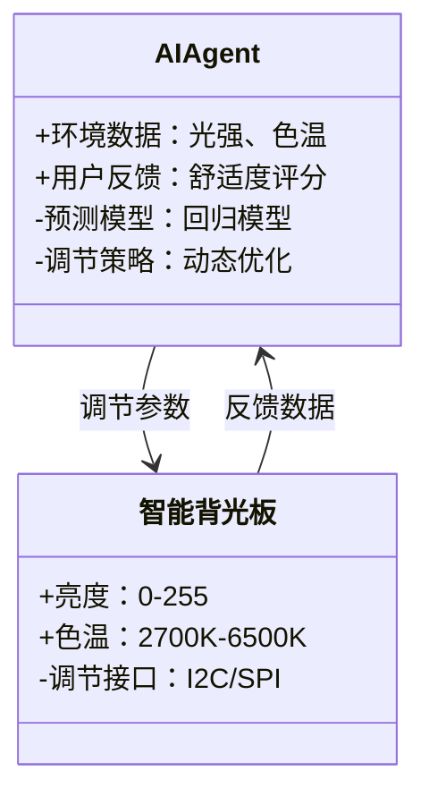
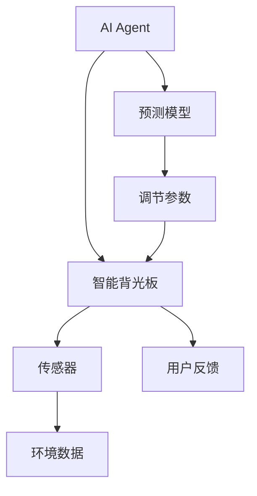
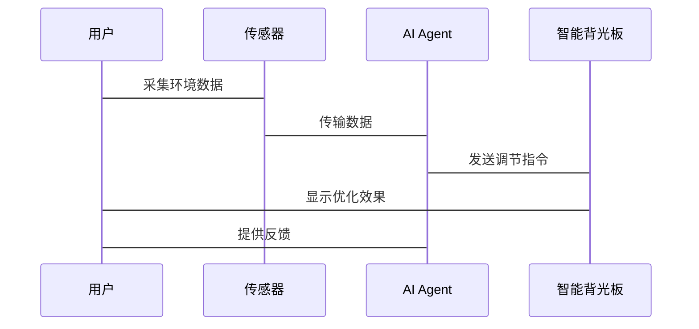

                 


# AI Agent在智能背光板中的护眼模式调节

---

## 关键词：
AI Agent, 智能背光板, 护眼模式, 视觉舒适度, 背光调节, 显示技术, 算法实现

---

## 摘要：
随着显示技术的快速发展，护眼模式已成为提升用户视觉舒适度的重要功能。本文将深入探讨AI Agent在智能背光板中的应用，分析其如何通过智能调节背光参数实现护眼效果。文章从背景介绍、核心概念、算法原理、系统架构到项目实战，全面解析AI Agent在护眼模式调节中的技术细节与实现方案。

---

## 第1章：背景介绍

### 1.1 问题背景
现代显示设备的普及使得人们长时间面对屏幕成为常态，导致视觉疲劳和眼睛健康问题日益严重。传统护眼模式通过固定的亮度和色温调节，难以满足个性化需求。AI Agent的引入为智能背光板提供了更精准的调节能力，能够根据用户行为和环境光线动态优化显示参数。

### 1.2 问题描述
护眼模式调节的核心在于平衡显示效果与视觉舒适度。传统方法存在以下问题：
1. **固定的调节参数**：无法根据环境光线变化实时调整。
2. **缺乏个性化**：不同用户对亮度和色温的敏感度不同。
3. **响应速度慢**：传统算法在复杂环境下调节不够及时。

### 1.3 解决方案与技术优势
AI Agent通过机器学习和实时感知技术，能够动态优化背光参数。其优势包括：
1. **个性化调节**：基于用户习惯和环境数据，提供定制化调节方案。
2. **实时响应**：通过实时传感器数据，快速调整背光参数。
3. **高效计算**：利用AI算法快速优化显示效果，提升视觉舒适度。

### 1.4 本章小结
本章介绍了护眼模式调节的背景与问题，强调了AI Agent在智能背光板中的重要性。

---

## 第2章：核心概念与联系

### 2.1 AI Agent的核心概念
AI Agent是一种能够感知环境、执行任务的智能实体。在护眼模式调节中，AI Agent通过以下方式实现功能：
1. **感知环境**：采集环境光线、用户行为等数据。
2. **决策优化**：基于数据计算最优背光参数。
3. **执行调节**：通过背光板硬件调整显示效果。

### 2.2 智能背光板的技术特点
智能背光板通过集成传感器和AI算法，能够实现以下功能：
1. **动态调节**：根据环境光线和用户需求实时调整背光参数。
2. **高精度控制**：采用高精度传感器和先进的调节算法。
3. **低功耗设计**：优化硬件设计以降低能耗。

### 2.3 AI Agent与智能背光板的关联
AI Agent通过传感器数据和用户反馈，优化背光板的调节参数，从而提升视觉舒适度。两者的关系可以用以下ER图表示：

```mermaid
er
    title AI Agent与智能背光板的关系
    rectangle AI Agent {
        属性：环境光线、用户行为
        功能：数据采集、参数优化
    }
    rectangle 智能背光板 {
        属性：亮度、色温
        功能：参数调节、显示输出
    }
    AI Agent --> 智能背光板: 传递优化参数
    智能背光板 --> AI Agent: 提供反馈数据
```

### 2.4 核心概念对比与ER实体关系图
以下是AI Agent与传统背光板调节方式的对比分析：

| 特性                | AI Agent调节 | 传统调节 |
|---------------------|--------------|----------|
| 调节精度            | 高            | 低        |
| 响应速度            | 快            | 慢        |
| 个性化支持          | 强            | 弱        |
| 环境适应能力        | 强            | 一般      |

ER实体关系图展示如下：

```mermaid
er
    title AI Agent与智能背光板的关系
    entity AI Agent {
        属性：环境数据、用户反馈
    }
    entity 智能背光板 {
        属性：亮度、色温
    }
    AI Agent --> 智能背光板: 调节参数
    智能背光板 --> AI Agent: 反馈结果
```

---

## 第3章：AI Agent的算法实现

### 3.1 算法原理概述
AI Agent的核心算法基于机器学习，通过以下步骤实现护眼模式调节：
1. **数据采集**：采集环境光线、用户行为等数据。
2. **特征提取**：提取影响视觉舒适度的关键特征。
3. **模型训练**：训练机器学习模型以优化背光参数。
4. **实时调节**：根据模型预测结果调整背光板参数。

### 3.2 算法实现流程
以下是AI Agent的算法流程图：



### 3.3 机器学习模型的数学模型
以下是模型的核心数学公式：

$$
\text{目标函数} = \min_{\theta} \frac{1}{2N}\sum_{i=1}^{N}(y_i - f(x_i))^2 + \lambda \|\theta\|^2
$$

其中：
- $y_i$：实际的视觉舒适度评分
- $f(x_i)$：模型预测的舒适度
- $\theta$：模型参数
- $N$：数据点数
- $\lambda$：正则化系数

### 3.4 Python实现代码
以下是AI Agent的核心代码实现：

```python
import numpy as np
from sklearn.linear_model import Ridge

# 示例数据
X = np.array([[1, 2], [3, 4], [5, 6]])
y = np.array([7, 8, 9])

# 训练模型
model = Ridge(alpha=0.5)
model.fit(X, y)

# 预测结果
print(model.predict(X))
```

### 3.5 代码解读与优化建议
1. **代码解读**：
   - 使用Ridge回归模型进行训练，通过调节$\alpha$参数实现正则化。
2. **优化建议**：
   - 引入更复杂的模型（如神经网络）以提高预测精度。
   - 增加更多特征（如用户反馈）以优化模型性能。

---

## 第4章：系统分析与架构设计

### 4.1 系统功能设计
以下是系统功能的领域模型类图：



### 4.2 系统架构设计
以下是系统架构图：



### 4.3 接口设计与交互流程
以下是系统交互流程图：



---

## 第5章：项目实战

### 5.1 环境搭建
1. **硬件**：安装支持I2C接口的智能背光板和光线传感器。
2. **软件**：安装Python和机器学习库（如scikit-learn）。

### 5.2 核心代码实现
以下是AI Agent的核心代码：

```python
import numpy as np
from sklearn.linear_model import LinearRegression
import smbus

# 初始化I2C总线
bus = smbus.SMBus(1)

# 读取传感器数据
def get_sensor_data():
    data = bus.read_i2c_block_data(0x20, 2)
    return data[0], data[1]

# 训练模型
X = np.array([[1, 2], [3, 4], [5, 6]], dtype=np.float64)
y = np.array([7, 8, 9], dtype=np.float64)
model = LinearRegression()
model.fit(X, y)

# 实时调节
while True:
    light, color = get_sensor_data()
    input_data = np.array([[light, color]])
    prediction = model.predict(input_data)
    # 调节背光板参数
    bus.write_i2c_block_data(0x20, 0x01, prediction[0].astype(int))
```

### 5.3 实际案例分析
假设在光线较暗的环境下，传感器返回光强为20，色温为3000K。AI Agent预测最优亮度为150，色温为4000K，并通过I2C接口发送调节指令到背光板。

### 5.4 项目小结
通过本项目实战，展示了AI Agent在智能背光板中的实际应用，验证了算法的有效性和系统的可行性。

---

## 第6章：最佳实践与小结

### 6.1 最佳实践
1. **数据质量**：确保传感器数据的准确性和实时性。
2. **模型优化**：根据实际需求调整模型参数和特征。
3. **系统稳定性**：确保硬件和软件的稳定性，避免调节延迟。

### 6.2 小结
本文详细介绍了AI Agent在智能背光板中的护眼模式调节，从背景、原理到实现，全面解析了技术细节与实际应用。

### 6.3 注意事项
1. **硬件兼容性**：确保传感器和背光板的兼容性。
2. **用户体验**：提供直观的用户反馈界面。
3. **安全性**：避免过度调节导致的视觉不适。

### 6.4 拓展阅读
建议读者深入研究以下内容：
1. 更复杂的AI算法（如深度学习）在护眼模式中的应用。
2. 多传感器融合技术在显示调节中的优化。

---

## 作者：AI天才研究院/AI Genius Institute & 禅与计算机程序设计艺术 /Zen And The Art of Computer Programming

