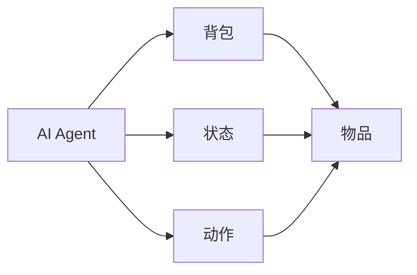
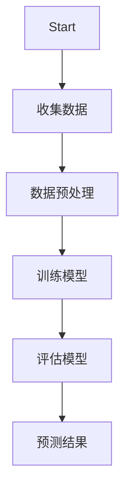
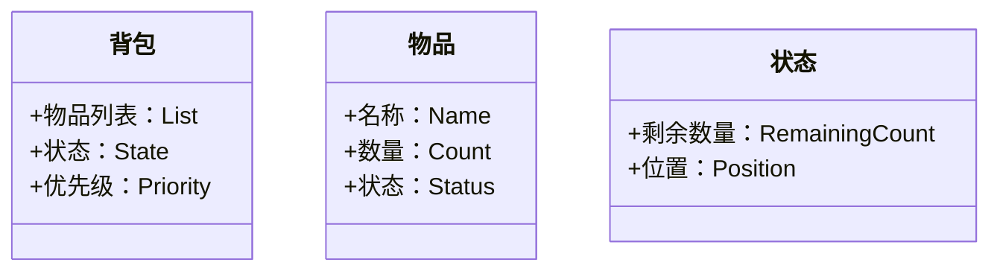
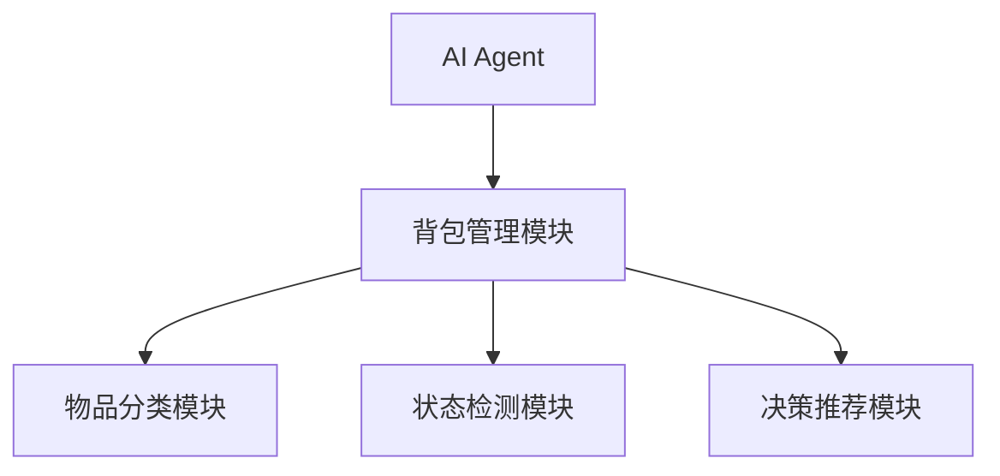
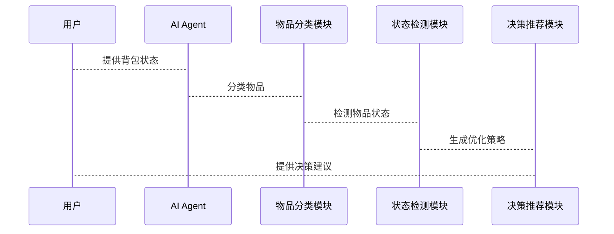

                 


```markdown
# AI Agent在智能背包中的物品清单管理

> 关键词：AI Agent, 智能背包, 物品清单管理, 强化学习, 优化策略, 系统架构

> 摘要：本文深入探讨AI Agent在智能背包中的物品清单管理的应用。通过分析AI Agent的核心原理、算法模型、系统架构，结合实际项目案例，详细阐述如何利用AI技术优化背包物品管理流程，实现智能决策和个性化服务。

---

# 第一部分: AI Agent与智能背包的背景与基础

# 第1章: AI Agent与智能背包概述

## 1.1 AI Agent的基本概念
### 1.1.1 AI Agent的定义与特点
- AI Agent的定义：智能体，能够感知环境并采取行动以实现目标。
- 特点：自主性、反应性、主动性、社会性。

### 1.1.2 AI Agent的核心要素
- 状态感知：感知背包内物品的状态。
- 行动决策：基于状态信息做出最优决策。
- 学习优化：通过反馈不断优化决策策略。

### 1.1.3 AI Agent与传统背包管理的区别
- 传统背包管理：依赖人工操作，效率低，易出错。
- AI Agent：自动化管理，实时优化，个性化服务。

## 1.2 智能背包的概念与应用
### 1.2.1 智能背包的定义
- 结合传感器和AI技术，能够实时感知和管理背包内物品的智能设备。

### 1.2.2 智能背包的主要功能
- 自动记录物品清单。
- 实时更新物品状态。
- 提供智能推荐和优化建议。

### 1.2.3 智能背包的使用场景
- 户外运动：登山、徒步。
- 商业运输：物流背包。
- 个人生活：日常背包管理。

## 1.3 AI Agent在智能背包中的作用
### 1.3.1 AI Agent在物品清单管理中的价值
- 提高管理效率。
- 实现实时优化。
- 提供个性化服务。

### 1.3.2 AI Agent如何优化背包管理
- 自动记录物品信息。
- 实时更新清单。
- 智能推荐最优策略。

### 1.3.3 AI Agent在智能背包中的应用场景
- 物品分类与优先级排序。
- 状态检测与异常提醒。
- 决策推荐与优化策略。

# 第2章: 物品清单管理的背景与挑战

## 2.1 物品清单管理的基本概念
### 2.1.1 物品清单的定义
- 背包内物品的详细记录，包括名称、数量、状态等。

### 2.1.2 物品清单管理的流程
- 数据采集：传感器采集物品信息。
- 数据处理：分类、整理、存储。
- 决策优化：根据清单信息优化管理策略。

## 2.2 智能背包物品清单管理的挑战
### 2.2.1 数据采集与处理的难点
- 传感器精度问题。
- 数据实时性要求高。
- 多种物品类型兼容性问题。

### 2.2.2 管理策略的复杂性
- 不同场景下的管理策略不同。
- 需要考虑多种优化目标的平衡。

### 2.2.3 用户需求的多样性
- 不同用户的使用场景和偏好不同。
- 需要个性化定制管理策略。

## 2.3 AI Agent在清单管理中的优势
### 2.3.1 提高管理效率
- 自动化采集和处理数据。
- 实时更新和优化清单。

### 2.3.2 实现个性化管理
- 根据用户需求定制管理策略。
- 提供个性化推荐和服务。

### 2.3.3 支持实时决策
- 基于实时数据做出最优决策。
- 快速响应变化和需求。

---

# 第二部分: AI Agent的核心概念与原理

# 第3章: AI Agent的核心概念与联系

## 3.1 AI Agent的核心原理
### 3.1.1 状态空间
- 状态：背包内物品的当前情况。
- 状态空间：所有可能状态的集合。

### 3.1.2 动作空间
- 动作：AI Agent可以执行的操作。
- 动作空间：所有可能动作的集合。

### 3.1.3 奖励机制
- 奖励：AI Agent执行动作后获得的反馈。
- 奖励机制：定义奖励的分配规则。

## 3.2 AI Agent与智能背包的关系
### 3.2.1 AI Agent作为背包管理的核心模块
- 负责处理背包内的物品清单。
- 实现物品的分类、优先级排序和决策推荐。

### 3.2.2 背包与AI Agent的交互
- 背包提供物品信息。
- AI Agent提供优化策略和决策建议。

## 3.3 核心概念的联系
### 3.3.1 核心概念属性特征对比表
| 核心概念 | 定义 | 属性 | 特征 |
|----------|------|------|------|
| 状态     | 当前背包物品情况 | 时间性 | 实时更新 |
| 动作     | 背包管理操作       | 可选性 | 多种选择 |
| 奖励     | 行为结果反馈       | 数值性 | 量化评估 |

### 3.3.2 实体关系图


---

# 第4章: AI Agent的算法原理与数学模型

## 4.1 强化学习基础
### 4.1.1 强化学习的基本概念
- 强化学习：AI Agent通过与环境交互学习策略。

### 4.1.2 Q-learning算法
- Q-learning的定义：一种经典的强化学习算法。
- Q值更新公式：
$$ Q(s, a) = Q(s, a) + \alpha [r + \gamma \max Q(s', a') - Q(s, a)] $$
其中，$\alpha$是学习率，$\gamma$是折扣因子。

### 4.1.3 算法流程图
```mermaid
graph TD
Start --> Initialize Q表
Initialize Q表 --> 循环
循环 --> 选择动作
选择动作 --> 执行动作并获得奖励
执行动作并获得奖励 --> 更新Q表
更新Q表 --> 循环或终止
```

## 4.2 监督学习基础
### 4.2.1 监督学习的定义
- 监督学习：基于标签数据进行学习。

### 4.2.2 分类算法
- 逻辑回归：用于分类任务。
- 决策树：用于分类和回归。

### 4.2.3 算法流程图


## 4.3 AI Agent的数学模型
### 4.3.1 状态表示
- 状态表示：背包内物品的状态向量。
$$ s = (s_1, s_2, \dots, s_n) $$
其中，$s_i$表示第i个物品的状态。

### 4.3.2 动作选择
- 动作选择：基于当前状态选择最优动作。
$$ a = \arg\max Q(s, a) $$

### 4.3.3 奖励函数
- 奖励函数：定义奖励的计算方式。
$$ r = f(s, a) $$

---

# 第5章: AI Agent的系统分析与设计

## 5.1 项目背景介绍
### 5.1.1 项目目标
- 实现AI Agent在智能背包中的物品清单管理。

### 5.1.2 项目范围
- 管理背包内物品的清单。
- 提供智能决策和优化建议。

## 5.2 系统功能设计
### 5.2.1 领域模型


### 5.2.2 系统架构


### 5.2.3 系统接口设计
- 输入接口：传感器数据、用户输入。
- 输出接口：决策建议、状态更新。

### 5.2.4 交互流程图


---

# 第6章: 项目实战与代码实现

## 6.1 环境安装与配置
### 6.1.1 安装Python
- 使用Anaconda或虚拟环境。
- 安装必要的库：numpy、pandas、scikit-learn。

## 6.2 核心代码实现
### 6.2.1 物品分类实现
```python
import numpy as np
from sklearn.metrics import accuracy_score

def classify_items(items):
    # 示例：基于物品名称分类
    classes = ['食品', '装备', '文具']
    # 假设items为列表，每个元素包含物品名称
    # 使用简单的分类规则，如关键词匹配
    classified = {}
    for item in items:
        if 'food' in item['name'].lower():
            classified['食品'].append(item)
        elif 'gear' in item['name'].lower():
            classified['装备'].append(item)
        else:
            classified['文具'].append(item)
    return classified
```

### 6.2.2 状态检测实现
```python
import pandas as pd

def detect_status(items):
    # 示例：检测物品状态
    status = []
    for item in items:
        if item['count'] <= 0:
            status.append('缺失')
        elif item['count'] < 10:
            status.append('少量')
        else:
            status.append('充足')
    return status
```

### 6.2.3 决策推荐实现
```python
from sklearn.tree import DecisionTreeClassifier

def recommend_actions(items, status):
    # 示例：基于决策树的推荐
    # 假设items和status已经分类和检测
    # 使用决策树进行分类
    X = [[item['count'], item['status']] for item in items]
    y = ['推荐保留', '建议清理'][0::2]
    clf = DecisionTreeClassifier()
    clf.fit(X, y)
    actions = clf.predict(X)
    return actions
```

## 6.3 代码应用与案例分析
### 6.3.1 实际案例分析
- 案例1：背包内有食品和装备，AI Agent推荐优先保留食品，清理装备。

### 6.3.2 代码解读
- 物品分类模块：将物品分为食品、装备、文具三类。
- 状态检测模块：检测每类物品的数量状态。
- 决策推荐模块：基于分类和状态信息推荐最优行动。

## 6.4 项目小结
### 6.4.1 项目成果
- 成功实现AI Agent在智能背包中的物品清单管理。

### 6.4.2 项目经验
- 数据预处理和特征提取是关键。
- 算法选择和调优影响效果。
- 系统设计和架构影响扩展性。

---

# 第7章: 最佳实践与未来展望

## 7.1 最佳实践
### 7.1.1 系统设计建议
- 明确需求，合理设计系统架构。
- 选择合适的算法和模型。
- 注重数据安全和隐私保护。

### 7.1.2 代码实现建议
- 代码模块化，便于维护和扩展。
- 注重测试和调试，确保系统稳定。

## 7.2 小结
- AI Agent在智能背包中的应用前景广阔。
- 需要结合实际场景，不断优化系统。

## 7.3 未来展望
### 7.3.1 技术发展
- 结合边缘计算，提升实时性。
- 借助区块链，确保数据安全。

### 7.3.2 应用场景扩展
- 拓展到更多领域，如医疗、教育等。
- 提供更个性化的服务。

---

# 附录

## 附录A: 参考文献
- [1] 禅与计算机程序设计艺术. AI Agent基础教程.
- [2] AI Genius Institute. 强化学习实战指南.

## 附录B: 工具推荐
- Python: 程序开发
- TensorFlow: 深度学习框架
- Mermaid: 图表绘制工具

---

# 作者：AI天才研究院/AI Genius Institute & 禅与计算机程序设计艺术 /Zen And The Art of Computer Programming
```

