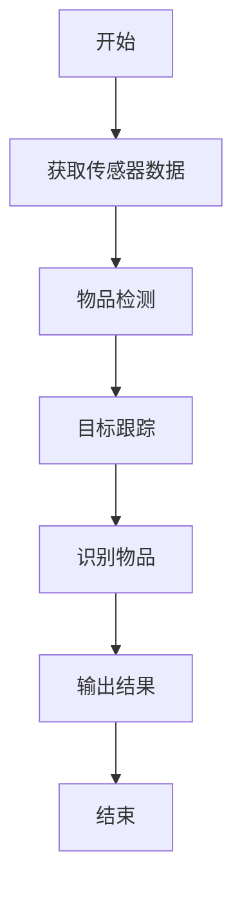
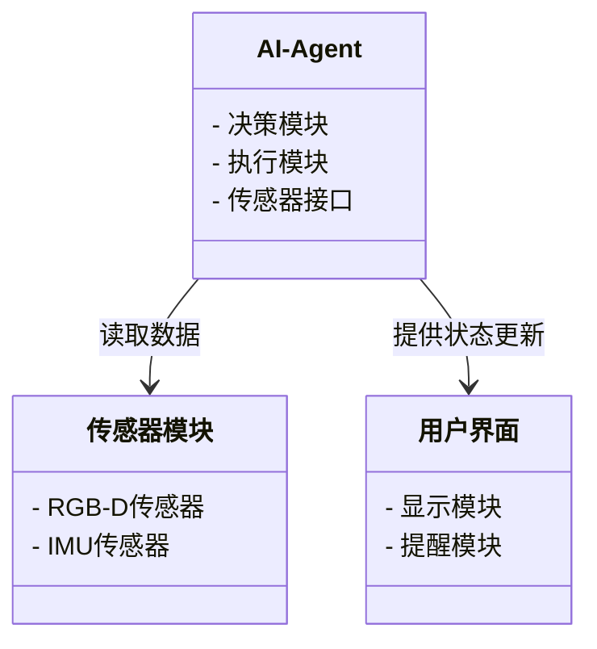
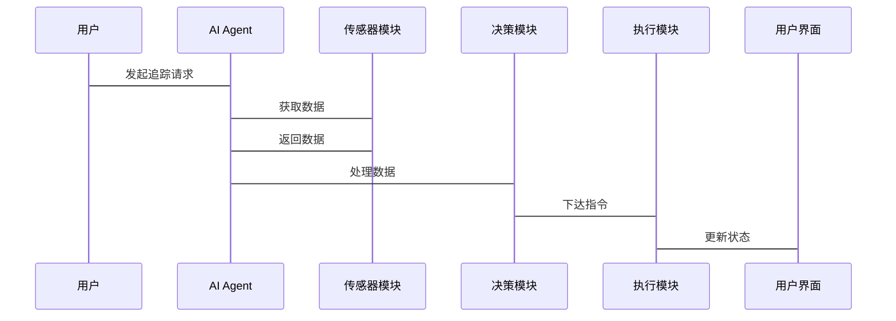

                 


# 目录大纲：《AI Agent在智能背包中的物品追踪》

---

# AI Agent在智能背包中的物品追踪

> **关键词**：AI Agent, 物品追踪, 智能背包, 传感器数据融合, 多目标跟踪, 自动决策系统  
> **摘要**：本文详细探讨了AI Agent在智能背包中的物品追踪应用，从基础概念、核心算法到系统设计和项目实战，全面解析如何利用AI技术实现智能背包中的物品自动识别与追踪。文章结合理论与实践，通过具体案例分析，展示了AI Agent在智能背包中的独特优势和实际应用价值。

---

## 目录

### 第一部分: AI Agent与智能背包物品追踪的背景与基础

#### 第1章: AI Agent与智能背包概述
1.1 AI Agent的基本概念  
1.1.1 什么是AI Agent  
1.1.2 AI Agent的核心特征  
1.1.3 AI Agent在智能背包中的应用  

1.2 智能背包的基本结构  
1.2.1 智能背包的功能模块  
1.2.2 智能背包的硬件组成  
1.2.3 智能背包的软件架构  

1.3 物品追踪的必要性与应用场景  
1.3.1 物品追踪的基本概念  
1.3.2 智能背包中物品追踪的场景  
1.3.3 物品追踪的技术挑战  

1.4 本章小结  

#### 第2章: AI Agent在物品追踪中的核心作用  
2.1 AI Agent在物品追踪中的角色  
2.1.1 AI Agent作为决策者  
2.1.2 AI Agent作为执行者  
2.1.3 AI Agent作为协调者  

2.2 AI Agent与物品追踪系统的结合  
2.2.1 系统整体架构  
2.2.2 AI Agent与传感器的交互  
2.2.3 AI Agent与用户界面的交互  

2.3 AI Agent在物品追踪中的优势  
2.3.1 自动化决策的优势  
2.3.2 多目标追踪的高效性  
2.3.3 系统扩展的灵活性  

2.4 本章小结  

---

### 第二部分: AI Agent与物品追踪的核心概念与联系

#### 第3章: AI Agent与物品追踪的核心概念与联系  
3.1 核心概念原理  
3.1.1 AI Agent的核心算法  
3.1.2 物品追踪的基本原理  
3.1.3 AI Agent与物品追踪的协同机制  

3.2 核心概念属性特征对比表格  
| 概念 | 属性 | 特征 |  
|------|------|------|  
| AI Agent | 智能性 | 高 |  
| 物品追踪 | 实时性 | 高 |  
| 传感器 | 精准度 | 中高 |  

3.3 ER实体关系图架构（Mermaid）  
```mermaid  
erd  
  包含关系  
    实体: AI Agent  
    实体: 物品  
    实体: 传感器数据  
    实体: 用户  
  关系: AI Agent -> 物品: "管理"  
  关系: 传感器数据 -> 物品: "检测"  
  关系: 用户 -> AI Agent: "控制"  
```

3.4 本章小结  

---

### 第三部分: AI Agent在物品追踪中的算法原理

#### 第4章: 基于AI Agent的物品追踪算法原理  
4.1 算法概述  
4.1.1 算法目标：实现多目标跟踪  
4.1.2 算法输入：传感器数据（如RGB-D、IMU）  
4.1.3 算法输出：物品的位置、状态和识别结果  

4.2 算法核心步骤（Mermaid流程图）  


4.3 算法数学模型与公式  
4.3.1 概率模型：贝叶斯定理  
$$ P(A|B) = \frac{P(B|A)P(A)}{P(B)} $$  
4.3.2 目标检测：Faster R-CNN算法框架  

4.4 代码实现示例  
```python  
import numpy as np  
from detectron2 import detectron2  

def track_objects(传感器数据):  
    检测结果 = detectron2.detect(传感器数据)  
    跟踪结果 = 多目标跟踪算法(检测结果)  
    return 跟踪结果  
```

4.5 本章小结  

---

### 第四部分: 系统分析与架构设计方案

#### 第5章: 系统架构设计与实现  
5.1 问题场景介绍  
5.1.1 智能背包中的物品管理需求  
5.1.2 用户对物品追踪的实时性要求  

5.2 项目介绍  
5.2.1 项目目标：实现智能背包中的物品自动识别与追踪  
5.2.2 项目范围：背包内物品的实时追踪与提醒  

5.3 系统功能设计（领域模型Mermaid类图）  


5.4 系统架构设计（Mermaid架构图）  
```mermaid  
graph TD  
    A[AI Agent] --> B[传感器模块]: 读取数据  
    A --> C[决策模块]: 处理数据  
    C --> D[执行模块]: 执行指令  
    A --> E[用户界面]: 提供反馈  
```

5.5 系统接口设计与交互（Mermaid序列图）  


5.6 本章小结  

---

### 第五部分: 项目实战与案例分析

#### 第6章: 项目实战与案例分析  
6.1 环境安装与配置  
6.1.1 安装Python与相关库  
6.1.2 安装传感器驱动  

6.2 系统核心实现（代码示例）  
```python  
import numpy as np  
import sensor_interface  

class AI_Backpack_Tracker:  
    def __init__(self):  
        self.sensor = sensor_interface.SensorInterface()  
        self.tracker = MultiObjectTracker()  

    def track_items(self):  
        while True:  
            data = self.sensor.get_data()  
            results = self.tracker.track(data)  
            self.update_ui(results)  

    def update_ui(self, results):  
        # 更新用户界面显示  
        pass  

if __name__ == "__main__":  
    tracker = AI_Backpack_Tracker()  
    tracker.track_items()  
```

6.3 代码应用解读与分析  
6.3.1 代码功能模块分析  
6.3.2 代码实现细节解读  
6.3.3 代码优化建议  

6.4 实际案例分析  
6.4.1 案例背景介绍  
6.4.2 系统实现过程  
6.4.3 实验结果与分析  

6.5 本章小结  

---

### 第六部分: 总结与展望

#### 第7章: 总结与展望  
7.1 系统实现总结  
7.1.1 核心成果回顾  
7.1.2 系统性能分析  

7.2 未来展望  
7.2.1 算法优化方向  
7.2.2 系统扩展与应用  

7.3 最佳实践 tips  
7.3.1 传感器选择建议  
7.3.2 算法实现注意事项  
7.3.3 系统部署与维护  

7.4 本章小结  

---

# 作者：AI天才研究院 & 禅与计算机程序设计艺术

---

通过以上目录大纲，文章将从基础概念、核心算法、系统设计到项目实战，逐步展开，确保读者能够系统性地理解和掌握AI Agent在智能背包中的物品追踪技术。

