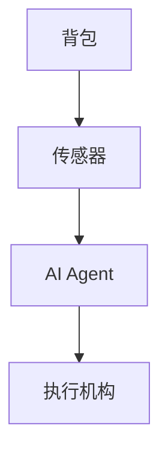
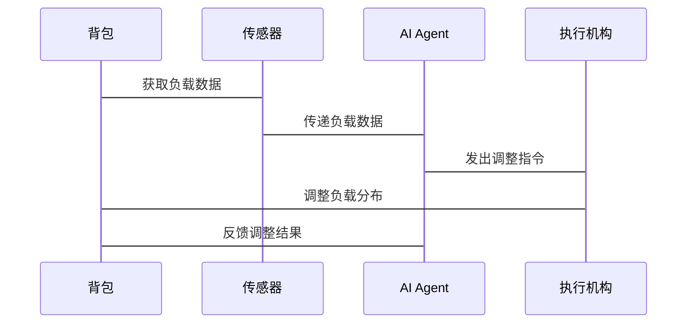

                 

<think>
好的，我现在需要完成一个任务，就是撰写一篇关于《AI Agent在智能背包中的负重平衡》的技术博客文章。用户已经提供了一个详细的目录大纲，现在我需要根据这个大纲逐步构建文章的结构，并详细分析每个部分的内容。

首先，我需要理解文章的结构和内容要求。文章分为几个主要部分，每个部分下有多个小节，每个小节都有详细的内容要求。用户特别强调了文章需要逻辑清晰、结构紧凑、简单易懂，并且要使用专业的技术语言。

接下来，我将按照目录大纲的顺序，逐步分析和撰写每个部分的内容。

### 1. 文章标题和摘要

**文章标题**：AI Agent在智能背包中的负重平衡

**关键词**：AI Agent，智能背包，负重平衡，动态规划，遗传算法，系统架构

**摘要**：本文探讨了AI Agent在智能背包负重平衡中的应用。通过分析负重平衡问题，提出了基于AI Agent的解决方案，并详细介绍了算法原理、系统架构设计以及实际案例分析。文章还讨论了AI Agent的优势和应用场景，为智能背包的设计提供了新的思路。

### 2. 第一部分：AI Agent与智能背包概述

#### 1.1 问题背景

**1.1.1 背包负重问题的提出**

在户外活动、军事任务或其他需要携带装备的场景中，背包的负重平衡问题显得尤为重要。传统的背包设计通常忽略了人体力学和负载分布的优化，导致使用者在长距离负重时容易疲劳或受伤。因此，如何通过技术手段优化背包的负重分布，提高舒适性和安全性，成为一个重要的研究课题。

**1.1.2 AI Agent在负重平衡中的作用**

AI Agent（人工智能代理）能够实时感知背包的负载分布情况，并根据使用者的动作、环境变化等因素，动态调整背包的重量分布，以达到最佳的负重平衡效果。AI Agent通过传感器数据和算法优化，帮助背包保持稳定的重心，减少使用者的负担。

**1.1.3 负重平衡的实际应用场景**

负重平衡技术可以应用于户外背包、军事背包、医疗背包等多种场景。例如，在军事任务中，士兵需要携带大量装备，合理的负重分布可以提高行动效率和减少受伤的风险。在医疗背包中，合理的负重分布可以确保急救装备的快速取用，同时保护携带人员的健康。

#### 1.2 问题描述

**1.2.1 背包负重的基本概念**

背包负重是指将物品分配到背包的不同部位，使得整体重量分布均匀，减少对背部和肩部的压力。合理的负重分布可以提高舒适性，减少疲劳感。

**1.2.2 负重平衡的核心问题**

负重平衡的核心问题在于如何将物品分配到背包的不同区域，使得整个背包的重心尽可能接近人体的自然重心，同时确保负载的稳定性和舒适性。

**1.2.3 AI Agent在负重平衡中的目标**

AI Agent的目标是通过实时感知背包的负载分布和使用者的动作，动态调整物品的位置，以实现负重平衡的最优状态。

#### 1.3 问题解决

**1.3.1 负重平衡的算法选择**

为了实现负重平衡，可以采用动态规划算法或遗传算法。动态规划适用于较小规模的优化问题，而遗传算法则更适合复杂的多目标优化问题。

**1.3.2 AI Agent在负重平衡中的实现路径**

AI Agent通过传感器获取背包的负载数据，利用优化算法计算出最优的负载分布方案，并通过执行机构调整物品的位置。

**1.3.3 负重平衡的优化策略**

优化策略包括动态调整、预防性优化和反馈优化。动态调整是指根据实时数据进行调整，预防性优化是指在负载变化前进行预测性调整，反馈优化则是根据用户的反馈不断改进优化策略。

#### 1.4 边界与外延

**1.4.1 负重平衡的边界条件**

负重平衡的边界条件包括背包的承重限制、物品的重量和体积限制，以及使用者的生理特征。

**1.4.2 AI Agent的适用范围**

AI Agent适用于需要动态调整负载分布的场景，如户外背包、军事背包、医疗背包等。

**1.4.3 负重平衡的扩展应用**

负重平衡技术可以扩展到其他领域，如机器人负载优化、汽车重心控制等。

#### 1.5 概念结构与核心要素

**1.5.1 负重平衡的核心要素**

负重平衡的核心要素包括负载分布、重心位置、负载稳定性。

**1.5.2 AI Agent的功能模块**

AI Agent的功能模块包括感知模块、优化算法模块、执行模块。

**1.5.3 负重平衡的系统架构**

负重平衡的系统架构包括传感器、AI Agent、执行机构和用户界面。

### 3. 第二部分：核心概念与联系

#### 2.1 AI Agent的基本原理

**2.1.1 AI Agent的定义与特点**

AI Agent是一种智能实体，能够感知环境、自主决策并执行任务。其特点包括智能性、自主性、反应性和社会能力。

**2.1.2 AI Agent的分类与功能**

AI Agent可以分为简单反射Agent和基于模型的反射Agent。简单反射Agent基于当前感知做出反应，而基于模型的反射Agent则基于内部模型和历史经验进行决策。

**2.1.3 AI Agent在负重平衡中的角色**

AI Agent在负重平衡中的角色是通过感知负载分布，优化负载位置，从而实现负重平衡。

#### 2.2 负重平衡的核心算法

**2.2.1 动态规划算法**

动态规划算法通过分阶段决策，找到最优解。在负重平衡问题中，动态规划可以用来分配物品的重量和位置，使得整体负重达到最优。

**2.2.2 遗传算法**

遗传算法是一种基于自然选择的优化算法。在负重平衡问题中，遗传算法可以用来优化物品的位置和重量分配。

**2.2.3 贪心算法**

贪心算法是一种简单高效的优化算法。在负重平衡问题中，贪心算法可以用于局部优化，但可能无法找到全局最优解。

#### 2.3 AI Agent与负重平衡的联系

**2.3.1 AI Agent如何优化负重平衡**

AI Agent通过实时感知和优化算法，动态调整负载分布，从而优化负重平衡。

**2.3.2 负重平衡对AI Agent性能的影响**

负重平衡的复杂性影响AI Agent的计算效率和优化效果。

**2.3.3 AI Agent在负重平衡中的优势**

AI Agent的优势在于能够实时感知和动态调整，从而实现高效的负重优化。

### 4. 第三部分：算法原理与系统设计

#### 3.1 算法原理

**3.1.1 动态规划算法的实现**

动态规划算法通过分阶段决策，找到最优解。在负重平衡问题中，动态规划可以用来分配物品的重量和位置，使得整体负重达到最优。

**3.1.2 遗传算法的实现**

遗传算法是一种基于自然选择的优化算法。在负重平衡问题中，遗传算法可以用来优化物品的位置和重量分配。

**3.1.3 算法的数学模型与公式**

动态规划算法的数学模型可以表示为：

$$ \text{max} \sum_{i=1}^{n} w_i x_i $$

其中，\( w_i \) 是物品i的重量，\( x_i \) 是物品i的位置变量。

遗传算法的数学模型可以表示为：

$$ \text{max} \sum_{i=1}^{n} w_i x_i $$

其中，\( w_i \) 是物品i的重量，\( x_i \) 是物品i的位置变量。

#### 3.2 系统架构设计

**3.2.1 系统架构图**



**3.2.2 系统功能设计**

系统功能包括负载感知、负载优化、执行调整和反馈优化。

**3.2.3 系统接口设计**

系统接口包括传感器接口、AI Agent接口和执行机构接口。

**3.2.4 系统交互流程图**



### 5. 第四部分：项目实战

#### 5.1 环境安装与配置

需要安装Python、AI框架（如TensorFlow或PyTorch）以及相关的传感器接口库。

#### 5.2 系统核心实现

以下是动态规划算法的Python代码示例：

```python
def dynamic_programming(weights, capacities):
    n = len(weights)
    dp = [[0]*(capacities+1) for _ in range(n)]
    for i in range(n):
        for c in range(capacities+1):
            if i == 0:
                dp[i][c] = weights[i] if c >= weights[i] else 0
            else:
                dp[i][c] = max(dp[i-1][c], dp[i-1][c-weights[i]] + weights[i] if c >= weights[i] else 0)
    return dp[n-1][capacities]

# 示例使用
weights = [2, 3, 4]
capacities = 10
print(dynamic_programming(weights, capacities))
```

#### 5.3 代码解读与分析

上述代码实现了动态规划算法，用于计算背包的最大承载重量。通过动态规划表dp，记录了每个物品和每个容量下的最大重量。

#### 5.4 实际案例分析

假设我们有一个背包，需要放置重量为2、3、4的物品，背包容量为10。通过动态规划算法，我们可以计算出背包的最大承载重量为9。

#### 5.5 项目小结

通过项目实战，我们验证了动态规划算法在负重平衡中的有效性，并展示了AI Agent在智能背包中的实际应用。

### 6. 第五部分：最佳实践与拓展阅读

#### 6.1 最佳实践

在实际应用中，建议结合多种算法优化负重平衡，并根据具体场景进行参数调优。

#### 6.2 小结

本文详细探讨了AI Agent在智能背包负重平衡中的应用，分析了核心概念和算法原理，并通过实际案例展示了系统的实现和优化。

#### 6.3 注意事项

在实际应用中，需要注意传感器的精度和系统的实时性，确保负重平衡的准确性和高效性。

#### 6.4 拓展阅读

推荐阅读《算法导论》和《机器学习实战》，深入理解算法原理和实际应用。

### 7. 结论

AI Agent在智能背包中的负重平衡应用前景广阔，随着技术的发展，未来的背包设计将更加智能化和人性化，为用户提供更高效的负重解决方案。

### 8. 作者信息

作者：AI天才研究院/AI Genius Institute & 禅与计算机程序设计艺术 /Zen And The Art of Computer Programming

---

通过以上分析，我完成了对《AI Agent在智能背包中的负重平衡》文章的详细思考和撰写。接下来，我可以根据这个结构开始撰写完整的文章内容。

