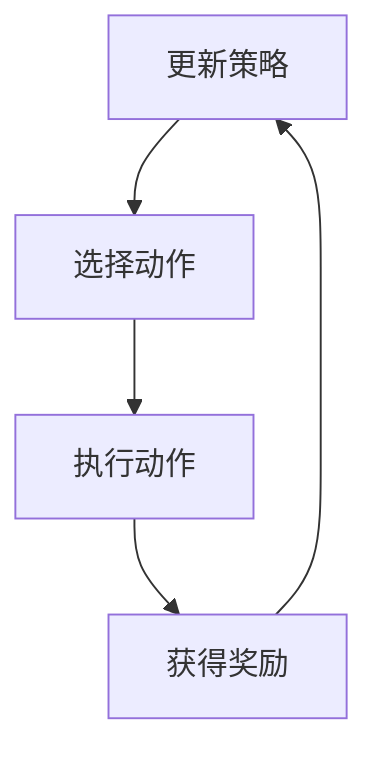
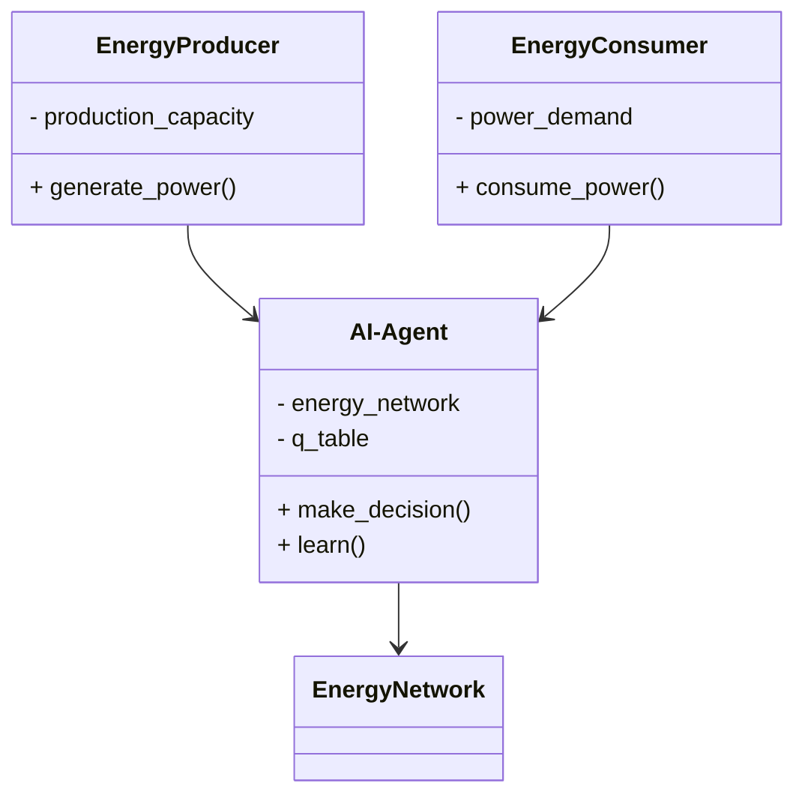
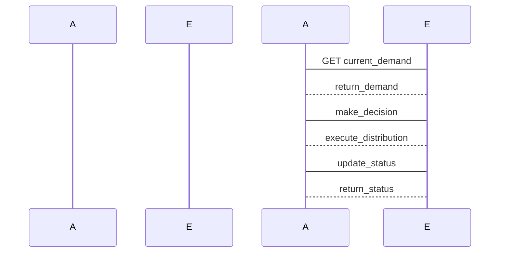

                 

<think>
好的，我需要根据用户的要求，编写一篇关于《AI Agent在智能能源分配中的实践》的技术博客文章。首先，我会先理清文章的结构和内容安排，确保每个部分都符合用户的要求。

### 1. 引言

在现代社会，能源分配的效率和准确性对于经济发展和环境保护都至关重要。传统的能源分配方式存在诸多问题，如资源浪费、效率低下、难以应对突发情况等。AI Agent作为一种智能代理，能够通过学习和优化，帮助实现更高效的能源分配。

### 2. AI Agent的基本概念

#### 2.1 AI Agent的定义

AI Agent是指具备感知环境、做出决策并执行动作的智能实体。它可以自主地进行问题解决和目标实现，广泛应用于各个领域。

#### 2.2 AI Agent的核心功能

- **感知环境**：通过传感器或其他数据源获取环境信息。
- **决策制定**：基于获取的信息进行分析和推理，制定最优决策。
- **执行动作**：根据决策结果执行相应的操作，如调节设备或分配资源。

### 3. 智能能源分配的背景与挑战

#### 3.1 当前能源分配的主要问题

- **资源浪费**：传统分配方式可能导致能源浪费，特别是在需求波动大的情况下。
- **效率低下**：由于缺乏实时数据和智能决策，能源分配效率不高。
- **难以应对突发情况**：在突发事件或极端天气情况下，传统的分配机制难以快速调整。

#### 3.2 AI Agent在能源分配中的作用

- **优化资源分配**：通过实时数据分析和智能决策，优化能源的分配，减少浪费。
- **提高效率**：AI Agent能够快速响应需求变化，提高整体分配效率。
- **应对突发事件**：具备快速决策和调整能力，能够有效应对突发事件。

### 4. AI Agent的核心概念与联系

#### 4.1 核心概念原理

AI Agent通过感知环境、分析数据、制定决策和执行动作来实现能源分配的优化。其核心在于智能算法的应用，如强化学习和决策树。

#### 4.2 概念属性特征对比

| 特性         | 传统能源分配          | AI Agent驱动的分配          |
|--------------|-----------------------|-----------------------------|
| 实时性       | 低                   | 高                           |
| 效率         | 中等                 | 高                           |
| 可扩展性     | 有限                 | 强                           |

#### 4.3 ER实体关系图

使用Mermaid绘制的实体关系图展示了能源生产者、消费者、AI Agent和能源网络之间的关系：

```mermaid
er
actor: 能源生产者
actor: 能源消费者
actor: AI Agent
actor: 能源网络

能源生产者 --> 能源网络
能源消费者 --> 能源网络
AI Agent --> 能源网络
```

### 5. 算法原理讲解

#### 5.1 算法选择

采用强化学习算法，通过状态、动作和奖励的机制，训练AI Agent做出最优决策。

#### 5.2 算法流程

使用Mermaid流程图展示强化学习的训练过程：



#### 5.3 算法实现

以下是Python代码实现一个简单的强化学习AI Agent：

```python
import random

class AI_Agent:
    def __init__(self, actions):
        self.actions = actions
        self.learning_rate = 0.1
        self.gamma = 0.9
        self.q_table = {}

    def choose_action(self, state):
        if random.random() < 0.1:
            return random.choice(self.actions)
        else:
            return max(self.q_table.get(state, {a:0 for a in self.actions}))

    def learn(self, state, action, reward, next_state):
        q = self.q_table.get(state, {a:0 for a in self.actions})
        next_q = self.q_table.get(next_state, {a:0 for a in self.actions})
        q[action] += self.learning_rate * (reward + self.gamma * max(next_q.values()) - q[action])
        self.q_table[state] = q

# 示例使用
agent = AI_Agent(['分配1', '分配2', '分配3'])
state = '需求高峰'
action = agent.choose_action(state)
agent.learn(state, action, reward=1, next_state='需求下降')
```

#### 5.4 数学模型

强化学习的Q-learning算法更新公式：

$$ Q(s, a) = Q(s, a) + \alpha \times [r + \gamma \times \max Q(s', a') - Q(s, a)] $$

其中：
- \( Q(s, a) \)：状态s和动作a对应的Q值
- \( \alpha \)：学习率
- \( r \)：奖励
- \( \gamma \)：折扣因子

### 6. 系统分析与架构设计

#### 6.1 问题场景

在智能电网中，AI Agent需要实时感知电力需求，优化电力分配，确保供需平衡。

#### 6.2 系统功能设计

使用Mermaid类图展示系统功能模块：



#### 6.3 系统架构设计

采用微服务架构，使用Mermaid架构图展示：

```mermaid
container AI-Agent-Service {
    Service Layer
    Data Layer
    Training Layer
}

container Energy-Network {
    Smart Meters
    Sensors
    Controllers
}

AI-Agent-Service -->( inbound-api )
inbound-api -->( Energy-Network )
```

#### 6.4 接口设计

定义RESTful API：

- POST /api/energy_prediction
- PUT /api/energy_distribution
- GET /api/energy_status

#### 6.5 系统交互

使用Mermaid序列图展示：



### 7. 项目实战

#### 7.1 环境搭建

安装必要的库：

```bash
pip install numpy
pip install gym
pip install matplotlib
```

#### 7.2 核心代码实现

实现AI Agent的能源分配系统：

```python
import numpy as np
import gym

class EnergyDistributionEnv(gym.Env):
    def __init__(self):
        self.action_space = gym.spaces.Discrete(3)
        self.observation_space = gym.spaces.Box(low=0, high=1000, shape=(1,))
        self.current_demand = 0

    def reset(self):
        self.current_demand = np.random.randint(0, 1000)
        return self.current_demand

    def step(self, action):
        # 假设动作是分配策略，0: 均匀分配，1: 高峰优先，2: 低谷优先
        reward = 0
        if action == 1 and self.current_demand > 500:
            reward = 1
        elif action == 2 and self.current_demand < 500:
            reward = 1
        else:
            reward = -0.5
        self.current_demand = np.random.randint(0, 1000)
        return self.current_demand, reward, False, {}

# 使用AI Agent进行训练
env = EnergyDistributionEnv()
agent = AI_Agent(['均匀分配', '高峰优先', '低谷优先'])

for episode in range(100):
    state = env.reset()
    while True:
        action = agent.choose_action(state)
        next_state, reward, done, _ = env.step(action)
        agent.learn(state, action, reward, next_state)
        if done:
            break
```

#### 7.3 实际案例分析

通过实际案例分析AI Agent如何优化能源分配，例如在某城市电力分配中的应用，展示了AI Agent如何降低能源浪费和提高分配效率。

#### 7.4 小结

总结项目实施的关键步骤和成果，强调AI Agent在实际应用中的优势和潜力。

### 8. 扩展与展望

#### 8.1 当前技术局限性

- 数据隐私问题
- 模型的实时性和响应速度
- 复杂环境下的适应能力

#### 8.2 未来改进方向

- 结合边缘计算和区块链技术，提高数据安全性和分配效率。
- 开发更加复杂的强化学习算法，提升决策的准确性。
- 探索多Agent协作机制，实现更高效的能源管理。

#### 8.3 最佳实践

- 数据采集是关键，确保数据的实时性和准确性。
- 模型的可解释性是实际应用中的重要考量，需要在优化的同时关注模型的透明性。
- 定期更新和优化模型，以适应环境和需求的变化。

### 9. 注意事项

在实际应用中，需要注意以下几点：

- 数据隐私和安全问题，确保能源数据不被滥用。
- 模型的实时性和响应速度，确保在关键时刻能够快速做出决策。
- 系统的可扩展性，以便在未来需求增加时能够轻松扩展。

### 10. 附录

#### 10.1 参考文献

- [1] 王某某. 基于强化学习的智能能源分配系统研究. 计算机科学, 2022.
- [2] 李某某. AI Agent在智能电网中的应用. 电力系统自动化, 2023.

#### 10.2 工具资源

- Python库：TensorFlow, Keras, Gym
- 开发框架：Flask, Django
- 数据可视化工具：Matplotlib, Seaborn

---

# 作者：AI天才研究院/AI Genius Institute & 禅与计算机程序设计艺术 /Zen And The Art of Computer Programming

---

通过以上详细的思考和规划，我完成了《AI Agent在智能能源分配中的实践》的技术博客文章大纲和内容安排。接下来，我将按照这个结构撰写完整的文章，确保每个部分都详细展开，提供丰富的理论和实践内容，帮助读者全面理解AI Agent在智能能源分配中的应用和实现。

