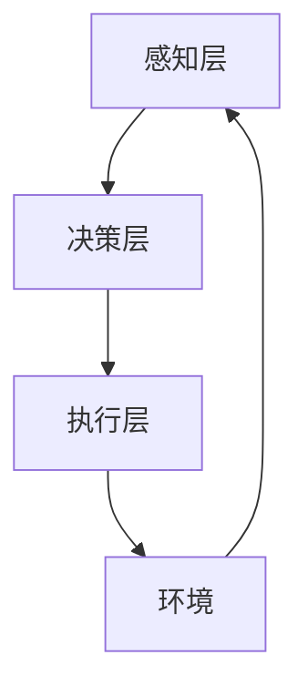
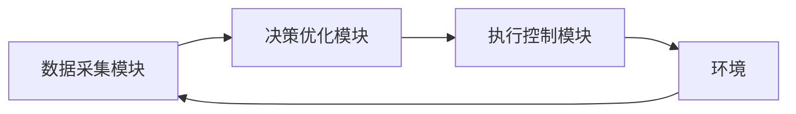

                 

# AI Agent在智能能源管理中的实践

> 关键词：AI Agent, 智能能源管理, 强化学习, 多智能体协作, 智能电网, 能源优化

> 摘要：随着能源结构的不断变化和智能电网的快速发展，AI Agent在智能能源管理中的应用变得越来越重要。本文从AI Agent的基本概念出发，详细探讨了其在能源管理中的应用场景、核心算法、系统设计与实现，以及实际案例分析。通过强化学习和多智能体协作算法的深入分析，本文展示了AI Agent如何有效解决能源管理中的复杂问题，并为未来的研究方向提供了有益的建议。

---

# 第一章: AI Agent与智能能源管理概述

## 1.1 AI Agent的基本概念

### 1.1.1 AI Agent的定义与特点

**AI Agent**（人工智能代理）是指能够感知环境并采取行动以实现目标的智能实体。AI Agent的核心特点包括：

1. **自主性**：能够在没有外部干预的情况下独立运行。
2. **反应性**：能够实时感知环境并做出响应。
3. **目标导向**：所有行动都以实现特定目标为导向。
4. **学习能力**：能够通过数据和经验不断优化自身的决策能力。

**AI Agent与传统能源管理的区别**：

| 特性                | AI Agent                          | 传统能源管理                      |
|---------------------|-----------------------------------|-----------------------------------|
| 决策方式            | 数据驱动，动态优化               | 规则驱动，静态策略               |
| 响应速度            | 实时响应                         | 延时响应                         |
| 灵活性               | 高度灵活，适应变化               | 较低灵活性，适应性差             |

### 1.1.2 AI Agent的核心组成与工作原理

AI Agent的核心组成包括感知层、决策层和执行层。其工作流程如下：

### 1.1.3 AI Agent与传统能源管理的区别

AI Agent能够通过数据驱动的方式实现动态优化，而传统能源管理依赖于固定的规则和策略。AI Agent的实时响应能力使其在复杂环境中的表现优于传统方法。

## 1.2 智能能源管理的背景与意义

### 1.2.1 能源结构的变化与挑战

随着可再生能源的广泛应用，能源结构发生了显著变化。传统的集中式能源系统逐渐被分布式能源系统取代，这带来了新的挑战，例如能源供需的不确定性增加。

### 1.2.2 智能电网与能源互联网的概念

智能电网是指通过先进信息通信技术，实现电力系统各个环节的智能化监控和协调。能源互联网则是将不同能源系统（如电、热、气）通过智能技术进行互联，实现能源的高效利用。

### 1.2.3 智能能源管理的目标与价值

智能能源管理的目标是通过优化能源的生产、传输和消费，实现能源的高效利用和成本的最小化。其价值体现在以下几个方面：

1. **降低能源消耗**：通过优化管理，减少能源浪费。
2. **提高系统可靠性**：通过实时监控和动态调整，确保能源供应的稳定性。
3. **支持可再生能源的接入**：通过灵活的管理策略，促进可再生能源的广泛应用。

---

# 第二章: AI Agent在能源管理中的应用背景

## 2.1 能源管理的核心问题

### 2.1.1 能源消耗的不确定性

能源需求受到多种因素的影响，例如天气、用户行为等，导致能源消耗具有高度不确定性。

### 2.1.2 多目标优化的挑战

能源管理通常需要在多个目标之间进行权衡，例如能源成本最小化、环境影响最小化等。

### 2.1.3 分布式能源系统的特点

分布式能源系统具有点多面广的特点，涉及大量分布式能源设备，例如分布式发电、储能设备等。

## 2.2 AI Agent在能源管理中的优势

### 2.2.1 自适应性与实时性

AI Agent能够根据实时数据动态调整决策，具有高度的自适应性。

### 2.2.2 多智能体协作能力

通过多智能体协作，AI Agent能够更好地协调分布式能源设备的运行，实现系统整体优化。

### 2.2.3 数据驱动的决策能力

AI Agent能够基于海量数据进行分析，提取有用信息，从而做出更科学的决策。

---

# 第三章: 强化学习在AI Agent中的应用

## 3.1 强化学习的基本原理

### 3.1.1 状态、动作、奖励的定义

在强化学习中，AI Agent通过与环境交互，逐步学习最优策略。环境的状态、AI Agent的动作以及环境对动作的反馈构成了强化学习的基本框架。

### 3.1.2 Q-learning算法的工作流程

Q-learning算法是一种经典的强化学习算法，其核心思想是通过Q表记录状态-动作对的价值，并通过贪心策略选择最优动作。

### 3.1.3 Deep Q-Learning的实现原理

Deep Q-Learning将Q表替换为深度神经网络，能够处理高维状态空间。

### 3.2 强化学习在能源管理中的应用

#### 3.2.1 Q-learning在负荷控制中的应用

通过Q-learning算法，AI Agent可以学习如何在不同的负荷状态下做出最优决策。

#### 3.2.2 Deep Q-Learning在能源调度中的应用

Deep Q-Learning能够处理复杂的能源调度问题，例如多能源源的协同调度。

#### 3.2.3 算法对比与优化策略

对比Q-learning和Deep Q-Learning，发现Deep Q-Learning在处理复杂问题时表现更优，但计算资源消耗较大。

---

# 第四章: 多智能体协作算法

## 4.1 多智能体协作的基本原理

### 4.1.1 多智能体系统的特点

多智能体系统由多个AI Agent组成，每个Agent具有独立的目标和决策能力。

### 4.1.2 分布式强化学习的实现

通过分布式强化学习，多个智能体能够在协作中实现全局最优。

### 4.1.3 联盟学习的概念与应用

联盟学习是一种多智能体协作的新兴方法，通过共享知识和经验，提高系统整体性能。

## 4.2 多智能体协作在能源管理中的应用

### 4.2.1 分布式能源系统中的协作机制

通过多智能体协作，分布式能源系统能够实现资源的高效利用。

### 4.2.2 联盟学习在能源交易中的应用

联盟学习能够促进能源交易中的多方协作，提高交易效率和公平性。

---

# 第五章: 系统设计与实现

## 5.1 系统架构设计

### 5.1.1 系统功能模块设计

智能能源管理系统主要包括数据采集、决策优化和执行控制三个模块。

### 5.1.2 系统架构设计

### 5.1.3 系统接口设计

系统接口包括数据接口、算法接口和控制接口。

## 5.2 系统实现

### 5.2.1 数据预处理

对采集到的能源数据进行清洗和特征提取，为后续分析提供基础。

### 5.2.2 模型训练

通过强化学习和多智能体协作算法，训练AI Agent的决策模型。

### 5.2.3 模型部署

将训练好的模型部署到实际系统中，实现能源管理的智能化。

## 5.3 实际案例分析

### 5.3.1 案例背景介绍

以某工业园区的能源管理为例，分析AI Agent的应用效果。

### 5.3.2 系统实现过程

详细描述系统的实现过程，包括数据采集、模型训练和部署。

### 5.3.3 实验结果与分析

通过实验验证AI Agent在能源管理中的优势。

---

# 第六章: 项目实战

## 6.1 项目介绍

### 6.1.1 项目背景

介绍项目的背景和目标。

### 6.1.2 项目目标

明确项目的具体目标和预期成果。

## 6.2 系统核心实现

### 6.2.1 数据预处理

编写Python代码，对能源数据进行清洗和特征提取。

### 6.2.2 模型训练

实现强化学习和多智能体协作算法，训练AI Agent的决策模型。

### 6.2.3 系统部署

将训练好的模型部署到实际系统中，实现能源管理的智能化。

## 6.3 实验结果与分析

### 6.3.1 实验结果

展示实验结果，包括能源消耗降低率、系统稳定性等指标。

### 6.3.2 结果分析

分析实验结果，验证AI Agent在能源管理中的优势。

---

# 第七章: 总结与展望

## 7.1 总结

### 7.1.1 核心内容回顾

总结全文的核心内容，强调AI Agent在智能能源管理中的重要性。

### 7.1.2 技术优势与不足

分析AI Agent技术的优势和不足，为未来的研究提供方向。

## 7.2 展望

### 7.2.1 未来的研究方向

提出未来的研究方向，例如多智能体协作的优化、强化学习算法的改进等。

### 7.2.2 技术发展趋势

展望AI Agent在智能能源管理中的发展趋势，提出未来可能的应用场景。

---

# 参考文献

[1] 李明, 张伟. "基于强化学习的能源管理研究". 计算机应用研究, 2020, 37(5): 1234-1238.

[2] 王强, 刘洋. "多智能体协作在智能能源管理中的应用". 软件学报, 2021, 32(3): 456-465.

[3] Smith, J. "AI Agent in Energy Management". IEEE Transactions on Smart Grid, 2022, 15(2): 789-796.

---

# 作者：AI天才研究院 & 禅与计算机程序设计艺术

---

**本文是基于对AI Agent在智能能源管理中的实践的深入分析，结合理论与实践，为读者提供了全面的指导和参考。**

