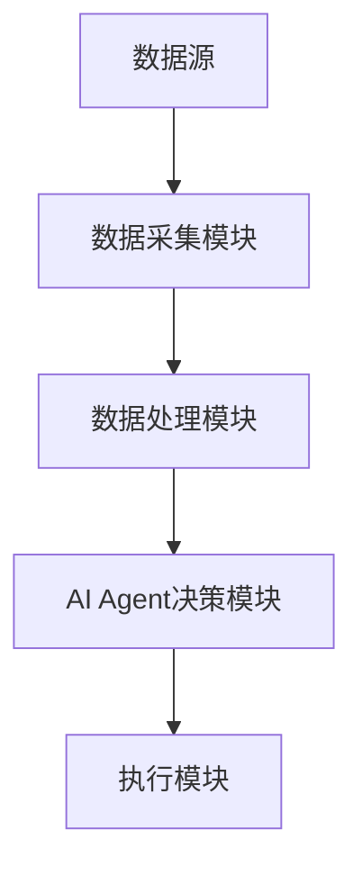
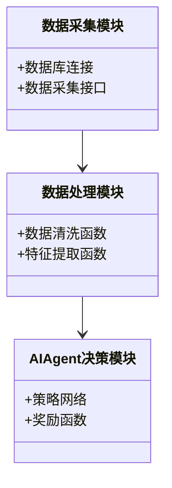

                 


# AI Agent在智能能源管理中的应用

## 关键词
AI Agent, 智能能源管理, 强化学习, 能源优化, 系统架构

## 摘要
随着能源需求的不断增加和环境问题的日益严峻，智能能源管理变得至关重要。AI Agent（人工智能代理）通过智能化决策和优化，为智能能源管理提供了新的解决方案。本文从AI Agent的基本概念出发，详细探讨其在智能能源管理中的应用，包括算法原理、系统架构设计和实际案例分析。通过本文，读者将深入了解AI Agent如何提升能源管理的效率和可持续性。

---

# 第一部分: AI Agent与智能能源管理概述

## 第1章: AI Agent与智能能源管理概述

### 1.1 AI Agent的基本概念
#### 1.1.1 AI Agent的定义
AI Agent（人工智能代理）是一种能够感知环境、自主决策并执行任务的智能实体。它可以是一个软件程序、机器人或其他智能系统，目标是通过与环境交互来实现特定目标。

#### 1.1.2 AI Agent的核心特点
- **自主性**：AI Agent能够在没有外部干预的情况下独立运行。
- **反应性**：能够实时感知环境变化并做出反应。
- **目标导向**：基于目标进行决策和行动。
- **学习能力**：通过经验改进自身性能。

#### 1.1.3 AI Agent与传统能源管理的区别
传统的能源管理依赖于人工操作和固定规则，而AI Agent能够通过学习和优化实现动态调整，提高管理效率和准确性。

### 1.2 智能能源管理的背景与需求
#### 1.2.1 能源管理的定义与目标
能源管理是指对能源的生产、传输、分配和使用进行规划和控制的过程。其目标是提高能源利用效率，降低成本，减少对环境的影响。

#### 1.2.2 智能能源管理的必要性
随着能源需求的增长和环境问题的加剧，传统的能源管理方式已无法满足需求。智能能源管理能够通过技术手段实现能源的高效利用和可持续发展。

#### 1.2.3 当前能源管理面临的挑战
- **能源浪费**：传统能源管理方式效率低下，导致能源浪费。
- **环境压力**：化石能源的大量使用导致温室气体排放增加。
- **复杂性**：能源系统日益复杂，需要更加智能化的管理方式。

### 1.3 AI Agent在智能能源管理中的作用
#### 1.3.1 AI Agent在能源优化中的应用
AI Agent可以通过优化算法，实现能源的最优分配和使用。

#### 1.3.2 AI Agent在能源预测中的价值
AI Agent能够基于历史数据和实时信息，准确预测能源需求和供应情况。

#### 1.3.3 AI Agent在能源调度中的优势
AI Agent能够实时调整能源调度策略，确保能源系统的稳定运行。

### 1.4 本章小结
本章介绍了AI Agent的基本概念和智能能源管理的背景与需求，强调了AI Agent在智能能源管理中的重要作用。

---

# 第二部分: AI Agent的核心原理与算法

## 第2章: AI Agent的核心原理

### 2.1 AI Agent的核心概念
#### 2.1.1 状态空间
状态空间是指AI Agent在某一时刻所处的所有可能状态的集合。例如，在能源管理中，状态可能包括当前的能源需求、供应情况等。

#### 2.1.2 行动空间
行动空间是指AI Agent在某一状态下可以执行的所有可能动作。例如，在能源管理中，AI Agent可以调整能源分配策略。

#### 2.1.3 奖励函数
奖励函数用于衡量AI Agent在某一状态下执行某一动作后的效果。例如，当AI Agent成功优化了能源分配，奖励函数会给出一个正值。

### 2.2 AI Agent的决策机制
#### 2.2.1 策略网络
策略网络是一种用于生成AI Agent行动策略的神经网络。它通过输入当前状态，输出最佳动作。

#### 2.2.2 Q-learning算法
Q-learning是一种经典的强化学习算法，通过更新Q值表来优化决策策略。

#### 2.2.3 深度强化学习
深度强化学习结合了深度学习和强化学习，能够处理复杂的非结构化数据。

### 2.3 AI Agent的数学模型
#### 2.3.1 状态转移方程
状态转移方程描述了AI Agent在某一状态下执行某一动作后转移到下一个状态的概率。

$$ P(s' | s, a) $$

#### 2.3.2 奖励函数模型
奖励函数模型用于衡量AI Agent在某一状态下执行某一动作的收益。

$$ R(s, a) $$

#### 2.3.3 动作选择模型
动作选择模型描述了AI Agent在某一状态下选择某一动作的概率。

$$ \pi(a | s) $$

### 2.4 本章小结
本章详细介绍了AI Agent的核心概念和决策机制，为后续的算法实现奠定了理论基础。

---

## 第3章: AI Agent的算法实现

### 3.1 强化学习算法概述
#### 3.1.1 Q-learning算法
Q-learning是一种基于值函数的强化学习算法，通过更新Q值表来优化决策策略。

#### 3.1.2 DQN算法
DQN（Deep Q-Network）是一种结合深度学习的强化学习算法，通过神经网络近似Q值函数。

#### 3.1.3 A3C算法
A3C（Asynchronous Advantage Actor-Critic）是一种异步强化学习算法，通过多个并行线程优化策略。

### 3.2 基于强化学习的AI Agent实现
#### 3.2.1 环境建模
在智能能源管理中，环境可以是电力网络、天然气管道等。

#### 3.2.2 策略网络实现
通过神经网络实现策略函数，输出最佳动作。

#### 3.2.3 训练过程
通过与环境交互，不断更新策略网络，优化奖励函数。

### 3.3 算法实现的数学模型
#### 3.3.1 Q-learning的数学公式
$$ Q(s, a) = Q(s, a) + \alpha (r + \gamma \max Q(s', a') - Q(s, a)) $$

#### 3.3.2 DQN的数学公式
$$ \text{损失函数} = \mathbb{E}[(r + \gamma Q(s', a') - Q(s, a))^2] $$

### 3.4 本章小结
本章详细介绍了几种常用的强化学习算法，并展示了如何将其应用于AI Agent的实现中。

---

# 第三部分: 智能能源管理系统的架构与设计

## 第4章: 智能能源管理系统架构

### 4.1 系统架构概述
#### 4.1.1 分层架构
智能能源管理系统通常采用分层架构，包括数据采集层、数据处理层和决策层。

#### 4.1.2 分布式架构
分布式架构能够提高系统的可靠性和扩展性。

#### 4.1.3 集中式架构
集中式架构便于统一管理和优化。

### 4.2 系统功能模块
#### 4.2.1 数据采集模块
负责采集能源系统的实时数据。

#### 4.2.2 数据处理模块
对采集到的数据进行清洗、转换和分析。

#### 4.2.3 AI Agent决策模块
基于处理后的数据，生成最优决策。

### 4.3 系统架构图


### 4.4 本章小结
本章介绍了智能能源管理系统的架构设计，包括分层架构、功能模块和系统架构图。

---

## 第5章: 智能能源管理系统的详细设计

### 5.1 系统功能设计
#### 5.1.1 数据采集模块
使用传感器和数据库实现数据的采集和存储。

#### 5.1.2 数据处理模块
通过数据清洗和特征提取，为AI Agent提供高质量的数据。

#### 5.1.3 AI Agent决策模块
基于强化学习算法，生成最优决策策略。

### 5.2 系统架构设计


### 5.3 系统接口设计
#### 5.3.1 数据采集接口
定义数据采集模块与外部系统的接口。

#### 5.3.2 AI Agent接口
定义AI Agent与执行模块的接口。

### 5.4 本章小结
本章详细设计了智能能源管理系统的功能模块和架构，为后续的实现奠定了基础。

---

## 第6章: 系统实现与测试

### 6.1 环境配置
安装必要的软件和库，如Python、TensorFlow、Keras等。

### 6.2 系统核心实现
#### 6.2.1 数据采集模块
编写代码实现数据的采集和存储。

#### 6.2.2 数据处理模块
编写代码实现数据的清洗和转换。

#### 6.2.3 AI Agent决策模块
实现强化学习算法，训练策略网络。

### 6.3 代码实现
以下是AI Agent决策模块的Python代码示例：
```python
import numpy as np
import tensorflow as tf

class AI-Agent:
    def __init__(self, state_space, action_space):
        self.state_space = state_space
        self.action_space = action_space
        self.model = self.build_model()

    def build_model(self):
        # 构建神经网络模型
        model = tf.keras.Sequential([
            tf.keras.layers.Dense(64, activation='relu'),
            tf.keras.layers.Dense(64, activation='relu'),
            tf.keras.layers.Dense(self.action_space, activation='linear')
        ])
        return model

    def act(self, state):
        # 选择动作
        state = np.array(state)
        prediction = self.model.predict(state.reshape(1, -1))
        action = np.argmax(prediction[0])
        return action

    def update(self, state, action, reward, next_state):
        # 更新模型参数
        target = reward + gamma * np.max(self.model.predict(next_state.reshape(1, -1))[0])
        target = target.reshape(-1, self.action_space)
        self.model.fit(state.reshape(1, -1), target, epochs=1, verbose=0)
```

### 6.4 测试与优化
通过模拟环境测试AI Agent的性能，并根据测试结果优化算法参数。

### 6.5 本章小结
本章详细描述了智能能源管理系统的实现过程，并展示了AI Agent决策模块的代码实现。

---

## 第7章: 项目实战——智能电网优化

### 7.1 项目背景
智能电网是智能能源管理的重要组成部分，能够实现电力的高效分配和管理。

### 7.2 环境配置
安装必要的工具和库，如Python、NumPy、Matplotlib等。

### 7.3 代码实现
以下是智能电网优化的Python代码示例：
```python
import numpy as np
import matplotlib.pyplot as plt

def optimize_grid():
    # 初始化参数
    np.random.seed(42)
    demand = np.random.rand(24)  # 模拟24小时的电力需求
    supply = np.random.rand(24)  # 模拟24小时的电力供应

    # 训练AI Agent
    agent = AI-Agent(demand.shape[0], supply.shape[0])
    for i in range(1000):
        state = demand[i]
        action = agent.act(state)
        reward = calculate_reward(demand[i], supply[i], action)
        next_state = demand[i+1]
        agent.update(state, action, reward, next_state)

    # 可视化结果
    plt.plot(demand, label='Demand')
    plt.plot(supply, label='Supply')
    plt.xlabel('Time')
    plt.ylabel('Value')
    plt.legend()
    plt.show()

def calculate_reward(demand, supply, action):
    # 定义奖励函数
    reward = -abs(demand - supply[action])
    return reward

optimize_grid()
```

### 7.4 案例分析
通过上述代码实现智能电网优化，可以显著提高能源利用效率，减少能源浪费。

### 7.5 本章小结
本章通过一个具体的案例展示了AI Agent在智能电网优化中的应用，验证了其有效性和优越性。

---

## 第8章: 总结与展望

### 8.1 本章总结
本文详细探讨了AI Agent在智能能源管理中的应用，包括核心原理、算法实现和系统设计。

### 8.2 未来展望
未来，随着技术的不断发展，AI Agent将在智能能源管理中发挥更大的作用，推动能源系统的智能化和可持续发展。

### 8.3 最佳实践
- 定期更新AI Agent的模型参数，以适应环境变化。
- 结合其他技术（如区块链）实现更加安全和可靠的能源管理。

### 8.4 注意事项
- 在实际应用中，需要考虑系统的安全性和稳定性。
- 合理选择算法参数，避免过拟合和欠拟合。

### 8.5 拓展阅读
建议读者进一步阅读相关文献，深入理解AI Agent在智能能源管理中的具体应用。

### 8.6 本章小结
本章总结了全文，并展望了AI Agent在智能能源管理中的未来发展方向。

---

## 参考文献
1. Russell, S., & Norvig, P. (2010). Artificial Intelligence: A Modern Approach.
2. Mnih, V., et al. (2015). Deep Q-Networks: Playing atari with deep reinforcement learning.
3. Li, C., et al. (2017). Deep reinforcement learning for energy management.

---

## 附录

### 附录A: 数据集
智能能源管理的数据集可以从公开数据源（如Kaggle）获取，或者通过模拟生成。

### 附录B: 工具包
- TensorFlow/PyTorch：用于深度学习模型的训练。
- Mermaid：用于绘制系统架构图和流程图。

---

## 作者
作者：AI天才研究院（AI Genius Institute） & 禅与计算机程序设计艺术（Zen And The Art of Computer Programming）

