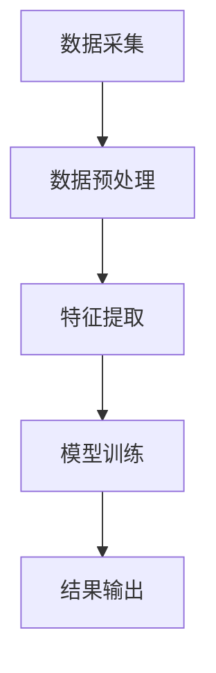

                 


# AI Agent在智能腕带中的工作效率监测

## 关键词：AI Agent，智能腕带，工作效率监测，数据采集，机器学习

## 摘要：  
本文探讨了AI Agent在智能腕带中的应用，重点分析了如何利用AI技术实现工作效率监测。通过详细阐述AI Agent的核心原理、智能腕带的数据采集与处理、算法实现及系统架构设计，本文为读者提供了从理论到实践的全面指南。我们还通过实际案例展示了AI Agent在智能腕带中的应用，最后总结了最佳实践和未来发展方向。

---

## 第1章：背景介绍

### 1.1 问题背景
#### 1.1.1 工作效率监测的重要性
工作效率是衡量一个人在工作时间内产出成果的关键指标。在现代职场中，长时间的工作可能导致效率下降，甚至影响健康。因此，监测和优化工作效率变得尤为重要。

#### 1.1.2 智能腕带的普及与应用
智能腕带作为一种可穿戴设备，已经广泛应用于健康监测和运动追踪。它能够实时采集心率、步频、压力水平等数据，为用户提供健康建议。

#### 1.1.3 AI Agent在智能设备中的潜力
AI Agent是一种能够感知环境、处理信息并采取行动的智能体。它在智能设备中的潜力巨大，可以实时分析数据，提供个性化的建议，从而优化工作效率。

### 1.2 问题描述
#### 1.2.1 工作效率监测的定义
工作效率监测是指通过分析工作期间的各项指标，评估工作产出与效率的过程。

#### 1.2.2 智能腕带的数据采集能力
智能腕带能够采集心率、运动步频、压力水平等多模态数据，为工作效率监测提供丰富数据源。

#### 1.2.3 AI Agent在数据处理中的作用
AI Agent能够处理复杂的数据，识别模式，提供实时反馈，帮助用户优化工作效率。

### 1.3 问题解决
#### 1.3.1 AI Agent的核心功能
AI Agent的核心功能包括数据处理、模式识别和决策支持。

#### 1.3.2 智能腕带的数据采集与传输
智能腕带通过传感器采集数据，并通过蓝牙或Wi-Fi将数据传输到手机或其他设备。

#### 1.3.3 工作效率监测的实现流程
从数据采集到分析，再到结果反馈，AI Agent和智能腕带协同工作，实现工作效率的实时监测。

### 1.4 边界与外延
#### 1.4.1 AI Agent的局限性
AI Agent依赖传感器数据，可能无法捕捉所有影响效率的因素。

#### 1.4.2 智能腕带的适用场景
适用于办公室员工、学生等需要长时间专注工作的人群。

#### 1.4.3 工作效率监测的边界条件
仅监测工作时间内的效率，不考虑其他时间段。

### 1.5 概念结构与核心要素组成
#### 1.5.1 AI Agent的基本组成
包括感知层、数据层、决策层和执行层。

#### 1.5.2 智能腕带的核心功能模块
包括数据采集模块、数据传输模块和数据分析模块。

#### 1.5.3 工作效率监测的系统架构
包括数据采集端、数据处理端和用户反馈端。

---

## 第2章：核心概念与联系

### 2.1 AI Agent的核心原理
AI Agent能够感知环境、处理信息并采取行动。在智能腕带中，AI Agent通过分析数据，提供实时反馈，优化工作效率。

### 2.2 智能腕带的数据采集与处理
数据采集包括心率、运动步频等，数据预处理包括清洗和转换，数据存储涉及数据库设计。

### 2.3 AI Agent与智能腕带的协同工作
数据流从智能腕带到AI Agent，AI Agent分析数据并提供反馈。决策机制基于机器学习模型，反馈机制向用户发送提醒或建议。

### 2.4 核心概念属性特征对比表格
| 概念 | 属性 | 特征 |
|------|------|------|
| AI Agent | 输入数据 | 多模态数据（心率、步频、压力等） |
| 智能腕带 | 输出结果 | 工作效率评分（高效、一般、低效） |
| 数据处理 | 核心算法 | 时间序列分析、机器学习模型 |

### 2.5 ER实体关系图
```mermaid
erDiagram
    agent {
        id : integer
        name : string
        function : string
    }
    wristband {
        id : integer
        user_id : integer
        data_type : string
    }
    agent --|{--> wristband : 监测数据
```

---

## 第3章：算法原理

### 3.1 数据采集与特征提取
AI Agent从智能腕带接收多模态数据，预处理包括清洗和转换。特征提取涉及统计特征和时间序列特征。

### 3.2 模型训练与优化
选择随机森林和XGBoost进行训练，通过网格搜索调优模型参数，提高准确性和稳定性。

### 3.3 算法流程与代码实现


```python
import pandas as pd
from sklearn.ensemble import RandomForestClassifier
from xgboost import XGBClassifier
from sklearn.metrics import accuracy_score

# 数据读取
data = pd.read_csv('work_efficiency.csv')

# 特征提取
features = data[['heart_rate', 'step_frequency', 'pressure']]
labels = data['efficiency_score']

# 模型训练
model_rf = RandomForestClassifier().fit(features, labels)
model_xgb = XGBClassifier().fit(features, labels)

# 模型预测
rf_pred = model_rf.predict(features)
xgb_pred = model_xgb.predict(features)

# 模型评估
print("Random Forest Accuracy:", accuracy_score(labels, rf_pred))
print("XGBoost Accuracy:", accuracy_score(labels, xgb_pred))
```

---

## 第4章：数学模型

### 4.1 时间序列分析
使用ARIMA模型预测工作效率，模型参数选择和评估指标如均方误差（MSE）。

### 4.2 机器学习模型实现
使用XGBoost进行分类，模型调优和评估指标如F1分数。

---

## 第5章：系统分析与架构设计

### 5.1 问题场景介绍
办公室员工的工作效率监测，项目目标和实施步骤。

### 5.2 系统功能设计
数据采集、数据处理、效率评分和反馈提醒。使用Mermaid类图展示领域模型。

### 5.3 系统架构设计
数据采集层、数据处理层和用户反馈层。使用Mermaid架构图展示系统架构。

### 5.4 系统接口与交互
系统接口设计展示AI Agent与智能腕带的交互，使用Mermaid序列图展示用户、智能腕带和AI Agent的交互过程。

---

## 第6章：项目实战

### 6.1 环境安装与核心代码实现
安装Python和机器学习库，实现数据采集、处理、模型训练和结果输出。

### 6.2 实际案例分析与项目小结
分析实际案例，总结经验教训，提出改进建议。

---

## 第7章：最佳实践

### 7.1 使用中的注意事项
数据隐私保护、模型泛化能力、用户反馈机制。

### 7.2 总结与展望
总结文章内容，展望未来发展方向，如更先进的AI算法和更广泛的应用场景。

### 7.3 拓展阅读与工具资源
推荐学术论文、技术博客和工具资源，供读者深入学习。

---

## 第8章：小结与展望

总结全文的核心内容，强调AI Agent在智能腕带中的优势和挑战，展望未来的发展方向。

---

## 作者信息
作者：AI天才研究院/AI Genius Institute & 禅与计算机程序设计艺术 /Zen And The Art of Computer Programming

---

以上是《AI Agent在智能腕带中的工作效率监测》的完整内容，希望对您有所帮助！

