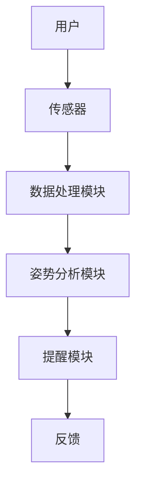
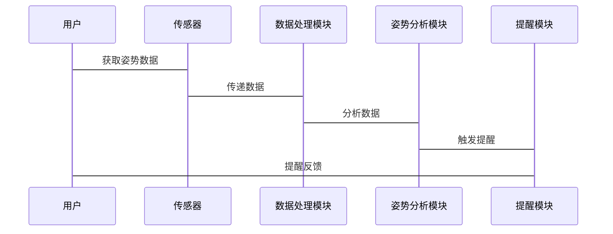

                 


# AI Agent在智能腰带中的姿势矫正与提醒

## 关键词：AI Agent，智能腰带，姿势矫正，提醒机制，传感器，算法

## 摘要：  
本文详细探讨了AI Agent在智能腰带中的应用，重点分析了其在姿势矫正与提醒方面的作用。通过介绍AI Agent的核心算法、智能腰带的传感器技术、姿势矫正的实现方法以及提醒机制的设计，本文旨在为读者提供一个全面的技术视角。文章还通过实际案例分析，展示了AI Agent在智能腰带中的实际应用场景，并提出了优化建议。

---

# 第1章: 背景介绍

## 1.1 问题背景  
姿势矫正对于保持健康非常重要，尤其是在现代人长时间坐着工作的背景下，不良姿势可能导致颈椎病、腰椎病等问题。智能腰带作为一种可穿戴设备，能够实时监测用户的姿势，并通过AI Agent提供个性化的矫正建议和提醒。

## 1.2 问题描述  
传统的姿势矫正方法依赖于手动提醒或外部设备（如矫正带），存在效率低、用户体验差的问题。AI Agent的引入，能够通过传感器实时采集数据，结合机器学习算法，实现智能化的姿势矫正与提醒。

## 1.3 问题解决  
AI Agent通过实时监测用户的姿势数据，分析其是否符合健康标准，并通过震动或语音提醒的方式，帮助用户纠正不良姿势。这种智能化的解决方案，能够显著提高姿势矫正的效果和用户体验。

## 1.4 边界与外延  
AI Agent在智能腰带中的应用具有一定的边界，例如其依赖于传感器的精度和算法的准确性。此外，AI Agent还可以与其他智能设备协同工作，进一步扩展其应用场景。

## 1.5 概念结构与核心要素  
AI Agent在智能腰带中的实现，涉及传感器、数据采集、算法分析、提醒机制等多个核心要素。这些要素共同构成了一个完整的姿势矫正系统。

---

# 第2章: 核心概念与联系

## 2.1 AI Agent的原理  
AI Agent通过传感器采集用户姿势数据，利用机器学习算法进行分析，并根据结果触发提醒机制。其核心在于数据的实时采集与分析能力。

## 2.2 智能腰带的功能分析  
智能腰带的主要功能包括数据采集、数据处理、姿势分析和提醒反馈。其中，数据采集依赖于多种传感器，如加速度传感器、陀螺仪等。

## 2.3 核心概念对比  
以下是对不同AI Agent算法和智能腰带功能的对比分析：

| 算法类型 | 优点 | 缺点 |
|----------|------|------|
| 基于规则的AI Agent | 实现简单，易于部署 | 灵活性差，无法应对复杂场景 |
| 基于机器学习的AI Agent | 学习能力强，适应性好 | 需要大量数据支持，计算资源消耗大 |

---

# 第3章: 算法原理讲解

## 3.1 算法流程  
姿势矫正的核心算法流程如下：

1. 数据采集：通过传感器获取用户的姿势数据。
2. 数据预处理：去除噪声，提取有效特征。
3. 姿势分析：利用机器学习算法对数据进行分类，判断是否为不良姿势。
4. 提醒触发：当检测到不良姿势时，触发震动或语音提醒。

## 3.2 数据预处理  
数据预处理是姿势矫正算法的关键步骤。常见的预处理方法包括归一化、滤波等。例如，使用滑动平均法对传感器数据进行平滑处理：

$$ smoothed\_data = \frac{data[i] + data[i-1] + data[i-2]}{3} $$

## 3.3 姿势分析  
姿势分析的核心是分类算法。常用的算法包括支持向量机（SVM）和随机森林（Random Forest）。以下是一个简单的SVM分类器实现示例：

```python
from sklearn.svm import SVC
import numpy as np

# 假设X为特征向量，y为标签
X = np.array([[x1, x2, x3], ...])
y = np.array([0, 1, 0, ...])

# 训练模型
model = SVC()
model.fit(X, y)

# 预测
new_sample = np.array([[a, b, c]])
print(model.predict(new_sample))
```

## 3.4 提醒机制  
提醒机制的设计需要考虑用户体验。常见的提醒方式包括震动、语音提示和LED灯闪烁。以下是一个震动提醒的实现示例：

```python
import time

# 模拟震动提醒
def vibrate(duration):
    import RPi.GPIO as GPIO
    GPIO.setmode(GPIO.BCM)
    GPIO.setup(18, GPIO.OUT)
    GPIO.output(18, True)
    time.sleep(duration)
    GPIO.output(18, False)
    GPIO.cleanup()

vibrate(0.5)  # 震动0.5秒
```

---

# 第4章: 系统分析与架构设计

## 4.1 系统架构  
以下是智能腰带的系统架构图：



## 4.2 系统功能设计  
智能腰带的功能模块包括：

1. 传感器模块：负责采集姿势数据。
2. 数据处理模块：对数据进行预处理和特征提取。
3. 姿势分析模块：利用机器学习算法进行分类。
4. 提醒模块：根据分析结果触发提醒。

## 4.3 系统交互  
以下是系统交互的序列图：



---

# 第5章: 项目实战

## 5.1 环境安装  
以下是项目所需的环境和工具：

- Python 3.8+
- numpy、scikit-learn、RPi.GPIO等库
- 智能腰带硬件（如加速度传感器、震动马达等）

## 5.2 核心代码实现  
以下是姿势矫正算法的核心代码：

```python
import numpy as np
from sklearn.svm import SVC

# 示例数据集
X = np.array([
    [1, 2, 3],
    [4, 5, 6],
    [7, 8, 9],
    [10, 11, 12]
])
y = np.array([0, 1, 0, 1])

# 训练模型
model = SVC()
model.fit(X, y)

# 预测新样本
new_sample = np.array([[5, 6, 7]])
print(model.predict(new_sample))
```

## 5.3 案例分析  
以下是一个实际案例分析：

- 用户长时间保持不良姿势，系统检测到后触发震动提醒，帮助用户纠正姿势。

---

# 第6章: 最佳实践

## 6.1 小结  
AI Agent在智能腰带中的应用，显著提高了姿势矫正的效果和用户体验。通过实时监测和智能提醒，用户能够更好地保持良好的姿势习惯。

## 6.2 注意事项  
在实际应用中，需要注意传感器的精度、算法的实时性和用户体验的优化。此外，还需要考虑数据隐私和安全性问题。

## 6.3 拓展阅读  
推荐阅读以下书籍和论文：

- 《机器学习实战》
- 《深度学习入门：基于Python的卷积神经网络实战》
- 《可穿戴设备与人工智能》

---

# 作者：AI天才研究院 & 禅与计算机程序设计艺术

---

以上是《AI Agent在智能腰带中的姿势矫正与提醒》的技术博客文章的完整目录大纲和内容。希望这篇文章能够为读者提供清晰的技术视角和实践指导。

