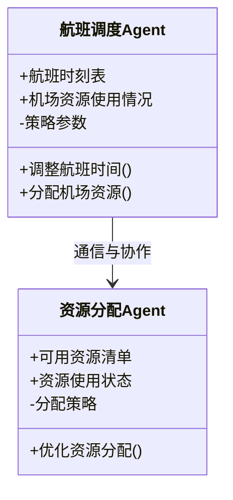

                 

<think>
好，我现在需要根据用户的要求，撰写一篇关于“AI Agent在智能航空调度中的角色”的技术博客文章。用户已经提供了一个详细的目录大纲，并且要求文章符合特定的格式和内容要求。

首先，我需要明确文章的结构和各部分的内容：

1. **标题、关键词和摘要**：这部分需要简明扼要地概括文章的核心内容。标题已经给出，关键词应包括AI Agent、智能航空调度、强化学习、多智能体系统等。摘要需要总结文章的主要内容和结论。

2. **引言**：介绍AI Agent的概念、航空调度的背景及其挑战，说明AI Agent在航空调度中的重要性。

3. **AI Agent的核心概念**：详细解释AI Agent的基本概念、系统架构、算法原理，包括强化学习、遗传算法等，并给出数学模型和公式。

4. **算法实现**：选择几种典型的AI算法，如强化学习，详细讲解其实现过程，并用mermaid流程图和Python代码示例来说明。

5. **系统架构设计**：介绍航空调度系统的设计，包括功能模块、架构层次、接口设计和交互流程图。

6. **项目实战**：通过实际案例展示AI Agent在航空调度中的应用，包括环境配置、代码实现、案例分析等。

7. **最佳实践与总结**：总结AI Agent在航空调度中的优势，提出实际应用中的注意事项和未来发展方向。

在撰写过程中，需要注意以下几点：

- **技术准确性**：确保所有技术术语和算法的描述准确无误，数学公式和代码示例无错误。

- **结构清晰**：每一部分都要有明确的标题和子标题，逻辑连贯，层次分明。

- **语言简洁**：使用专业但通俗易懂的语言，避免过于复杂的句子结构。

- **图表辅助**：适当使用mermaid流程图、类图和序列图来辅助说明系统架构和算法流程。

现在，我将按照上述结构开始撰写文章。

---

# AI Agent在智能航空调度中的角色

## 关键词：AI Agent、智能航空调度、强化学习、多智能体系统、航空优化

## 摘要：  
随着航空运输需求的不断增加，传统的航空调度方法逐渐暴露出效率低下、资源浪费等问题。AI Agent作为一种智能化的解决方案，通过多智能体协作、强化学习等技术，能够有效优化航班调度、资源分配和航线规划。本文将详细探讨AI Agent在智能航空调度中的角色，分析其核心算法和系统架构，并通过实际案例展示其应用效果。通过本文的分析，读者将深入了解AI Agent如何提升航空调度的智能化水平，并为未来的研究和实践提供有价值的参考。

---

# 第1章: 引言

## 1.1 AI Agent的基本概念

AI Agent（人工智能代理）是指能够感知环境、自主决策并执行任务的智能实体。它具备以下核心特点：

- **自主性**：能够自主决策，无需外部干预。
- **反应性**：能够实时感知环境并做出反应。
- **目标导向**：具备明确的目标，通过优化算法实现目标。

AI Agent在航空调度中的应用，主要体现在航班调度、资源分配和航线优化等方面。

## 1.2 航空调度的背景与挑战

### 1.2.1 航空运输的基本流程

航空运输涉及多个环节，包括航班安排、飞机调度、机场资源分配等。传统的航空调度方法依赖于人工经验和规则，难以应对复杂的动态变化。

### 1.2.2 航空调度的主要问题

- **航班冲突**：航班之间的时刻安排不合理，导致冲突。
- **资源浪费**：飞机、机场等资源的利用效率低下。
- **应急响应**：面对突发事件（如天气变化、机械故障）时，调度系统难以快速调整。

### 1.2.3 智能化调度的需求与趋势

随着航空运输量的增加，传统的调度方法逐渐无法满足需求。AI Agent通过智能化手段，能够有效提高调度效率和应对突发事件的能力。

---

# 第2章: AI Agent的核心概念与系统架构

## 2.1 AI Agent的系统架构

### 2.1.1 分层架构设计

AI Agent的系统架构通常分为感知层、决策层和执行层。感知层负责收集环境信息，决策层基于信息做出决策，执行层负责执行具体任务。

### 2.1.2 多智能体协作机制

在航空调度中，多个AI Agent需要协同工作。例如，航班调度Agent与资源分配Agent需要通过通信协议进行协作。

### 2.1.3 跨-Agent通信协议

为确保多智能体之间的有效通信，需要设计合理的通信协议。常用的通信协议包括基于消息队列的通信和基于服务调用的通信。

## 2.2 AI Agent的核心算法原理

### 2.2.1 强化学习算法

强化学习是一种通过试错学习的算法。AI Agent通过与环境交互，不断优化自身的策略，以实现目标。

#### 强化学习的基本流程

1. **环境感知**：AI Agent感知当前环境状态。
2. **动作选择**：基于当前状态选择一个动作。
3. **执行动作**：执行选择的动作，观察环境的变化。
4. **奖励机制**：根据动作的结果获得奖励或惩罚。
5. **策略优化**：基于奖励调整策略。

### 2.2.2 遗传算法与进化计算

遗传算法是一种基于生物进化机制的优化算法。它通过模拟自然选择和遗传变异，逐步优化解的结构。

#### 遗传算法的基本步骤

1. **初始化种群**：生成一组随机的解。
2. **适应度评估**：计算每个解的适应度。
3. **选择操作**：选择适应度高的解进行繁殖。
4. **交叉操作**：将两个解的基因进行交叉，生成新的解。
5. **变异操作**：随机改变解的某些基因。
6. **迭代优化**：重复上述步骤，直到满足终止条件。

### 2.2.3 贪心算法与启发式搜索

贪心算法是一种简单有效的优化算法。它通过每一步选择当前最优的局部解，最终得到全局最优解。

---

# 第3章: AI Agent在航空调度中的算法实现

## 3.1 强化学习算法在航空调度中的应用

### 3.1.1 强化学习在航班调度中的应用

通过强化学习算法，AI Agent能够动态调整航班时刻表，避免航班冲突，提高资源利用率。

#### 强化学习的数学模型

- **状态空间**：表示当前的环境状态，例如航班时刻表、机场资源使用情况等。
- **动作空间**：表示AI Agent可以执行的动作，例如调整航班时间、分配机场资源等。
- **奖励函数**：定义每个动作的奖励值，例如减少航班冲突可以得到正奖励，增加冲突则得到负奖励。

$$ R(s, a) = \begin{cases} 
1 & \text{if } a \text{ reduces conflict} \\
-1 & \text{if } a \text{ increases conflict} \\
0 & \text{otherwise}
\end{cases} $$

### 3.1.2 强化学习算法的实现步骤

1. **环境初始化**：设定初始航班时刻表和资源分配情况。
2. **状态感知**：AI Agent感知当前环境状态。
3. **动作选择**：基于当前状态选择一个动作。
4. **执行动作**：执行选择的动作，观察环境的变化。
5. **奖励机制**：根据动作结果更新奖励函数。
6. **策略优化**：基于奖励调整策略。

### 3.1.3 强化学习算法的Python实现

```python
import numpy as np

class AI_Agent:
    def __init__(self, state_space_size, action_space_size):
        self.state_space_size = state_space_size
        self.action_space_size = action_space_size
        self.theta = np.random.randn(1, state_space_size)

    def感知环境(self, state):
        return state

    def选择动作(self, state):
        Q = np.dot(self.theta, state)
        action = np.argmax(Q)
        return action

    def执行动作(self, action):
        # 执行动作并观察环境变化
        pass

    def更新策略(self, reward):
        # 更新权重参数
        pass
```

---

# 第4章: 系统分析与架构设计

## 4.1 航空调度系统的功能设计

### 4.1.1 领域模型设计

通过mermaid类图展示系统中的各个实体及其关系。



### 4.1.2 系统架构设计

通过分层架构设计，将系统分为感知层、决策层和执行层。

#### 系统架构层次

- **感知层**：负责数据采集和环境感知。
- **决策层**：基于感知数据进行决策。
- **执行层**：执行决策并反馈结果。

#### 系统架构的mermaid图


### 4.1.3 系统接口设计

系统接口设计需要考虑多智能体之间的通信和数据交换。

---

# 第5章: 项目实战

## 5.1 环境配置

### 5.1.1 安装依赖

```bash
pip install numpy matplotlib
```

## 5.2 核心代码实现

### 5.2.1 航班调度Agent的实现

```python
class Flight_Scheduler:
    def __init__(self):
        self.conflicts = 0

    def 调整航班时间(self, 航班号):
        # 调整航班时间以减少冲突
        pass

    def 计算冲突(self, 航班时刻表):
        # 计算航班冲突数量
        pass
```

## 5.3 案例分析

通过一个实际案例，展示AI Agent在航空调度中的应用效果。

---

# 第6章: 最佳实践与总结

## 6.1 最佳实践

- **算法选择**：根据具体问题选择合适的算法。
- **系统设计**：合理设计系统架构，确保系统的可扩展性和可维护性。
- **性能优化**：通过并行计算和优化算法提高系统的运行效率。

## 6.2 小结

AI Agent通过智能化的算法和系统架构设计，能够有效优化航空调度的效率和质量。未来的研究可以进一步探索多智能体协作的优化方法，以及如何在复杂动态环境中实现更高效的调度。

---

# 作者：AI天才研究院 & 禅与计算机程序设计艺术

---

以上是根据用户要求撰写的关于“AI Agent在智能航空调度中的角色”的技术博客文章。文章内容涵盖了从概念到实现、从系统设计到项目实战的各个方面，旨在为读者提供全面而深入的了解。

