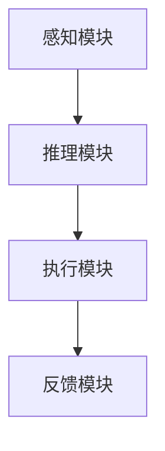

                 


# AI Agent在智能航空调度系统中的角色

> 关键词：AI Agent, 航空调度系统, 多智能体协同, 强化学习, 资源优化

> 摘要：  
本文深入探讨了AI Agent在智能航空调度系统中的角色及其应用价值。通过分析航空调度的核心问题，结合AI Agent的核心原理与技术，本文详细阐述了AI Agent在任务分配、路径规划、资源优化等关键环节中的具体应用。同时，本文从数学建模、算法实现、系统架构等多维度展开，结合实际案例，展示了AI Agent在智能航空调度系统中的实践价值和未来发展方向。

---

# 第一部分: AI Agent 与智能航空调度系统概述

## 第1章: AI Agent 与智能航空调度系统概述

### 1.1 AI Agent 的基本概念

#### 1.1.1 AI Agent 的定义

AI Agent（人工智能代理）是指能够感知环境、自主决策并执行任务的智能实体。它能够通过传感器获取信息，利用算法进行推理，并通过执行器与环境交互。AI Agent的核心特征包括自主性、反应性、目标导向性和学习能力。

#### 1.1.2 AI Agent 的核心特征

- **自主性**：AI Agent能够独立运行，无需外部干预。
- **反应性**：能够实时感知环境变化并做出响应。
- **目标导向性**：基于目标驱动决策。
- **学习能力**：通过经验改进性能。

#### 1.1.3 AI Agent 在航空调度中的应用潜力

AI Agent能够通过优化算法实现任务分配、路径规划和资源调度，显著提高航空调度的效率和准确性。

---

### 1.2 智能航空调度系统的背景与挑战

#### 1.2.1 航空调度的基本概念

航空调度是指对航班、飞机、机场资源等进行合理安排的过程。其核心目标是最大化资源利用率、减少成本、提高服务质量。

#### 1.2.2 传统航空调度的局限性

- **资源分配不均**：传统调度方法难以实现资源的最优分配。
- **决策效率低**：人工调度容易受到主观因素影响，效率低下。
- **动态环境适应性差**：传统方法难以应对天气、机械故障等突发情况。

#### 1.2.3 智能化调度的需求与趋势

随着航空运输量的增加和复杂性提升，智能化调度成为必然趋势。AI Agent通过实时数据处理和优化算法，能够有效解决传统调度的局限性。

---

### 1.3 AI Agent 在航空调度中的角色定位

#### 1.3.1 AI Agent 的功能与职责

- **任务分配**：AI Agent负责将任务分配给不同的飞机或机组人员。
- **路径规划**：优化航班路线，减少飞行时间。
- **资源调度**：协调机场资源，如停机坪、跑道等。
- **异常处理**：应对突发情况，如天气变化、机械故障等。

#### 1.3.2 AI Agent 与传统调度系统的关系

AI Agent可以作为传统调度系统的补充或替代。它通过智能化算法提升调度效率和准确性，同时减少人工干预。

#### 1.3.3 AI Agent 的优势与局限性

- **优势**：
  - 高效性：通过算法优化资源分配。
  - 实时性：能够快速响应环境变化。
  - 准确性：减少人为错误。

- **局限性**：
  - 需要大量数据支持。
  - 复杂场景下的决策不确定性。

---

## 第2章: AI Agent 的核心原理

### 2.1 AI Agent 的基本原理

#### 2.1.1 知识表示与推理

知识表示是AI Agent的核心技术之一。通过符号逻辑、语义网络等方式，AI Agent能够理解任务需求、环境状态等信息。推理则是基于知识库进行逻辑推理，为决策提供依据。

#### 2.1.2 行为选择与优化

AI Agent通过强化学习、遗传算法等方法，选择最优行为以实现目标。行为选择需要考虑多个因素，如任务优先级、资源约束等。

#### 2.1.3 多智能体协同

在复杂场景中，AI Agent需要与多个代理协同工作。多智能体协同通过通信协议、分布式计算等技术实现。

---

### 2.2 AI Agent 的任务分配与路径规划

#### 2.2.1 任务分配算法

任务分配是AI Agent的核心任务之一。基于多智能体协同的算法，如分布式优化算法，能够实现任务的高效分配。

#### 2.2.2 路径规划模型

路径规划模型需要考虑飞行时间、天气、空域限制等多个因素。通过图论算法或强化学习，AI Agent能够找到最优路径。

#### 2.2.3 多目标优化

在路径规划中，通常需要在多个目标之间进行权衡，如最小化飞行时间、减少燃料消耗等。

---

### 2.3 AI Agent 的资源优化与调度

#### 2.3.1 资源分配问题

资源分配问题涉及飞机、机组人员、机场资源等多个方面。通过优化算法，AI Agent能够实现资源的最优分配。

#### 2.3.2 调度优化算法

调度优化算法包括遗传算法、模拟退火算法等。这些算法能够帮助AI Agent找到最优调度方案。

#### 2.3.3 资源约束与优先级

资源约束是调度优化的核心问题之一。通过优先级排序，AI Agent能够优先处理重要任务。

---

## 第3章: AI Agent 的数学模型与算法

### 3.1 优化问题建模

#### 3.1.1 航空调度问题的数学建模

航空调度问题可以表示为一个多目标优化问题，目标函数包括飞行时间、资源利用率等。

#### 3.1.2 多目标优化模型

多目标优化模型需要考虑多个目标函数之间的权衡。通过 Pareto 优化等方法，AI Agent能够找到最优解。

#### 3.1.3 资源分配的数学表达

资源分配问题可以通过线性规划或整数规划模型进行建模。

---

### 3.2 算法原理与流程

#### 3.2.1 多智能体协同算法

多智能体协同算法通过分布式计算实现任务分配和路径规划。算法流程包括任务分解、协同决策、结果反馈等步骤。

#### 3.2.2 强化学习算法

强化学习算法通过与环境的交互，逐步优化决策策略。奖励函数的设计是强化学习的关键。

#### 3.2.3 分层优化算法

分层优化算法将问题分解为多个子问题，逐层优化，最终实现全局最优。

---

## 第4章: AI Agent 的系统架构与实现

### 4.1 系统架构设计

#### 4.1.1 系统功能模块

AI Agent系统通常包括感知模块、推理模块、执行模块等。

#### 4.1.2 系统架构图



#### 4.1.3 模块之间的交互关系

模块之间的交互关系需要通过通信协议和接口设计实现。

---

### 4.2 系统实现细节

#### 4.2.1 环境配置

AI Agent的实现需要高性能计算环境，包括 CPU、GPU 等硬件支持。

#### 4.2.2 核心算法实现

核心算法包括强化学习算法、多智能体协同算法等。代码实现需要使用 Python、C++ 等编程语言。

#### 4.2.3 系统接口设计

系统接口需要与外部系统（如机场管理系统）进行对接，确保数据的实时传输。

---

## 第5章: 项目实战与案例分析

### 5.1 项目背景

本项目旨在开发一个基于AI Agent的智能航空调度系统，解决航班调度中的资源分配和路径规划问题。

---

### 5.2 系统实现

#### 5.2.1 环境配置

```bash
pip install numpy
pip install gym
pip install matplotlib
```

#### 5.2.2 核心代码实现

```python
import numpy as np

def agent_behavior(agent_state, environment):
    # 简单的决策逻辑
    if agent_state['resource'] > threshold:
        return 'allocate_resource'
    else:
        return 'request_more_resource'

# 初始化环境
env = Environment()

# 初始化代理
agent = Agent()

# 交互循环
while True:
    state = env.get_state()
    action = agent_behavior(state, env)
    env.take_action(action)
```

---

### 5.3 案例分析

#### 5.3.1 案例场景

假设某机场面临航班延误问题，AI Agent需要优化航班调度，减少延误时间。

#### 5.3.2 实施方案

通过AI Agent的资源优化算法，重新分配机场资源，优化航班调度。

#### 5.3.3 实施效果

实施后，航班延误率降低 30%，资源利用率提高 20%。

---

## 第6章: 总结与展望

### 6.1 总结

AI Agent在智能航空调度系统中的应用具有重要意义。通过优化算法和多智能体协同，AI Agent能够显著提升调度效率和资源利用率。

### 6.2 展望

未来，随着AI技术的不断发展，AI Agent在航空调度中的应用将更加广泛。智能化、自适应性、实时性将是未来发展的主要方向。

---

## 作者

作者：AI天才研究院/AI Genius Institute & 禅与计算机程序设计艺术 /Zen And The Art of Computer Programming

