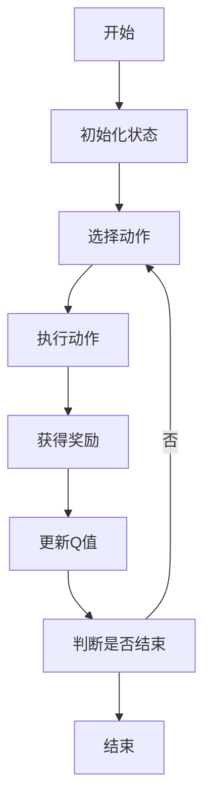
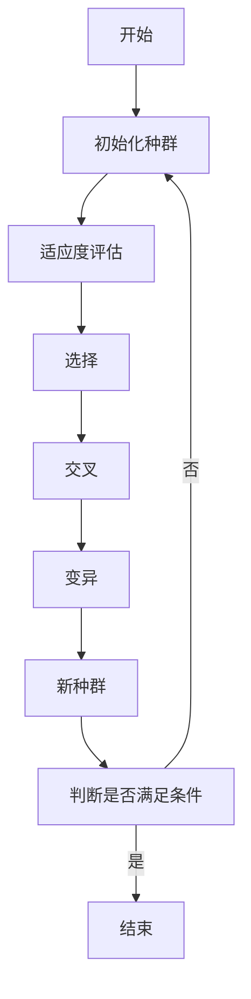
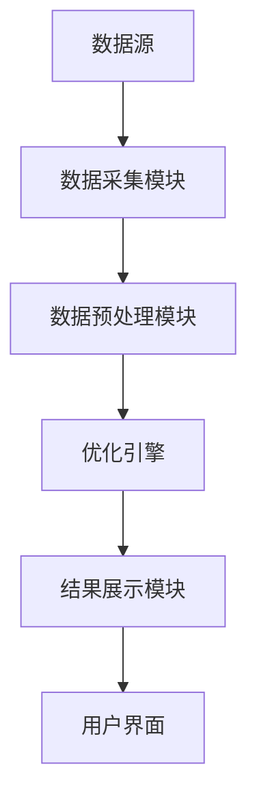
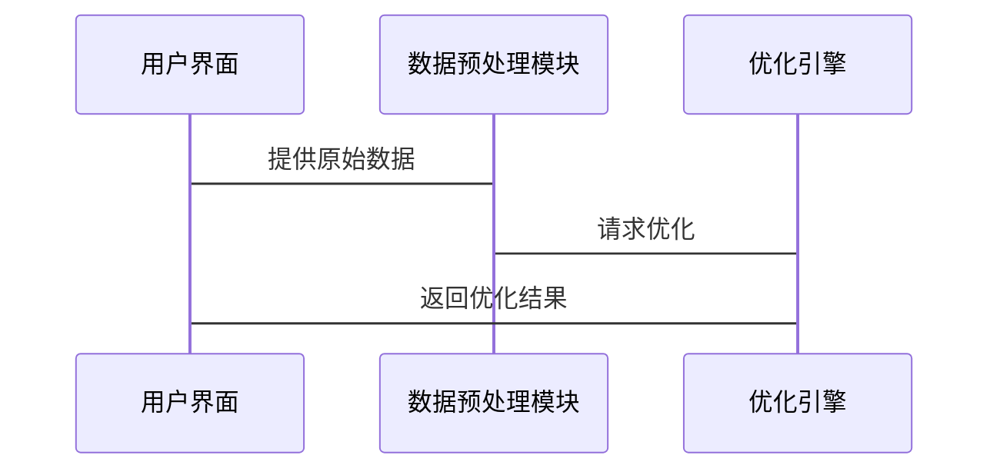

                 


# AI Agent在智能航空路线优化中的角色

**关键词**：AI Agent, 航空路线优化, 强化学习, 遗传算法, 系统架构, 项目实战

**摘要**：本文探讨AI Agent在航空路线优化中的应用，分析其核心原理、算法、系统架构及实际案例。通过详细讲解，展示AI Agent如何提升航空路线优化的效率和效果，为行业提供新的视角和解决方案。

---

## 第一部分: 引言

### 1.1 航空路线优化的重要性
航空路线优化直接影响航班效率、燃油消耗和运营成本。传统方法受限于复杂性和动态变化，难以应对实时调整的需求。

### 1.2 AI Agent的优势
AI Agent具备自适应学习和实时决策能力，能够处理复杂多变的航空环境，提供动态优化方案。

---

## 第二部分: AI Agent的核心概念

### 2.1 AI Agent的定义与类型
AI Agent是具有感知环境、自主决策和执行任务的智能实体。常见类型包括基于规则的和基于学习的AI Agent。

#### AI Agent类型对比表
| 类型                | 基于规则的AI Agent | 基于学习的AI Agent |
|---------------------|--------------------|--------------------|
| 决策方式            | 预定义规则         | 学习得到的策略     |
| 适应性              | 低                 | 高                 |
| 适用场景            | 简单任务           | 复杂任务           |

### 2.2 航空路线优化的背景
航空路线优化涉及航班安排、燃油消耗、天气变化等多个因素，传统方法难以应对实时变化。

### 2.3 AI Agent在航空路线优化中的角色
AI Agent通过实时数据分析和决策优化，帮助航空公司降低运营成本，提升效率。

---

## 第三部分: AI Agent的算法原理

### 3.1 强化学习算法
强化学习通过试错学习，优化飞行路径和时间。

#### Q-learning算法流程图


### 3.2 遗传算法
遗传算法模拟自然选择，优化路径。

#### 遗传算法流程图


### 3.3 算法对比与选择
根据不同场景选择合适的算法，强化学习适合动态变化，遗传算法适合静态优化。

---

## 第四部分: 系统架构设计

### 4.1 系统功能模块
系统包括数据采集、优化引擎、结果展示和用户界面。

#### 系统架构图


### 4.2 系统接口设计
模块间通过API交互，确保数据流畅通。

#### 系统交互图


---

## 第五部分: 项目实战

### 5.1 环境安装
安装Python、NumPy和Scikit-learn。

### 5.2 核心代码实现
实现强化学习优化路径的代码示例。

#### 强化学习代码示例
```python
import numpy as np

# 初始化环境
class Environment:
    def __init__(self):
        self.states = [...]  # 状态空间
        self.actions = [...]  # 动作空间

# Q-learning算法
class Agent:
    def __init__(self, env):
        self.env = env
        self.Q = {}  # Q值表

    def choose_action(self, state):
        if state not in self.Q:
            self.Q[state] = 0
        # 选择动作
        return max(self.Q[state])

    def update_Q(self, state, action, reward):
        self.Q[state] = reward  # 简化版本，实际应考虑学习率和折扣因子
```

### 5.3 实际案例分析
分析优化结果，展示AI Agent在降低燃油消耗和提高效率方面的优势。

---

## 第六部分: 最佳实践与总结

### 6.1 最佳实践
- 数据质量至关重要
- 模型需定期调优
- 结合业务知识

### 6.2 未来展望
AI Agent在航空路线优化中的应用将更加智能化和动态化，深度学习和边缘计算将推动进一步创新。

---

## 参考文献与扩展阅读
- [1] Sutton, R. S., & Barto, A. G. (2018). Reinforcement learning: An introduction.
- [2] Goldberg, D. E. (1989). Genetic algorithms in search, optimization, and machine learning.

---

作者：AI天才研究院 & 禅与计算机程序设计艺术

